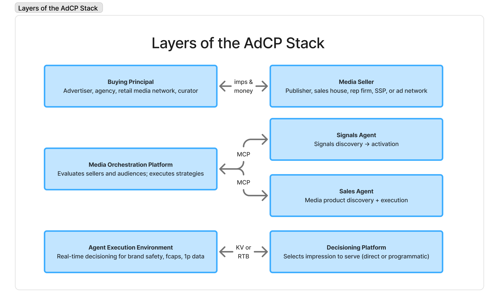

<Info>
**🎉 AdCP v2.5.0 Released**

Developer experience and API refinement release featuring type safety improvements, batch creative previews (5-10x faster), schema versioning (`/schemas/v2.5/`), template formats with dynamic sizing, enhanced product filtering, and inline creative updates. [See what's new →](/dist/docs/2.5.3/reference/release-notes)
</Info>

Welcome to the Ad Context Protocol (AdCP) documentation—the open standard for agentic advertising.

## The Opportunity

RTB unlocked programmatic. AdCP unlocks the rest.

90% of ad spend never touches RTB—it lives in walled gardens, direct deals, and premium inventory. Execution costs limit how many media partners advertisers can work with. The opportunity isn't optimizing existing platforms better—it's expanding to more partners without scaling headcount.

AI agents collapse this complexity cost. AdCP gives them a standard way to buy media, build creatives, and activate audiences across any platform.

## What is AdCP?

AdCP is an **open standard for advertising automation** that enables AI agents to interact with advertising platforms through unified interfaces:

- **One Protocol**: Single interface for all advertising platforms
- **AI-Native**: Works over MCP and A2A protocols for seamless agent integration
- **Platform Agnostic**: Works with any compatible advertising platform

AdCP uses a task-first architecture where core advertising tasks (like creating media buys or discovering signals) can be accessed through multiple protocols:
- **MCP (Model Context Protocol)**: For direct AI assistant integration
- **A2A (Agent2Agent Protocol)**: For complex workflows and agent collaboration

All tasks and data models are defined with JSON schemas for validation and client code generation.

## Protocol Architecture

AdCP operates at multiple layers, providing a clean separation between the business roles, orchestration layer, and technical execution:



## The AdCP Ecosystem Layers

### Top Layer: Business Principals

#### Buying Principal (Left)
The demand side of advertising, including:
- **Advertisers**: Brands with products/services to promote
- **Agencies**: Acting on behalf of advertisers
- **Retail Media Networks**: Retailers monetizing their audiences
- **Curators**: Packaging inventory and data for specific use cases

#### Media Seller (Right)
The supply side of advertising, including:
- **Publishers**: Content creators with audience reach
- **Sales Houses**: Representing multiple publishers
- **Rep Firms**: Specialized sales representation
- **SSPs**: Supply-side platforms aggregating inventory
- **Ad Networks**: Aggregating and reselling inventory

These parties exchange impressions and money through the orchestration layer below.

### Middle Layer: Orchestration

#### Media Orchestration Platform (Left)
Platforms that evaluate sellers and audiences, and execute buying strategies:
- **Examples**: Scope3, custom orchestration solutions
- **Function**: Strategy execution, seller evaluation, optimization
- **Integration**: Uses MCP to communicate with both Audience and Sales Agents

#### Signal Agent (Right, Top)
MCP servers that provide:
- **Signal Discovery**: Finding relevant signals (audiences, contextual, geographical, temporal) using natural language
- **Signal Activation**: Pushing signals to decisioning platforms
- **Integration**: Exposes data provider capabilities via MCP

#### Sales Agent (Right, Bottom)
MCP servers that provide:
- **Media Product Discovery**: Natural language inventory search
- **Media Execution**: Creating and managing campaigns
- **Integration**: Exposes publisher capabilities via MCP

### Bottom Layer: Technical Execution

#### Agentic eXecution Engine (AXE) (Left)
Real-time execution layer for:
- **Brand Safety**: Ensuring appropriate ad placement
- **Frequency Capping**: Managing exposure limits
- **First-Party Data**: Activating advertiser data
- **Dynamic Audience Targeting**: Applying buyer segments at impression time
- **Integration**: Connects via key-value pairs or RTB protocols

See [AXE documentation](/dist/docs/2.5.3/media-buy/advanced-topics/agentic-execution-engine) for details.

#### Decisioning Platform (Right)
The technical infrastructure that:
- **Selects Impressions**: Decides which ad to serve
- **Delivery Method**: Direct campaigns or programmatic (RTB)
- **Examples**: DSPs, SSPs, Ad Servers, Google Ad Manager, Kevel

## The Complete AdCP Flow with Creative Agents

The AdCP ecosystem extends beyond media transactions to include creative production and delivery. This expanded view shows how creative agents integrate with the core AdCP components:


### Three Interconnected Flows

#### Creative Flow (Top)
- **Creative Agent**: AI-powered creative generation and optimization
- **Property**: The publisher or platform displaying the ad
- **Consumer**: The end user viewing the advertisement

#### Business Flow (Middle)
- **Advertiser**: The brand with a message to deliver
- **Principal**: The buying principal (agency, trading desk, or brand itself)
- **Media Seller**: The supply-side entity selling ad inventory

#### Technical Flow (Bottom)
- **Brand Agent**: Represents the advertiser's objectives and brand guidelines
- **Media Agent**: Orchestrates the media buying process
- **Sales Agent**: Facilitates inventory discovery and transaction execution
- **Decisioning Platform**: Makes real-time ad serving decisions
- **AXE (Agentic eXecution Engine)**: Provides real-time execution capabilities

### How Creative Agents Enhance AdCP

Creative agents add a new dimension to the AdCP ecosystem:

1. **Dynamic Creative Generation**: Build creatives on-demand based on campaign objectives
2. **Format Adaptation**: Automatically adapt creative assets to different ad formats
3. **Real-time Optimization**: Adjust creative elements based on performance data
4. **Asset Management**: Organize and tag creative assets for efficient campaign execution

The creative flow operates in parallel with the business and technical flows, ensuring that the right creative reaches the right consumer at the right moment.

## How AdCP Protocols Work Together

Each AdCP protocol operates within this ecosystem:

### 🎯 Signals Activation Protocol
- **Scope**: Works with **signal agents** to discover and activate signals directly on **decisioning platforms**
- **Integration**: Direct integration between signal agents and decisioning platforms (DSPs, SSPs, ad servers)
- **Workflow**: Find signals → Direct activation on target platform → Ready for campaign use

### 📍 Curation Protocol (Coming Soon)
- **Scope**: Works with **decisioning platforms** and **supply-side platforms**
- **Integration**: Curates inventory that will be targeted with activated signals
- **Workflow**: Define requirements → Find inventory → Package with signals

### 💰 Media Buy Protocol
- **Scope**: Works primarily with **decisioning platforms** (DSPs, SSPs, ad servers)
- **Integration**: Executes campaigns using curated inventory and activated signals
- **Workflow**: Set objectives → Execute buys → Optimize performance

### 🎨 Creative Agent Protocol
- **Scope**: Works with **creative generation and optimization** systems
- **Integration**: Builds creative assets and executable code for campaigns
- **Workflow**: Define brief → Generate creative → Refine and deploy

## Quick Start

Want to try AdCP right now?

### 🚀 [**Interactive Testing Platform**](https://testing.adcontextprotocol.org)
Test all AdCP tasks in your browser - no code required.

### 📋 [**AdAgents.json Builder**](https://adcontextprotocol.org/adagents)
Validate your publisher's adagents.json file or create a new one with guided validation and agent card verification.

### 📖 [**Quickstart Guide**](/dist/docs/2.5.3/quickstart)
Get started in 5 minutes with authentication, testing, and your first request.

### 💻 **Client Libraries**

#### JavaScript/TypeScript
[](https://www.npmjs.com/package/@adcp/client)

```bash
npm install @adcp/client
```

- **NPM**: [@adcp/client](https://www.npmjs.com/package/@adcp/client)
- **GitHub**: [adcp-client](https://github.com/adcontextprotocol/adcp-client)
- **Documentation**: [JavaScript Client Guide](/dist/docs/2.5.3/quickstart#code-examples)

#### Python
[](https://pypi.org/project/adcp/)

```bash
pip install adcp
```

- **PyPI**: [adcp](https://pypi.org/project/adcp/)
- **GitHub**: [adcp-python](https://github.com/adcontextprotocol/adcp-python)
- **Documentation**: [Python Client Guide](/dist/docs/2.5.3/quickstart#code-examples)

## Example: Natural Language Advertising

Instead of navigating multiple platforms, you can now say:

> "Find audience signals of premium sports enthusiasts who would be interested in high-end running shoes, and activate them on Scope3."

The AI assistant will:
1. Search for relevant signals across connected platforms
2. Show you options with transparent pricing
3. Activate your chosen signals for use on decisioning platforms

## Available Protocols

### 🎯 [Signals Activation Protocol](/dist/docs/2.5.3/signals/overview)
**Status**: RFC/v0.1

Discover and activate data signals (audiences, contextual, geographical, temporal) using natural language.

### 📍 Curation Protocol
**Status**: Coming Soon

Curate media inventory based on context and brand safety.

### 💰 [Media Buy Protocol](/dist/docs/2.5.3/media-buy)
**Status**: RFC/v0.1

Execute and optimize media buys programmatically.

### 🎨 [Creative Protocol](/dist/docs/2.5.3/creative/)
**Status**: RFC/v0.1

Generate and optimize creative assets using AI-powered agents.

## Reference Implementations

- [Signals Agent](https://github.com/adcontextprotocol/signals-agent)
- [Sales Agent](https://github.com/adcontextprotocol/salesagent)

## For Platform Providers

AI is buying ads. Make sure it can buy yours.

If you operate a data platform, DSP, or ad tech solution, AdCP lets AI agents discover and purchase your inventory. [Review the Protocol Specifications](/dist/docs/2.5.3/signals/specification) to get started.

## For Advertisers & Agencies

AI that sells products and builds brands.

AdCP-enabled AI assistants can work across all your media partners through a single interface:

1. Check if your platforms support AdCP
2. Configure your AI assistant with AdCP-enabled platforms
3. Start using natural language for your campaigns

## Protocol Flexibility

AdCP's task-first architecture means you can access the same functionality through different protocols:

- **Using MCP**: Ideal for Claude and other AI assistants with direct tool integration
- **Using A2A**: Perfect for complex workflows with approvals and multi-agent collaboration
- **Protocol Agnostic**: Implementers write tasks once, support all protocols automatically

Learn more in the [Protocols section](/dist/docs/2.5.3/building).

## Next Steps

### Getting Started
- 🚀 **New to AdCP?** Start with the [**Quickstart Guide**](/dist/docs/2.5.3/quickstart)
- 🧪 **Want to test?** Try the [**Interactive Testing Platform**](https://testing.adcontextprotocol.org)
- 📚 **Building an integration?** Choose [MCP](/dist/docs/2.5.3/building/integration/mcp-guide) or [A2A](/dist/docs/2.5.3/building/integration/a2a-guide) protocol guide

### By Role
- **Platform Providers**: Start with the [Signals Protocol Specification](/dist/docs/2.5.3/signals/specification) or [Media Buy Protocol](/dist/docs/2.5.3/media-buy/)
- **Developers**: Review the [Protocol Comparison](/dist/docs/2.5.3/building/understanding/protocol-comparison) and [Task Reference](/dist/docs/2.5.3/media-buy/task-reference/)
- **Everyone**: Join the [Slack Community](https://join.slack.com/t/agenticads/shared_invite/zt-3c5sxvdjk-x0rVmLB3OFHVUp~WutVWZg)

## Need Help?

- 📖 Browse the documentation
- 💬 Ask in [Slack Community](https://join.slack.com/t/agenticads/shared_invite/zt-3c5sxvdjk-x0rVmLB3OFHVUp~WutVWZg)
- 📧 Email: support@adcontextprotocol.org
