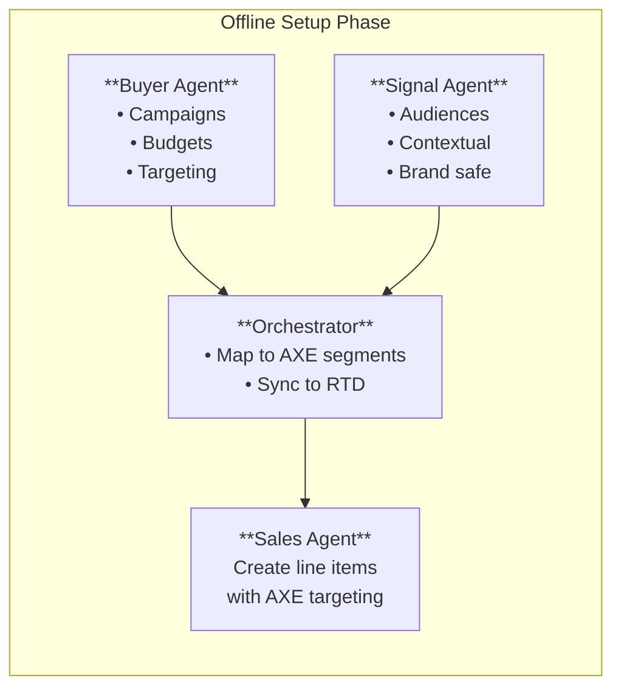
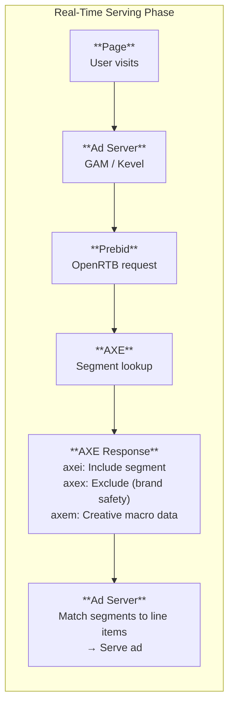

The Agentic eXecution Engine (AXE) is AdCP's real-time execution layer that enables dynamic audience targeting, brand safety enforcement, and frequency management at impression time.

## Two-Phase Workflow

AXE operates in two distinct phases: **offline campaign setup** and **real-time ad serving**.

### Phase 1: Offline Setup

Before ads serve, campaigns are configured and segment data is synchronized:



**What happens:**
1. **Buyer Agent** creates campaigns with targeting and budgets via AdCP
2. **Signal Agents** attach contextual data (audiences, brand safety rules, weather triggers)
3. **Orchestrator** maps campaigns to AXE segments and syncs data to the real-time module
4. **Sales Agent** creates ad server line items targeting AXE segment key-values

### Phase 2: Real-Time Serving

When an ad request arrives, AXE evaluates it in real-time and returns segment decisions:



**What happens:**
1. User visits page, triggering ad request
2. Ad server initiates request to Prebid (or similar)
3. Prebid sends OpenRTB bid request to AXE
4. AXE evaluates user/context and returns segment values
5. Ad server matches segments to line items and serves appropriate ad

## AXE Segment Types

AXE returns three types of segment values to the ad server:

| Segment | Key | Purpose | Example |
|---------|-----|---------|---------|
| **Include** | `axei` | Audience targeting - user belongs to this segment | `"seg_auto_intenders"` |
| **Exclude** | `axex` | Brand safety/suppression - block this impression | `"unsafe_content"` |
| **Macro** | `axem` | Creative personalization data | `"eyJjb250ZXh0IjoiLi4uIn0="` |

### How Segments Flow to Creatives

```json
{
  "packages": [{
    "product_id": "premium_video",
    "targeting_overlay": {
      "axe_include_segment": "seg_auto_intenders_q1",
      "axe_exclude_segment": "seg_existing_customers"
    }
  }]
}
```

At impression time:
- `axei` is checked against `axe_include_segment` → must match to serve
- `axex` is checked against `axe_exclude_segment` → must NOT match to serve
- `axem` is passed to creative via the `{AXEM}` macro

## Data Flow Example

Here's a concrete example of AXE in action for a customer acquisition campaign:

### Setup (Offline)

**1. Buyer uploads suppression list:**
```
Advertiser CRM
  → Hash emails (SHA256)
  → Upload to orchestrator
  → Receive segment ID: "seg_existing_customers_acme"
```

**2. Create media buy with AXE targeting:**
```json
{
  "buyer_ref": "acme_acquisition_q1",
  "packages": [{
    "product_id": "premium_video_millennials",
    "budget": { "amount": 50000 },
    "targeting_overlay": {
      "axe_exclude_segment": "seg_existing_customers_acme"
    }
  }]
}
```

**3. Sales Agent creates line item:**
```
Line item: "Acme Q1 Acquisition"
Targeting: axex != "seg_existing_customers_acme"
```

### Serving (Real-Time)

**4. User visits publisher site:**
```
GET /ad-request
User-Agent: Mozilla/5.0...
Cookie: uid=abc123
```

**5. AXE lookup:**
```
Input: uid=abc123
Check: Is abc123 in seg_existing_customers_acme?
Result: YES (hashed email matches)
```

**6. AXE response:**
```json
{
  "axei": null,
  "axex": "seg_existing_customers_acme",
  "axem": null
}
```

**7. Ad server decision:**
```
Line item requires: axex != "seg_existing_customers_acme"
Current axex: "seg_existing_customers_acme"
Decision: DO NOT SERVE (user is existing customer)
```

**Result:** Acquisition budget is not wasted on existing customers.

## Core Capabilities

### 1. Dynamic Audience Targeting

Bring your own DMP/CDP segments to publisher inventory:

- Upload audience data (hashed emails, device IDs, etc.)
- Receive segment IDs from your orchestrator
- Reference segment IDs in `axe_include_segment`
- AXE matches users at impression time

**Use cases:** Lookalike targeting, CRM activation, behavioral segments

### 2. Brand Safety

Real-time content evaluation at impression time:

- **Content classification** - News, entertainment, sports, etc.
- **Sentiment analysis** - Positive/negative content detection
- **Keyword blocking** - Brand-specific term avoidance
- **Adjacency rules** - What other ads are on the page

Brand safety rules flow from Signal Agents through the orchestrator to AXE.

### 3. Cross-Publisher Frequency Management

Unlike publisher-side caps, AXE tracks exposure across:

- Multiple publishers
- Multiple campaigns
- Multiple devices (with identity resolution)

AXE enforces frequency caps and returns segment decisions to the ad server. The ad server doesn't know *why* a segment matched or didn't match—it just knows whether to serve.

### 4. First-Party Data Activation

Activate your customer data without sharing PII:

1. Hash customer identifiers (emails, phone numbers)
2. Upload to orchestrator (data stays with orchestrator)
3. Reference via segment ID in campaigns
4. AXE matches at impression time
5. Publisher never sees raw customer data

## Privacy by Design: Opaque Segment IDs

A key AXE design principle is that **segment IDs are intentionally opaque**. The ad server only sees that segment `ABCD` passed or failed—it doesn't know what type of targeting the segment represents.

This could mean:
- User exceeded frequency cap
- Page failed brand safety check
- User is in a first-party suppression list
- User matches an audience segment

This opacity protects buyer data. Publishers and ad servers cannot reverse-engineer:
- Which users are in buyer CRM lists
- Frequency cap thresholds
- Brand safety rules
- Audience segment definitions

All the ad server knows is: "AXE says serve" or "AXE says don't serve."

## Integration Points

### For Buyers

| Step | Action | Result |
|------|--------|--------|
| 1 | Upload audience to orchestrator | Receive segment ID |
| 2 | Include segment ID in `create_media_buy` | Campaign created with AXE targeting |
| 3 | Monitor delivery reports | Track segment match rates |

### For Publishers

Publishers don't implement AXE directly. To support AXE targeting:

1. **Integrate with Prebid** or similar real-time data module
2. **Accept key-value targeting** - Pass `axei`, `axex` values to ad server
3. **Configure line items** - Target on AXE segment key-values
4. **Declare support** - Indicate AXE compatibility in `adagents.json`

### For Orchestrators

Orchestrators operate the AXE layer:

1. **Segment ingestion** - Accept audience data from buyers
2. **Real-time lookups** - Sub-10ms segment membership checks
3. **Signal integration** - Apply brand safety and contextual signals
4. **Frequency state** - Maintain cross-campaign exposure tracking
5. **RTD module** - Expose segments via Prebid or OpenRTB

## Universal Macro: {AXEM}

Creatives can receive AXE context data for dynamic rendering:

```html

```

The `{AXEM}` macro contains base64-encoded contextual metadata:
- Weather conditions
- Content category
- User segment attributes (anonymized)
- Custom orchestrator data

See [Universal Macros](/dist/docs/2.5.3/creative/universal-macros) for details.

## When to Use AXE

| Scenario | Use AXE? | Alternative |
|----------|----------|-------------|
| Target users in my CRM | ✅ Yes | — |
| Suppress existing customers | ✅ Yes | — |
| Cross-publisher frequency cap | ✅ Yes | — |
| Real-time brand safety | ✅ Yes | — |
| Target "millennials in California" | ❌ No | Express in brief |
| Geographic restrictions | ❌ No | Use `geo_country_any_of` |
| Publisher's audience segments | ❌ No | Express in brief |
| Single-publisher frequency cap | ❌ No | Publisher ad server handles this |

## Performance

AXE is designed for ad serving latency requirements:

| Operation | Target Latency |
|-----------|----------------|
| Segment membership lookup | < 10ms |
| Brand safety evaluation | < 20ms |
| Frequency check | < 5ms |
| Combined AXE decision | < 50ms |

## Related Documentation

- **[Targeting](/dist/docs/2.5.3/media-buy/advanced-topics/targeting)** - Brief-based targeting and geographic overlays
- **[Signals Protocol](/dist/docs/2.5.3/signals/overview)** - Signal discovery and activation
- **[Universal Macros](/dist/docs/2.5.3/creative/universal-macros)** - Creative-level AXE integration
- **[Orchestrator Design](/dist/docs/2.5.3/media-buy/advanced-topics/orchestrator-design)** - Building orchestration platforms
