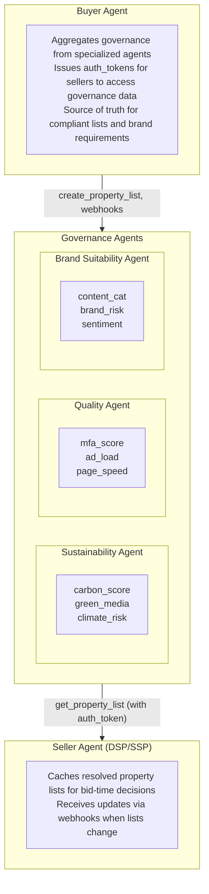

<Warning>
**Draft for AdCP 3.0** - These governance protocols are under active development by the AAO Governance Working Group. Feedback welcome via [GitHub Discussions](https://github.com/adcontextprotocol/adcp/discussions).
</Warning>

The Governance Protocol provides standardized mechanisms for compliance, brand suitability, and quality control across advertising workflows. It enables specialized agents to evaluate, filter, and score advertising entities against configurable criteria.

## Mission

> Define and operate transparent, privacy-safe, brand-suitable campaign governance that encodes human heuristics in open protocol objects, making campaigns easy to launch, safe to scale, and measurable against verifiable outcomes for buyers, sellers, and auditors.

## Protocol Domains

The Governance Protocol covers four distinct governance domains:

| Domain | What It Governs | Key Mechanisms |
|--------|-----------------|----------------|
| **[Property Governance](./property/index)** | Where ads can run | Property lists, compliance filtering, adagents.json authorization |
| **[Brand Protocol](/dist/docs/3.0.0-beta.3/brand-protocol/index)** | Brand identity & agents | brand.json discovery, brand agent authorization |
| **[Content Standards](./content-standards/index)** | Brand suitability | Privacy-preserving content evaluation, calibration, validation |
| **Creative Governance** | What creatives are compliant | Format validation, content moderation, accessibility |
| **Campaign Governance** | What can be bought | Budget controls, approval workflows, policy compliance |

Each domain has specialized governance agents that provide data, filtering, and scoring capabilities.

## Working Group Areas

The AAO Governance Working Group is developing standards across six areas that inform these protocols:

| Area | Focus | Protocol Impact |
|------|-------|-----------------|
| Brand Suitability | Safe, appropriate ad contexts | Property Governance, Content filtering, adagents.json |
| Brand Manifest & Standards Library | Machine-readable brand policies | [Brand Manifest](/dist/docs/3.0.0-beta.3/creative/brand-manifest), Content Standards |
| Creative Standards & Validation | Technical and ethical creative criteria | Creative Governance |
| Process & Human Oversight | Human-in-the-loop checkpoints | All protocols |
| Regulatory & Compliance | Legal and regional frameworks | All protocols |
| Measurement & Verification | Proving compliance | All protocols |

## Architecture

Governance agents operate across the **full campaign lifecycle**:

- **Setup time**: Configure property lists, brand requirements, and compliance rules
- **Execution time**: Filter inventory and validate placements through cached rules and scoring
- **Post-delivery**: Measurement, verification, and reporting on compliance



## Common Patterns

### Feature Discovery

All governance agents advertise their capabilities via `get_adcp_capabilities`:

```json
{
  "tool": "get_adcp_capabilities",
  "arguments": {}
}
```

Response (governance section):
```json
{
  "governance": {
    "property_features": [
      { "feature_id": "mfa_score", "type": "quantitative", "range": { "min": 0, "max": 100 } },
      { "feature_id": "coppa_certified", "type": "binary" },
      { "feature_id": "carbon_score", "type": "quantitative", "range": { "min": 0, "max": 100 } }
    ]
  }
}
```

### Brand Manifest

Buyers declare their brand identity, and governance agents automatically apply appropriate rules:

```json
{
  "brand_manifest": {
    "brand_name": "ToyBrand",
    "industry": "toys",
    "target_audience": "children_under_13"
  }
}
```

When a governance agent sees this manifest, it automatically applies COPPA requirements, content filtering for children's brands, and other industry-specific rules.

### Prompt-Based Policies

Governance protocols support **natural language prompts** for policy definitions rather than rigid keyword lists:

```json
{
  "policy": "Avoid content about violence, controversial politics, or adult themes. Sports news is excellent. Entertainment is generally acceptable.",
  "exclusions_prompt": "Block content containing hate speech, illegal activities, or ongoing litigation against our company."
}
```

This enables AI-powered verification agents to understand context and nuance.

### Webhook Notifications

Governance agents notify subscribers when evaluations change:

```json
{
  "webhook_url": "https://buyer.example.com/webhooks/list-changed",
  "events": ["list_updated", "property_removed", "score_changed"]
}
```

## Integration with Media Buy

The Media Buy Protocol consumes governance data at multiple stages:

- **Product discovery**: Pass `property_list_ref` to `get_products` to filter inventory
- **Media buy creation**: Reference property lists to constrain where ads can run
- **Authorization**: adagents.json validates agent authority to sell properties

```json
{
  "tool": "get_products",
  "arguments": {
    "brief": "UK video inventory for Q1",
    "property_list_ref": {
      "agent_url": "https://buyer-agent.example.com",
      "list_id": "pl_q1_uk_premium",
      "auth_token": "..."
    }
  }
}
```

## Getting Started

**Buyers:**
1. Subscribe to governance agents for property data and brand suitability
2. Create property lists with filters and brand manifests
3. Aggregate results into final compliant lists
4. Share references with sellers (with auth tokens)

**Governance Agent Implementers:**
1. Implement feature discovery tasks (`get_adcp_capabilities`, etc.)
2. Implement stateful list management (CRUD operations)
3. Support webhooks to notify when evaluations change
4. See the [Property Protocol Specification](./property/specification) for detailed implementation guidance

## Protocol Sections

<CardGroup cols={2}>
  <Card title="Property Governance" icon="building" href="/dist/docs/3.0.0-beta.3/governance/property/index">
    Control where ads can run with property lists, compliance filtering, and publisher authorization via adagents.json.
  </Card>
  <Card title="Content Standards" icon="shield-check" href="/dist/docs/3.0.0-beta.3/governance/content-standards/index">
    Privacy-preserving brand suitability through calibration-based content evaluation and validation.
  </Card>
</CardGroup>
