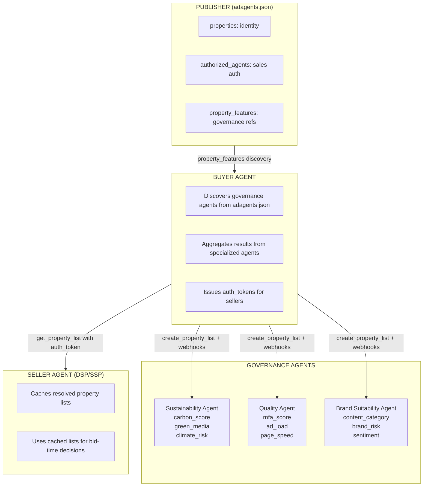

<Info>
**AdCP 3.0 Proposal** - This protocol is under development for AdCP 3.0. Feedback welcome via [GitHub Discussions](https://github.com/adcontextprotocol/adcp/discussions).
</Info>

Property Governance standardizes how advertising properties (websites, apps, CTV, podcasts, billboards) are identified, authorized, enriched with data, and selected for campaigns.

## Overview

Property Governance addresses five distinct concerns:

| Concern | Question | Owner | Mechanism |
|---------|----------|-------|-----------|
| **Property Identity** | What properties exist? | Publishers | `adagents.json` properties array |
| **Sales Authorization** | Who can sell this property? | Publishers | `adagents.json` authorized_agents |
| **Property Data** | What do we know about this property? | Data providers | Governance agents via [`get_adcp_capabilities`](/docs/protocol/get_adcp_capabilities) |
| **Property Selection** | Which properties meet my requirements? | Buyers | Property lists with filters |

The first three are **publisher-side declarations** via adagents.json. The last two are **buyer-side operations** that consume property data from governance agents.

## Publisher Side: adagents.json

Publishers declare their properties, authorize sales agents, and reference governance agents via `/.well-known/adagents.json`:

```json
{
  "$schema": "https://adcontextprotocol.org/schemas/v2/adagents.json",
  "properties": [
    {
      "property_id": "example_site",
      "property_type": "website",
      "name": "Example Site",
      "identifiers": [{"type": "domain", "value": "example.com"}]
    }
  ],
  "authorized_agents": [
    {
      "url": "https://agent.example.com",
      "authorized_for": "Official sales agent",
      "authorization_type": "property_ids",
      "property_ids": ["example_site"]
    }
  ],
  "property_features": [
    {
      "url": "https://api.sustainability-vendor.example",
      "name": "Sustainability Vendor",
      "features": ["carbon_score", "green_media_certified"]
    },
    {
      "url": "https://api.quality-vendor.example",
      "name": "Quality Vendor",
      "features": ["mfa_score", "ad_load_rating", "page_speed"]
    }
  ]
}
```

### Governance Agent Discovery via property_features

The `property_features` array solves a key discovery problem: **how does a buyer know which governance agents have data about a given property?**

Without `property_features`, buyers would need to query every possible governance agent to find out who has compliance, sustainability, or quality data. With `property_features`, publishers declare these relationships upfront:

| Field | Purpose |
|-------|---------|
| `url` | Governance agent's API endpoint |
| `name` | Human-readable agent name |
| `features` | Feature IDs this agent provides (e.g., `carbon_score`, `mfa_score`) |
| `publisher_id` | Optional identifier for looking up this publisher at the agent |

**Example use cases:**
- **Sustainability**: Publisher declares a carbon measurement vendor tracks their emissions
- **Quality**: Publisher declares a verification vendor measures MFA score and ad density
- **Consumer experience**: Publisher declares a vendor that tracks page speed and ad load

Buyers read `property_features` from adagents.json, then query only the relevant governance agents for detailed data.

See the [adagents.json Tech Spec](/docs/governance/property/adagents) for complete documentation including examples and the discovery workflow.

## Buyer Side: Property Data and Selection

### Property Data Providers

Governance agents provide data about properties - compliance scores, brand suitability ratings, sustainability metrics, consumer experience scores, etc. They advertise their capabilities via [`get_adcp_capabilities`](/docs/protocol/get_adcp_capabilities) in the `governance.property_features` section:

```json
{
  "governance": {
    "property_features": [
      { "feature_id": "mfa_score", "type": "quantitative", "range": { "min": 0, "max": 100 } },
      { "feature_id": "coppa_certified", "type": "binary" },
      { "feature_id": "carbon_score", "type": "quantitative", "range": { "min": 0, "max": 100 } }
    ]
  }
}
```

Buyers send property lists to these agents, and the agents filter and score the properties based on their specialized data. Different agents specialize in different data:

- **Brand suitability providers** (content classification, risk scoring)
- **Quality measurement** (MFA score, ad density, fraud detection)
- **Sustainability providers** (carbon scoring, green media certification)
- **Consumer experience** (page speed, ad load, layout shift)

### Property Selection via Governance Agents

Buyers create **property lists on governance agents** - the agents manage these lists and apply their filtering logic:

```json
{
  "tool": "create_property_list",
  "arguments": {
    "name": "Q1 Campaign - UK Premium",
    "base_properties": [
      {
        "selection_type": "publisher_tags",
        "publisher_domain": "raptive.com",
        "tags": ["premium_news"]
      }
    ],
    "filters": {
      "countries_all": ["UK"],
      "channels_any": ["display", "video"],
      "feature_requirements": [
        { "feature_id": "mfa_score", "min_value": 70, "max_value": 100 }
      ]
    },
    "brand_manifest": {
      "brand_name": "ToyBrand",
      "industry": "toys",
      "target_audience": "children_under_13"
    }
  }
}
```

When you provide a brand manifest, governance agents automatically apply appropriate rules (COPPA for children's brands, content filtering based on industry, etc.).

A buyer agent typically works with **multiple governance agents** (brand suitability, quality, sustainability) and aggregates/intersects their results into a final compliant list.

## How It Fits Together



### The Complete Flow

1. **Publisher declares** properties, sales agents, AND governance agents in `adagents.json`
2. **Buyer discovers** governance agents by reading `property_features` from adagents.json
3. **Buyer queries** each governance agent's `get_adcp_capabilities` for detailed capabilities
4. **Buyer creates** property lists on each governance agent with filters and brand manifests
5. **Governance agents evaluate** properties and notify buyer via webhooks when lists change
6. **Buyer aggregates** results into a final compliant list
7. **Buyer shares** property list reference with sellers (with auth token)
8. **Seller caches** resolved list for bid-time decisions

## Sharing Property Lists with Sellers

Once a buyer has a compliant property list, they share it with sellers:

1. **Get a list reference**: The buyer agent exposes the list via `get_property_list`
2. **Issue an auth token**: The buyer generates a token that authorizes access to the list
3. **Pass to seller**: Include `property_list_ref` with `auth_token` in product discovery or media buy requests
4. **Seller caches locally**: Sellers fetch and cache the resolved list for bid-time decisions
5. **Webhooks for updates**: When the list changes, sellers are notified to refresh their cache

```json
{
  "property_list_ref": {
    "agent_url": "https://buyer-agent.example.com",
    "list_id": "pl_q1_uk_premium",
    "auth_token": "eyJhbGciOiJIUzI1NiIs..."
  }
}
```

Sellers use this reference in `get_products` to filter available inventory:

```json
{
  "tool": "get_products",
  "arguments": {
    "brief": "UK video inventory for Q1",
    "property_list_ref": {
      "agent_url": "https://buyer-agent.example.com",
      "list_id": "pl_q1_uk_premium",
      "auth_token": "..."
    }
  }
}
```

## Relationship to Other Protocols

### Property Governance + Media Buy

The Media Buy Protocol consumes property lists at multiple stages:

- **Product discovery**: Pass `property_list_ref` to `get_products` to filter inventory to compliant properties
- **Media buy creation**: Reference property lists to constrain where ads can run
- **Authorization**: adagents.json validates agent authority to sell

### Property Governance + Signals

Both protocols operate on properties but serve different purposes:

| Signals Protocol | Property Governance |
|------------------|---------------------|
| Audience/contextual data | Property metadata and compliance |
| "Who should see this ad?" | "Where can this ad run?" |
| Signal activation | Property filtering |

## Tasks

### Discovery

- **[`get_adcp_capabilities`](/docs/protocol/get_adcp_capabilities)**: Discover governance capabilities including property features (protocol-level task)

### Property List Management

- **[create_property_list](/docs/governance/property/tasks/property_lists#create_property_list)**: Create a new property list on a governance agent
- **[get_property_list](/docs/governance/property/tasks/property_lists#get_property_list)**: Retrieve resolved properties (with caching guidance)
- **[update_property_list](/docs/governance/property/tasks/property_lists#update_property_list)**: Modify filters or base properties
- **[delete_property_list](/docs/governance/property/tasks/property_lists#delete_property_list)**: Remove a property list

## Getting Started

**Publishers:**
1. Create `/.well-known/adagents.json` with property definitions
2. Authorize sales agents for your properties
3. Declare governance agents in `property_features` (sustainability vendors for carbon, quality vendors for MFA and ad load, suitability vendors for content classification, etc.)

**Buyers:**
1. Discover governance agents by reading `property_features` from publishers' adagents.json files
2. Query each governance agent's `get_adcp_capabilities` for capabilities
3. Create property lists on relevant governance agents with filters and brand manifests
4. Aggregate results into a final compliant list
5. Share property list references with sellers (with auth tokens)

**Governance Agent Implementers:**
1. Implement [`get_adcp_capabilities`](/docs/protocol/get_adcp_capabilities) to advertise your capabilities in `governance.property_features`
2. Implement property list CRUD operations
3. Support webhooks to notify buyers when evaluations change
4. Work with publishers to get listed in their `property_features`
5. See the [Protocol Specification](/docs/governance/property/specification) for implementation details

See the [Protocol Specification](/docs/governance/property/specification) for detailed implementation guidance.
