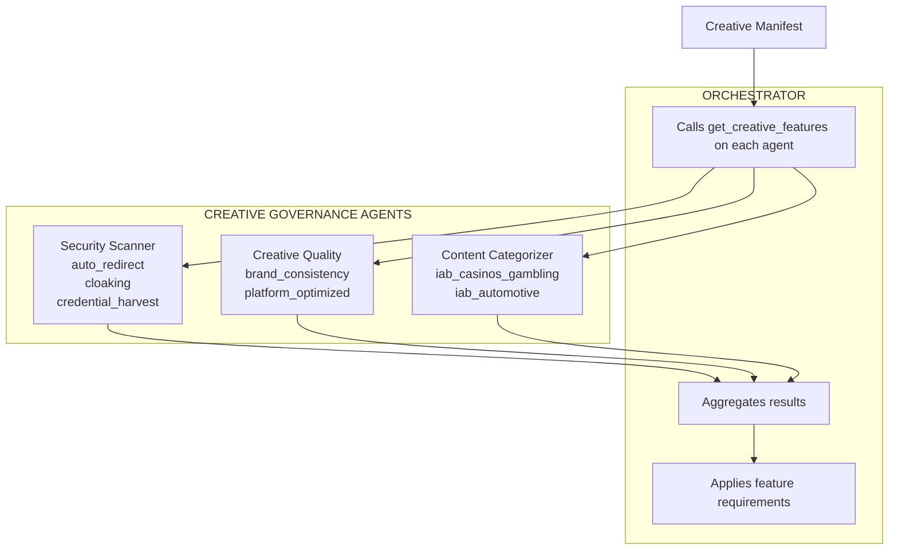

<Info>
**AdCP 3.0 Proposal** - This protocol is under development for AdCP 3.0. Feedback welcome via [GitHub Discussions](https://github.com/adcontextprotocol/adcp/discussions).
</Info>

Creative Governance standardizes how creatives are evaluated by specialized governance agents. It applies the same feature-based pattern as [Property Governance](../property/index) — agents declare features they can evaluate, accept creative manifests, and return feature values.

## Overview

Creative governance agents evaluate creatives and return feature values. Different agents evaluate different features:

| Agent type | Example features | Feature type |
|------------|-----------------|--------------|
| **Security scanner** | `auto_redirect`, `credential_harvest`, `cloaking` | Binary |
| **Creative quality** | `brand_consistency`, `platform_optimized`, `creative_quality_score` | Quantitative, binary |
| **Content categorization** | `iab_casinos_gambling`, `iab_automotive` | Binary (with confidence) |

The protocol doesn't define a fixed feature taxonomy. Vendors declare what they evaluate via [`get_adcp_capabilities`](/dist/docs/3.0.0-rc.1/protocol/get_adcp_capabilities) and compete on coverage.

## How it works

### 1. Agent declares features

A creative governance agent advertises its capabilities using the same feature definition pattern as property governance:

<CodeGroup>
```json Security scanner
{
  "governance": {
    "creative_features": [
      {
        "feature_id": "auto_redirect",
        "type": "binary",
        "description": "Unauthorized navigation away from publisher context without user interaction",
        "methodology_url": "https://scanner.example.com/methodology"
      },
      {
        "feature_id": "credential_harvest",
        "type": "binary",
        "description": "Phishing techniques to gather user credentials or PII",
        "methodology_url": "https://scanner.example.com/methodology"
      },
      {
        "feature_id": "cloaking",
        "type": "binary",
        "description": "Creative masks or misrepresents content to evade detection",
        "methodology_url": "https://scanner.example.com/methodology"
      }
    ]
  }
}
```

```json Creative quality platform
{
  "governance": {
    "creative_features": [
      {
        "feature_id": "brand_consistency",
        "type": "quantitative",
        "range": { "min": 0, "max": 100 },
        "description": "Adherence to brand guidelines including logo placement, colors, and typography",
        "methodology_url": "https://quality.example.com/methodology"
      },
      {
        "feature_id": "platform_optimized",
        "type": "binary",
        "description": "Creative meets platform-specific best practices (aspect ratio, text overlay limits)",
        "methodology_url": "https://quality.example.com/methodology"
      }
    ]
  }
}
```

```json Content categorizer
{
  "governance": {
    "creative_features": [
      {
        "feature_id": "iab_casinos_gambling",
        "type": "binary",
        "description": "Creative contains casinos or gambling content (IAB Content Taxonomy 3.1, ID 181)",
        "methodology_url": "https://categorizer.example.com/methodology"
      },
      {
        "feature_id": "iab_automotive",
        "type": "binary",
        "description": "Creative contains automotive content (IAB Content Taxonomy 3.1, ID 1)",
        "methodology_url": "https://categorizer.example.com/methodology"
      }
    ]
  }
}
```
</CodeGroup>

The orchestrator reads these declarations via `get_adcp_capabilities` before evaluating any creative. If a required feature is absent from an agent's declaration, the orchestrator surfaces the gap immediately rather than discovering it mid-evaluation.

### 2. Orchestrator evaluates a creative

The orchestrator calls [`get_creative_features`](./get_creative_features) with a creative manifest:

```json
{
  "creative_manifest": {
    "format_id": {
      "agent_url": "https://creative.adcontextprotocol.org",
      "id": "html5-display-300x250"
    },
    "assets": {
      "creative_html": {
        "url": "https://cdn.agency.com/creative/abc123.html"
      }
    }
  }
}
```

### 3. Agent returns feature values

The agent evaluates the creative and returns feature values. The response shape is the same regardless of agent type:

```json
{
  "results": [
    { "feature_id": "auto_redirect", "value": true, "confidence": 0.97 },
    { "feature_id": "credential_harvest", "value": false },
    { "feature_id": "cloaking", "value": false }
  ],
  "detail_url": "https://scanner.example.com/reports/ctx_abc123"
}
```

### 4. Orchestrator applies requirements

The orchestrator evaluates the feature values against buyer-defined requirements — the same pattern as property list feature requirements:

- Security: reject if `auto_redirect` is `true`
- Quality: reject if `brand_consistency` is below 80
- Categorization: reject if `iab_casinos_gambling` is `true` and campaign excludes gambling

## Design principles

**Feature IDs enforce strictness, not schema rigidity.** A categorization agent that declares `iab_casinos_gambling` using IAB Content Taxonomy 3.1 ID 181 is as strict as any custom schema — the discipline lives in the agent's methodology, not in the wire format. An orchestrator that requires `iab_casinos_gambling: false` gets a binary pass/fail answer regardless of how the agent detected the content. The feature ID is the contract. The protocol staying schema-agnostic means adding a new IAB category or scanning technique does not require a protocol change.

**Confidence is opt-in, not mandatory.** The `confidence` field on a feature result is optional. Security scanners typically omit it — a creative either contains a credential harvesting pattern or it does not. Categorization agents include it because content detection is probabilistic: a creative may be 94% likely to contain gambling content. The agent decides what to disclose. An orchestrator that cannot tolerate ambiguity requires `value: false` and ignores confidence entirely; an orchestrator that wants to threshold probabilistic results uses it. This is the same field that exists on `property-feature-value` for property governance.

**Orchestrator-enforced consistency.** An orchestrator that requires `iab_casinos_gambling` from its categorization agent discovers at capability-check time — before any creative is evaluated — whether the agent supports that feature. If it does not, the orchestrator fails fast and surfaces the gap. This mirrors how property governance works: IAS and DoubleVerify evaluate different property features; the orchestrator determines which features are required and routes accordingly. Mandating a fixed feature set in the protocol schema would mean every new IAB category or custom brand requirement requires a protocol revision. The protocol defines the enforcement mechanism; the orchestrator defines the requirements.

**Opaque detailed intelligence.** Feature values on the wire are pass/fail (binary) or scores (quantitative). Detection methodology, threat intelligence, and detailed scoring breakdowns stay behind the vendor's access-controlled `detail_url` and `methodology_url`.

## Multi-agent collaboration

Creative governance evaluations typically involve multiple specialist agents working in parallel — the same pattern property governance uses for sustainability, quality, and suitability agents.

| Agent | Features returned | Orchestrator requirement |
|-------|------------------|------------------------|
| Security scanner | `auto_redirect`, `cloaking` | Block if any are `true` |
| Creative quality platform | `brand_consistency`, `platform_optimized` | Block if score below threshold |
| Content categorizer | `iab_casinos_gambling`, `iab_automotive` | Block if excluded category is `true` |

Each agent uses the same `get_creative_features` task. The orchestrator calls them in parallel, collects independent result sets, and applies its requirements across all of them. No agent needs to know about the others.

This means a buyer can:
- Add a new specialist agent without changing existing agents or the evaluation protocol
- Apply different confidence thresholds per agent type
- Replace one vendor with another without changing the evaluation logic for other agents

The orchestrator's feature requirements — not the protocol schema — define what "complete" creative governance means for a given campaign.



## Async evaluation

If evaluation takes time (e.g., sandboxed execution for malware scanning), the agent returns `status: "working"` and delivers results via the standard webhook mechanism. No custom status values or webhook events needed — the existing [async task pattern](/dist/docs/3.0.0-rc.1/building/implementation/async-operations) handles this.
