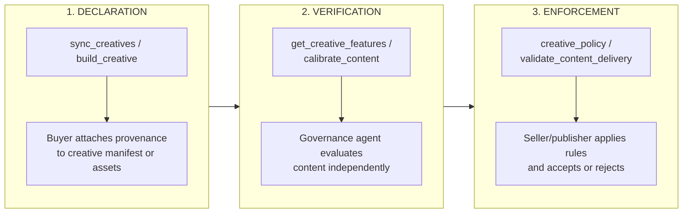
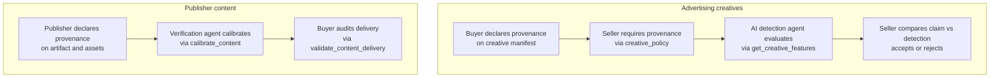

When a creative arrives with a provenance claim, the receiving party needs to decide whether to trust it. This page describes how AdCP handles that decision: provenance claims travel with the creative from buyer to seller, and each enforcement point — the publisher, the SSP, the verification vendor — runs its own independent check. No single party's attestation is taken at face value. This separation between declaration and verification is what makes the system work when the parties involved have competing incentives.

## Three-moment lifecycle

AI provenance flows through three distinct moments, each handled by existing AdCP tasks.



| Moment | When | Who | Task |
|--------|------|-----|------|
| **Declaration** | Creative submission | Buyer, agency, or creative tool | `sync_creatives`, `build_creative` |
| **Verification** | Before trafficking or during calibration | Seller's governance agent | `get_creative_features`, `calibrate_content` |
| **Enforcement** | Acceptance decision or post-delivery audit | Seller agent, buyer agent | `creative_policy`, `validate_content_delivery` |

Each moment is independent. A buyer can declare provenance without any verification having occurred. A seller can verify without requiring a declaration. Enforcement can happen with or without both.

## AI detection via get_creative_features

AI detection is a creative governance feature, evaluated by specialist agents through `get_creative_features` -- the same task used for security scanning, creative quality, and content categorization. AI detection does not require a separate protocol or workflow.

### Agent declares AI detection capabilities

An AI detection agent advertises its features via `get_adcp_capabilities`:

```json
{
  "governance": {
    "creative_features": [
      {
        "feature_id": "ai_generated",
        "type": "binary",
        "description": "Whether the creative contains AI-generated content",
        "methodology_url": "https://detector.example.com/methodology"
      },
      {
        "feature_id": "ai_modified",
        "type": "binary",
        "description": "Whether the creative contains AI-modified elements",
        "methodology_url": "https://detector.example.com/methodology"
      },
      {
        "feature_id": "ai_confidence",
        "type": "quantitative",
        "range": { "min": 0, "max": 1 },
        "description": "Confidence score for AI detection result",
        "methodology_url": "https://detector.example.com/methodology"
      }
    ]
  }
}
```

### Seller evaluates a creative

The seller sends the creative manifest to the AI detection agent:

```json
{
  "creative_manifest": {
    "format_id": {
      "agent_url": "https://creative.adcontextprotocol.org",
      "id": "display_300x250"
    },
    "assets": {
      "banner_image": {
        "url": "https://cdn.novabrands.example.com/hero.jpg",
        "width": 300,
        "height": 250
      },
      "headline": {
        "content": "Nutrition dogs love"
      }
    }
  },
  "feature_ids": ["ai_generated", "ai_modified", "ai_confidence"]
}
```

### Agent returns detection results

```json
{
  "results": [
    { "feature_id": "ai_generated", "value": true, "confidence": 0.94 },
    { "feature_id": "ai_modified", "value": false },
    { "feature_id": "ai_confidence", "value": 0.94 }
  ],
  "detail_url": "https://detector.example.com/reports/ctx_xyz789"
}
```

### Seller applies enforcement logic

The seller compares the detection result against the buyer's provenance claim:

```javascript
const provenance = creative.manifest.provenance;
const detection = await detectionAgent.getCreativeFeatures({
  creative_manifest: creative.manifest,
  feature_ids: ['ai_generated']
});

if (detection.errors) {
  // Detection failed - handle based on policy
  return;
}

const aiDetected = detection.results.find(
  f => f.feature_id === 'ai_generated'
);

// Case 1: Provenance claims non-AI, detection says AI
if (
  provenance?.digital_source_type === 'digital_capture' &&
  aiDetected?.value === true &&
  aiDetected?.confidence > 0.9
) {
  // Reject - provenance claim contradicts detection
  return;
}

// Case 2: AI content in jurisdiction requiring disclosure
if (
  aiDetected?.value === true &&
  !provenance?.disclosure?.required
) {
  // Reject - AI content without required disclosure metadata
  return;
}
```

### Multi-agent evaluation

AI detection fits naturally into the multi-agent creative governance pattern. A seller evaluating a creative can call multiple specialist agents in parallel:

| Agent | Features | Provenance relevance |
|-------|----------|---------------------|
| Security scanner | `auto_redirect`, `cloaking` | None -- independent concern |
| AI detection | `ai_generated`, `ai_modified` | Verifies provenance claims |
| Content categorizer | `iab_casinos_gambling` | None -- independent concern |
| Creative quality | `brand_consistency` | None -- independent concern |

The orchestrator calls all agents via `get_creative_features`, aggregates results, and applies its requirements across all of them. AI detection is one column in the evaluation matrix, not a separate workflow.

## Content standards integration

For publisher content (artifacts), provenance verification uses the content standards infrastructure: `calibrate_content` for alignment and `validate_content_delivery` for auditing.

### Artifact provenance

Publishers declare provenance on artifacts the same way buyers declare it on creatives:

```json
{
  "property_id": { "type": "domain", "value": "newssite.example.com" },
  "artifact_id": "article_trends_2026",
  "provenance": {
    "digital_source_type": "digital_creation",
    "declared_by": { "role": "platform" }
  },
  "assets": [
    {
      "type": "text",
      "role": "title",
      "content": "Industry trends to watch in 2026"
    },
    {
      "type": "image",
      "url": "https://cdn.newssite.example.com/ai-illustration.jpg",
      "alt_text": "Conceptual illustration",
      "provenance": {
        "digital_source_type": "trained_algorithmic_media",
        "ai_tool": { "name": "Midjourney", "version": "v7" },
        "declared_by": { "role": "platform" }
      }
    }
  ]
}
```

### Calibration for AI provenance

During `calibrate_content`, the verification agent can evaluate whether artifact provenance claims are accurate. This uses the same calibration dialogue as brand suitability -- the verification agent returns verdicts with explanations:

```json
{
  "verdict": "fail",
  "explanation": "The article's hero image shows strong indicators of AI generation (GAN artifacts, inconsistent lighting) but is marked as digital_creation. The provenance claim does not match detection results.",
  "features": [
    {
      "feature_id": "provenance_accuracy",
      "status": "failed",
      "explanation": "Image asset provenance claims digital_creation but AI detection confidence is 0.92."
    },
    {
      "feature_id": "brand_safety",
      "status": "passed",
      "explanation": "No safety concerns with the content itself."
    }
  ]
}
```

### Post-delivery validation

Buyers can audit AI provenance in delivered content through `validate_content_delivery`, the same task used for brand suitability auditing:

```json
{
  "standards_id": "acme_ai_disclosure_policy",
  "records": [
    {
      "record_id": "imp_54321",
      "media_buy_id": "mb_acme_q1",
      "artifact": {
        "property_id": { "type": "domain", "value": "newssite.example.com" },
        "artifact_id": "article_trends_2026",
        "provenance": {
          "digital_source_type": "digital_creation",
          "declared_by": { "role": "platform" }
        },
        "assets": [
          {
            "type": "image",
            "url": "https://cdn.newssite.example.com/ai-illustration.jpg"
          }
        ]
      }
    }
  ]
}
```

## Compliance profiles

Different regulatory environments require different levels of provenance enforcement. Here are example configurations.

<CodeGroup>
```json EU (strict)
{
  "profile": "eu_strict",
  "creative_policy": {
    "provenance_required": true
  },
  "enforcement_rules": {
    "ai_detection_required": true,
    "ai_detection_confidence_threshold": 0.85,
    "disclosure_required_for": [
      "trained_algorithmic_media",
      "composite_with_trained_algorithmic_media",
      "human_edits"
    ],
    "reject_on_mismatch": true,
    "jurisdictions": [
      {
        "country": "DE",
        "regulation": "eu_ai_act_article_50",
        "label_text": "KI-generiert"
      },
      {
        "country": "FR",
        "regulation": "eu_ai_act_article_50",
        "label_text": "Contenu généré par l'IA"
      }
    ]
  }
}
```

```json US/California (moderate)
{
  "profile": "us_california",
  "creative_policy": {
    "provenance_required": true
  },
  "enforcement_rules": {
    "ai_detection_required": true,
    "ai_detection_confidence_threshold": 0.90,
    "disclosure_required_for": [
      "trained_algorithmic_media",
      "composite_with_trained_algorithmic_media"
    ],
    "reject_on_mismatch": true,
    "jurisdictions": [
      {
        "country": "US",
        "region": "CA",
        "regulation": "ca_sb_942",
        "label_text": "Created with AI"
      }
    ]
  }
}
```

```json Permissive
{
  "profile": "permissive",
  "creative_policy": {
    "provenance_required": false
  },
  "enforcement_rules": {
    "ai_detection_required": false,
    "log_provenance_if_present": true,
    "reject_on_mismatch": false
  }
}
```
</CodeGroup>

<Info>
These profiles are illustrative configurations, not schema-defined objects. Each seller implements enforcement logic suited to their regulatory requirements. The AdCP schemas provide the data model; the enforcement rules are implementation decisions.
</Info>

## For regulators

AdCP provides a machine-readable, protocol-level mechanism for AI disclosure in programmatic advertising. Every creative and content artifact in the supply chain can carry structured provenance metadata that declares the digital source type, the AI tools used, the level of human oversight, and the applicable disclosure requirements by jurisdiction — including specific regulation identifiers such as `eu_ai_act_article_50`, `ca_sb_942`, and `cn_deep_synthesis`.

This metadata uses the IPTC digital source type vocabulary, the same classification system adopted by C2PA Content Credentials, Meta, and Google for AI content labeling. AdCP does not invent a new taxonomy. It carries an existing, widely adopted one through the advertising supply chain where it has not previously been available in structured form.

### Verification is independent, not self-reported

Provenance in AdCP is explicitly a claim, not a certification. The declaring party — typically the advertiser or their agency — attaches provenance when submitting a creative. The enforcing party — typically the publisher or their supply-side platform — verifies that claim independently using AI detection services, C2PA manifest validation, or both. This verification happens through existing AdCP governance mechanisms (`get_creative_features` for creatives, `calibrate_content` for publisher content) and does not require new infrastructure.

This architecture addresses a structural problem in advertising compliance: the party submitting the creative has an incentive to understate AI involvement (to avoid placement restrictions or disclosure requirements), while the party publishing the creative bears the regulatory liability for non-disclosure. By treating provenance as a verifiable claim rather than a trusted assertion, the protocol ensures that compliance does not depend on the good faith of any single participant.

### Mapping to regulatory requirements

**EU AI Act Article 50**: Requires that AI-generated content be labeled in a machine-readable way. AdCP's `digital_source_type` field provides this classification at the asset level. The `disclosure.jurisdictions` array allows creatives to carry jurisdiction-specific label text. Enforcement points can filter or flag creatives based on `digital_source_type` values that indicate AI generation (`trained_algorithmic_media`, `composite_with_trained_algorithmic_media`).

**California SB 942**: Requires disclosure when content is generated or substantially modified by AI. The `digital_source_type` and `human_oversight` fields together provide the information needed to determine whether a creative meets the disclosure threshold. The `disclosure.required` flag provides a direct signal for enforcement.

**Platform mandates (Meta, Google, TikTok)**: Major platforms already require AI content labeling using IPTC-aligned metadata. AdCP's provenance structure is directly compatible with these requirements because it uses the same underlying vocabulary.

AdCP does not determine which regulations apply to a given creative. It provides the structured metadata that allows each enforcement point to apply its own jurisdictional rules. The protocol carries the data; the enforcing party makes the compliance decision.

### Verification flow



## Implementation checklist

### Buyers (brands and agencies)

| Requirement | Description |
|-------------|-------------|
| Attach provenance to creatives | Set `provenance` on `creative-asset` or `creative-manifest` when submitting via `sync_creatives` |
| Classify AI involvement | Use the correct `digital_source_type` for each creative and asset |
| Declare AI tooling | Populate `ai_tool` when AI systems were used in production |
| Set human oversight level | Indicate `human_oversight` when AI is involved |
| Declare disclosure obligations | Populate `disclosure.jurisdictions` for each applicable regulation |
| Preserve C2PA references | Include `c2pa.manifest_url` when content credentials exist |
| Run pre-submission detection | Optionally attach `verification` results from your own detection services |

### Sellers (publishers and platforms)

| Requirement | Description |
|-------------|-------------|
| Set creative policy | Add `provenance_required: true` to `creative-policy` if provenance is required |
| Run AI detection | Call `get_creative_features` with an AI detection agent to verify provenance claims |
| Compare claims vs detection | Implement logic to compare `digital_source_type` against `ai_generated` feature results |
| Enforce disclosure | Verify that AI content includes appropriate `disclosure` metadata for target jurisdictions |
| Reject mismatches | Reject creatives where provenance claims contradict detection results |
| Declare artifact provenance | Attach `provenance` to content artifacts submitted via content standards |

### Creative agents

| Requirement | Description |
|-------------|-------------|
| Attach provenance to generated content | When `build_creative` generates AI content, attach provenance with `digital_source_type`, `ai_tool`, and `human_oversight` |
| Set `declared_by` role to `tool` | Creative agents that attach provenance should identify themselves with role `tool` |
| Carry through C2PA | If source assets have C2PA manifests, carry the reference through to the generated manifest |

### Governance agents (AI detection)

| Requirement | Description |
|-------------|-------------|
| Declare detection features | Advertise `ai_generated` and related features via `get_adcp_capabilities` |
| Implement `get_creative_features` | Accept creative manifests and return detection results |
| Return confidence scores | Include `confidence` on detection results for probabilistic assessments |
| Provide detail URLs | Link to full reports via `detail_url` for audit trails |

## Related

- [AI provenance and disclosure](/dist/docs/3.0.0-rc.1/creative/provenance) -- The provenance schema reference, digital source type enum, and inheritance model
- [Creative Governance](/dist/docs/3.0.0-rc.1/governance/creative/index) -- Feature-based creative evaluation via `get_creative_features`
- [`get_creative_features`](/dist/docs/3.0.0-rc.1/governance/creative/get_creative_features) -- Task reference for creative feature evaluation
- [Content Standards](/dist/docs/3.0.0-rc.1/governance/content-standards/index) -- Privacy-preserving brand suitability for publisher content
- [`calibrate_content`](/dist/docs/3.0.0-rc.1/governance/content-standards/tasks/calibrate_content) -- Calibration task for content standards alignment
- [`validate_content_delivery`](/dist/docs/3.0.0-rc.1/governance/content-standards/tasks/validate_content_delivery) -- Post-delivery content validation
