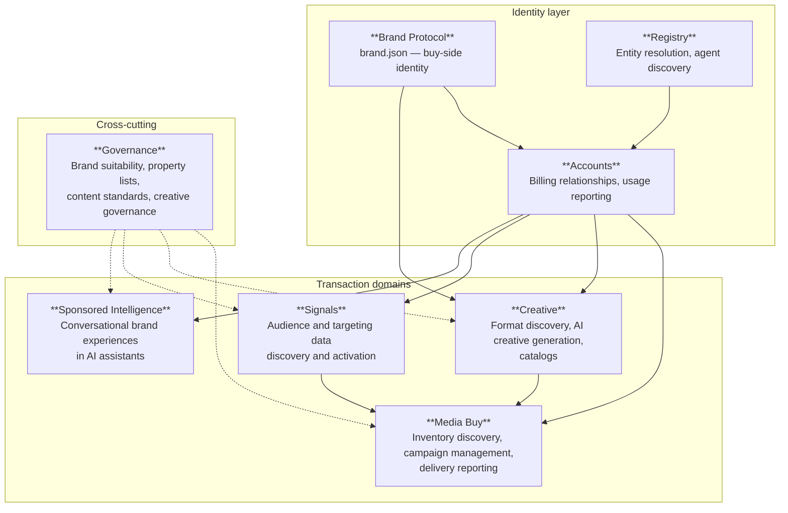
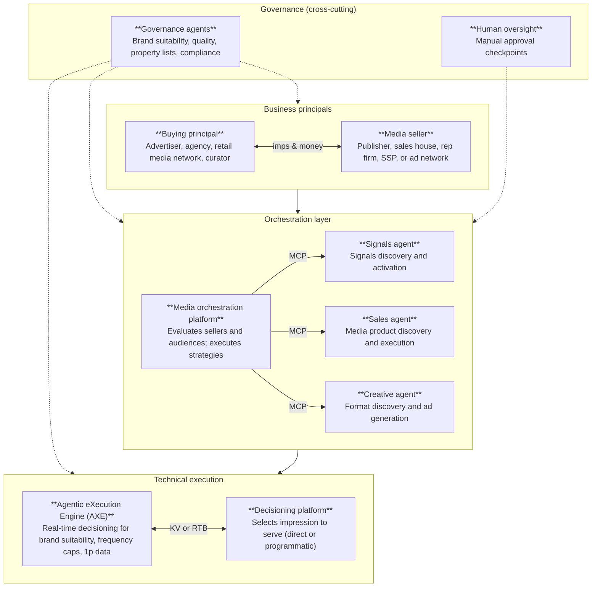

# Protocol architecture

AdCP operates at multiple layers, providing a clean separation between business roles, orchestration, and technical execution.

## Protocol domain map

### Identity layer

Three protocol domains establish who the parties are before any transaction occurs.

**Brand Protocol** defines buy-side identity through `brand.json` files hosted at `/.well-known/brand.json`. Brands declare their corporate hierarchy, sub-brands, properties, and authorized operators. Any domain can be resolved to a canonical brand identity. See [Brand Protocol](/dist/docs/3.0.0-rc.1/brand-protocol).

**Registry** provides a public REST API for entity resolution and agent discovery. Resolve a brand domain, find which agents are authorized to sell a publisher's inventory, or discover agents by capability. See [Registry API](/dist/docs/3.0.0-rc.1/registry).

**Accounts** establishes the commercial relationship between buyers and sellers. Every AdCP transaction happens within an account that defines billing terms, operator authorization, and usage reporting. Accounts are grounded in brand identity from the Brand Protocol. See [Accounts Protocol](/dist/docs/3.0.0-rc.1/accounts/overview).

### Transaction domains

Four protocol domains handle core advertising operations.

**Media Buy** covers inventory discovery (`get_products`), campaign creation (`create_media_buy`), and delivery reporting (`get_media_buy_delivery`). Publishers return structured media products with pricing, targeting options, and delivery forecasts. Buyers can request proposals — structured media plans that encode publisher expertise. See [Media Buy](/dist/docs/3.0.0-rc.1/media-buy).

**Creative** handles format discovery (`list_creative_formats`), AI-powered creative generation (`build_creative`), catalog synchronization (`sync_catalogs`), and creative delivery tracking. Creative agents resolve brand identity from the Brand Protocol to generate on-brand assets. See [Creative](/dist/docs/3.0.0-rc.1/creative).

**Signals** enables audience and targeting data discovery (`get_signals`) and activation (`activate_signal`). Data providers publish signal catalogs that buyers can discover with natural language queries, then activate on decisioning platforms. See [Signals](/dist/docs/3.0.0-rc.1/signals/overview).

**Sponsored Intelligence** defines conversational brand experiences in AI assistants. When a user expresses interest in a brand, the host initiates a consent-first session where the brand's agent engages conversationally with text, voice, UI components, or commerce handoffs. See [Sponsored Intelligence](/dist/docs/3.0.0-rc.1/sponsored-intelligence/overview).

### Governance (cross-cutting)

**Governance** operates across all transaction domains. Governance agents manage property lists (curated sets of properties for targeting or exclusion), content standards (brand suitability policies), and creative governance (security scanning, content categorization). Governance data flows into media buy decisions, creative validation, and signal activation. See [Governance Protocol](/dist/docs/3.0.0-rc.1/governance/overview).

Human-in-the-loop approval checkpoints are supported at any stage — campaign approval, creative review, budget thresholds, and policy exceptions. This is not a real-time protocol: operations may take minutes to days when human approval is required.

---

## Ecosystem layers

The protocol domain map above shows how AdCP tasks relate to each other. The diagram below shows how these map to real-world roles and systems.

### Business principals

**Buying principal** — the demand side: advertisers, agencies, retail media networks, and curators packaging inventory and data for specific use cases.

**Media seller** — the supply side: publishers, sales houses, rep firms, SSPs, and ad networks.

These parties exchange impressions and money through the orchestration layer.

### Orchestration layer

**Media orchestration platform** — evaluates sellers and audiences, executes buying strategies. Communicates with specialized agents via MCP.

**Signals agent** — MCP servers exposing audience and targeting data discovery and activation.

**Sales agent** — MCP servers exposing media product discovery and campaign execution.

**Creative agent** — MCP servers exposing format discovery and AI-powered creative generation.

### Technical execution

**Agentic eXecution Engine (AXE)** — real-time execution layer for brand suitability, frequency capping, first-party data activation, and dynamic audience targeting. Connects via key-value pairs or RTB protocols. See [AXE documentation](/dist/docs/3.0.0-rc.1/media-buy/advanced-topics/agentic-execution-engine).

**Decisioning platform** — the infrastructure that selects which ad to serve, via direct campaigns or programmatic (RTB). Examples include DSPs, SSPs, and ad servers.

### Governance and human oversight

**Governance agents** provide compliance and quality control across all layers: property lists, brand suitability scoring, quality measurement (MFA score, ad density), and privacy compliance (COPPA, TCF, GDPR). They operate at setup time, real-time, and post-bid.

**Human-in-the-loop** — optional manual approval at key decision points: campaign approval, creative review, budget thresholds, and policy exceptions.
