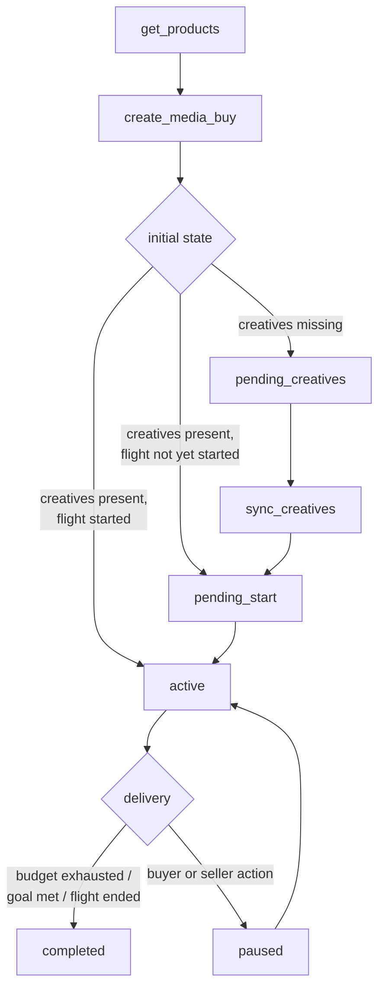
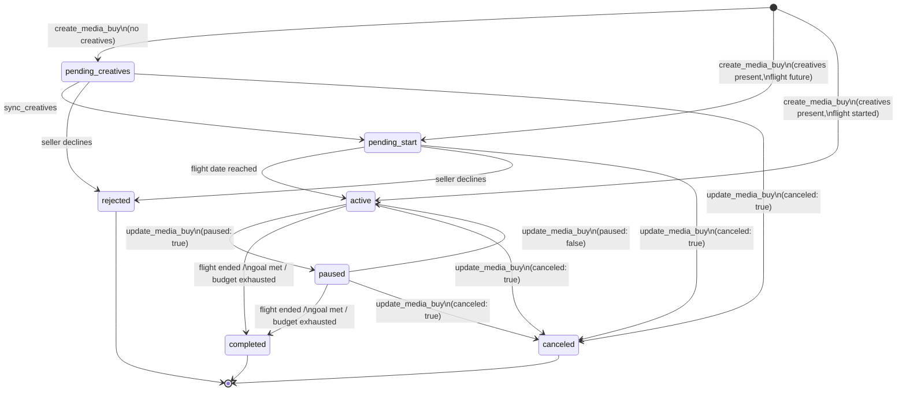
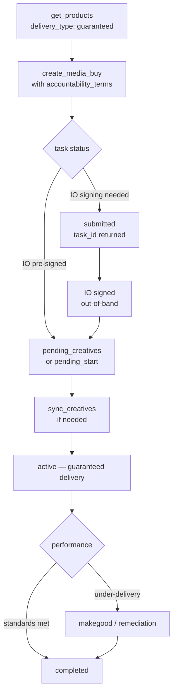

This page is the canonical sequence reference for media buy lifecycle. For conceptual background on the full lifecycle — campaign structure, package model, property targeting, and async operations — see [Media Buy Lifecycle](/dist/docs/3.0.13/media-buy/media-buys/).

## Standard flow

Every media buy follows four steps:



1. **`get_products`** — discover available inventory matching your brief.
2. **`create_media_buy`** — submit packages; the seller validates and confirms.
3. **`sync_creatives`** — assign creative assets to packages that need them.
4. **Delivery** — the buy enters `active`, accrues impressions, and eventually reaches a terminal state.

## State machine

### Media buy states

| State | Meaning | Terminal? |
|-------|---------|-----------|
| `pending_creatives` | Approved; no creatives assigned yet | No |
| `pending_start` | Creatives assigned; waiting for flight date | No |
| `active` | Delivering impressions | No |
| `paused` | Temporarily halted | No |
| `completed` | Flight ended, goal met, or budget exhausted | Yes |
| `rejected` | Seller declined the buy | Yes |
| `canceled` | Buyer or seller terminated before completion | Yes |

<Note>
`pending_manual` and `pending_permission` are **task-level** statuses — they describe whether the *operation* (e.g., `create_media_buy`) is queued for human review, not the media buy's own state. The media buy enters `pending_creatives`, `pending_start`, or `active` once the operation completes. See [Asynchronous Operations](/dist/docs/3.0.13/media-buy/media-buys/#asynchronous-operations-and-human-in-the-loop).
</Note>

### Transitions



### Discovering valid actions at runtime

Rather than hardcoding the state machine, read `valid_actions` from `get_media_buys`. The seller returns exactly what the buyer can do in the current state:

```json
{
  "media_buy_id": "mb_12345",
  "status": "active",
  "revision": 3,
  "valid_actions": ["pause", "cancel", "update_budget", "update_dates", "update_packages", "add_packages", "sync_creatives"]
}
```

Always pass `revision` in `update_media_buy` calls. The seller rejects with `CONFLICT` if the revision has changed since your last read.

## Guaranteed / PG deal variation

Products with `delivery_type: "guaranteed"` require contractual commitment before delivery begins. The flow diverges after `create_media_buy`:



### What makes a guaranteed buy different

**`accountability_terms` are required** on each package with a guaranteed product. Three fields are required:

- `performance_standards` — viewability, IVT, completion rate, and other thresholds with measurement vendor
- `measurement_terms` — who counts the billing metric, acceptable variance, and makegood remedies
- `cancellation_policy` — notice period and cancellation fee for early termination

Omitting any of these on a guaranteed package causes the seller to return `TERMS_REJECTED`.

**IO signing** — `create_media_buy` for a guaranteed product may return task status `submitted` with a `task_id` rather than completing synchronously. This means the seller's system is awaiting insertion order (IO) acceptance. Poll with `tasks/get` or configure a webhook. Once the IO is signed, the completion artifact carries the `media_buy_id` and the media buy enters `pending_creatives` or `pending_start`.

**Makegoods** — if the seller under-delivers against agreed `performance_standards`, they propose a remedy from the `makegood_policy`: `additional_delivery`, `credit`, or `invoice_adjustment`. The buyer accepts or disputes.

<Note>
A seller who accepts without under-delivering earns a favorable accountability signal. See [Accountability](/dist/docs/3.0.13/media-buy/advanced-topics/accountability) for the full negotiation flow including how buyers can propose non-default terms at `create_media_buy` time.
</Note>

## Creative sync timing

### When creatives are required

`create_media_buy` accepts inline `creative_assignments` or `creatives` per package. If you supply them at creation time and the flight date has passed, the buy enters `active` directly. If the flight date is in the future, it enters `pending_start`.

If no creatives are assigned at creation, the buy enters `pending_creatives`. Delivery cannot begin until `sync_creatives` is called to assign at least one creative per package.

### The `creative_deadline`

`create_media_buy` returns a `creative_deadline` timestamp on the media buy response. Individual packages may carry their own `creative_deadline`. **Package-level deadlines take precedence over the media buy deadline.** This matters for mixed-channel orders — a print package may have a material deadline days before the digital packages in the same buy.

After the deadline, `sync_creatives` calls for that package return `CREATIVE_REJECTED`. Creative changes are blocked; delivery continues with whatever creatives are currently assigned (or the package remains in `pending_creatives` if none were ever assigned).

```
Deadline hierarchy:
  package.creative_deadline  (if present — wins)
    ↓ else
  media_buy.creative_deadline
```

### Effect on creatives when a buy ends

When a media buy reaches `rejected`, `canceled`, or `completed`, creative assignments are released. The creatives themselves are not deleted — they remain in the library with their existing review status and are available for assignment to other media buys.

## Health and dependency impairment

`status` describes operational state — is the buy serving, paused, or terminal? **`health`** is a separate orthogonal field describing whether upstream dependencies are intact:

| Field | Tracks | Values |
|-------|--------|--------|
| `status` | Operational state | `pending_creatives`, `pending_start`, `active`, `paused`, `completed`, `rejected`, `canceled` |
| `health` | Dependency state | `ok`, `impaired` |

The two are orthogonal. A buy can be `paused`-and-impaired, `pending_creatives`-and-impaired, or `active`-and-impaired. Health does not change `status`; `valid_actions` is unaffected.

### When `health` is `impaired`

`health` transitions to `impaired` when an upstream dependency referenced by the buy enters an offline state that affects delivery for at least one package:

- An audience the buy targets transitions to `suspended` (consent expiry, TTL, policy enforcement).
- A creative the buy uses transitions from `approved` to `rejected` (post-approval revocation).
- A catalog item the buy targets transitions to `withdrawn` (seller-initiated removal).
- An event source the buy depends on enters `insufficient` (zero events received).
- A property the buy targets is depublished via brand.json / adagents.json.

The buy's `impairments[]` array carries one entry per affected dependency:

```json
{
  "media_buy_id": "mb_456",
  "status": "active",
  "health": "impaired",
  "impairments": [
    {
      "impairment_id": "imp_01HZX9...",
      "resource_type": "audience",
      "resource_id": "aud_123",
      "package_ids": ["pkg_a"],
      "transition": { "from": "ready", "to": "suspended" },
      "reason_code": "consent_expired",
      "reason": "Hashed identifier consent basis expired on 2026-06-01.",
      "observed_at": "2026-06-02T14:11:00Z",
      "remediation": "Re-sync audience after refreshing consent upstream."
    }
  ]
}
```

### Materiality

Each entry in `impairments[]` MUST list at least one package whose ability to serve is degraded. Cosmetic effects (one rejected creative in a package that still has serviceable peers) MUST NOT be reported as impairments — they're surfaced via the resource's own status, not the buy's.

### Reverse direction

When the underlying resource returns to a serviceable state (audience re-syncs, creative re-approved), the seller MUST remove the corresponding entry from `impairments[]` and flip `health` to `ok` if no other impairments remain. The buyer sees the recovered state on the next snapshot read or via the next `impairment` push (which carries the closure).

### Pushed via `impairment` webhook

When a buy's `health` transitions or an impairment is added/removed, the seller fires an `impairment` notification against the buy's `push_notification_config`. The payload reuses the `impairment` object shape plus the buy's updated `health`. See the [persistent webhook contract](/dist/docs/3.0.13/building/by-layer/L3/webhooks#persistent-channel-contract) for delivery semantics (at-least-once, no-ordering, coalescence, replay via snapshot).

### Materiality coverage

The MUST-strength materiality rule applies to resource types where the resource → buy join is cheap and 1:N — audience, event_source, property. For creative and catalog_item, materiality is SHOULD-strength: a creative in a large pool may not degrade serving when removed, and the join is more expensive for sellers to compute. Implementers SHOULD report conservatively when uncertain and MUST NOT report when serving is provably unaffected.

### Remediation by `reason_code`

Each `reason_code` has a typical buyer remediation path. Sellers don't fill this in per-impairment — buyer agents key remediation off `reason_code` directly. The table below is the protocol-level guidance; the per-impairment free-text `remediation` field carries seller-specific context that doesn't fit the typical path (e.g., "we restored this audience yesterday; sync now to pick up the refresh").

| `reason_code` | Typical buyer remediation |
|---|---|
| `consent_expired` | Refresh upstream consent (e.g., hashed-id consent renewal on a clean-room flow), then re-sync the audience via `sync_audiences`. |
| `ttl_expired` | Re-sync the audience via `sync_audiences` to renew. |
| `pii_audit_failed` | Address audit findings upstream (hashing, identifier hygiene). Re-sync only **after** the seller signals the audit is cleared — a buyer agent that loops `sync_audiences` against an uncleared audit will not converge. |
| `content_rejected` | Same path as initial creative approval — fix the issue and resubmit via `sync_creatives`. Campaign-level decision (replace vs. wait for resubmit) depends on creative pool composition and is left to the buyer. |
| `source_offline` | Verify the tag is firing on the buyer's properties (this is often a buyer/publisher integration issue, not a seller-side outage), then re-sync via `sync_event_sources`. |
| `seller_removed` | No buyer-side resubmit path. Find a replacement via the same discovery tool used at campaign setup (`get_products`, `get_signals`, `list_creative_formats`), or contact the seller for restoration ETA. |
| `policy_violation` | Seller-side enforcement; buyer-side resubmit unlikely to clear. Await resolution or escalate per the seller's standard contact path. |
| `property_depublished` | No buyer-side fix — property publication is controlled by the publisher's `brand.json` / `adagents.json`. Find a replacement property via `get_products` or remove from targeting. |

### Triage ordering

Buyer agents triaging a non-empty `impairments[]` SHOULD sort entries by `observed_at` ascending — the oldest open impairment is the most likely to have already eaten into delivery. Webhook arrival time is not a reliable proxy: under the coalescence rule (see [webhooks § Coalescence](/dist/docs/3.0.13/building/by-layer/L3/webhooks#coalescence)) the seller MAY batch multiple state changes into one fire, and re-emission under a fresh `idempotency_key` resets the transport timestamp without changing `observed_at`.

### Impairments are operational signals, not commercial events

An `impairment` reports degraded delivery from upstream dependency change. It is **not** a billing event, makegood trigger, or credit dispute. Commercial remedies for under-delivery are governed by `accountability_terms` on guaranteed buys and remain out of scope for this surface. Integrators building dispute pipelines should drive them from delivery reports and accountability terms, not from `impairments[]`.

### Compliance

The `impairment.coherence` assertion verifies that the buy's `impairments[]` surface stays in sync with the underlying resources it references. It is a cross-resource invariant — it observes both the resource transition and the buy snapshot in the same compliance run.

**Forward rule.** Every entry in a buy's `impairments[]` MUST reference a resource whose current status is an offline state — `audience: suspended` (on `audience-status`), `creative: rejected` (on `creative-status`), `catalog_item: withdrawn` (on `catalog-item-status`), `event_source: insufficient` (the `assessment-status` value surfaced through `event-source-health.status`), or a property depublished via `brand.json` / `adagents.json`. A buy reporting an impairment whose referenced resource is no longer offline fails the check — the seller has stale state on the buy.

**Inverse rule.** Any resource in an offline state that is referenced by a non-terminal buy MUST appear in that buy's `impairments[]`. A seller that transitions a resource without propagating to the affected buys fails the check — the seller has stale state on the resource.

**Health-iff rule.** A non-terminal buy's `health` MUST be `impaired` whenever `impairments[]` is non-empty, and MUST be `ok` whenever `impairments[]` is empty. This is a strict iff — stale `health: "impaired"` with an empty `impairments[]` (or `health: "ok"` with a non-empty `impairments[]`) violates the rule even when the forward and inverse rules are individually satisfied.

**Out of scope.** All three rules relax on buys in terminal status (`completed`, `canceled`, `rejected`). Sellers MAY leave `impairments[]` and `health` in whatever state they held at the terminal transition — they are not required to clean up. Buyers MUST NOT treat post-terminal drift as a coherence violation; the buy is no longer serving and synchronisation is wasted effort. Materiality (the requirement that `package_ids` be non-empty) is enforced at the schema layer by `package_ids: minItems: 1` on `impairment.json` — `impairment.coherence` does not re-check it.

**Snapshot is one of several propagation surfaces.** Sellers declare which surfaces they use via [`capabilities.media_buy.propagation_surfaces`](https://adcontextprotocol.org/schemas/3.0.13/protocol/get-adcp-capabilities-response.json) on `get_adcp_capabilities` — a non-exclusive array, so a seller mirroring impairments on both the buy snapshot AND firing webhooks declares `["snapshot", "webhook"]` (the common case for premium guaranteed sellers). The three surface values:

- **`snapshot`** — seller populates `health` + `impairments[]` on `get_media_buys` reads. The contract above governs this surface; `impairment.coherence` storyboards grade it when declared, `not_applicable` otherwise.
- **`webhook`** — seller fires `notification-type: impairment` webhooks via `push_notification_config`. Subject to the persistent-channel webhook contract.
- **`out_of_band`** — seller propagates via channels outside the AdCP protocol surface (email, dashboard, partner-specific feeds). Long-tail and enterprise-bundled platforms commonly use this when impairment workflows are managed in human channels. Sellers declaring only `["out_of_band"]` are not graded by snapshot or webhook compliance — their bar is the offline agreement.

Default when absent is `["snapshot"]`. Each surface is independent of the others; declare the actual mix of surfaces buyers will observe on the agent. A seller with impairment data in their API under a non-AdCP field name (a mapping gap) SHOULD document the mapping rather than declare `out_of_band` — the spec's gap is what `out_of_band` legitimately covers.

**Relationship to other invariants.** `impairment.coherence` complements `status.monotonic`, which observes single-resource transitions only. The two run together on every specialism whose storyboard exercises both a resource-state transition and a media-buy snapshot read — audience-sync, creative-ad-server, creative-template, creative-generative, sales-catalog-driven. The cross-resource exercise that drives non-NA grading is the dependency-impairment storyboard (`media_buy_seller/dependency_impairment`, creative-track), which forces a creative from approved → rejected on an active buy, verifies the buy reflects `health: impaired` with a matching `impairments[]` entry, recovers the creative, and verifies the buy returns to `health: ok` with `impairments[]` cleared. Audience-track and catalog-track variants are follow-ups, pending `force_audience_status` / `force_catalog_item_status` support in the compliance test controller.

See the [Snapshot and log contract](/dist/docs/3.0.13/protocol/snapshot-and-log) for the read-side rules that tie `impairments[]` (snapshot) to the `impairment` push (log).

<Tip>
Creative library state and creative assignment state are tracked independently. A creative that was assigned to a canceled buy still has whatever review status it earned and can be immediately assigned to a new buy. See [creative state and assignment state](/dist/docs/3.0.13/creative/creative-libraries#creative-state-and-assignment-state-are-separate).
</Tip>

## See also

- [Media Buy Lifecycle](/dist/docs/3.0.13/media-buy/media-buys/) — full lifecycle reference: campaign structure, package model, async operations
- [`create_media_buy`](/dist/docs/3.0.13/media-buy/task-reference/create_media_buy) — task reference with request parameters, response shapes, and examples
- [`sync_creatives`](/dist/docs/3.0.13/creative/task-reference/sync_creatives) — assign and update creative assets on active packages
- [Accountability](/dist/docs/3.0.13/media-buy/advanced-topics/accountability) — performance standards, measurement terms, makegood resolution
- [Optimization & Reporting](/dist/docs/3.0.13/media-buy/media-buys/optimization-reporting) — delivery monitoring, dimensional reporting, campaign updates
