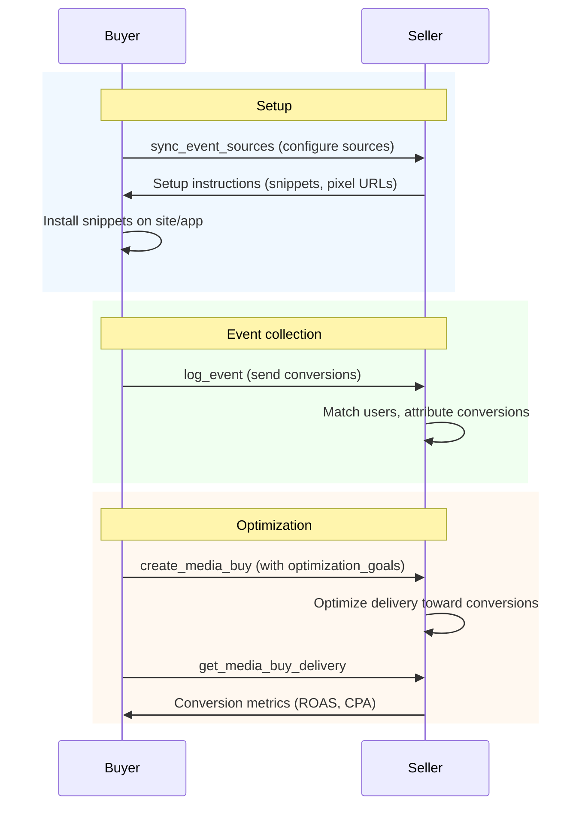

Conversion tracking in AdCP connects advertising spend to business outcomes. Two tasks handle the lifecycle: [`sync_event_sources`](/dist/docs/3.0.5/media-buy/task-reference/sync_event_sources) configures where events come from, and [`log_event`](/dist/docs/3.0.5/media-buy/task-reference/log_event) sends the events themselves.

Event data feeds into delivery reporting (conversions, ROAS, cost per acquisition) and enables optimization goals on media buy packages.

## The flow



This shows the recommended order. In practice, media buys can be created before events are flowing — the seller begins optimizing once sufficient event history accumulates.

## Event source

An event source represents a channel through which conversion events are collected — a website pixel, mobile SDK, server-to-server integration, or CRM import.

Configure event sources with [`sync_event_sources`](/dist/docs/3.0.5/media-buy/task-reference/sync_event_sources). You provide an `event_source_id`, optional `name`, `event_types`, and `allowed_domains`. The response includes additional fields for each source:

| Field | Type | Description |
|-------|------|-------------|
| `seller_id` | string | Seller-assigned identifier in their ad platform |
| `action` | string | What happened: `created`, `updated`, `unchanged`, `deleted`, `failed` |
| `managed_by` | string | `buyer` (you configured it) or `seller` (always-on, seller-managed) |
| `action_source` | [ActionSource](#action-sources) | Type of event source (website pixel, app SDK, etc.) |
| `setup` | object | Implementation details — snippet code, snippet type, instructions |

### Buyer-managed vs seller-managed

**Buyer-managed** sources are ones you configure via `sync_event_sources`. You control the event types, domains, and lifecycle.

**Seller-managed** sources are always-on and appear in the response with `managed_by: "seller"`. These are common in commerce media where the retailer provides built-in attribution (e.g., purchase tracking on their own platform). Products with `conversion_tracking.platform_managed: true` indicate the seller provides these sources.

To discover all sources on an account (including seller-managed), call `sync_event_sources` without an `event_sources` array:

```json
{
  "$schema": "https://adcontextprotocol.org/schemas/3.0.5/media-buy/sync-event-sources-request.json",
  "idempotency_key": "c9f3d6a7-5678-48e4-5678-9012345abcde",
  "account": { "account_id": "acct_12345" }
}
```

## Event

An event represents a user action — a purchase, lead submission, page view, app install, or any of the [standard event types](#event-types).

Send events with [`log_event`](/dist/docs/3.0.5/media-buy/task-reference/log_event):

```json
{
  "$schema": "https://adcontextprotocol.org/schemas/3.0.5/core/event.json",
  "event_id": "evt_purchase_12345",
  "event_type": "purchase",
  "event_time": "2026-01-15T14:30:00Z",
  "action_source": "website",
  "event_source_url": "https://www.example.com/checkout/confirm",
  "user_match": {
    "hashed_email": "a1b2c3d4e5f6a1b2c3d4e5f6a1b2c3d4e5f6a1b2c3d4e5f6a1b2c3d4e5f6a1b2",
    "click_id": "abc123def456",
    "click_id_type": "gclid"
  },
  "custom_data": {
    "value": 149.99,
    "currency": "USD",
    "order_id": "order_98765",
    "num_items": 3
  }
}
```

| Field | Type | Required | Description |
|-------|------|----------|-------------|
| `event_id` | string | Yes | Unique identifier for deduplication (scoped to event_type + event_source_id). Max 256 chars. |
| `event_type` | [EventType](#event-types) | Yes | Standard event type |
| `event_time` | date-time | Yes | ISO 8601 timestamp when the event occurred |
| `user_match` | [UserMatch](#user-match) | No | User identifiers for attribution matching |
| `custom_data` | [CustomData](#custom-data) | No | Event-specific data (value, currency, items) |
| `action_source` | [ActionSource](#action-sources) | No | Where the event occurred |
| `event_source_url` | uri | No | URL where the event occurred (required when action_source is `website`) |
| `custom_event_name` | string | No | Name for custom events (when event_type is `custom`) |

Events are deduplicated by `event_id` + `event_type` + `event_source_id`. Sending the same event multiple times is safe.

## User match

User identifiers enable the seller to attribute conversions to ad impressions. Provide the strongest identifiers available — more identifiers means higher match rates.

```json
{
  "$schema": "https://adcontextprotocol.org/schemas/3.0.5/core/user-match.json",
  "hashed_email": "a1b2c3d4e5f6a1b2c3d4e5f6a1b2c3d4e5f6a1b2c3d4e5f6a1b2c3d4e5f6a1b2",
  "uids": [
    { "type": "uid2", "value": "AbC123XyZ..." }
  ],
  "click_id": "abc123def456",
  "click_id_type": "gclid"
}
```

At least one identifier is required. The hierarchy from strongest to weakest:

| Field | Type | Match quality | Description |
|-------|------|---------------|-------------|
| `uids` | UID[] | Deterministic | Universal ID values (`rampid`, `id5`, `uid2`, `euid`, `pairid`, `maid`) |
| `hashed_email` | string | Deterministic | SHA-256 hash of lowercase, trimmed email (64-char hex) |
| `hashed_phone` | string | Deterministic | SHA-256 hash of E.164 phone number (64-char hex) |
| `click_id` | string | Deterministic | Platform click identifier (fbclid, gclid, ttclid, etc.) |
| `click_id_type` | string | — | Type of click identifier |
| `client_ip` | string | Probabilistic | Client IP address (requires `client_user_agent`) |
| `client_user_agent` | string | Probabilistic | Client user agent (requires `client_ip`) |

**Hashing**: Normalize before hashing — emails to lowercase with whitespace trimmed, phone numbers to E.164 format (e.g., `+12065551234`). Hash with SHA-256, output as 64-character lowercase hex.

Send multiple identifier types when available. The seller uses the best available match.

## Custom data

Event-specific data for attribution and reporting. For purchase events, always include `value` and `currency` to enable ROAS reporting.

```json
{
  "$schema": "https://adcontextprotocol.org/schemas/3.0.5/core/event-custom-data.json",
  "value": 149.99,
  "currency": "USD",
  "order_id": "order_98765",
  "content_ids": ["SKU-1234", "SKU-5678"],
  "num_items": 3,
  "contents": [
    { "id": "SKU-1234", "quantity": 2, "price": 49.99, "brand": "Acme" },
    { "id": "SKU-5678", "quantity": 1, "price": 50.01, "brand": "Nova" }
  ]
}
```

| Field | Type | Description |
|-------|------|-------------|
| `value` | number | Monetary value of the event |
| `currency` | string | ISO 4217 currency code (e.g., `USD`, `EUR`, `GBP`) |
| `order_id` | string | Unique order or transaction identifier |
| `content_ids` | string[] | Product or content identifiers |
| `content_type` | string | Category of content (product, service, etc.) |
| `content_name` | string | Name of the product or content |
| `content_category` | string | Category of the product or content |
| `num_items` | integer | Number of items in the event |
| `search_string` | string | Search query (for search events) |
| `contents` | Content[] | Per-item details: `id` (required), `quantity`, `price`, `brand` |

## Event types

Standard marketing event types, aligned with IAB ECAPI:

| Event type | Description |
|------------|-------------|
| `page_view` | User viewed a page |
| `view_content` | User viewed specific content (product, article, etc.) |
| `select_content` | User selected or clicked on content |
| `select_item` | User selected a specific product or item from a list |
| `search` | User performed a search |
| `share` | User shared content via social or messaging |
| `add_to_cart` | User added an item to cart |
| `remove_from_cart` | User removed an item from cart |
| `viewed_cart` | User viewed their shopping cart |
| `add_to_wishlist` | User added an item to a wishlist |
| `initiate_checkout` | User started checkout process |
| `add_payment_info` | User added payment information |
| `purchase` | User completed a purchase |
| `refund` | A purchase was fully or partially refunded (adjusts ROAS) |
| `lead` | User expressed interest (form submission, signup, etc.) |
| `qualify_lead` | Lead qualified by sales or scoring criteria |
| `close_convert_lead` | Lead converted to a customer or closed deal |
| `disqualify_lead` | Lead disqualified or marked as not viable |
| `complete_registration` | User completed account registration |
| `subscribe` | User subscribed to a service or newsletter |
| `start_trial` | User started a free trial |
| `app_install` | User installed an application |
| `app_launch` | User launched an application |
| `contact` | User initiated contact (call, message, etc.) |
| `schedule` | User scheduled an appointment or event |
| `donate` | User made a donation |
| `submit_application` | User submitted an application (loan, job, etc.) |
| `custom` | Custom event type (specify in `custom_event_name`) |

## Action sources

Where the conversion event originated:

| Action source | Description |
|---------------|-------------|
| `website` | Event occurred on a website |
| `app` | Event occurred in a mobile or desktop app |
| `offline` | Event occurred offline (imported data) |
| `phone_call` | Event originated from a phone call |
| `chat` | Event originated from a chat conversation |
| `email` | Event originated from an email interaction |
| `in_store` | Event occurred at a physical retail location |
| `system_generated` | Event generated by an automated system |
| `other` | Other source (specify in `ext`) |

## Event source health

Sellers that evaluate event source quality include a `health` object on each source in the [`sync_event_sources`](/dist/docs/3.0.5/media-buy/task-reference/sync_event_sources) response. This is the AdCP equivalent of platform-specific quality scores like Snap's Event Quality Score (EQS) or Meta's Event Match Quality (EMQ).

The `status` field is the AdCP-standardized score — comparable across all sellers:

| Status | Meaning |
|--------|---------|
| `insufficient` | Setup incomplete or event quality too low — optimization cannot run |
| `minimum` | Functional but data quality limits optimization effectiveness |
| `good` | Meets quality thresholds for most optimization goals |
| `excellent` | Exceeds quality thresholds across all dimensions |

Buyer agents should key decisions off `status`, not `detail`. The optional `detail` object contains seller-specific scoring (e.g., Snap's 0-10 EQS, Meta's 0-10 EMQ) for human dashboards or advanced diagnostics, but scales vary by seller and cannot be compared across platforms.

| Field | Type | Description |
|-------|------|-------------|
| `status` | string | AdCP-standardized health level. Use for cross-seller decisions. |
| `detail` | object | Seller-specific `score`, `max_score`, and optional `label`. Only present when the seller has a native quality score. |
| `match_rate` | number | Fraction of events matched to ad interactions (0.0-1.0). Low rates indicate weak user_match identifiers. Only available from sellers that compute match rates (Snap, Meta). |
| `last_event_at` | date-time | Timestamp of the most recent event received. |
| `evaluated_at` | date-time | When this health assessment was computed. Use to detect stale assessments. |
| `events_received_24h` | integer | Events received in the last 24 hours. |
| `issues` | array | Actionable problems with `severity` and `message`. Sellers should limit to the top 3-5 most actionable items. Buyer agents should sort by severity rather than relying on array position. |

Health is reported per event source, not per account. A buyer with a healthy website pixel and a broken app SDK will see different health on each.

**When `health` is absent**, the seller does not evaluate event source quality. Buyer agents should proceed without health gating — the seller handles quality internally. Do not treat absent health as `insufficient`.

### How sellers compute health

Sellers with native API-accessible quality scores (Snap EQS, Meta EMQ) relay them directly in `status` and `detail`. Most sellers do not have native scores — they derive `status` from operational metrics:

- **`insufficient`**: tag inactive, or `events_received_24h` is 0
- **`minimum`**: tag active, low volume or high error rate
- **`good`**: firing steadily, reasonable volume, core event types covered
- **`excellent`**: high volume, low errors, enhanced matching enabled

When sellers compute health from reporting data, the `evaluated_at` timestamp tells the buyer how fresh the assessment is. Assessments older than 24 hours may not reflect recent changes to tag configuration or event volume. The `detail` object is absent for these sellers — there is no native score to relay.

**Schema**: [`/schemas/3.0.5/core/event-source-health.json`](https://adcontextprotocol.org/schemas/3.0.5/core/event-source-health.json)

## Measurement readiness

Products that support event-based optimization can include a `measurement_readiness` object in [`get_products`](/dist/docs/3.0.5/media-buy/task-reference/get_products) responses. This tells the buyer whether their event setup is sufficient for the product to optimize effectively.

| Field | Type | Description |
|-------|------|-------------|
| `status` | string | AdCP-standardized level: `insufficient`, `minimum`, `good`, `excellent` |
| `required_event_types` | EventType[] | Event types this product needs |
| `missing_event_types` | EventType[] | Required types the buyer hasn't configured |
| `issues` | array | Actionable problems with `severity` and `message` |
| `notes` | string | Seller explanation or recommendations |

Measurement readiness is evaluated per product in the context of the buyer's account. The same product shows different readiness for different buyers depending on their event source configuration.

**When `measurement_readiness` is absent**, the product either does not use event-based optimization (CTV awareness, guaranteed display) or the seller does not provide readiness assessments. In both cases, the buyer agent should treat the product as viable. Do not treat absent readiness as `insufficient`.

Unlike event source health, measurement readiness has no `evaluated_at` timestamp — it is evaluated fresh on each `get_products` call using the buyer's current event source configuration.

### Cross-seller buyer agent pattern

A buyer agent talking to multiple sellers writes one set of rules that works everywhere. Any status other than `insufficient` means the product can optimize — the question is how well. The standardized `status` field means no per-seller integration code:

```javascript test=false
// Works across all sellers — no seller-specific logic
for (const seller of sellers) {
  const sources = await seller.syncEventSources({ account: seller.account });

  // Surface issues from any seller — sort by severity, don't rely on array position
  for (const source of sources.event_sources) {
    if (source.health?.status === "insufficient") {
      surfaceIssues(source.health.issues ?? []);
    }
  }

  const products = await seller.getProducts({
    account: seller.account,
    buying_mode: "brief",
    brief: campaign.brief,
  });

  for (const product of products.products) {
    const mr = product.measurement_readiness;

    // Absent = no event-based optimization needed (CTV, awareness), treat as viable
    if (!mr) {
      viable.push(product);
      continue;
    }

    // For DR products, require good or better
    if (campaign.goal === "conversions" && mr.status === "minimum") {
      warnings.push({ product, reason: "Event setup is functional but limits optimization" });
      viable.push(product); // Still viable, but flag it
    } else if (mr.status !== "insufficient") {
      viable.push(product);
    } else {
      skipped.push({ product, issues: mr.issues });
    }
  }
}
```

**Schema**: [`/schemas/3.0.5/core/measurement-readiness.json`](https://adcontextprotocol.org/schemas/3.0.5/core/measurement-readiness.json)

### Trust boundaries

The `issues[].message`, `measurement_readiness.notes`, and `detail.label` fields are seller-provided free text. Buyer agents should treat these as untrusted content — do not pass them directly into LLM system prompts or use them as decision-making inputs without a trust boundary. They are safe to display to humans or include in informational context, but should not influence agent control flow.

## Optimization goals

Optimization goals tell the seller what to optimize delivery toward. Set them on a package in [`create_media_buy`](/dist/docs/3.0.5/media-buy/task-reference/create_media_buy#campaign-with-conversion-optimization). A package accepts an array of goals — each with an optional `priority` (1 = highest). Products declare `max_optimization_goals` when they limit how many goals a package can carry (most social platforms accept only 1).

**Schema**: [`/schemas/3.0.5/core/optimization-goal.json`](https://adcontextprotocol.org/schemas/3.0.5/core/optimization-goal.json)

There are two kinds of goals, discriminated by `kind`:

- **`kind: "metric"`** — Optimize for a seller-tracked delivery metric (clicks, views, engagements, etc.). No event source or conversion tracking setup required. The product declares which metrics it supports in `metric_optimization`.
- **`kind: "event"`** — Optimize for advertiser-tracked conversion events. Requires event sources registered via `sync_event_sources`. The product declares support in `conversion_tracking`.

### kind: event

Optimize for advertiser-tracked conversion events. The `event_sources` array defines which source-type pairs feed this goal. When the seller supports `multi_source_event_dedup` (declared in [`get_adcp_capabilities`](/dist/docs/3.0.5/protocol/get_adcp_capabilities)), they deduplicate by `event_id` across all entries — the same business event reported by multiple sources counts once, using `value_field` and `value_factor` from the first matching entry. When `multi_source_event_dedup` is absent or false, buyers should use a single event source per goal.

**Cost per conversion** (single source):

```json
{
  "kind": "event",
  "event_sources": [
    { "event_source_id": "website_pixel", "event_type": "lead" }
  ],
  "target": { "kind": "cost_per", "value": 25.00 },
  "priority": 1
}
```

**Return on ad spend** (multiple sources with refunds):

```json
{
  "kind": "event",
  "event_sources": [
    { "event_source_id": "web_pixel", "event_type": "purchase", "value_field": "order_total" },
    { "event_source_id": "app_sdk", "event_type": "purchase", "value_field": "order_total" },
    { "event_source_id": "web_pixel", "event_type": "refund", "value_field": "refund_amount", "value_factor": -1 }
  ],
  "target": { "kind": "per_ad_spend", "value": 4.0 },
  "attribution_window": { "post_click": { "interval": 28, "unit": "days" }, "post_view": { "interval": 1, "unit": "days" } },
  "priority": 1
}
```

For `per_ad_spend` targets, each event source entry specifies a `value_field` (which field on `custom_data` carries the monetary value) and an optional `value_factor` (multiplier, defaults to 1). The seller computes `sum(value_field * value_factor) / spend` across all deduplicated events.

**Maximize conversion value** (no specific ROAS target):

```json
{
  "kind": "event",
  "event_sources": [
    { "event_source_id": "web_pixel", "event_type": "purchase", "value_field": "value" }
  ],
  "target": { "kind": "maximize_value" },
  "priority": 1
}
```

A `maximize_value` target steers spend toward higher-value conversions without committing to a specific return ratio. Requires `value_field` on at least one event source entry.

| Field | Type | Required | Description |
|-------|------|----------|-------------|
| `kind` | `"event"` | Yes | Discriminator |
| `event_sources` | array | Yes | Source-type pairs feeding this goal. Seller deduplicates by `event_id` across entries — when the same `event_id` arrives from multiple sources with different `value_field`s, the seller uses the `value_field` and `value_factor` from the first matching entry in this array. |
| `event_sources[].event_source_id` | string | Yes | Event source (must be configured via `sync_event_sources`) |
| `event_sources[].event_type` | [EventType](#event-types) | Yes | Event type to include (e.g., `purchase`, `lead`, `refund`) |
| `event_sources[].custom_event_name` | string | When event_type is `custom` | Platform-specific custom event name |
| `event_sources[].value_field` | string | When target is `per_ad_spend` or `maximize_value` | Which field on `custom_data` carries the monetary value. The seller must use this for value extraction and aggregation — it is not passed directly to underlying platform APIs. |
| `event_sources[].value_factor` | number | No | Multiplier the seller must apply to `value_field` before aggregation (default 1). Use -1 for refunds, 0.01 for cents, 0 to zero out a source's value contribution while still counting it for dedup. |
| `target.kind` | `"cost_per"` \| `"per_ad_spend"` \| `"maximize_value"` | No | Target type. When omitted, the seller maximizes conversion count within budget (see [default behavior](#default-behavior-for-event-goals)). |
| `target.value` | number | Yes (if target set) | Cost per event in buy currency, or return ratio (e.g., 4.0 = \$4 per \$1 spent) |
| `attribution_window` | object | No | Click-through and view-through windows. When omitted, the seller uses their default. |
| `priority` | integer | No | 1 = highest priority. When omitted, sellers use array position. |

### kind: metric

Optimize for a seller-tracked delivery metric. No event source needed — the seller tracks these natively. Products declare which metrics they support in `metric_optimization.supported_metrics`.

**Maximize clicks** (no target — seller optimizes for volume within budget):

```json
{
  "kind": "metric",
  "metric": "clicks"
}
```

**Cost per click**:

```json
{
  "kind": "metric",
  "metric": "clicks",
  "target": { "kind": "cost_per", "value": 2.00 },
  "priority": 2
}
```

**Minimum click-through rate**:

```json
{
  "kind": "metric",
  "metric": "clicks",
  "target": { "kind": "threshold_rate", "value": 0.001 },
  "priority": 2
}
```

**Minimum attention time**:

```json
{
  "kind": "metric",
  "metric": "attention_seconds",
  "target": { "kind": "threshold_rate", "value": 5.0 },
  "priority": 3
}
```

**Maximize engagements** (social reactions, comments, shares, story opens, overlay taps):

```json
{
  "kind": "metric",
  "metric": "engagements"
}
```

**Completed views with duration threshold** (6-second views on TikTok):

```json
{
  "kind": "metric",
  "metric": "completed_views",
  "view_duration_seconds": 6,
  "target": { "kind": "cost_per", "value": 0.02 },
  "priority": 1
}
```

| Field | Type | Required | Description |
|-------|------|----------|-------------|
| `kind` | `"metric"` | Yes | Discriminator |
| `metric` | string | Yes | Seller-native metric (see metrics table below) |
| `view_duration_seconds` | number | No | Minimum video view duration (in seconds) that qualifies as a `completed_views` event. Only applicable when metric is `completed_views`. When omitted, the seller uses their platform default. Must be a value listed in the product's `metric_optimization.supported_view_durations` — sellers reject unsupported values. |
| `target.kind` | `"cost_per"` \| `"threshold_rate"` | No | Target type. When omitted, the seller maximizes metric volume within budget. |
| `target.value` | number | Yes (if target set) | Cost per metric unit in buy currency, or minimum per-impression value |
| `priority` | integer | No | 1 = highest priority. When omitted, sellers use array position. |

**Metrics**:

| Metric | Unit | `threshold_rate` example | Description |
|---|---|---|---|
| `clicks` | count/impression | 0.001 (0.1% CTR) | Link clicks, swipe-throughs, CTA taps that navigate away |
| `views` | count/impression | 0.70 (70% viewability) | Viewable impressions |
| `completed_views` | count/impression | 0.85 (85% VCR) | Video or audio completions. Use `view_duration_seconds` to control the qualifying threshold (e.g., 2s, 6s, 15s). |
| `viewed_seconds` | seconds/impression | 3.0 (3s in view) | Time in view per impression |
| `attention_seconds` | seconds/impression | 5.0 (5s attention) | Attention time per impression |
| `attention_score` | score/impression | 40.0 (vendor-specific) | Attention score per impression |
| `engagements` | count/impression | — | Direct interaction beyond viewing — social reactions/comments/shares, story/unit opens, interactive overlay taps on CTV, companion banner interactions on audio |
| `follows` | count/impression | — | New followers, page likes, artist/podcast/channel subscribes |
| `saves` | count/impression | — | Saves, bookmarks, playlist adds, pins — signals of intent to return |
| `profile_visits` | count/impression | — | Visits to the brand's in-platform page — profile, artist page, channel, or storefront. Does not include external website clicks (use `clicks` for that). |
| `reach` | unique entities/window | — | Unique audience reach within a frequency window. Requires `reach_unit` (e.g., `households`, `individuals`). Use `target_frequency` to set the frequency band for optimization. |

### Target kinds

All target kinds across both goal types:

| `target.kind` | Metric goals | Event goals | Description |
|---|---|---|---|
| `cost_per` | Cost per click/view/etc. | Cost per conversion event | `spend / count` |
| `threshold_rate` | Minimum per-impression value | — | `at least X per impression` |
| `per_ad_spend` | — | Target return on ad spend | `sum(value_field * value_factor) / spend` |
| `maximize_value` | — | Maximize total conversion value | Steers spend toward higher-value conversions. Requires `value_field`. |

### Choosing a strategy

| Goal | When to use | What you set |
|---|---|---|
| Max conversions | As many conversions as possible within budget | `kind: "event"` + event sources, no target. `value_field` may be present for reporting but does not change the objective. |
| Target cost per conversion | Specific cost per event | `kind: "event"` + `target: { kind: "cost_per", value: 25.0 }` |
| Target return on ad spend | Specific return ratio on event values | `kind: "event"` + `value_field` on sources + `target: { kind: "per_ad_spend", value: 4.0 }` |
| Maximize conversion value | Steer toward higher-value conversions without a ROAS target | `kind: "event"` + `value_field` on sources + `target: { kind: "maximize_value" }` |
| Max clicks | Maximize clicks within budget | `kind: "metric"`, `metric: "clicks"`, no target |
| Target cost per click | Specific cost per click | `kind: "metric"`, `metric: "clicks"` + `target: { kind: "cost_per", value: 2.0 }` |
| Target CTR | Minimum click-through rate | `kind: "metric"`, `metric: "clicks"` + `target: { kind: "threshold_rate", value: 0.001 }` |
| Target viewability | Minimum viewability rate | `kind: "metric"`, `metric: "views"` + `target: { kind: "threshold_rate", value: 0.70 }` |
| Target attention | Minimum attention time | `kind: "metric"`, `metric: "attention_seconds"` + `target: { kind: "threshold_rate", value: 5.0 }` |
| Target VCR | Minimum video completion rate | `kind: "metric"`, `metric: "completed_views"` + `target: { kind: "threshold_rate", value: 0.85 }` |
| Completed views with duration | Video views with specific duration threshold | `kind: "metric"`, `metric: "completed_views"` + `view_duration_seconds: 6` |
| Max engagements | Maximize social interactions within budget | `kind: "metric"`, `metric: "engagements"`, no target |
| Max follows | Maximize new followers/subscribers | `kind: "metric"`, `metric: "follows"`, no target |
| Max saves | Maximize saves/bookmarks/playlist adds | `kind: "metric"`, `metric: "saves"`, no target |
| Max profile visits | Drive traffic to brand page/profile | `kind: "metric"`, `metric: "profile_visits"`, no target |
| Max unique reach | Maximize unique audience within budget | `kind: "metric"`, `metric: "reach"` + `reach_unit: "households"`, no target |
| Reach with frequency | Reach at 1-3x/week frequency band | `kind: "metric"`, `metric: "reach"` + `reach_unit` + `target_frequency: { min: 1, max: 3, window: "7d" }` |

### Multiple goals and priority

A package can have multiple goals. Priority controls which the seller treats as primary. A common pattern is to use metric goals as proxy signals when event data is sparse:

```json
"optimization_goals": [
  {
    "kind": "metric",
    "metric": "clicks",
    "target": { "kind": "cost_per", "value": 2.00 },
    "priority": 2
  },
  {
    "kind": "event",
    "event_sources": [
      { "event_source_id": "mobile_sdk", "event_type": "app_install" },
      { "event_source_id": "mmp_adjust", "event_type": "app_install" }
    ],
    "target": { "kind": "cost_per", "value": 10.00 },
    "priority": 1
  }
]
```

The seller focuses on the `priority: 1` goal (installs at \$10 cost per, deduplicated across SDK and MMP) and uses clicks as a proxy signal until install data accumulates.

### Default behavior for event goals

When `target` is omitted from an event goal, the seller maximizes conversion count within budget. This is true regardless of whether `value_field` is present on event sources — `value_field` without an explicit value-oriented target enables reporting (conversion_value, ROAS in delivery reports) but does not change the optimization objective.

| `target` | `value_field` | Seller behavior |
|-----------|---------------|-----------------|
| omitted | omitted | Maximize event count within budget |
| omitted | present | Maximize event count within budget. Value available for reporting only. |
| `cost_per` | either | Target cost per conversion. Value used for reporting if present. |
| `per_ad_spend` | present | Target return on ad spend. |
| `per_ad_spend` | **missing** | **Validation error** — seller must reject. No value dimension to compute return. |
| `maximize_value` | present | Steer toward higher-value conversions. |
| `maximize_value` | **missing** | **Validation error** — seller must reject. No value dimension to maximize. |

### Blending vs. sequencing goals

`value_factor` and `priority` both express "event type A matters more than event type B" but mean different things to the seller's optimization:

- **`value_factor`** blends multiple event sources into a **single objective function**. Set per event source entry *within* a single goal's `event_sources` array. The seller sees one goal with a composite value signal. Use this when purchases and page views should be optimized together with explicit relative weights.
- **`priority`** sequences **independent goals**. Set on separate goal objects in the `optimization_goals` array. The seller optimizes for goal 1 first; goal 2 is a secondary objective, not blended in. Use this when goals are conceptually separate (e.g., hit a CPA target first, then maximize reach with remaining budget).

Use `value_factor` to blend. Use `priority` to sequence. Mixing them up produces subtly wrong optimization — a blended goal that should be sequenced, or sequenced goals that should be blended — and the effect is hard to detect in delivery reports.

### Event type polarity

Most event types are positive signals — a purchase, lead, or install is something the buyer wants more of. Some event types are observation signals that should not be standalone optimization targets:

| Polarity | Event types | Notes |
|----------|-------------|-------|
| Positive | `purchase`, `lead`, `qualify_lead`, `close_convert_lead`, `app_install`, `complete_registration`, `subscribe`, `start_trial`, `contact`, `schedule`, `donate`, `submit_application` | Safe as standalone optimization targets |
| Upper funnel | `page_view`, `view_content`, `select_content`, `select_item`, `search`, `add_to_cart`, `viewed_cart`, `add_to_wishlist`, `initiate_checkout`, `add_payment_info`, `share`, `app_launch` | Valid optimization targets but typically used as proxy signals (`priority: 2`) when lower-funnel data is sparse |
| Observation | `refund`, `remove_from_cart`, `disqualify_lead` | Include in `event_sources` for attribution accuracy and ROAS adjustment, not as standalone optimization targets |

`custom` events are not classified here — their polarity depends on the buyer's definition. Buyer agents should apply the same reasoning when choosing whether a custom event is safe as a standalone target.

Observation events are useful inside a composite goal — `refund` with `value_factor: -1` adjusts ROAS downward, which is exactly what you want. The risk is a misconfigured buyer agent that creates a standalone goal optimizing toward `refund` or `remove_from_cart` count. This is a buyer-agent implementation concern, not a protocol constraint — the protocol intentionally does not restrict which event types can be optimization targets.

### Volume normalization with `value_factor`

When combining event sources at different volume scales (e.g., `page_view` in the tens of thousands vs. `purchase` in the hundreds), the aggregate value in `sum(value_field * value_factor) / spend` will be dominated by the highest-volume type without explicit weighting. Buyers should use `value_factor` to express relative weights across sources:

```json
{
  "kind": "event",
  "event_sources": [
    { "event_source_id": "web_pixel", "event_type": "page_view", "value_field": "value", "value_factor": 0.01 },
    { "event_source_id": "web_pixel", "event_type": "purchase", "value_field": "value", "value_factor": 1 }
  ],
  "target": { "kind": "per_ad_spend", "value": 4.0 }
}
```

Here `page_view` contributes 1% of its face value, preventing it from dominating the ROAS calculation despite being ~100x more frequent than `purchase`.

Automatic normalization is intentionally out of scope — it requires event history the seller may not have, and would make the ROAS formula opaque. Buyer agents that want to normalize across event types should do so on their end before setting `value_factor`.

### Pricing model vs. optimization goal

The pricing model (CPC, CPM, CPA, etc.) determines what the buyer pays. The optimization goal determines how the seller allocates impressions. These are independent — a package can use CPM pricing while optimizing toward a CPA target, or use CPA pricing while optimizing for ROAS. See [Pricing Models](/dist/docs/3.0.5/media-buy/advanced-topics/pricing-models) for details on billing.

### Reach and frequency

Reach-based optimization uses `metric: "reach"` with two additional fields:

- **`reach_unit`** (required): The unit of measurement — must be a value declared in the product's `metric_optimization.supported_reach_units` (e.g., `households`, `individuals`).
- **`target_frequency`** (optional): Frequency band that guides optimization. The seller treats impressions toward unreached entities as higher-value and impressions toward already-saturated entities as lower-value. Includes `min`, `max`, and `window` (e.g., `"7d"`, `"campaign"`). When omitted, the seller maximizes unique reach.

```json
{
  "kind": "metric",
  "metric": "reach",
  "reach_unit": "households",
  "target_frequency": { "min": 1, "max": 3, "window": "7d" },
  "priority": 1
}
```

For GRP-based buys, use [CPP pricing](/dist/docs/3.0.5/media-buy/advanced-topics/pricing-models#cpp-cost-per-point). For hard frequency limits independent of optimization, use `frequency_cap` on the package. Reach and frequency metrics are available in delivery reporting via [`get_media_buy_delivery`](/dist/docs/3.0.5/media-buy/task-reference/get_media_buy_delivery).

### Prerequisites

**For metric goals** (`kind: "metric"`):

1. **Check product support** — The product must declare `metric_optimization` with the desired metric in `supported_metrics`. No event source or conversion tracking setup is required.
2. **Check target support** — If setting a target, verify the target kind is listed in `metric_optimization.supported_targets`.
3. **Check view durations** — If using `completed_views` with `view_duration_seconds`, verify the value is listed in `metric_optimization.supported_view_durations`.

**For event goals** (`kind: "event"`):

1. **Configure event sources** — Call [`sync_event_sources`](/dist/docs/3.0.5/media-buy/task-reference/sync_event_sources) to set up the event sources referenced in `event_sources`.
2. **Check product support** — The product must declare `conversion_tracking` with the desired target kind in `supported_targets`.
3. **Check dedup support** — If using multiple event sources per goal, verify the seller supports `multi_source_event_dedup` in [`get_adcp_capabilities`](/dist/docs/3.0.5/protocol/get_adcp_capabilities). When unsupported, use a single event source per goal.
4. **Send events** — Use [`log_event`](/dist/docs/3.0.5/media-buy/task-reference/log_event) to send conversion data. The seller needs event history to optimize effectively.

### Attribution windows

Attribution windows control how far back the seller looks to credit an ad impression for a conversion. Common options:

| Window | Meaning |
|--------|---------|
| `post_click: {interval: 7, unit: "days"}` | Conversions within 7 days of a click |
| `post_click: {interval: 28, unit: "days"}` | Conversions within 28 days of a click |
| `post_view: {interval: 1, unit: "days"}` | Conversions within 1 day of viewing an ad |
| `post_view: {interval: 7, unit: "days"}` | Conversions within 7 days of viewing an ad |

Values must match an option in the seller's `conversion_tracking.attribution_windows` capability. When omitted, the seller applies their default window.

## Connection to delivery reporting

Once event sources are configured and events are flowing, conversion metrics appear in [`get_media_buy_delivery`](/dist/docs/3.0.5/media-buy/task-reference/get_media_buy_delivery) responses:

- **`conversions`** — Post-click or post-view conversions attributed to the campaign
- **`conversion_value`** — Monetary value of attributed conversions
- **`roas`** — Return on ad spend (conversion_value / spend)
- **`cost_per_acquisition`** — Cost per conversion (spend / conversions)

These metrics are reported per-package when the package has `optimization_goals` set. Sellers that support `by_action_source` breakdowns can show conversions split by source (website, app, in_store, etc.).

## Catalog-item attribution

For catalog-driven packages, conversion events carry `content_ids` that identify which catalog items were involved. The catalog's `content_id_type` declares what identifier type to expect (`sku`, `gtin`, `job_id`, etc.).

Attribution is broad by design: a user might click on one item (job A) but convert on another (apply to job B). The event fires with the actual `content_id` of the conversion, not the clicked item. Per-item click-to-conversion path analysis is a platform optimization concern, not a protocol concern.

The `by_catalog_item` breakdown in [`get_media_buy_delivery`](/dist/docs/3.0.5/media-buy/task-reference/get_media_buy_delivery) shows per-item metrics (impressions, spend, clicks, conversions).

## Related documentation

- [`sync_event_sources`](/dist/docs/3.0.5/media-buy/task-reference/sync_event_sources) — Configure event sources
- [`log_event`](/dist/docs/3.0.5/media-buy/task-reference/log_event) — Send conversion events
- [`create_media_buy`](/dist/docs/3.0.5/media-buy/task-reference/create_media_buy#campaign-with-conversion-optimization) — Set optimization goals on packages
- [`get_media_buy_delivery`](/dist/docs/3.0.5/media-buy/task-reference/get_media_buy_delivery) — Monitor conversion metrics
- [Pricing Models](/dist/docs/3.0.5/media-buy/advanced-topics/pricing-models#cpa-cost-per-acquisition) — CPA billing (pay per conversion)
