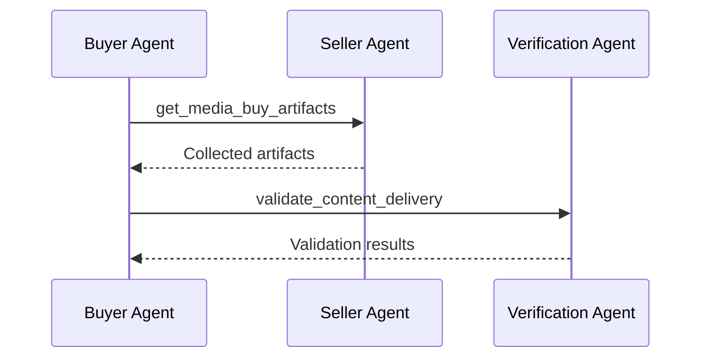

# get_media_buy_artifacts

Retrieve content artifacts from a media buy for validation. This is separate from `get_media_buy_delivery` which returns performance metrics - artifacts contain the actual content (text, images, video) where ads were placed.

**Response time**: < 5s (batch of 1,000 artifacts)

## Data Flow



The buyer retrieves artifacts the seller has collected per the sampling configuration agreed at buy creation time. Sellers may also push artifacts via webhook — `get_media_buy_artifacts` is the pull-based alternative. The buyer forwards artifacts to the verification agent for validation.

## Request

**Schema**: [get-media-buy-artifacts-request.json](https://adcontextprotocol.org/schemas/3.0.6/content-standards/get-media-buy-artifacts-request.json)

| Parameter | Type | Required | Description |
|-----------|------|----------|-------------|
| `account` | [account-ref](/dist/docs/3.0.6/building/integration/accounts-and-agents#account-references) | No | Account reference. Pass `{ "account_id": "..." }` or `{ "brand": {...}, "operator": "..." }` if the seller supports implicit resolution. Only returns artifacts for media buys belonging to this account. When omitted, returns artifacts across all accessible accounts. |
| `media_buy_id` | string | Yes | Media buy to get artifacts from |
| `package_ids` | array | No | Filter to specific packages |
| `failures_only` | boolean | No | Only return artifacts where the seller's local model returned `local_verdict: "fail"` (see [behavior with unevaluated records](#failures_only-and-unevaluated-records)) |
| `time_range` | object | No | Filter to specific time period |
| `pagination` | object | No | Pagination parameters (see below) |

<Info>
**Sampling is configured at buy creation time**, not at retrieval time. The sampling rate, method, and per-channel configuration are part of the media buy's `governance.content_standards` agreement. `get_media_buy_artifacts` retrieves artifacts that the seller has already collected per that agreement. For push-based delivery, configure `artifact_webhook` in `create_media_buy`.
</Info>

### Pagination

Uses higher limits than standard pagination because artifact result sets can be very large.

| Parameter | Type | Default | Description |
|-----------|------|---------|-------------|
| `pagination.max_results` | integer | 1000 | Maximum artifacts per page (1-10,000) |
| `pagination.cursor` | string | - | Opaque cursor from a previous response |

## Response

**Schema**: [get-media-buy-artifacts-response.json](https://adcontextprotocol.org/schemas/3.0.6/content-standards/get-media-buy-artifacts-response.json)

### Success Response

```json
{
  "$schema": "/schemas/3.0.6/content-standards/get-media-buy-artifacts-response.json",
  "media_buy_id": "mb_nike_reddit_q1",
  "artifacts": [
    {
      "record_id": "imp_12345",
      "timestamp": "2025-01-15T10:30:00Z",
      "package_id": "pkg_feed_standard",
      "artifact": {
        "property_rid": "01916f3a-a1d3-7000-8000-000000000040",
        "artifact_id": "r_fitness_abc123",
        "assets": [
          {"type": "text", "role": "title", "content": "Best protein sources for muscle building", "language": "en"},
          {"type": "text", "role": "paragraph", "content": "Looking for recommendations on high-quality protein sources for recovery", "language": "en"},
          {"type": "image", "url": "https://cdn.reddit.com/fitness-image.jpg", "alt_text": "Person lifting weights"}
        ]
      },
      "country": "US",
      "channel": "social",
      "brand_context": {"brand_id": "nike_global", "sku_id": "air_max_2025"},
      "local_verdict": "pass"
    },
    {
      "record_id": "imp_12346",
      "timestamp": "2025-01-15T10:35:00Z",
      "package_id": "pkg_feed_standard",
      "artifact": {
        "property_rid": "01916f3a-a1d3-7000-8000-000000000040",
        "artifact_id": "r_news_politics_456",
        "assets": [
          {"type": "text", "role": "title", "content": "Election Results Analysis", "language": "en"},
          {"type": "text", "role": "paragraph", "content": "The latest polling data shows a tight race between candidates", "language": "en"}
        ]
      },
      "country": "US",
      "channel": "social",
      "brand_context": {"brand_id": "nike_global", "sku_id": "air_max_2025"},
      "local_verdict": "fail"
    }
  ],
  "collection_info": {
    "total_deliveries": 100000,
    "total_collected": 1000,
    "returned_count": 1000,
    "effective_rate": 0.01
  },
  "pagination": {
    "cursor": "eyJvZmZzZXQiOjEwMDB9",
    "has_more": true
  }
}
```

### Response Fields

| Field | Description |
|-------|-------------|
| `artifacts` | Array of delivery records with full artifact content |
| `artifacts[].country` | ISO 3166-1 alpha-2 country code where delivery occurred |
| `artifacts[].channel` | Channel type (display, olv, ctv, podcast, social, etc.) |
| `artifacts[].brand_context` | Brand/SKU information for policy evaluation (schema TBD) |
| `artifacts[].local_verdict` | Seller's local model verdict (pass/fail/unevaluated) |
| `collection_info` | Artifact collection statistics — what the seller collected per the buy agreement |
| `pagination` | Cursor for fetching more results |

## Use Cases

### Validate Collected Artifacts

```python
# Get artifacts from seller (sampling was configured at buy creation time)
artifacts_response = seller_agent.get_media_buy_artifacts(
    media_buy_id="mb_nike_reddit_q1"
)

# Convert to validation records
records = [
    {
        "record_id": a["record_id"],
        "timestamp": a["timestamp"],
        "media_buy_id": artifacts_response["media_buy_id"],
        "artifact": a["artifact"],
        "country": a.get("country"),
        "channel": a.get("channel"),
        "brand_context": a.get("brand_context")
    }
    for a in artifacts_response["artifacts"]
]

# Validate against verification agent
validation = verification_agent.validate_content_delivery(
    standards_id="nike_brand_safety",
    records=records
)

# Check for drift between local and verified verdicts
for i, result in enumerate(validation["results"]):
    local = artifacts_response["artifacts"][i]["local_verdict"]
    verified = result["verdict"]
    if local != verified:
        print(f"Drift detected: {result['record_id']} - local={local}, verified={verified}")
```

### Focus on Local Failures

```python
# Get only artifacts that failed local evaluation
failures = seller_agent.get_media_buy_artifacts(
    media_buy_id="mb_nike_reddit_q1",
    failures_only=True,
    pagination={"max_results": 100}
)

# Verify these were correctly flagged
validation = verification_agent.validate_content_delivery(
    standards_id="nike_brand_safety",
    records=[{"record_id": a["record_id"], "artifact": a["artifact"]}
             for a in failures["artifacts"]]
)

# Check false positive rate
false_positives = sum(1 for r in validation["results"] if r["verdict"] == "pass")
print(f"False positive rate: {false_positives / len(failures['artifacts']):.1%}")
```

## failures_only and Unevaluated Records

When a seller does not run a local evaluation model, all records have `local_verdict: "unevaluated"`. In this case, `failures_only` returns an empty result set — there are no failures to return.

Governance agents receiving validation results where every `local_verdict` is `"unevaluated"` should treat this as **no local enforcement**. The validation still works — the verification agent evaluates the artifacts normally — but there is no drift comparison to perform. Buyers can check `content_standards.supports_local_evaluation` in [get_adcp_capabilities](/dist/docs/3.0.6/protocol/get_adcp_capabilities#content_standards) to know whether `failures_only` will be useful before creating a buy.

| `local_verdict` | `failures_only` returns? | Drift comparison possible? |
|-----------------|--------------------------|---------------------------|
| `fail` | Yes | Yes |
| `pass` | No | N/A (not in result set) |
| `unevaluated` | No | No — omit `failures_only` to retrieve all collected artifacts |

## Non-Web Artifact Examples

### Podcast

```json
{
  "record_id": "imp_podcast_001",
  "timestamp": "2025-02-10T08:00:00Z",
  "package_id": "pkg_mid_roll",
  "artifact": {
    "property_id": {"type": "apple_podcast_id", "value": "1234567890"},
    "artifact_id": "episode_42_segment_3",
    "assets": [
      {"type": "text", "role": "title", "content": "The Future of Running Shoes", "language": "en"},
      {"type": "audio", "url": "https://cdn.example.com/secured/ep42_seg3.mp3", "transcript": "Today we're talking to Dr. Chen about biomechanics research and how it's changing shoe design for marathon runners...", "duration_ms": 480000}
    ],
    "metadata": {
      "json_ld": [{"@type": "PodcastEpisode", "episodeNumber": 42, "name": "The Future of Running Shoes"}]
    }
  },
  "country": "US",
  "channel": "podcast",
  "brand_context": {"brand_id": "nike_global", "sku_id": "vaporfly_next"},
  "local_verdict": "pass"
}
```

### CTV

```json
{
  "record_id": "imp_ctv_001",
  "timestamp": "2025-02-10T20:15:00Z",
  "package_id": "pkg_premium_ctv",
  "artifact": {
    "property_id": {"type": "app_id", "value": "com.streamingservice.tv"},
    "artifact_id": "show_running_s2e5_scene_14",
    "assets": [
      {"type": "text", "role": "title", "content": "Championship Race - Final Stretch", "language": "en"},
      {"type": "video", "url": "https://cdn.streaming.example.com/secured/s2e5_scene14.mp4", "transcript": "The runners round the final corner as the crowd erupts. Commentary: 'And she's pulling ahead now, this is going to be close...'", "duration_ms": 120000}
    ]
  },
  "country": "US",
  "channel": "ctv",
  "brand_context": {"brand_id": "nike_global"},
  "local_verdict": "pass"
}
```

### AI-Generated Content

```json
{
  "record_id": "imp_ai_001",
  "timestamp": "2025-02-10T14:22:00Z",
  "package_id": "pkg_conversational",
  "artifact": {
    "property_id": {"type": "domain", "value": "chat.example.com"},
    "artifact_id": "session_x7k9_turn_15",
    "assets": [
      {"type": "text", "role": "paragraph", "content": "Based on your training schedule, I'd recommend increasing your long run distance by 10% each week. Here's a 12-week half-marathon plan...", "language": "en"}
    ]
  },
  "country": "GB",
  "channel": "display",
  "brand_context": {"brand_id": "nike_global", "sku_id": "pegasus_41"},
  "local_verdict": "unevaluated"
}
```

Note: The AI-generated content example has `local_verdict: "unevaluated"` because the content is ephemeral and the platform relies on post-delivery validation rather than a local model.

## Delivery vs Artifacts

| Aspect | get_media_buy_delivery | get_media_buy_artifacts |
|--------|------------------------|-------------------------|
| **Purpose** | Performance reporting | Content validation |
| **Data size** | Small (metrics) | Large (full content) |
| **Frequency** | Regular reporting | Sampled validation |
| **Contains** | Impressions, clicks, spend | Text, images, video |
| **Consumer** | Buyer for optimization | Verification agent |

## Related Tasks

- [validate_content_delivery](./validate_content_delivery) - Validate the artifacts
- [calibrate_content](./calibrate_content) - Understand why artifacts pass/fail
- [get_media_buy_delivery](../../../media-buy/task-reference/get_media_buy_delivery) - Get performance metrics
