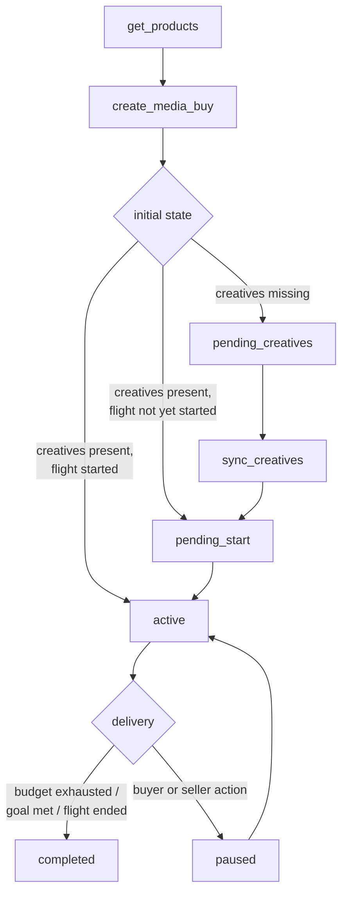
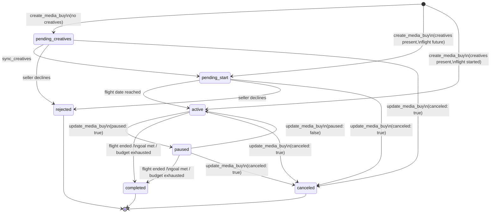
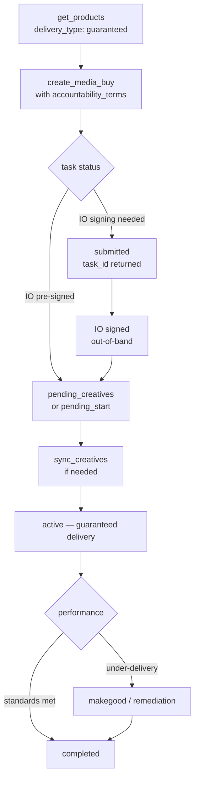

This page is the canonical sequence reference for media buy lifecycle. For conceptual background on the full lifecycle — campaign structure, package model, property targeting, and async operations — see [Media Buy Lifecycle](/dist/docs/3.0.6/media-buy/media-buys/).

## Standard flow

Every media buy follows four steps:



1. **`get_products`** — discover available inventory matching your brief.
2. **`create_media_buy`** — submit packages; the seller validates and confirms.
3. **`sync_creatives`** — assign creative assets to packages that need them.
4. **Delivery** — the buy enters `active`, accrues impressions, and eventually reaches a terminal state.

## State machine

### Media buy states

| State | Meaning | Terminal? |
|-------|---------|-----------|
| `pending_creatives` | Approved; no creatives assigned yet | No |
| `pending_start` | Creatives assigned; waiting for flight date | No |
| `active` | Delivering impressions | No |
| `paused` | Temporarily halted | No |
| `completed` | Flight ended, goal met, or budget exhausted | Yes |
| `rejected` | Seller declined the buy | Yes |
| `canceled` | Buyer or seller terminated before completion | Yes |

<Note>
`pending_manual` and `pending_permission` are **task-level** statuses — they describe whether the *operation* (e.g., `create_media_buy`) is queued for human review, not the media buy's own state. The media buy enters `pending_creatives`, `pending_start`, or `active` once the operation completes. See [Asynchronous Operations](/dist/docs/3.0.6/media-buy/media-buys/#asynchronous-operations-and-human-in-the-loop).
</Note>

### Transitions



### Discovering valid actions at runtime

Rather than hardcoding the state machine, read `valid_actions` from `get_media_buys`. The seller returns exactly what the buyer can do in the current state:

```json
{
  "media_buy_id": "mb_12345",
  "status": "active",
  "revision": 3,
  "valid_actions": ["pause", "cancel", "update_budget", "update_dates", "update_packages", "add_packages", "sync_creatives"]
}
```

Always pass `revision` in `update_media_buy` calls. The seller rejects with `CONFLICT` if the revision has changed since your last read.

## Guaranteed / PG deal variation

Products with `delivery_type: "guaranteed"` require contractual commitment before delivery begins. The flow diverges after `create_media_buy`:



### What makes a guaranteed buy different

**`accountability_terms` are required** on each package with a guaranteed product. Three fields are required:

- `performance_standards` — viewability, IVT, completion rate, and other thresholds with measurement vendor
- `measurement_terms` — who counts the billing metric, acceptable variance, and makegood remedies
- `cancellation_policy` — notice period and cancellation fee for early termination

Omitting any of these on a guaranteed package causes the seller to return `TERMS_REJECTED`.

**IO signing** — `create_media_buy` for a guaranteed product may return task status `submitted` with a `task_id` rather than completing synchronously. This means the seller's system is awaiting insertion order (IO) acceptance. Poll with `tasks/get` or configure a webhook. Once the IO is signed, the completion artifact carries the `media_buy_id` and the media buy enters `pending_creatives` or `pending_start`.

**Makegoods** — if the seller under-delivers against agreed `performance_standards`, they propose a remedy from the `makegood_policy`: `additional_delivery`, `credit`, or `invoice_adjustment`. The buyer accepts or disputes.

<Note>
A seller who accepts without under-delivering earns a favorable accountability signal. See [Accountability](/dist/docs/3.0.6/media-buy/advanced-topics/accountability) for the full negotiation flow including how buyers can propose non-default terms at `create_media_buy` time.
</Note>

## Creative sync timing

### When creatives are required

`create_media_buy` accepts inline `creative_assignments` or `creatives` per package. If you supply them at creation time and the flight date has passed, the buy enters `active` directly. If the flight date is in the future, it enters `pending_start`.

If no creatives are assigned at creation, the buy enters `pending_creatives`. Delivery cannot begin until `sync_creatives` is called to assign at least one creative per package.

### The `creative_deadline`

`create_media_buy` returns a `creative_deadline` timestamp on the media buy response. Individual packages may carry their own `creative_deadline`. **Package-level deadlines take precedence over the media buy deadline.** This matters for mixed-channel orders — a print package may have a material deadline days before the digital packages in the same buy.

After the deadline, `sync_creatives` calls for that package return `CREATIVE_REJECTED`. Creative changes are blocked; delivery continues with whatever creatives are currently assigned (or the package remains in `pending_creatives` if none were ever assigned).

```
Deadline hierarchy:
  package.creative_deadline  (if present — wins)
    ↓ else
  media_buy.creative_deadline
```

### Effect on creatives when a buy ends

When a media buy reaches `rejected`, `canceled`, or `completed`, creative assignments are released. The creatives themselves are not deleted — they remain in the library with their existing review status and are available for assignment to other media buys.

<Tip>
Creative library state and creative assignment state are tracked independently. A creative that was assigned to a canceled buy still has whatever review status it earned and can be immediately assigned to a new buy. See [creative state and assignment state](/dist/docs/3.0.6/creative/creative-libraries#creative-state-and-assignment-state-are-separate).
</Tip>

## See also

- [Media Buy Lifecycle](/dist/docs/3.0.6/media-buy/media-buys/) — full lifecycle reference: campaign structure, package model, async operations
- [`create_media_buy`](/dist/docs/3.0.6/media-buy/task-reference/create_media_buy) — task reference with request parameters, response shapes, and examples
- [`sync_creatives`](/dist/docs/3.0.6/creative/task-reference/sync_creatives) — assign and update creative assets on active packages
- [Accountability](/dist/docs/3.0.6/media-buy/advanced-topics/accountability) — performance standards, measurement terms, makegood resolution
- [Optimization & Reporting](/dist/docs/3.0.6/media-buy/media-buys/optimization-reporting) — delivery monitoring, dimensional reporting, campaign updates
