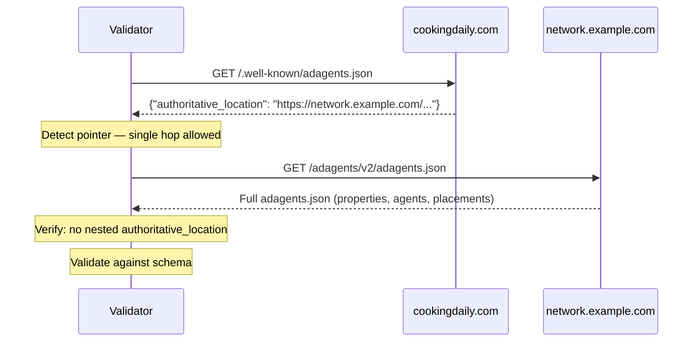

Managed ad networks (e.g. networks operating hundreds or thousands of publisher domains) already distribute `ads.txt` via HTTP redirects or centralized hosting. `adagents.json` supports the same scale through a built-in delegation model: the [URL reference pattern](/dist/docs/3.1.0-rc.10/governance/property/adagents#url-reference-pattern).

This guide maps your existing `ads.txt` deployment knowledge to `adagents.json` and covers the infrastructure patterns that work at network scale.

## How it compares to ads.txt distribution

Both `ads.txt` and `adagents.json` require a file at a well-known path on each publisher origin. The deployment mechanics are similar, but `adagents.json` has a built-in delegation model that replaces the HTTP redirect patterns networks typically use for `ads.txt`.

| Concern | `ads.txt` | `adagents.json` |
|---------|-----------|-----------------|
| File location | `/ads.txt` | `/.well-known/adagents.json` |
| Delegation mechanism | HTTP 301/302 redirect | `authoritative_location` field (in-file reference) |
| What the delegation expresses | "This file lives somewhere else" | "This publisher delegates to a named authority" |
| Publisher intent | Ambiguous (redirect could be infrastructure) | Explicit (pointer file is a declaration) |
| Scope of authorization | Flat (`DIRECT` / `RESELLER`) | Structured (property, placement, country, time window, delegation type) |
| Caching at scale | Each domain cached independently (no deduplication) | Validators cache one authoritative file for all domains that reference it |
| File format | Plain text, one entry per line | JSON with schema validation |

The key difference: an HTTP redirect is invisible to the consumer. A validator following a 301 cannot tell whether the redirect means "the publisher delegates to this network" or "the CDN reorganized its paths." The `authoritative_location` field makes delegation an explicit publisher declaration.

## The pointer file pattern

Each managed domain hosts a minimal pointer file at `/.well-known/adagents.json`. The pointer references one centralized authoritative file that the network maintains.

**Pointer file** (on each domain):
```json
{
  "$schema": "https://adcontextprotocol.org/schemas/3.1.0-rc.10/adagents.json",
  "authoritative_location": "https://network.example.com/adagents/v2/adagents.json",
  "last_updated": "2025-06-01T00:00:00Z"
}
```

The `last_updated` timestamp in the pointer file reflects when the pointer itself was last modified (e.g., when the `authoritative_location` URL changed), not when the authoritative file was updated. The authoritative file carries its own `last_updated`.

**Authoritative file** (at the network):
```json
{
  "$schema": "https://adcontextprotocol.org/schemas/3.1.0-rc.10/adagents.json",
  "contact": {
    "name": "Example Network Ad Operations",
    "email": "adops@network.example.com",
    "domain": "network.example.com"
  },
  "properties": [
    {
      "property_id": "site_cooking_daily",
      "property_type": "website",
      "name": "Cooking Daily",
      "identifiers": [{"type": "domain", "value": "cookingdaily.com"}],
      "tags": ["food", "managed_network"],
      "publisher_domain": "cookingdaily.com"
    },
    {
      "property_id": "site_garden_weekly",
      "property_type": "website",
      "name": "Garden Weekly",
      "identifiers": [{"type": "domain", "value": "gardenweekly.com"}],
      "tags": ["home", "managed_network"],
      "publisher_domain": "gardenweekly.com"
    }
  ],
  "tags": {
    "managed_network": {
      "name": "Managed Network",
      "description": "All domains managed by Example Network"
    }
  },
  "authorized_agents": [
    {
      "url": "https://sales.network.example.com",
      "authorized_for": "All managed network properties",
      "authorization_type": "property_tags",
      "property_tags": ["managed_network"],
      "delegation_type": "ad_network"
    }
  ],
  "last_updated": "2025-06-01T00:00:00Z"
}
```

### How validators resolve pointer files



The validator fetches the pointer file, follows the `authoritative_location` URL, and validates the authoritative file as a normal inline structure.

**Single hop only.** The authoritative file must not itself contain an `authoritative_location`. This prevents redirect chains and infinite loops.

### One authoritative file vs. per-publisher files

The example above shows every domain pointing to the same authoritative file. This works when all publishers share the same agents, delegation types, and placement structure.

Per-publisher authoritative files make sense when arrangements differ across the network:

- Different publishers authorize different agents (some have their own direct sales alongside the network)
- Different delegation types (Publisher A is `ad_network` only, Publisher B retains a `direct` path for premium placements)
- Different placement structures (one publisher has `pre_roll` and `host_read`, another only has `display_banner`)
- Different governance vendors in `property_features`

In this model, each pointer file references a publisher-specific URL:

```
cookingdaily.com/.well-known/adagents.json
  → "authoritative_location": "https://network.example.com/adagents/cookingdaily.json"

gardenweekly.com/.well-known/adagents.json
  → "authoritative_location": "https://network.example.com/adagents/gardenweekly.json"
```

The network still hosts all the authoritative files centrally — the pointer files just reference different paths. The [CI/CD pipeline](#cicd-pipeline) pattern is a natural fit: generate per-publisher authoritative files from a central database and deploy them to the network's CDN.

Start with one shared file. Move to per-publisher files as publishers negotiate individual arrangements.

### Why not HTTP redirects?

HTTP redirects work for `ads.txt` because `ads.txt` is a flat list with no self-referential semantics. Crawlers follow the redirect chain and validate the final file.

For `adagents.json`, HTTP redirects cause problems:

- **Ambiguous intent.** A redirect could mean delegation, infrastructure migration, or CDN routing. The pointer file explicitly declares delegation.
- **No scoping.** An HTTP redirect is all-or-nothing. A pointer file sits alongside a structured authorization model where the network can declare exactly what it is authorized to sell.
- **Caching penalty.** With HTTP redirects, a validator has no way to know that 10,000 domains all redirect to the same file. It must treat each response as independent — 10,000 cache entries for identical content. With `authoritative_location`, the validator sees the same URL across all pointer files and caches the authoritative file once. For a network with thousands of domains, this is the difference between one cache entry and thousands.

HTTP redirects to `/.well-known/adagents.json` are not prohibited, but they are not the recommended pattern. Use `authoritative_location` instead.

## Choosing the right delegation type

When a network authorizes agents on behalf of managed publishers, the `delegation_type` field describes the commercial relationship:

| `delegation_type` | Use when | Example |
|-------------------|----------|---------|
| `direct` | Publisher treats this as their own sales channel, even though the network operates it | A white-label sales agent branded as the publisher |
| `delegated` | Publisher authorizes the network to sell on their behalf | A rep firm with explicit publisher agreements |
| `ad_network` | Inventory is sold through the network's package, not as the publisher's endpoint | Mediavine-style managed network selling across its portfolio |

Most managed networks will use `ad_network`. Use `delegated` when individual publishers maintain their own commercial identity but authorize the network to represent them. Use `direct` only when the network operates what publishers present as their own sales infrastructure.

A single authoritative file can mix delegation types — different agents can have different relationships with the same inventory:

```json
{
  "authorized_agents": [
    {
      "url": "https://sales.network.example.com",
      "authorized_for": "Network-sold inventory across all managed properties",
      "authorization_type": "property_tags",
      "property_tags": ["managed_network"],
      "delegation_type": "ad_network"
    },
    {
      "url": "https://premium.publisher.example.com",
      "authorized_for": "Publisher's direct premium sales",
      "authorization_type": "property_ids",
      "property_ids": ["site_cooking_daily"],
      "delegation_type": "direct",
      "placement_tags": ["premium"],
      "exclusive": true
    }
  ]
}
```

## Keeping the file efficient with property tags

A managed network with 500 properties and three authorized agents could list every property ID in every agent entry — but that means maintaining 1,500 property-to-agent mappings. Property tags eliminate that redundancy.

The principle: **list each property once** with its identifier and tags, then **authorize agents by tag**.

```json
{
  "properties": [
    {
      "property_id": "site_cooking_daily",
      "property_type": "website",
      "name": "Cooking Daily",
      "identifiers": [{"type": "domain", "value": "cookingdaily.com"}],
      "tags": ["managed_network", "food"],
      "publisher_domain": "cookingdaily.com"
    },
    {
      "property_id": "site_garden_weekly",
      "property_type": "website",
      "name": "Garden Weekly",
      "identifiers": [{"type": "domain", "value": "gardenweekly.com"}],
      "tags": ["managed_network", "home"],
      "publisher_domain": "gardenweekly.com"
    }
  ],
  "tags": {
    "managed_network": {
      "name": "Managed Network",
      "description": "All domains managed by Example Network"
    },
    "food": {
      "name": "Food & Cooking",
      "description": "Food and cooking content verticals"
    },
    "home": {
      "name": "Home & Garden",
      "description": "Home and garden content verticals"
    }
  },
  "authorized_agents": [
    {
      "url": "https://sales.network.example.com",
      "authorized_for": "All managed network properties",
      "authorization_type": "property_tags",
      "property_tags": ["managed_network"],
      "delegation_type": "ad_network"
    },
    {
      "url": "https://food-vertical-agent.example.com",
      "authorized_for": "Food vertical properties only",
      "authorization_type": "property_tags",
      "property_tags": ["food"],
      "delegation_type": "delegated"
    }
  ]
}
```

Each property appears once. Tags handle the mapping. When a new domain joins the network, add it to `properties` with the right tags — no authorization entries need to change. When a new vertical agent comes on, add one agent entry with the relevant tag.

This keeps the file readable, maintainable, and compact even at thousands of properties.

## Representing many publishers under a single authorization

The pattern above is for a single publisher's `adagents.json` listing its own properties. Managed networks that represent many *other* publishers (WordPress networks, content-recommendation networks, multi-property holding-company configurations) host one authoritative file that declares which agents are authorized to sell on each represented publisher's behalf.

When every represented publisher delegates the same agent under the same tag predicate — the canonical managed-network shape — use the compact `publisher_domains[]` form of `publisher_properties`:

```json
{
  "authorized_agents": [{
    "url": "https://agent.network.example/api",
    "authorized_for": "Managed-network inventory across represented publishers",
    "authorization_type": "publisher_properties",
    "publisher_properties": [{
      "publisher_domains": ["site1.example", "site2.example", "site3.example"],
      "selection_type": "by_tag",
      "property_tags": ["managed_network"]
    }],
    "delegation_type": "ad_network"
  }]
}
```

One entry per shared selector predicate, not per publisher. The above is semantically identical to repeating the singular-form entry once per listed domain. See [Pattern 4 in the adagents.json reference](/dist/docs/3.1.0-rc.10/governance/property/adagents#pattern-4-publisher-property-references) for the full mechanics, the singular-vs-compact contract, and the interaction with the `managerdomain` ads.txt fallback. The compact form scales linearly with the *number of distinct selector predicates* — typically a small constant — instead of with the number of represented publishers.

## Controlling what each agent can sell with placements

Unlike `ads.txt`, where every authorized seller appears to have access to everything, `adagents.json` lets networks declare exactly which placements each agent is authorized to sell. This preserves sales leverage — buyers can see that premium inventory is only available through specific paths.

Define placements once at the top level, tag them for grouping, then scope each agent's authorization to specific placement tags:

```json
{
  "placement_tags": {
    "programmatic": {
      "name": "Programmatic",
      "description": "Placements available through programmatic sales paths"
    },
    "direct_only": {
      "name": "Direct only",
      "description": "Premium placements reserved for direct network sales"
    }
  },
  "placements": [
    {
      "placement_id": "bottom_native_feed",
      "name": "Bottom-of-page native feed",
      "tags": ["programmatic"],
      "property_tags": ["managed_network"]
    },
    {
      "placement_id": "page_takeover",
      "name": "Full-page takeover",
      "tags": ["direct_only", "premium"],
      "property_tags": ["managed_network"]
    },
    {
      "placement_id": "sidebar_display",
      "name": "Sidebar display",
      "tags": ["programmatic"],
      "property_tags": ["managed_network"]
    }
  ],
  "authorized_agents": [
    {
      "url": "https://taboola.com/agent",
      "authorized_for": "Bottom-of-page native feed across all managed properties",
      "authorization_type": "property_tags",
      "property_tags": ["managed_network"],
      "placement_tags": ["programmatic"],
      "delegation_type": "ad_network"
    },
    {
      "url": "https://sales.network.example.com",
      "authorized_for": "Premium direct-sold placements",
      "authorization_type": "property_tags",
      "property_tags": ["managed_network"],
      "placement_tags": ["direct_only"],
      "delegation_type": "direct",
      "exclusive": true
    }
  ]
}
```

In this example, Taboola can only sell programmatic placements (the bottom-of-page native feed and sidebar). The network's own sales team has exclusive access to page takeovers. A buyer agent reading this file knows exactly which paths lead to which inventory — there is no ambiguity about who can sell what.

## Additional authorization qualifiers

Beyond property tags and placement tags, agents can be scoped with:

- **`countries`** — restrict by geography (e.g. `["US", "CA"]`)
- **`effective_from` / `effective_until`** — time-bounded authorization for seasonal or trial arrangements
- **`exclusive`** — declare whether this is the sole authorized path for the scoped inventory

## What publishers are authorizing

When a publisher's domain hosts a pointer file, they are declaring that the authoritative file speaks for them. This means:

- The agents listed in the authoritative file are authorized to sell the publisher's inventory
- The `delegation_type` on each agent entry describes the commercial relationship
- Qualifiers (`placement_tags`, `countries`, `exclusive`, etc.) scope what each agent can sell

If the network operates the domain infrastructure, the publisher has typically already consented to this through their network agreement. But the pointer file is the machine-readable declaration of that consent. If a publisher leaves the network, removing or replacing the pointer file revokes authorization immediately.

## Deployment patterns

All of these patterns accomplish the same thing: serve a static JSON pointer file at `/.well-known/adagents.json` on each managed domain. Choose based on your existing infrastructure.

### CDN edge function

Serve the pointer file from a CDN worker or edge function. This is the most common pattern for networks that already manage DNS and CDN for their publishers.

**Cloudflare Worker:**
```javascript
export default {
  async fetch(request) {
    const url = new URL(request.url);
    if (url.pathname === '/.well-known/adagents.json') {
      return new Response(JSON.stringify({
        "$schema": "https://adcontextprotocol.org/schemas/3.1.0-rc.10/adagents.json",
        "authoritative_location": "https://network.example.com/adagents/v2/adagents.json",
        "last_updated": "2025-06-01T00:00:00Z"
      }), {
        headers: {
          'Content-Type': 'application/json',
          'Cache-Control': 'public, max-age=86400',
          'Access-Control-Allow-Origin': '*'
        }
      });
    }
    return fetch(request);
  }
};
```

**AWS CloudFront function:**
```javascript
function handler(event) {
  if (event.request.uri === '/.well-known/adagents.json') {
    return {
      statusCode: 200,
      statusDescription: 'OK',
      headers: {
        'content-type': { value: 'application/json' },
        'cache-control': { value: 'public, max-age=86400' },
        'access-control-allow-origin': { value: '*' }
      },
      body: JSON.stringify({
        "$schema": "https://adcontextprotocol.org/schemas/3.1.0-rc.10/adagents.json",
        "authoritative_location": "https://network.example.com/adagents/v2/adagents.json",
        "last_updated": "2025-06-01T00:00:00Z"
      })
    };
  }
  return event.request;
}
```

### CMS plugin

For networks managing WordPress or similar CMS installs, a plugin can serve the pointer file without touching server configuration.

**WordPress (mu-plugin):**
```php
<?php
add_action('init', function () {
    if (parse_url($_SERVER['REQUEST_URI'], PHP_URL_PATH) === '/.well-known/adagents.json') {
        header('Content-Type: application/json');
        header('Cache-Control: public, max-age=86400');
        echo json_encode([
            '$schema' => 'https://adcontextprotocol.org/schemas/3.1.0-rc.10/adagents.json',
            'authoritative_location' => 'https://network.example.com/adagents/v2/adagents.json',
            'last_updated' => '2025-06-01T00:00:00Z',
        ]);
        exit;
    }
});
```

Drop this in `wp-content/mu-plugins/` across managed installs. Must-use plugins load automatically without activation.

### CI/CD pipeline

Generate pointer files from a central configuration and deploy them as static assets alongside each site.

**GitHub Actions example:**
```yaml
name: Deploy adagents.json pointer files

on:
  push:
    branches: [main]
    paths: ['config/managed-domains.json']

jobs:
  deploy:
    runs-on: ubuntu-latest
    steps:
      - uses: actions/checkout@v4

      - name: Generate pointer files
        run: |
          TIMESTAMP=$(date -u +"%Y-%m-%dT%H:%M:%SZ")
          for domain in $(jq -r '.domains[]' config/managed-domains.json); do
            mkdir -p "dist/${domain}/.well-known"
            cat > "dist/${domain}/.well-known/adagents.json" <<EOF
          {
            "\$schema": "https://adcontextprotocol.org/schemas/3.1.0-rc.10/adagents.json",
            "authoritative_location": "https://network.example.com/adagents/v2/adagents.json",
            "last_updated": "${TIMESTAMP}"
          }
          EOF
          done

      - name: Deploy to hosting
        run: # your deployment step here
```

### DNS + edge function

If the network manages DNS but not the origin servers, route only the well-known path through an edge function using a CNAME and path-based routing.

This works when:
- The publisher controls their own origin server
- The network manages DNS (common in managed network agreements)
- You need to serve `adagents.json` without modifying the publisher's server

Configure your DNS provider to route `/.well-known/adagents.json` requests to a network-operated edge function (using the CDN edge pattern above), while passing all other traffic through to the publisher's origin.

The specific configuration depends on your DNS and CDN provider. The principle is the same: intercept the well-known path, serve the pointer file, pass everything else through.

## Validating deployment

### Single domain

```bash
# Fetch the pointer file
curl -s https://cookingdaily.com/.well-known/adagents.json | jq .

# Follow the reference and validate the authoritative file
curl -s $(curl -s https://cookingdaily.com/.well-known/adagents.json | jq -r '.authoritative_location') | jq .
```

### Using the AdCP client

The `@adcp/sdk` package includes a network consistency checker that validates deployment across all managed domains and detects common failure modes:

```bash
# Check all domains referencing an authoritative file
npx adcp check-network --url https://network.example.com/adagents/v2/adagents.json

# Check specific domains
npx adcp check-network --domains cookingdaily.com,gardenweekly.com

# JSON output for CI/CD pipelines
npx adcp check-network --url https://network.example.com/adagents/v2/adagents.json --json
```

Programmatic usage:

```typescript
import { NetworkConsistencyChecker } from '@adcp/sdk';

const checker = new NetworkConsistencyChecker({
  authoritativeUrl: 'https://network.example.com/adagents/v2/adagents.json',
});

const report = await checker.check();

console.log(`Coverage: ${report.coverage}%`);
console.log(`Orphaned pointers: ${report.orphanedPointers.length}`);
console.log(`Missing pointers: ${report.missingPointers.length}`);
console.log(`Schema errors: ${report.schemaErrors.length}`);
```

You can also use the **[AdAgents.json Builder](https://agenticadvertising.org/adagents/builder)** to validate individual domains interactively, or the [validation API](/dist/docs/3.1.0-rc.10/governance/property/adagents#programmatic-validation) for programmatic checks.

### Integrating with CI/CD

Run the consistency checker after deploying pointer files to catch issues before they affect buyers:

```yaml
- name: Validate network deployment
  run: npx adcp check-network --url ${{ vars.AUTHORITATIVE_URL }} --json > report.json

- name: Check for failures
  run: |
    ISSUES=$(jq '.orphanedPointers + .stalePointers + .missingPointers + .schemaErrors | length' report.json)
    if [ "$ISSUES" -gt 0 ]; then
      echo "::error::Network consistency check found $ISSUES issues"
      jq '.' report.json
      exit 1
    fi
```

## Troubleshooting

Five failure modes that occur in managed network deployments, how to detect them, and how to fix them.

### Orphaned pointer

**What happened:** A publisher domain has a pointer file referencing your authoritative URL, but the authoritative file doesn't list that domain in its `properties`.

**How it looks:** A buyer agent fetches `cookingdaily.com/.well-known/adagents.json`, follows the pointer to the network's authoritative file, and finds no property with `publisher_domain: "cookingdaily.com"`. The domain appears to delegate to a network that doesn't claim it.

**Common cause:** The network removed the publisher from the authoritative file (e.g., contract ended) but the pointer file on the domain was not removed.

**Fix:** Either re-add the property to the authoritative file, or remove/replace the pointer file on the publisher's domain. If the network no longer manages the domain's DNS or CDN, coordinate with the publisher to remove the pointer.

**Detection:** `npx adcp check-network --url <authoritative_url>` reports these as orphaned pointers.

### Stale pointer

**What happened:** A publisher's pointer file still references the network's authoritative URL after the relationship ended. Similar to an orphaned pointer, but from the publisher's perspective — the domain still claims delegation to a network that no longer authorizes it.

**Common cause:** Network terminated the publisher but doesn't control the domain's infrastructure. The publisher hasn't updated their well-known path.

**Fix:** The publisher must update or remove their pointer file. The network should notify the publisher when removing them from the authoritative file. The AAO registry detects this mismatch during crawls and surfaces it in network health monitoring.

### Missing pointer

**What happened:** A domain is listed in the authoritative file's `properties` (via `publisher_domain`), but `/.well-known/adagents.json` on that domain either doesn't exist or doesn't point to the expected authoritative URL.

**How it looks:** The network claims to represent the domain, but the domain doesn't confirm delegation. Buyer agents cannot verify the authorization chain.

**Common cause:** Publisher recently joined the network but the pointer file hasn't been deployed yet, or the deployment failed.

**Fix:** Deploy the pointer file to the domain using one of the [deployment patterns](#deployment-patterns) above. Verify with:

```bash
curl -s https://newpublisher.com/.well-known/adagents.json | jq '.authoritative_location'
```

### Schema errors

**What happened:** The authoritative file has validation errors — malformed JSON, missing required fields, invalid field values.

**Impact:** One bad deploy breaks validation for every domain in the network, since they all reference the same file.

**Fix:** Validate the authoritative file before deploying:

```bash
# Validate against the JSON schema
npx adcp check-network --url https://network.example.com/adagents/v2/adagents.json
```

Use the [AdAgents.json Builder](https://agenticadvertising.org/adagents/builder) for interactive validation during development. Add schema validation to your CI/CD pipeline as a pre-deploy check.

### Agent endpoint unreachable

**What happened:** An `authorized_agents` entry's URL doesn't respond or returns errors. Buyer agents cannot reach the sales agent declared in the authorization.

**Common cause:** Agent service is down, URL changed, or DNS is misconfigured.

**Fix:** Verify the agent endpoint is reachable and returns a valid agent card:

```bash
# A2A agent
curl -s https://sales.network.example.com/.well-known/agent-card.json | jq .

# Check via AdCP client
npx adcp check-network --url <authoritative_url>
```

The `check-network` command validates all agent endpoints and reports response times, so you can catch slow or failing agents before buyers do.

## Security considerations

One deploy to the authoritative file changes authorization across every publisher in the network. That scale is the point, and it's also the blast radius — a compromised network CDN can authorize a malicious sales agent across thousands of domains simultaneously. Two concrete implications that go beyond schema correctness:

**Validator fetch semantics.** The authoritative URL points at a network-controlled origin. Without explicit fetch rules, a misbehaving origin can poison caches or hang validators. Validators MUST:

- Connect only over HTTPS with valid certificates, and refuse to follow redirects (a redirect changes the declared location — treat as an error).
- Cap response size with a two-tier policy: pointer files served at `/.well-known/adagents.json` (whether inline or carrying `authoritative_location`) keep the [general SSRF body cap](/dist/docs/3.1.0-rc.10/building/by-layer/L1/security#webhook-url-validation-ssrf) of 5 MB — a per-publisher pointer file should be tiny, and 5 MB catches misconfiguration. Authoritative files reached by dereferencing `authoritative_location` (the second hop) use a higher recommended cap of 20 MB, because that origin has explicitly opted in to fanning out across a publisher network and routinely needs to enumerate thousands of properties or publisher domains. Enforce short connect/read timeouts (≤ 10s each) on both hops.
- On 5xx or timeout, serve the previously cached authoritative file for up to 24 hours rather than failing closed. A transient CDN outage is not a revocation.
- Attempt a refresh at least every 24 hours. Repeated 5xx responses MUST NOT extend the cache — the 7-day absolute cap is measured from the most recent successful fetch, not from the most recent response of any kind.
- Cap cached lifetime at 7 days from the most recent successful fetch, regardless of the origin's `Cache-Control`. After that, fail closed — the network has had seven days to fix its origin.
- Treat a non-monotonic `last_updated` (the refreshed file's timestamp is older than the cached file's) as an invalid response, equivalent to a 5xx: serve the cache, alert, do not adopt the older file. This blocks rollback attacks where an attacker re-serves a stale file to reinstate a previously revoked agent.

**Incremental refresh (conditional requests).** A 20 MB authoritative file refreshed naïvely on every consumer is expensive on both sides and turns every publisher churn into a full re-walk. Authoritative-file origins SHOULD support HTTP conditional requests, and validators SHOULD use them:

- Origins SHOULD emit `ETag` and `Last-Modified` headers on the authoritative file, regenerated whenever the file content changes.
- Validators SHOULD send `If-None-Match` (preferred) or `If-Modified-Since` on every refresh and treat a `304 Not Modified` as "cache stays valid, restart the 7-day clock from this success" — same effect as a successful body fetch for cache-lifetime purposes.
- The per-`authorized_agents[]` optional `last_updated` field (see `adagents.json` schema) gives consumers a second axis for partial-walk indexing: a validator that already has an index keyed by the file-level `last_updated` can skip authorized-agents entries whose own `last_updated` is older than the indexed value. This is advisory — consumers MAY ignore it and re-index the full file.

Conditional requests are the partial-update protocol for managed networks at scale. Without them, a network with 3,000 publishers churning weekly forces every buyer-side validator to download 20 MB per refresh per buyer. With them, the steady-state cost is one round-trip and a 304.

### Publisher revocation (the exit lifecycle)
 Removing a publisher domain from `publisher_properties[].publisher_domains[]` alone is not enough — cached authoritative files at downstream validators will keep authorizing the departed publisher for up to the 7-day cache cap. For revocations that need to propagate on the next refresh (a publisher leaving a network in dispute, a compliance issue, a misconfiguration cleanup), the authoritative file MUST list the publisher in the top-level `revoked_publisher_domains[]` array with a `revoked_at` timestamp.

Validator behavior:

- Validators MUST treat any publisher domain in `revoked_publisher_domains[]` as no-longer-authorized, **regardless** of whether the same domain still appears in any `authorized_agents[].publisher_properties[].publisher_domain` / `.publisher_domains[]`, in `authorized_agents[].properties[].publisher_domain` (`inline_properties` authorization type), or in top-level `properties[].publisher_domain` elsewhere in the file. The revocation list takes precedence — this lets a network ship a revocation without redeploying every selector entry.
- Validators with a cached prior version of the file MUST apply the revocation as of the validator's `last_updated` adoption time, not the entry's `revoked_at` (which can be in the past for catch-up entries).
- **Append-only durability on the validator side.** A `publisher_domain` that a validator has ever observed in a `revoked_publisher_domains[]` entry MUST be held as revoked for **7 days from the earliest `revoked_at` the validator has ever observed for that domain**, even if the entry is missing from a subsequent fetch. Durability keys on `publisher_domain` alone — keying on the `(publisher_domain, revoked_at)` tuple would let an attacker re-emit the same domain with a slightly mutated `revoked_at` (one second earlier, say) and present a "fresh" tuple the validator has never observed, bypassing the hold. Use `revoked_at` only to set the clock origin, not to identify the durability key. This places durability on the validator's cached state rather than on the network's retention SHOULD, and closes the rollback gap: an attacker who re-serves a stale file with `revoked_publisher_domains[]` removed and `last_updated` advanced cannot reinstate a previously-revoked publisher inside the validator's 7-day window. New revocations seen for the first time in the current fetch (no prior observation) start the 7-day clock from now.
- **Persistence across restart.** Validators SHOULD persist observed revocation entries (`{publisher_domain, earliest_revoked_at, first_observed_at}`) to durable storage. An in-memory-only validator that restarts inside the 7-day window MAY accept a rolled-back file because it has no record of the prior observation; operators SHOULD treat this as a known limitation and either persist the index or accept the residual risk. The 7-day window is measured from the *validator's* first observation, not from process start.
- The network SHOULD retain each `revoked_publisher_domains[]` entry for at least 7 days after `revoked_at` so validators that didn't observe the entry during its first appearance still pick it up on the next refresh.

For multi-publisher exits or routine churn under a normal commercial relationship-end, networks SHOULD use `reason: "relationship_ended"` so validator change-detection can suppress alerts on routine revocations and route the rest for review.

**Re-authorizing a previously-revoked publisher.** There is no `revoked_until` field and no un-revoke verb. To re-authorize, the network removes the entry from `revoked_publisher_domains[]` *after* the validator-side 7-day durability window has elapsed since `revoked_at`. Removing the entry sooner is a no-op on validators that observed the original revocation (they hold the revocation locally for the remainder of the window). For time-bounded compliance pulls where same-week reinstatement is operationally required, prefer running the revocation as a `reason: "compliance_violation"` and coordinating reinstatement out of band; the schema deliberately does not give the network a re-authorize-before-7-days back door, which would be the same surface as a rollback attack.

**Extension fields on revocation entries have no normative effect.** `revoked_publisher_domains[]` items use the project-wide `additionalProperties: true` policy, but validators MUST ignore unknown fields on these entries — extensions cannot loosen revocation semantics or carry side-channel reinstatement signals.

**Propagation latency.** Validators that maintain an in-memory authorization index keyed by `(agent, publisher_domain)` MUST NOT continue to authorize a pair more than one crawl interval after the validator has *successfully* refetched an `adagents.json` that lists the publisher in `revoked_publisher_domains[]`. Cache-bounded staleness from the fetch semantics above (24-hour fallback on 5xx, 7-day absolute cap) applies — the bound holds against the most recent successful fetch, not against any arbitrary wall-clock time. Crawl backlog and intermediate CDN caching extend the practical latency; the requirement is on the validator's own pipeline, not on the network.

Validators SHOULD also apply revocation **synchronously during manifest ingest**, not only on the next crawl cycle: when adopting any `adagents.json` whose `revoked_publisher_domains[]` lists *any* publisher domain — regardless of whether the validator currently authorizes any agent for it — the validator SHOULD remove every `(agent, publisher_domain)` entry it holds for that publisher from the in-memory index before serving the next authorization decision. This composes with, does not replace, the append-only durability rule above: the in-memory index update is what keeps live queries fresh; the 7-day hold is what survives a rollback attack.

**Reference implementation (non-normative).** Other validators MAY satisfy the requirements above through different mechanisms. The chain in this repo is: (a) the writer's revocation branch retires the matching catalog rows; (b) the next crawl pass re-snapshots the `(agent, publisher_domain)` set from the catalog (excluding retired rows); (c) the pre-vs-post diff emits an `authorization.revoked` event for every dropped pair; (d) the registry-sync consumer applies the event to the in-memory index. The `authorization.revoked` event shape is reference-implementation vocabulary, not a normative wire format.

**Change detection.** Because one deploy affects every publisher, buyer agents and validators SHOULD store the previous authoritative file and diff on each refresh, alerting on outlier changes. Concrete default thresholds that partners can implement on day one: any newly added `authorized_agents` entry that was not present in the previous fetch, any delegation-type downgrade (for example, an `exclusive` entry becoming non-exclusive), any property-count decrease greater than 10% or 50 absolute properties, and any change to `authoritative_location` itself. Tune from there — the goal is to catch a compromised deploy before it routes spend, not to suppress routine updates.

**Pointer integrity (the per-publisher swap threat).** The *Validator fetch semantics* and *Change detection* rules above defend against compromise of the network-side authoritative file and origin. They do not defend against compromise of the *pointer file itself* at a single publisher's edge. An attacker who gains write access to one publisher's `/.well-known/adagents.json` — via that publisher's CDN control plane, origin storage, or DNS — can silently change the `authoritative_location` to an attacker-controlled URL. TLS on that URL is valid because the attacker is serving from infrastructure the publisher's domain resolves to, the size/redirect/timeout caps do not trigger, and the change reads to a validator as a legitimate delegation handoff.

This last property is what makes pointer-swap distinct from a generic integrity failure: the whole point of the `authoritative_location` pattern is that publishers are *allowed* to change where they delegate, so the validator cannot treat any pointer change as adversarial without breaking legitimate delegation handoffs. The network-CDN threat is wide-and-shallow (one compromise, every publisher hijacked); the pointer-swap threat is narrow-and-deep (one publisher hijacked, but through a surface the network cannot monitor). Both are in scope.

Validators MUST treat a changed `authoritative_location` as a high-severity event, not a routine refresh. Concretely:

- Validators MUST NOT auto-adopt a changed `authoritative_location`. Continue serving the previously cached authoritative file (subject to the 7-day cap above) while the change is under confirmation. This is the minimum normative floor; the SHOULDs below specify how confirmation is obtained.
- Validators SHOULD honor the new location only after either (a) out-of-band confirmation — operator acknowledgement, a publisher support-channel notice, or an announced network transition — or (b) a minimum stability grace window of 24 hours during which the new pointer value must remain unchanged. The 24 h window is a fallback for the unconfirmed path; an out-of-band confirmation completed in minutes satisfies (a) and is compliant — validators MUST NOT impose a 24 h floor on the OOB path.
- "Announced network transition" in (a) means a publisher-attested or network-attested statement the validator operator can verify (e.g., a signed announcement countersigned by an existing trusted key, an operator-verified update to the publisher's `brand.json` `agents[]` set, or a notice on an established publisher-identity channel the operator already trusts for that publisher). A blog post or press release by itself does not qualify; the bar is verifiability, not publicity.
- Validators SHOULD cross-check the candidate authoritative file against the publisher's `/.well-known/brand.json` when one is published. If `brand.json` declares `agents[]`, the candidate authoritative file's `authorized_agents[]` URLs SHOULD reconcile with the `brand.json` agent set. An authoritative file that authorizes sales agents absent from the publisher's own identity declaration is a strong signal of pointer compromise and SHOULD block adoption pending operator review. During a legitimate inter-network migration the `brand.json` `agents[]` set can lag the pointer change; when `brand.json`'s `last_updated` is older than the pointer file's `last_updated`, treat a `brand.json`/authoritative mismatch as *stale cross-check* rather than *authoritative contradiction*, and fall back to path (a) or (b) above to confirm the migration.
- Refuse adoption on mixed signals: a pointer change coincident with a `last_updated` regression on the candidate authoritative file, a domain-wide delegation-type downgrade, or a first-seen sales agent with no prior ecosystem history is grounds to hold the cache and alert rather than to adopt. For this rule, *regression* means the candidate file's `last_updated` is strictly earlier than the cached file's `last_updated` by more than a small clock-skew tolerance (recommended: 60 seconds); pointer files served from multiple edges can observe minor non-monotonicity under normal operation, and the regression check is for rollback attacks, not clock jitter.

Publishers managing their own pointer file SHOULD serve it from the same infrastructure and change-management controls as other publisher-identity surfaces (`/.well-known/brand.json`, DNS records, TLS certificate issuance). A pointer file is an identity declaration; treating it as a static marketing asset is the misconfiguration that makes the swap threat practical.

**Relationship termination.** The pointer-file pattern relies on the network controlling publisher DNS or edge. When the relationship ends, both sides of the delegation must come down together:

- The network MUST remove the publisher from the authoritative file's `properties` at termination, even when it has already lost DNS/edge control. A publisher still pointing at an ex-network's file with no matching property becomes an [orphaned pointer](#orphaned-pointer) — visible to buyers as unauthorized.
- Validators SHOULD re-fetch and re-validate when a publisher domain transfers ownership, rather than relying on cached delegation.

**Signed pointers (planned).** A full close of the pointer-swap gap requires a signed-pointer mechanism: the pointer file carries a publisher-controlled detached signature over the canonical `(authoritative_location, last_updated)` object, with the public key anchored out-of-band — publisher-attested in `brand.json`, or via the future centralized publisher-key registry. The signing primitive and key-discovery / rotation model require an agreed design and are tracked as a planned AdCP 4.0 addition, not a 3.x requirement. To keep the 4.0 rollout viable, implementers publishing pointer files today SHOULD keep the pointer object shape stable: the top-level object SHOULD contain only `authoritative_location` and `last_updated`, with no additional top-level fields, so a detached signature can later be carried in a sibling field (or a `.sig` companion path) without colliding with custom fields added in the interim. Until 4.0 lands, the operator-side controls above are the normative baseline — they do not match the strength of a signed pointer, but they raise the cost of pointer-swap attacks above the cost of a routine CDN compromise, which is what 3.x can promise honestly.

## Next steps

- [adagents.json Tech Spec](/dist/docs/3.1.0-rc.10/governance/property/adagents) — full schema reference, authorization patterns, and validation behavior
- [Property Governance overview](/dist/docs/3.1.0-rc.10/governance/property) — how adagents.json fits into the broader governance model
- [AdAgents.json Builder](https://agenticadvertising.org/adagents/builder) — interactive validator and file creator
- [@adcp/sdk](https://github.com/adcontextprotocol/adcp-client) — TypeScript client library with network consistency checking
