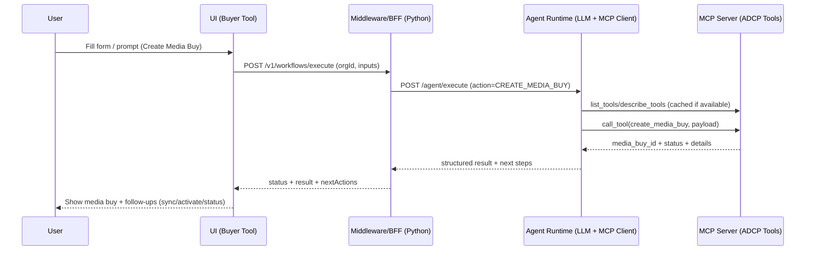

# ADCP-Compliant Buyer Agent Tool — Design Document (RFC)

## 0) Executive Summary

This document defines an **ADCP-compliant Buyer Agent Tool** that enables buyer-side users to execute advertising workflows (e.g., **product discovery**, **create media buy**, **creative listing/sync**) through a **workflow-first UI** backed by an **Agent Runtime (LLM + MCP client)** and an **MCP Server** that exposes ADCP tools.

A key architectural constraint from the whiteboard is that **browser-to-MCP calls cause CORS issues**; therefore, **all MCP interactions must be server-to-server** via a **Middleware/BFF**.

The system is designed to support **multi-tenant white-labeling**, strong tenant isolation, and operational visibility (auditing, metrics, tracing).

---

## 1) Source of Truth (Verified from Whiteboard + Provided Notes)

### Repos / Major Components (as written on the board)

- **UI**
  - Repo: `ui-adcp-buyer-agent`
  - Pages/features listed:
    1. Login / Signup
    2. Add Agent / MCP Server
    3. Workflows:
       1) Product Discovery
       2) Create Media Buy
       3) Creative Listing
       4) Creative Creation (optional)
       5) Activate Media Buy + Reporting

- **Middleware / Proxy (Python)**
  - Repo: `buyer-agent`
  - Purpose: proxy for MCP server; handles “action, data” handoff

- **Agent Runtime (MCP Client + Agent)**
  - Repo: `pubmatic-agents`
  - Notes on board:
    - MCP client
    - Agent
    - “use LLM to get all tool schemas”
    - routing
    - calling tools
    - response back to middleware

- **MCP Server**
  - Repo: `mcp-server`
  - Notes: “Activate MCP server”
  - Tools (board bullets):
    1) Product discovery
    2) Create media buy
    3) Sync creative

### Explicit Constraint

- **CORS issue** blocks **UI → MCP Server** direct calls.
- The design must route calls **UI → Middleware → Agent → MCP Server**.

### White-labeling Notes (board)

- Tenant selection by:
  - **OrgId**
  - **Domain level**
- **CSS/template hosting on CDN**
- “loading app → orgId/domain → static UI modules”
- Open question on board:
  - “How do we get domain from clients?”
    - “Expose API”
    - “Build config UI”

---

## 2) Problem Statement

Buyer-side users need a guided tool to execute common advertising buying workflows using standardized ADCP tool calls. The tool must:

- Be **workflow-first** (reduce prompt engineering)
- Remain **ADCP compliant** via **MCP tools**
- Prevent insecure browser access to MCP servers and avoid CORS limitations
- Support **multi-tenant** operation with **white-label branding**
- Provide traceability, auditing, and operational controls

---

## 3) Goals & Non-Goals

### Goals (v1)

- **Workflow-first UI** for primary buyer tasks
- **Hybrid interaction model**: forms + optional free-text prompt per workflow
- **BFF/Middleware** as the only external boundary for the UI
- **Agent Runtime** that:
  - fetches and caches MCP tool schemas
  - routes intent/workflow steps to tool calls
  - returns structured output + next-step suggestions
- **Tenant isolation + white-labeling** using org/domain mapping and CDN-hosted themes
- **Secure-by-default**: credentials server-side, least privilege, audit logs

### Non-goals (v1)

- Fully autonomous “hands-off” buying (human-in-the-loop approvals required)
- Advanced optimization and budget pacing algorithms (“Bucket 3” later)
- Building a complete creative authoring suite (only if MCP server supports it)

---

## 4) High-Level Architecture

### Logical Components

1) **UI (Buyer Tool)**
- Presents workflow pages and guided steps
- Collects inputs, validates forms, renders results
- Never talks to MCP Server directly

2) **Middleware / BFF (Python)**
- Single API surface for UI
- Solves CORS by performing server-to-server calls
- Enforces:
  - auth/session/JWT
  - org/tenant scoping
  - policy checks (e.g., approval gates)
  - rate limits
  - request normalization & response shaping
- Calls Agent Runtime with `action + data`

3) **Agent Runtime (LLM + MCP Client)**
- Orchestrates execution:
  - tool discovery (`list_tools`, `describe_tool`) with caching
  - tool selection and sequencing
  - tool invocation with validated payloads
  - response synthesis into structured UI-friendly format
- Emits tool-call traces for transparency/debugging

4) **MCP Server (ADCP Tools)**
- Authoritative execution layer exposing ADCP-compliant tools:
  - product discovery
  - create media buy
  - sync creative
  - optional listing/creation/reporting tools depending on backend

---

## 5) Primary Workflows (v1)

### 5.1 Product Discovery

- Inputs:
  - advertiser/brand context
  - targeting constraints (geo, audience, inventory types)
  - budget or spend bands (optional)
- Output:
  - product/inventory candidates
  - recommended shortlist
  - fields needed for next step (to create media buy)

### 5.2 Create Media Buy

- Inputs:
  - selected product(s)
  - budget, flight dates, targeting
  - creative references (existing creative IDs) or placeholder to sync later
- Output:
  - `media_buy_id`, initial status
  - validation errors/warnings if any
  - next steps: “sync creative”, “activate”, “view status/report”

### 5.3 Creative Listing / Sync

- Listing:
  - retrieve creatives by advertiser/campaign context
- Sync:
  - associate creatives with media buys and/or upload/publish creative artifacts
- Output:
  - synced creative status, errors per creative, actionable remediation steps

### 5.4 Activate + Reporting (optional scope boundary)

- If ADCP/MCP server exposes activation/reporting:
  - activate media buy (with explicit approval)
  - status retrieval and reporting summaries

---

## 6) APIs & Interfaces (Concrete Contracts)

### 6.1 UI → Middleware (BFF)

**Auth**
- Session cookie or JWT (implementation choice)
- Every request must include tenant context:
  - `orgId` (preferred)
  - domain resolved to orgId (fallback)

#### `POST /v1/workflows/execute`

Executes a workflow step (or a whole small workflow) via the agent.

Example request shape:

```json
{
  "orgId": "org_123",
  "workflowType": "CREATE_MEDIA_BUY",
  "input": {
    "prompt": "Create a media buy for sports audience in CA for Feb",
    "form": {
      "budget": 50000,
      "flightStart": "2026-02-01",
      "flightEnd": "2026-02-28",
      "geo": ["US-CA"],
      "productIds": ["prod_abc"]
    }
  },
  "context": {
    "userId": "user_789",
    "sessionId": "sess_456",
    "pageContext": {
      "currentStep": "review"
    }
  }
}
```

Example response shape:

```json
{
  "status": "SUCCESS",
  "result": {
    "mediaBuyId": "mb_001",
    "details": { "state": "DRAFT" }
  },
  "toolCalls": [
    {
      "tool": "create_media_buy",
      "input": { "...": "..." },
      "outputSummary": "Created draft media buy mb_001"
    }
  ],
  "nextActions": [
    { "type": "SYNC_CREATIVE", "label": "Sync creatives to this media buy" },
    { "type": "ACTIVATE", "label": "Request activation approval" }
  ],
  "errors": []
}
```

#### MCP Server management (admin)

- `GET /v1/mcp/servers`
- `POST /v1/mcp/servers`
- `PATCH /v1/mcp/servers/{id}`
- Stored secrets (API keys/resource headers) remain in BFF (never in UI)

### 6.2 Middleware → Agent Runtime

#### `POST /agent/execute`

Normalized invocation.

```json
{
  "orgId": "org_123",
  "action": "CREATE_MEDIA_BUY",
  "data": { "...workflow payload..." },
  "userContext": {
    "userId": "user_789",
    "roles": ["buyer"],
    "correlationId": "corr_abc"
  }
}
```

### 6.3 Agent Runtime → MCP Server

- Uses MCP conventions:
  - `list_tools`
  - `describe_tool`
  - `call_tool(name, input)`
- Tool schema caching:
  - cache by MCP server + version + tenant (if applicable)
  - TTL-based invalidation and manual refresh endpoint

---

## 7) CORS, Security, and Trust Boundaries

### Why CORS Happens

- MCP endpoints may use SSE (`text/event-stream`), custom headers, and strict origin policies.
- Many MCP servers are not configured for browser origins.

### Required Policy

- **UI must never call MCP Server directly**
- **Only Middleware/BFF calls MCP Server**, optionally via Agent Runtime, all server-to-server.

### Security Requirements

- **Credential handling**
  - API keys/resource headers stored server-side only
  - encrypted at rest (KMS or equivalent)
- **Tenant isolation**
  - `orgId` required for every request
  - enforce org scoping at BFF and in Agent Runtime
- **Human-in-the-loop**
  - activation and budget-committing actions require explicit approval gate
- **Audit logging**
  - who initiated
  - what workflow/action
  - which MCP tool(s) called
  - input hash or redacted payload
  - result summary + status

---

## 8) White-Labeling / Multi-Tenant Branding

### Tenant identification (recommended precedence)

1) **orgId** (explicit; strongest)
2) **domain → orgId mapping** (for white-labeled deployments)

### Theme/config model

- BFF endpoint:
  - `GET /v1/tenant/{orgId}/theme`
- Returns:
  - theme name
  - CSS URLs
  - logo URLs
  - feature toggles (e.g., enable creative creation page)

### CDN assets

- `/themes/{orgId}/theme.css`
- `/themes/{orgId}/logo.svg`
- `/themes/{orgId}/config.json`

### Domain acquisition (“How do we get domain from clients?”)

- In browser: `window.location.host` is the domain signal.
- For secure mapping, implement:
  - **Admin config UI** to register domains to orgId
  - **Domain verification** step (recommended):
    - DNS TXT record, or
    - `/.well-known/` HTTP file proof
- Runtime behavior:
  - UI sends `host` (or BFF infers from request host header)
  - BFF resolves `domain → orgId` and returns theme config

---

## 9) Observability & Operations

### Logging

- Correlation ID generated at BFF, propagated to Agent and tool calls
- Log events:
  - workflow start/end
  - tool call start/end
  - tool failures with categorized error codes

### Metrics (minimum)

- workflow success rate by type
- tool latency p50/p95
- tool error rate by tool name and category
- LLM token usage and cost per workflow

### Tracing

- OpenTelemetry recommended across:
  - UI request → BFF → Agent → MCP Server

---

## 10) Deployment Model

- **UI**: static site served from CDN
- **Middleware/BFF (Python)**: scalable service (k8s or similar)
- **Agent Runtime**:
  - separate service (recommended), or
  - colocated initially with BFF for simplicity
- **MCP Server**: separate service (e.g., Activate MCP server)

---

## 11) Open Questions (To Make Implementation Exact)

- **Tool names & schemas**: What are the exact MCP tool names today (e.g., `get_products` vs `product_discovery`)?
- **Auth model**: SSO/JWT? How do you derive `resource-id` / `resource-type` and where do those live?
- **Workflow mode**: chat-first, workflow-form-first, or hybrid?
- **Activation/reporting**: are these tools in scope on the MCP server for v1?

---

# Diagrams (Mermaid)

## A) System Block Diagram

```mermaid
flowchart LR
  UI[UI: ADCP Buyer Tool<br/>(repo: ui-adcp-buyer-agent)<br/>- Login/Signup<br/>- Add Agent/MCP<br/>- Workflows] -->|HTTPS JSON| BFF[Middleware / BFF (Python)<br/>(repo: buyer-agent)<br/>- Auth & Tenant<br/>- Proxy (CORS-safe)<br/>- Normalization<br/>- Approval gates]

  BFF -->|action + data| AG[Agent Runtime (LLM + MCP Client)<br/>(repo: pubmatic-agents)<br/>- Tool schema fetch/cache<br/>- Routing<br/>- Tool calls<br/>- Response synthesis]

  AG -->|MCP tool calls| MCP[MCP Server (ADCP Tools)<br/>(repo: mcp-server)<br/>- Product discovery<br/>- Create media buy<br/>- Sync creative]

  MCP --> ACT[Activate / Backend Systems]

  UI -.->|CORS blocked| MCP
```

## B) Sequence Diagram — Create Media Buy



## C) White-Labeling / Tenant Resolution Flow

```mermaid
flowchart TD
  Start[App Load] --> Identify{Tenant signal available?}

  Identify -->|orgId provided| Org[Use orgId]
  Identify -->|no orgId| Host[Use browser host/domain]

  Host --> Resolve[Resolve domain to orgId<br/>(BFF: /v1/tenant/resolve)]
  Resolve --> Org

  Org --> Theme[Fetch theme config<br/>(BFF: /v1/tenant/{orgId}/theme)]
  Theme --> CDN[Load assets from CDN<br/>/themes/{orgId}/...]
  CDN --> Render[Render branded UI<br/>(feature toggles applied)]
```
