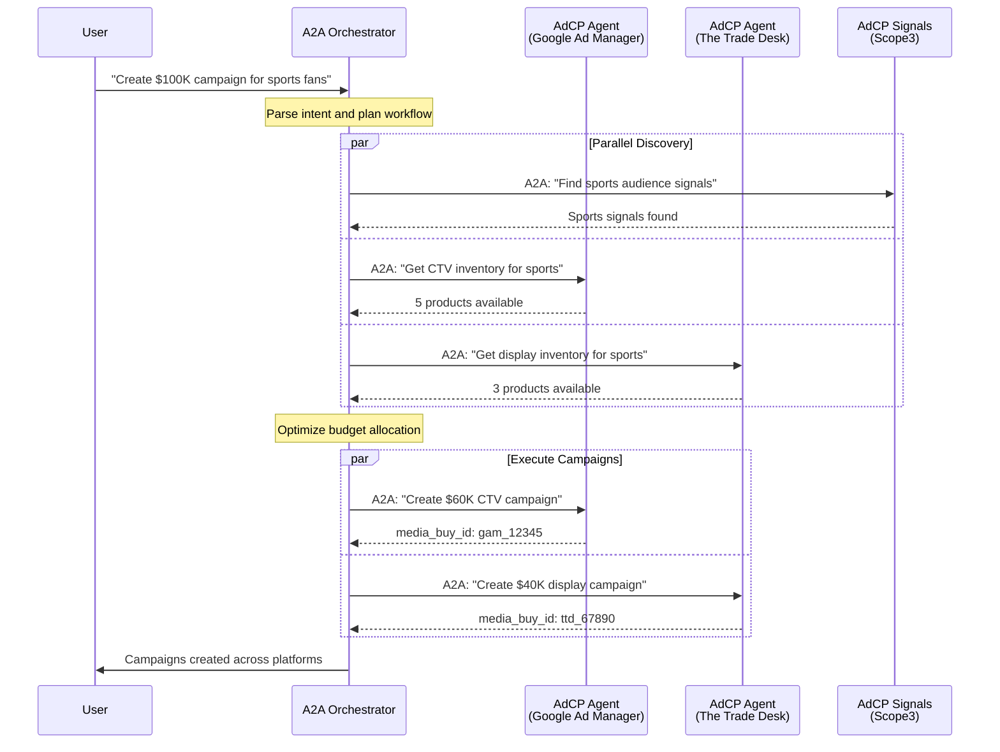
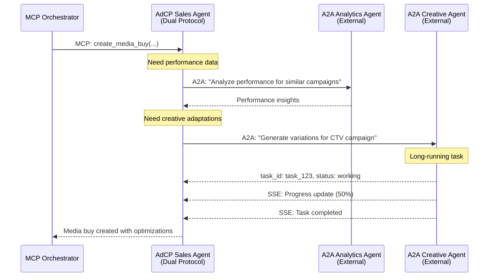
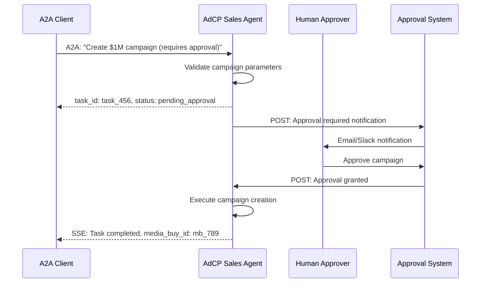

# A2A Integration Flow Examples

## Example 1: Cross-Platform Campaign Coordination

This example shows how an A2A orchestrator could coordinate a campaign across multiple AdCP-enabled platforms.



## Example 2: MCP to A2A Bridge Scenario

This shows how a traditional MCP orchestrator could leverage A2A agents through a bridge.



## Example 3: Human-in-the-Loop Approval Flow

This demonstrates how A2A's async model supports AdCP's HITL operations.



## Protocol Interaction Patterns

### Pattern 1: Protocol Selection

```javascript
// Client can choose protocol based on capabilities
if (agent.supports('a2a') && needsAsyncWorkflow) {
  // Use A2A for complex, long-running tasks
  await agent.a2a.send({
    message: "Analyze and optimize all active campaigns"
  });
} else if (agent.supports('mcp')) {
  // Use MCP for direct tool execution
  await agent.mcp.call('get_media_buy_delivery', {
    media_buy_id: 'mb_123'
  });
}
```

### Pattern 2: Protocol Translation

```javascript
// A2A request translated to MCP tools
async function handleA2ARequest(message) {
  const intent = parseIntent(message);
  
  switch(intent.action) {
    case 'create_campaign':
      // Map to MCP tools
      const products = await mcp.call('get_products', {
        brief: intent.brief
      });
      
      return await mcp.call('create_media_buy', {
        packages: products.map(p => p.product_id),
        total_budget: intent.budget
      });
  }
}
```

### Pattern 3: Cross-Protocol Context

```javascript
// Maintain context across protocols
class ContextManager {
  async handleMCPCall(tool, params, context) {
    // Store context from MCP interaction
    this.storeContext(context.sessionId, {
      protocol: 'mcp',
      tool,
      params,
      timestamp: Date.now()
    });
  }
  
  async handleA2ATask(task, context) {
    // Retrieve context from previous interactions
    const history = this.getContext(context.sessionId);
    
    // Use history to provide continuity
    return this.processWithContext(task, history);
  }
}
```

## Benefits of Integration

1. **Flexibility**: Clients can choose the most appropriate protocol
2. **Interoperability**: AdCP agents can work with the broader A2A ecosystem
3. **Scalability**: A2A's async model handles complex workflows
4. **Backward Compatibility**: Existing MCP clients continue to work
5. **Innovation**: Enables new multi-agent collaborative workflows