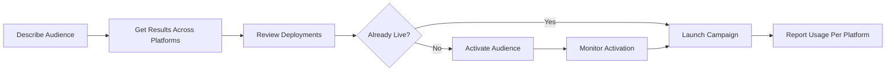

# Audience Activation Protocol Overview

The Audience Activation Protocol enables AI assistants to discover, activate, and manage marketing audiences through natural language interactions.

## Key Concepts

### Natural Language Discovery
Instead of complex filtering interfaces, describe your audience naturally:
- "High-income sports enthusiasts in major US cities"
- "People interested in sustainable fashion who shop online"
- "Small business owners looking for financial services"
- "Premium automotive content with high viewability"

### Multi-Platform Discovery
Discover audiences across multiple platforms in a single request:
- See where segments are already deployed (SSPs, DSPs, DMPs)
- Compare segment IDs across platforms
- Identify which platforms require activation
- Perfect for data providers like Peer39 with wide distribution

### Transparent Activation
- See which audiences are immediately available (`is_live: true`)
- Know activation timeframes before committing (typically 24-48 hours)
- Clear segment IDs for each platform
- Account-specific vs platform-wide deployments

### Flexible Pricing Models
- **CPM**: Traditional cost per thousand impressions
- **Revenue Share**: Percentage of media spend
- **Choice**: Some audiences offer both options

### Standardized Size Reporting
- **Individuals**: Unique people (best for frequency capping)
- **Devices**: Cookies and device IDs (largest reach)
- **Households**: Unique households (B2B and family targeting)

## The Four Essential Tools

### 1. get_audiences
Discover audiences based on your campaign needs across one or many platforms.

### 2. activate_audience  
Turn on audiences for specific platforms and accounts.

### 3. check_audience_status
Monitor activation progress and deployment status.


## Use Cases

### Data Provider with Multi-Platform Distribution

**Example: Peer39 Contextual Segments**

Peer39 has contextual segments deployed across multiple SSPs. Instead of making separate calls for each platform:

```
Human: Find me Peer39's luxury automotive segments across all SSPs

AI: I found Peer39's "Luxury Automotive Context" segment deployed across:

**Already Live:**
- ✅ Index Exchange (Platform-wide): ix_peer39_luxury_auto_gen
- ✅ Index Exchange (Your account): ix_agency123_peer39_lux_auto  
- ✅ OpenX (Platform-wide): ox_peer39_lux_auto_456

**Requires Activation:**
- ⏳ PubMatic (Your account): 60 minute activation

This segment targets pages with luxury automotive content and high viewability.
Price: $2.50 CPM across all platforms.

Would you like to activate on PubMatic?
```

### Agency with Personalized Catalogs

Agencies often have accounts with multiple data providers, each offering both public and custom segments:

```
Human: Find audiences for our Nike running campaign

AI: I found relevant audiences from your data providers:

**LiveRamp (Your Omnicom catalog):**
1. Marathon Enthusiasts - Custom
   - Built exclusively for Omnicom clients
   - ✅ Ready on The Trade Desk
   - Price: $6.00 CPM (negotiated rate)

2. General Runners - Public  
   - Available to all LiveRamp users
   - ✅ Ready on The Trade Desk
   - Price: $3.50 CPM (standard rate)
```

## How It Works



## Integration Flow

The Audience Activation Protocol works within the broader [Ad Tech Ecosystem Architecture](../intro#ad-tech-ecosystem-architecture):

1. **Discover** audiences on audience platforms (LiveRamp, Experian, Peer39)
2. **Identify** where they're deployed (multiple SSPs, DSPs, DMPs)
3. **Activate** audiences for platforms where they're not yet live
4. **Execute** campaigns on decisioning platforms using platform-specific IDs

## Example Interactions

### Single Platform Discovery (Traditional)

```
Human: Find me audiences interested in premium running gear for The Trade Desk

AI: I found 3 relevant audiences for The Trade Desk:

1. **Endurance Athletes** - 2.5M individuals
   - Status: ✅ Ready to use
   - Segment ID: ttd_endurance_2024
   - Price: $3.50 CPM
```

### Multi-Platform Discovery (New)

```
Human: Show me where Peer39's sports content segments are available

AI: Peer39's "Premium Sports Content" segment is deployed across:

**Supply-Side Platforms (SSPs):**
- Index Exchange: ✅ Live (ix_peer39_sports_478)
- OpenX: ✅ Live (ox_peer39_sports_923)  
- PubMatic: ✅ Live (pm_peer39_sports_115)
- Magnite: ⏳ Not deployed (24hr activation available)

**Demand-Side Platforms (DSPs):**
- The Trade Desk: ✅ Live (ttd_peer39_sports_pro)
- Amazon DSP: ⏳ Not deployed (48hr activation available)

All deployments are $2.00 CPM. Which platforms do you need?
```

## Benefits

### For Data Providers
- Show complete distribution in one response
- Reduce API calls from N platforms to 1
- Highlight platform coverage to buyers
- Simplify segment discovery across ecosystems

### For Buyers
- See all options at once
- Compare deployment status across platforms
- Make informed decisions about activation
- Understand true segment availability

### For Platforms
- Efficient discovery reduces system load
- Better user experience
- Clearer view of segment distribution
- Simplified workflow orchestration

## Next Steps

- Read the full [Protocol Specification](./specification)
- See the [Audience Agent reference implementation](https://github.com/adcontextprotocol/audience-agent)