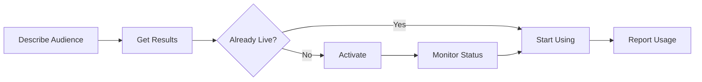

# Audience Discovery Protocol Overview

The Audience Discovery Protocol enables AI assistants to discover, activate, and manage marketing audiences through natural language interactions.

## Key Concepts

### Natural Language Discovery
Instead of complex filtering interfaces, describe your audience naturally:
- "High-income sports enthusiasts in major US cities"
- "People interested in sustainable fashion who shop online"
- "Small business owners looking for financial services"

### Transparent Activation
- See which audiences are immediately available (`is_live: true`)
- Know activation timeframes before committing (typically 24-48 hours)
- Clear segment IDs for each platform

### Flexible Pricing Models
- **CPM**: Traditional cost per thousand impressions
- **Revenue Share**: Percentage of media spend
- **Choice**: Some audiences offer both options

### Standardized Size Reporting
- **Individuals**: Unique people (best for frequency capping)
- **Devices**: Cookies and device IDs (largest reach)
- **Households**: Unique households (B2B and family targeting)

## The Four Essential Tools

### 1. get_audiences
Discover audiences based on your campaign needs.

### 2. activate_audience  
Turn on audiences for specific platforms and seats.

### 3. check_audience_status
Monitor activation progress and deployment status.

### 4. report_usage
Report daily usage for accurate billing.

## How It Works



## Platform vs Direct Accounts

### Platform Accounts
- Aggregate multiple advertisers (e.g., "Scope3's LiveRamp account")
- Platform-negotiated rates
- Simplified billing through platform

### Direct Accounts
- Direct relationship with provider (e.g., "Omnicom's LiveRamp account")
- Better rates typically available
- Direct billing and control

## Example Interaction

```
Human: Find me audiences interested in premium running gear

AI: I found 3 relevant audiences:

1. **Endurance Athletes** - 2.5M individuals
   - Status: ✅ Ready to use
   - Price: $3.50 CPM
   - High relevance for runners

2. **Premium Fitness Enthusiasts** - 850K households  
   - Status: ⏳ Requires activation (24-48 hours)
   - Price: $8 CPM or 15% revenue share
   - Affluent fitness audience

Would you like to activate the Premium Fitness Enthusiasts audience?
```

## Next Steps

- Read the full [Protocol Specification](./specification)
- Review [Implementation Examples](./examples)
- See the [Quick Reference](./quick-reference)