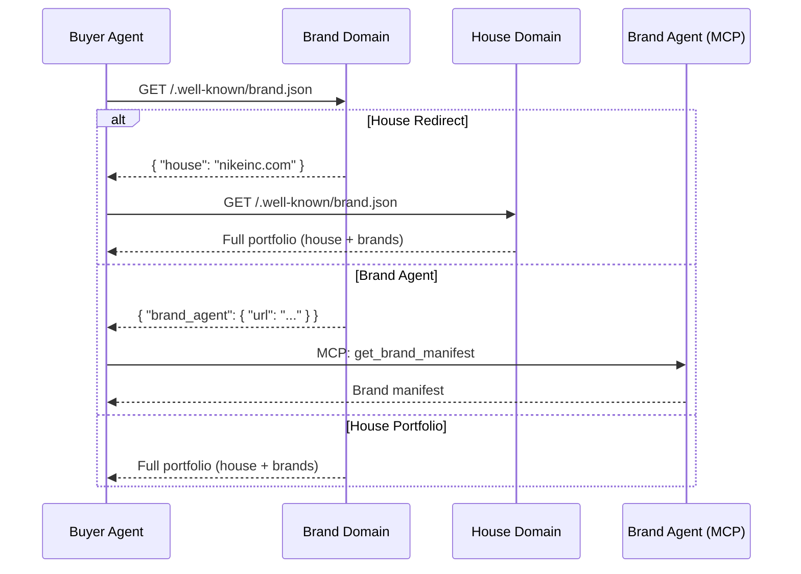

The Brand Protocol enables brands to claim their identity and establish a verifiable source of truth through a standardized discovery mechanism. By hosting a `brand.json` file at a well-known location, brands can declare their identity, brand hierarchy, and optionally designate official brand agents.

## Key concepts

Two related but distinct concepts appear throughout the protocol:

| Term | What it is | Where it lives | Who creates it |
|------|-----------|----------------|----------------|
| **Brand manifest** | A data structure describing a brand's identity (name, logos, colors, tone, etc.) | Anywhere — inline in AdCP requests, in the registry, or inside a brand.json file | Anyone (agencies, registries, brands) |
| **brand.json** | A file published at `/.well-known/brand.json` that declares brand ownership and hierarchy | On the brand's own domain | The brand itself |

A `brand.json` file may **contain** brand manifest data, but most AdCP operations work with the brand manifest directly. You don't need a `brand.json` file to use AdCP — you can pass brand manifests inline or reference the registry.

<Tip>
Think of `brand.json` as a business card holder on a company's front door. The **brand manifest** is the actual business information inside. You can get that information from the door, from a directory, or handed to you directly.
</Tip>

## Purpose

The Brand Protocol addresses buy-side identity in advertising, providing the same clarity that the Property Protocol provides for the sell-side:

| Sell Side | Buy Side | Description |
|-----------|----------|-------------|
| Publisher | **House** | Corporate entity (Nike, Inc., P&G) |
| Property | **Brand** | Advertising identity (Nike, Air Jordan) |
| Inventory | **Destination** | Landing pages, apps |

This parallel structure makes brands first-class citizens in AdCP.

## How it works

Brands host a `brand.json` file at `/.well-known/brand.json` on their domain. The file can take one of four forms:

1. **Brand Agent**: Points to an MCP agent that provides brand information
2. **House Portfolio**: Contains full brand hierarchy with all brands and properties
3. **House Redirect**: Points to a house domain that contains the portfolio
4. **Authoritative Location**: Points to a hosted brand.json URL



## Brand architecture

The protocol supports Keller's brand architecture models:

| Type | Description | Example |
|------|-------------|---------|
| `master` | Primary brand of house | Nike for Nike, Inc. |
| `sub_brand` | Carries parent name | Nike SB |
| `endorsed` | Independent identity, backed by parent | Air Jordan "by Nike" |
| `independent` | Operates separately | Converse under Nike, Inc. |

## Example: house portfolio

A house domain with multiple brands:

```json
{
  "$schema": "https://adcontextprotocol.org/schemas/v1/brand.json",
  "version": "1.0",
  "house": {
    "domain": "nikeinc.com",
    "name": "Nike, Inc.",
    "architecture": "hybrid"
  },
  "brands": [
    {
      "id": "nike",
      "names": [{"en": "Nike"}, {"zh": "耐克"}],
      "keller_type": "master",
      "properties": [
        {"type": "website", "identifier": "nike.com", "primary": true},
        {"type": "mobile_app", "store": "apple", "identifier": "com.nike.omega"}
      ]
    },
    {
      "id": "air_jordan",
      "names": [{"en": "Air Jordan"}, {"en": "Jordan"}],
      "keller_type": "endorsed",
      "parent_brand": "nike",
      "properties": [
        {"type": "website", "identifier": "jordan.com"},
        {"type": "website", "identifier": "jumpman23.com"}
      ]
    }
  ]
}
```

## Example: brand agent

A brand with an MCP agent that provides brand information:

```json
{
  "$schema": "https://adcontextprotocol.org/schemas/v1/brand.json",
  "version": "1.0",
  "brand_agent": {
    "url": "https://agent.acme.com/mcp",
    "id": "acme_brand_agent"
  }
}
```

The agent implements `get_brand_manifest({ house, brand_id })` to return brand manifest data.

## Example: house redirect

A brand domain pointing to its house:

```json
{
  "$schema": "https://adcontextprotocol.org/schemas/v1/brand.json",
  "house": "nikeinc.com"
}
```

## Resolution flow

Given any domain, the protocol resolves to a canonical brand:

```
jumpman23.com
  -> fetch /.well-known/brand.json
  -> { "house": "nikeinc.com" }
  -> fetch nikeinc.com/.well-known/brand.json
  -> search brands[] for property matching "jumpman23.com"
  -> found in Air Jordan brand's properties
  -> Result: { house: "nikeinc.com", brand_id: "air_jordan" }
```

## Brand resolution sources

There are three ways to obtain a brand manifest, each returning the same data structure:

| Source | How it works | When to use |
|--------|-------------|-------------|
| `resolve_brand` | Fetches `/.well-known/brand.json`, extracts the manifest | Brand publishes a `brand.json` file |
| `research_brand` | Fetches from Brandfetch, saves manifest to registry | No `brand.json` available, need enrichment |
| Registry lookup | Returns community or enriched manifest from the registry | Brand already registered |

Regardless of source, the result is a **brand manifest** that can be passed to any AdCP task.

## Use cases

### Creative generation

When a creative agent needs brand assets:

1. Resolve domain to canonical brand via brand.json
2. Get brand manifest (from agent or inline)
3. Generate on-brand creatives

### Brand verification

When verifying brand claims:

1. Fetch brand.json from claimed domain
2. Follow redirects to house if needed
3. Verify brand exists in portfolio

### Reporting roll-up

When aggregating brand performance:

1. Resolve all brand domains to canonical IDs
2. Group by house for corporate-level reporting
3. Optionally include/exclude sub-brands

## Brand context in requests

The Brand Protocol is **additive**, not required. Agents should accept brand context in multiple ways:

| Request Field | Behavior |
|--------------|----------|
| `brand_manifest: {...}` | Use the brand manifest data directly (highest priority) |
| `brand_domain: "nike.com"` | Resolve via Brand Protocol, extract manifest |
| `brand_url: "https://..."` | Fetch manifest directly from URL |
| *(none provided)* | Operate without brand context |

<Note>
Pass the **brand manifest** (the identity data), not the `brand.json` file. The `brand_manifest` field in tasks like `create_media_buy` expects the manifest object or a URL to one — regardless of how you obtained it.
</Note>

This flexibility allows:
- Agencies to pass manifests they already have cached
- Automatic discovery when only domain is known
- Generic operation when no brand context is needed

## Caching

Brand information changes infrequently (logo updates, guideline refreshes). Recommended caching:

- **HTTP headers**: Use standard `ETag`, `Last-Modified`, and `Cache-Control` headers
- **Default TTL**: 24 hours for validated brand.json files
- **Failed lookups**: Cache for 1 hour before retrying
- **last_updated field**: Informational timestamp in brand.json for staleness checks

Agents should respect HTTP caching headers when fetching brand.json files.

## Future considerations

### Digital asset management (DAM)

For brands requiring fine-grained control over asset usage, the `brand_agent` variant provides a natural integration point for DAM systems. Agents can:
- Enforce access control per asset
- Track usage and licensing
- Provide assets with usage terms
- Log access for compliance

This is optional—brands publishing static brand.json files grant implied permission for compliant creative use. DAM integration is for enterprises with complex licensing requirements.

## MCP tools

The Brand Protocol provides MCP tools for programmatic access:

| Tool | Description |
|------|-------------|
| `resolve_brand` | Resolve domain to canonical brand identity |
| `validate_brand_json` | Validate a domain's brand.json |
| `validate_brand_agent` | Test brand agent reachability |

## Learn more

<CardGroup cols={2}>
  <Card title="brand.json Spec" icon="code" href="/docs/brand-protocol/brand-json">
    Complete technical specification for the brand.json file format.
  </Card>
  <Card title="Brand Manifest" icon="palette" href="/docs/creative/brand-manifest">
    Brand identity and visual guidelines schema.
  </Card>
</CardGroup>
