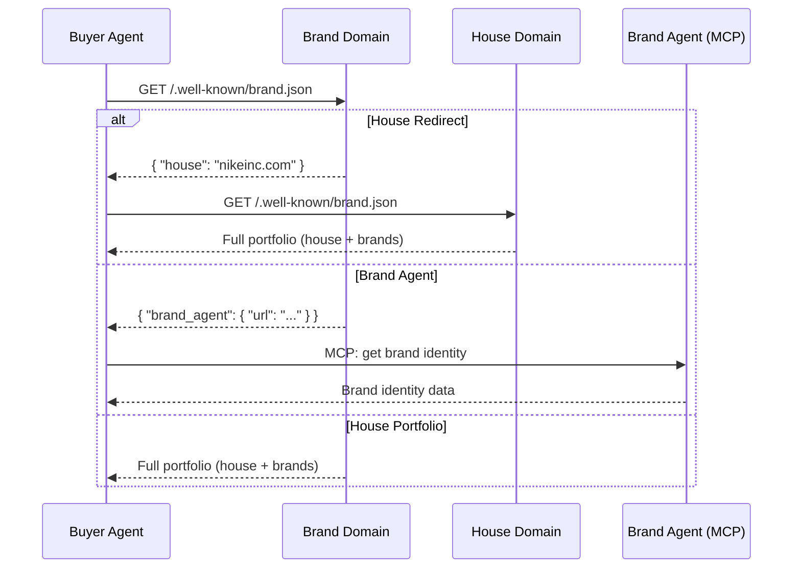

The Brand Protocol enables brands to claim their identity and establish a verifiable source of truth through a standardized discovery mechanism. By hosting a `brand.json` file at a well-known location, brands can declare their identity, brand hierarchy, and optionally designate official brand agents.

## Purpose

The Brand Protocol addresses buy-side identity in advertising, providing the same clarity that the Property Protocol provides for the sell-side:

| Sell Side | Buy Side | Description |
|-----------|----------|-------------|
| Publisher | **House** | Corporate entity (Nike, Inc., P&G) |
| Property | **Brand** | Advertising identity (Nike, Air Jordan) |
| Inventory | **Destination** | Landing pages, apps |

This parallel structure makes brands first-class citizens in AdCP.

## How it works

Brands host a `brand.json` file at `/.well-known/brand.json` on their domain. The file can take one of four forms:

1. **Brand Agent**: Points to an MCP agent that provides brand information
2. **House Portfolio**: Contains full brand hierarchy with all brands and properties
3. **House Redirect**: Points to a house domain that contains the portfolio
4. **Authoritative Location**: Points to a hosted brand.json URL


```mermaid
sequenceDiagram
    participant Agent as Buyer Agent
    participant Domain as Brand Domain
    participant House as House Domain
    participant BrandAgent as Brand Agent (MCP)

    Agent->>Domain: GET /.well-known/brand.json
    alt House Redirect
        Domain-->>Agent: { "house": "nikeinc.com" }
        Agent->>House: GET /.well-known/brand.json
        House-->>Agent: Full portfolio (house + brands)
    else Brand Agent
        Domain-->>Agent: { "brand_agent": { "url": "..." } }
        Agent->>BrandAgent: MCP: get brand identity
        BrandAgent-->>Agent: Brand identity data
    else House Portfolio
        Domain-->>Agent: Full portfolio (house + brands)
    end
```

## Brand architecture

The protocol supports Keller's brand architecture models:

| Type | Description | Example |
|------|-------------|---------|
| `master` | Primary brand of house | Nike for Nike, Inc. |
| `sub_brand` | Carries parent name | Nike SB |
| `endorsed` | Independent identity, backed by parent | Air Jordan "by Nike" |
| `independent` | Operates separately | Converse under Nike, Inc. |

## Example: house portfolio

A house domain with multiple brands:

```json
{
  "$schema": "https://adcontextprotocol.org/schemas/v3/brand.json",
  "version": "1.0",
  "house": {
    "domain": "nikeinc.com",
    "name": "Nike, Inc.",
    "architecture": "hybrid"
  },
  "brands": [
    {
      "id": "nike",
      "names": [{"en": "Nike"}, {"zh": "耐克"}],
      "keller_type": "master",
      "properties": [
        {"type": "website", "identifier": "nike.com", "primary": true},
        {"type": "mobile_app", "store": "apple", "identifier": "com.nike.omega"}
      ]
    },
    {
      "id": "air_jordan",
      "names": [{"en": "Air Jordan"}, {"en": "Jordan"}],
      "keller_type": "endorsed",
      "parent_brand": "nike",
      "properties": [
        {"type": "website", "identifier": "jordan.com"},
        {"type": "website", "identifier": "jumpman23.com"}
      ]
    }
  ]
}
```

## Example: brand agent

A brand with an MCP agent that provides brand information:

```json
{
  "$schema": "https://adcontextprotocol.org/schemas/v3/brand.json",
  "version": "1.0",
  "brand_agent": {
    "url": "https://agent.acme.com/mcp",
    "id": "acme_brand_agent"
  }
}
```

The agent provides brand identity data (logos, colors, tone) on behalf of the brand.

## Example: house redirect

A brand domain pointing to its house:

```json
{
  "$schema": "https://adcontextprotocol.org/schemas/v3/brand.json",
  "house": "nikeinc.com"
}
```

## Resolution flow

Given any domain, the protocol resolves to a canonical brand:

```
jumpman23.com
  -> fetch /.well-known/brand.json
  -> { "house": "nikeinc.com" }
  -> fetch nikeinc.com/.well-known/brand.json
  -> search brands[] for property matching "jumpman23.com"
  -> found in Air Jordan brand's properties
  -> Result: { house: "nikeinc.com", brand_id: "air_jordan" }
```

## Brand resolution sources

There are three ways to resolve brand identity, each returning the same data structure:

| Source | How it works | When to use |
|--------|-------------|-------------|
| [`resolve_brand`](#mcp-tools) | Fetches `/.well-known/brand.json`, extracts brand identity | Brand publishes a `brand.json` file |
| [Brand enrichment](/docs/registry/index#brand-resolution) | Fetches from Brandfetch, saves identity to registry | No `brand.json` available, need enrichment |
| [Registry lookup](/docs/registry/index#brand-resolution) | Returns community or enriched identity from the registry | Brand already registered |

Regardless of source, the result is a brand identity that can be referenced by any AdCP task via a brand reference (`{ "domain": "...", "brand_id": "..." }`).

## Use cases

### Creative generation

When a creative agent needs brand assets:

1. Resolve domain to canonical brand via brand.json
2. Get brand identity data (from brand.json, agent, or registry)
3. Generate on-brand creatives

### Brand verification

When verifying brand claims:

1. Fetch brand.json from claimed domain
2. Follow redirects to house if needed
3. Verify brand exists in portfolio

### Reporting roll-up

When aggregating brand performance:

1. Resolve all brand domains to canonical IDs
2. Group by house for corporate-level reporting
3. Optionally include/exclude sub-brands

## Brand context in requests

AdCP tasks accept a `brand` reference that identifies the brand by domain and optional brand_id. The system resolves this reference to the full brand identity at execution time.

```json
{
  "brand": {
    "domain": "acmecorp.com",
    "brand_id": "tide"
  }
}
```

For single-brand domains, `brand_id` is optional:

```json
{
  "brand": {
    "domain": "acmecorp.com"
  }
}
```

Brand identity data is resolved from `brand.json` or the registry — never passed inline.

## Caching

Brand information changes infrequently (logo updates, guideline refreshes). Recommended caching:

- **HTTP headers**: Use standard `ETag`, `Last-Modified`, and `Cache-Control` headers
- **Default TTL**: 24 hours for validated brand.json files
- **Failed lookups**: Cache for 1 hour before retrying
- **last_updated field**: Informational timestamp in brand.json for staleness checks

Agents should respect HTTP caching headers when fetching brand.json files.

## Brand protocol tasks

Agents that implement the brand protocol declare `supported_protocols: ["brand"]` in `get_adcp_capabilities`. The specific tasks they implement define their role:

| Agent capability | Tasks | Example |
|-----------------|-------|---------|
| DAM | `get_brand_identity` | Enterprise brand portal, asset management |
| Rights management | `get_rights` + `acquire_rights` | Talent licensing, music sync, stock media |
| Both | All brand tasks | Talent agency managing identity and rights |

### get_brand_identity

Returns brand identity data that's richer, more dynamic, or more access-controlled than static brand.json. Response depth depends on the caller's authorization — linked accounts (via `sync_accounts`) get full assets, voice configs, and rights availability.

### Rights discovery via brand.json

Brands with licensable rights declare a `rights_agent` in their brand.json. This makes rights crawlable and indexable without MCP calls:

```json
{
  "id": "daan_janssen",
  "names": [{"en": "Daan Janssen"}],
  "description": "Dutch Olympic speed skater, 2x gold medalist",
  "rights_agent": {
    "url": "https://rights.lotientertainment.com/mcp",
    "id": "loti_entertainment",
    "available_uses": ["likeness", "voice", "endorsement"],
    "right_types": ["talent"],
    "countries": ["NL", "BE", "DE"]
  }
}
```

The `brand_agent` provides identity data (logos, tone, assets). The `rights_agent` provides licensing (discovery, pricing, acquisition). They can be the same agent or different ones.

### get_rights

Search for licensable rights across a brand agent's roster. Returns matches with pricing. Discovery is natural-language-first — no taxonomy, LLMs interpret intent from the query.

### acquire_rights

Binding contractual request to clear rights. The buyer selects a `pricing_option_id` from `get_rights` and provides campaign details. Returns terms, generation credentials for LLM providers, and disclosure requirements.

### Generation credentials

Rights management agents coordinate with LLM providers (Midjourney, ElevenLabs, etc.) to issue scoped credentials. The rights agent sets up the permission; the provider enforces at generation time. Any creative agent can use the credentials.

### Creative lifecycle

Creative manifests carry an optional `rights` array — each entry is a rights constraint from a different rights holder. A single creative may combine talent likeness + music license, each with different validity periods and country restrictions. For v1, rights constraints are informational metadata.

Usage is reported back to the rights agent via `report_usage` with the `rights_id` field for cap tracking and billing.

## MCP tools

The Brand Protocol provides MCP tools for programmatic access:

| Tool | Description |
|------|-------------|
| `resolve_brand` | Resolve domain to canonical brand identity |
| `validate_brand_json` | Validate a domain's brand.json |
| `validate_brand_agent` | Test brand agent reachability |

## Learn more

<CardGroup cols={2}>
  <Card title="brand.json spec" icon="code" href="/docs/brand-protocol/brand-json">
    Complete technical specification for the brand.json file format.
  </Card>
  <Card title="get_brand_identity" icon="id-card" href="/docs/brand-protocol/tasks/get_brand_identity">
    Retrieve brand identity data from a brand agent.
  </Card>
  <Card title="get_rights" icon="scale-balanced" href="/docs/brand-protocol/tasks/get_rights">
    Search for licensable rights with pricing.
  </Card>
  <Card title="acquire_rights" icon="handshake" href="/docs/brand-protocol/tasks/acquire_rights">
    Acquire rights with contractual clearance.
  </Card>
</CardGroup>
