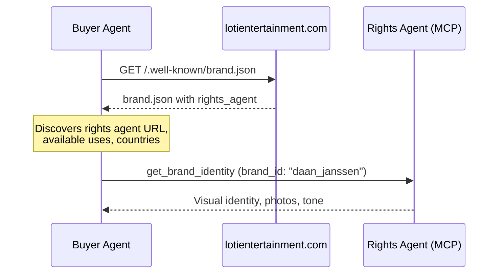
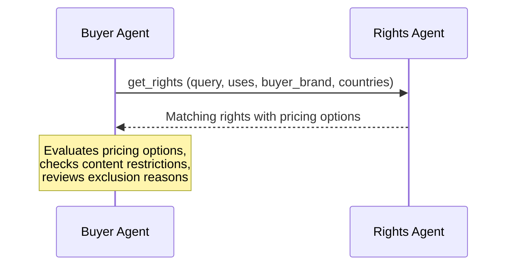
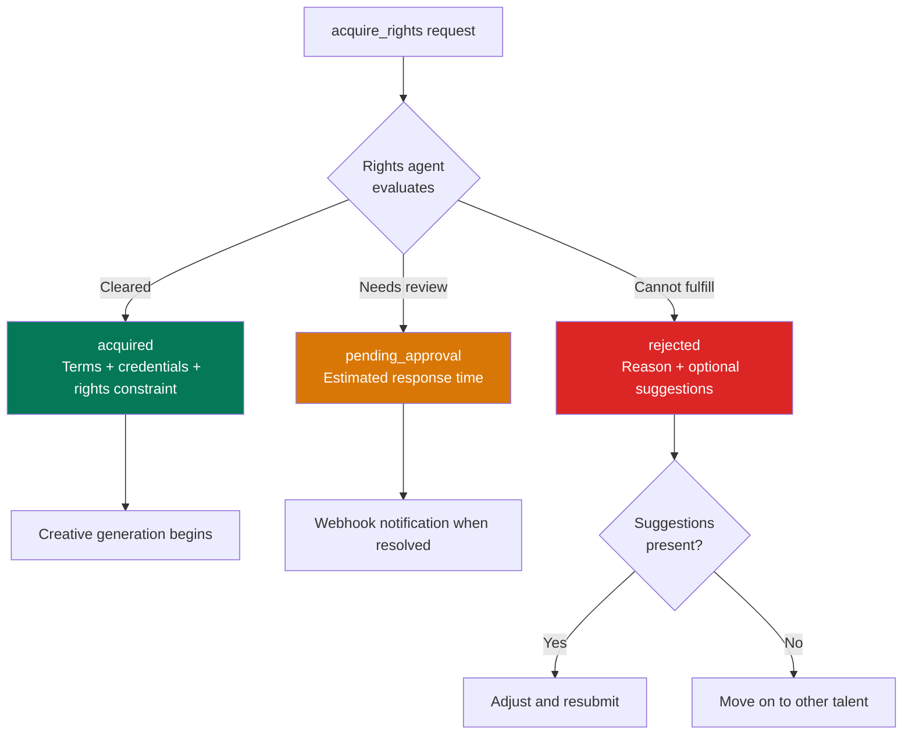
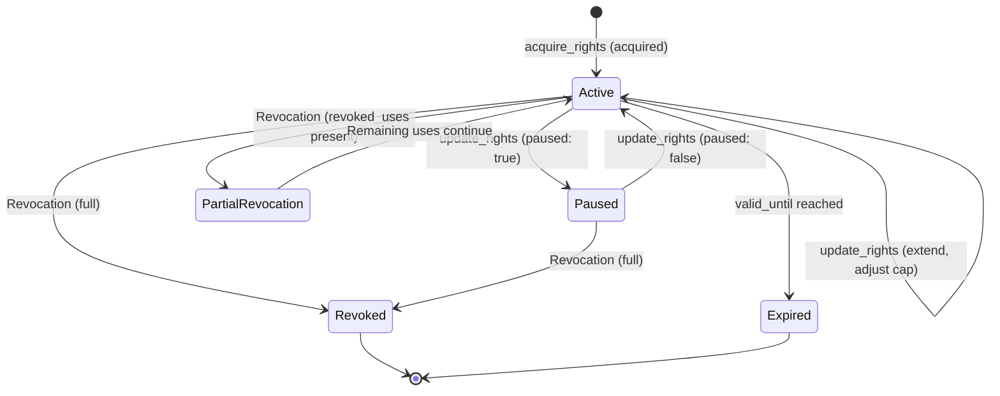

Meet Carlos. He runs programmatic at Pinnacle Media, a mid-size agency in Amsterdam. His client, Bistro Oranje — a steakhouse chain expanding across the Netherlands — wants a celebrity athlete in their next campaign. Not stock footage. Not a lookalike. A real, licensed Dutch athlete whose likeness and voice AI tools can generate into on-brand ads.

The problem: how do you find available talent, negotiate rights, get authorization for your AI tools, and track usage — all through agents, at programmatic speed?

This walkthrough follows Carlos from campaign brief to live delivery — and what happens when things change mid-flight.

**The workflow in seven steps:**
1. **Brief** — Define what the campaign needs
2. **Discover** — Fetch `brand.json` to find the rights agent
3. **Search** — Query available talent with `get_rights`
4. **Acquire** — Submit a binding request with `acquire_rights`
5. **Approve** — Handle approval, rejection, or pending paths
6. **Generate** — Create and deliver on-brand ads
7. **Manage** — Extend, pause, or pull the campaign


## Step 1: The brief

Bistro Oranje wants a Dutch Olympic athlete as the face of their summer campaign. Video ads, display banners, and audio spots across the Netherlands. Budget: EUR 5,000 for rights, plus creative production and media spend. The campaign runs June through August.

Carlos has used AdCP for media buying before. Rights licensing works the same way — his buyer agent talks to a rights agent the same way — same protocol, same tools.

<Accordion title="Agency language to protocol terms">

| What Carlos says | What the protocol calls it |
|---|---|
| "Find me a Dutch athlete for a food brand" | `get_rights` with natural language `query` |
| "How much for likeness and voice?" | `pricing_options` in the `get_rights` response |
| "Lock in 3 months, Netherlands only" | `acquire_rights` with campaign dates and countries |
| "Send me the keys so my creative tools can generate" | `generation_credentials` in the `acquire_rights` response |
| "The talent's agency needs to approve the creative" | `creative-approval-request` via the `approval_webhook` |
| "We need to extend through September" | `update_rights` with a new `end_date` |
| "The talent got injured — pull everything" | Revocation notification to the `revocation_webhook` |

</Accordion>

---

## Step 2: Discover the brand

Carlos's buyer agent starts where every AdCP interaction starts: `brand.json`. The agent fetches `https://lotientertainment.com/.well-known/brand.json` and finds a talent agency managing a roster of athletes.


The `rights_agent` field tells the buyer agent everything it needs to know before making any MCP calls — what is licensable, what types of rights, and where.

```json
{
  "$schema": "https://adcontextprotocol.org/schemas/v3/brand.json",
  "version": "1.0",
  "house": {
    "domain": "lotientertainment.com",
    "name": "Loti Entertainment",
    "architecture": "house_of_brands"
  },
  "brands": [
    {
      "id": "daan_janssen",
      "names": [{ "en": "Daan Janssen" }],
      "description": "Dutch Olympic speed skater, 2x gold medalist",
      "industry": "sports",
      "rights_agent": {
        "url": "https://rights.lotientertainment.com/mcp",
        "id": "loti_entertainment",
        "available_uses": ["likeness", "voice", "endorsement"],
        "right_types": ["talent"],
        "countries": ["NL", "BE", "DE"]
      }
    }
  ]
}
```



The buyer agent also calls `get_brand_identity` to retrieve visual assets and tone guidelines. These are needed later when creative tools generate on-brand ads featuring the athlete.

```json
{
  "brand_id": "daan_janssen",
  "fields": ["logos", "colors", "tone", "visual_guidelines"]
}
```

This returns high-res photos, brand colors, and appearance guidelines — everything a creative agent needs to generate ads that look right.

---

## Step 3: Search for talent

Now Carlos's agent calls `get_rights` on the rights agent. Carlos describes what he wants in plain language. No dropdown menus, no category codes — the agent understands intent.


**Request:**

```json
{
  "query": "Dutch athlete available for food and restaurant brands in the Netherlands, budget around EUR 5000 for 3 months",
  "uses": ["likeness", "voice"],
  "buyer_brand": {
    "domain": "bistrooranje.nl"
  },
  "countries": ["NL"],
  "right_type": "talent",
  "include_excluded": true
}
```

The `include_excluded: true` flag asks the rights agent to return talent that cannot be licensed as-is, along with reasons and suggestions. Without this flag, the response only includes available talent.

The response returns Daan Janssen as a 92% match — Dutch nationality, no food category conflicts, budget-aligned. Two pricing options: CPM at EUR 3.50 per impression, or a flat monthly rate at EUR 1,500 with a 100K impression cap. The response also shows Emma van Dijk as excluded due to a food category exclusivity in the Netherlands, with suggestions for alternative markets.

<Accordion title="Full get_rights response">

```json
{
  "rights": [
    {
      "rights_id": "loti_dj_talent_2026",
      "brand_id": "daan_janssen",
      "name": "Daan Janssen",
      "description": "Dutch Olympic speed skater, 2x gold medalist. Available for food, lifestyle, and fitness brands.",
      "right_type": "talent",
      "match_score": 0.92,
      "match_reasons": [
        "Dutch nationality matches geographic request",
        "No food category exclusivity conflicts",
        "Budget aligns with available pricing options"
      ],
      "available_uses": ["likeness", "voice", "endorsement"],
      "countries": ["NL", "BE", "DE"],
      "exclusivity_status": {
        "available": true,
        "existing_exclusives": [
          "Exclusive commitment in sportswear category (NL, BE, DE)"
        ]
      },
      "pricing_options": [
        {
          "pricing_option_id": "dj_cpm_likeness_voice",
          "model": "cpm",
          "price": 3.50,
          "currency": "EUR",
          "uses": ["likeness", "voice"],
          "description": "Likeness and voice, per-impression pricing"
        },
        {
          "pricing_option_id": "dj_flat_monthly",
          "model": "flat_rate",
          "price": 1500,
          "currency": "EUR",
          "uses": ["likeness", "voice"],
          "period": "monthly",
          "impression_cap": 100000,
          "overage_cpm": 4.00,
          "description": "Monthly flat rate with 100K impression cap"
        }
      ],
      "content_restrictions": [
        "No depiction in competitive sports contexts",
        "Alcohol adjacency prohibited",
        "Creative approval required for video formats"
      ]
    }
  ],
  "excluded": [
    {
      "brand_id": "emma_van_dijk",
      "name": "Emma van Dijk",
      "reason": "Exclusive commitment in food and beverage category (NL)",
      "suggestions": [
        "Available for food brands in BE and DE markets",
        "Exclusivity expires 2026-12-31 — available in NL from January 2027"
      ]
    }
  ]
}
```

</Accordion>

Carlos's agent sees two pricing options for Daan Janssen. The per-impression model works if volume is unpredictable. The flat monthly rate is better for a planned campaign — EUR 1,500/month with a 100,000 impression cap means the full 3-month campaign costs EUR 4,500, within budget.

The `excluded` array shows Emma van Dijk is unavailable in the Netherlands for food brands, but the suggestions tell Carlos's agent she is available in Belgium and Germany, or in the Netherlands starting January 2027. Suggestions mean the exclusion is actionable — the agent can adjust and retry.



---

## Step 4: Acquire the rights

Carlos reviews the options and picks the flat monthly rate. His buyer agent submits `acquire_rights` — a binding contractual request.


Carlos's agent submits `acquire_rights` with the flat monthly pricing option, campaign dates (June through August), webhooks for revocation and push notifications, and an idempotency key for safe retries.

<Accordion title="Full acquire_rights request">

```json
{
  "rights_id": "loti_dj_talent_2026",
  "pricing_option_id": "dj_flat_monthly",
  "buyer": {
    "domain": "bistrooranje.nl"
  },
  "campaign": {
    "description": "Summer steakhouse campaign featuring Daan Janssen in video, display, and audio ads promoting Bistro Oranje locations across the Netherlands",
    "uses": ["likeness", "voice"],
    "countries": ["NL"],
    "format_ids": [
      { "agent_url": "https://creatives.pinnaclemedia.com", "id": "video_16x9_30s" },
      { "agent_url": "https://creatives.pinnaclemedia.com", "id": "display_300x250" }
    ],
    "estimated_impressions": 250000,
    "start_date": "2026-06-01",
    "end_date": "2026-08-31"
  },
  "revocation_webhook": {
    "url": "https://api.pinnaclemedia.com/webhooks/revocation",
    "auth": {
      "type": "bearer",
      "token": "whk_pinnacle_abc123"
    }
  },
  "push_notification_config": {
    "url": "https://api.pinnaclemedia.com/webhooks/rights-updates",
    "auth": {
      "type": "bearer",
      "token": "whk_pinnacle_def456"
    }
  },
  "idempotency_key": "bistro-dj-summer-2026-v1"
}
```

</Accordion>

Three outcomes are possible.



Carlos's agent gets everything it needs to start creating: keys for Midjourney (likeness) and ElevenLabs (voice), the legal disclosure text for every ad, and a link to submit finished creatives for the talent's approval. The monthly cap of 100,000 impressions translates to a total campaign cap of 300,000 across the three-month term.

<Accordion title="Full acquired response">

```json
{
  "rights_id": "loti_dj_talent_2026",
  "status": "acquired",
  "brand_id": "daan_janssen",
  "terms": {
    "pricing_option_id": "dj_flat_monthly",
    "amount": 1500,
    "currency": "EUR",
    "period": "monthly",
    "uses": ["likeness", "voice"],
    "impression_cap": 100000,
    "overage_cpm": 4.00,
    "start_date": "2026-06-01",
    "end_date": "2026-08-31"
  },
  "generation_credentials": [
    {
      "provider": "midjourney",
      "rights_key": "rk_mj_dj_2026_bistro_7f3a9b",
      "uses": ["likeness"],
      "expires_at": "2026-09-01T00:00:00Z"
    },
    {
      "provider": "elevenlabs",
      "rights_key": "rk_el_dj_2026_bistro_4e8c1d",
      "uses": ["voice"],
      "expires_at": "2026-09-01T00:00:00Z"
    }
  ],
  "restrictions": [
    "No depiction in competitive sports contexts",
    "Alcohol adjacency prohibited",
    "Creative approval required for video formats"
  ],
  "disclosure": {
    "required": true,
    "text": "Features AI-generated likeness of Daan Janssen, used under license from Loti Entertainment."
  },
  "approval_webhook": {
    "url": "https://rights.lotientertainment.com/api/creative-approval",
    "auth": {
      "type": "bearer",
      "token": "appr_loti_dj_2026_9x4k"
    }
  },
  "usage_reporting_url": "https://rights.lotientertainment.com/api/usage",
  "rights_constraint": {
    "rights_id": "loti_dj_talent_2026",
    "rights_agent": {
      "url": "https://rights.lotientertainment.com/mcp",
      "id": "loti_entertainment"
    },
    "valid_from": "2026-06-01T00:00:00Z",
    "valid_until": "2026-09-01T00:00:00Z",
    "uses": ["likeness", "voice"],
    "countries": ["NL"],
    "impression_cap": 300000,
    "right_type": "talent",
    "verification_url": "https://rights.lotientertainment.com/verify/loti_dj_talent_2026"
  }
}
```

</Accordion>

---

## Step 5: Approval and rejection

Not every request gets approved immediately. The protocol handles two other paths.


### Pending approval

Some requests need human review — the talent's management, a legal team, or the athlete themselves. The rights agent returns `pending_approval` with an estimated timeline.

```json
{
  "rights_id": "loti_dj_talent_2026",
  "status": "pending_approval",
  "brand_id": "daan_janssen",
  "detail": "Video format requests require creative concept review by talent management",
  "estimated_response_time": "48h"
}
```

When the decision is made, the rights agent sends a webhook to the `push_notification_config` URL. The buyer agent does not poll.

### Rejection with suggestions (actionable)

If the request cannot be fulfilled as-is, but the buyer can adjust, the rejection includes `suggestions`. Their presence is the signal — if suggestions exist, the rejection is fixable.

```json
{
  "rights_id": "loti_dj_talent_2026",
  "status": "rejected",
  "brand_id": "daan_janssen",
  "reason": "Requested dates conflict with an existing exclusivity commitment in the food category for this market",
  "suggestions": [
    "Available in NL from 2026-09-01 onward",
    "Available immediately in BE and DE markets",
    "Consider likeness-only (without voice) — available at reduced rate"
  ]
}
```

Carlos's agent can revise — shift the dates, change the geography, or drop voice rights — and resubmit.

### Rejection without suggestions (final)

When there are no suggestions, the rejection is final for this talent and campaign combination.

```json
{
  "rights_id": "loti_dj_talent_2026",
  "status": "rejected",
  "brand_id": "daan_janssen",
  "reason": "This request does not meet the talent's current licensing criteria"
}
```

No `suggestions` field. The buyer agent moves on. The reason may be vague intentionally — agencies manage confidential rules (the talent's personal boundaries, legal constraints, internal policies) that are not appropriate to disclose. The protocol respects this: a sanitized reason is enough for the buyer agent to understand the outcome without exposing private business logic.

---

At this point, Carlos has licensed talent and is ready to generate creative. The next section covers what happens after acquisition: generation, delivery, and lifecycle management.

<CardGroup cols={2}>
  <Card title="Try it yourself" icon="graduation-cap" href="/docs/learning/tracks/buyer">
    Learn the protocol hands-on through the buyer certification program.
  </Card>
  <Card title="For advertisers" icon="bullhorn" href="/docs/brand-protocol/for-advertisers">
    How rights licensing works from the buyer's perspective.
  </Card>
</CardGroup>

---

## Step 6: Generate and deliver

With credentials in hand, Carlos's creative tools go to work. The Midjourney credential generates likeness. The ElevenLabs credential generates voice. Each provider validates the `rights_key` at generation time — the credential itself is the authorization.


### Creative approval

For video formats, the content restrictions require approval before distribution. The creative agent submits the finished ad to the `approval_webhook`.

```json
{
  "rights_id": "loti_dj_talent_2026",
  "creative_id": "bistro_summer_video_01",
  "creative_url": "https://cdn.pinnaclemedia.com/creatives/bistro_summer_video_01.mp4",
  "creative_format": {
    "agent_url": "https://creatives.pinnaclemedia.com",
    "id": "video_16x9_30s"
  },
  "description": "30-second video spot featuring Daan Janssen recommending Bistro Oranje summer menu"
}
```

### Rights constraint in the creative manifest

Every creative that uses licensed talent carries the `rights_constraint` from the `acquire_rights` response in its manifest — the buyer does not construct it manually. A single ad can combine talent likeness from one rights holder and music from another, each with different validity periods and geographic restrictions. Downstream participants (SSPs, verification vendors) hit the `verification_url` to confirm the grant is still active before serving.

### Usage reporting

Impressions are reported back to the rights agent for billing and cap enforcement.

The `impression_cap` in the terms (100,000 per month) is a soft cap by default. If the campaign exceeds it, additional impressions are billed at the `overage_cpm` rate (EUR 4.00). The rights agent tracks cumulative usage and can notify the buyer when approaching the cap.

---

## Step 7: The lifecycle continues

Rights are not static. Campaigns change, contracts extend, and sometimes things go wrong.


### Updating rights

Midway through the campaign, Bistro Oranje wants to extend through September. Carlos's agent calls `update_rights`.

```json
{
  "rights_id": "loti_dj_talent_2026",
  "end_date": "2026-09-30",
  "impression_cap": 150000,
  "idempotency_key": "bistro-dj-extend-sept-v1"
}
```

The response includes updated terms and re-issued generation credentials with the new expiration. The old credentials continue working during an overlap period — no gap in creative delivery.

If the campaign needs to pause (talent injury, brand issue, seasonal break), the agent can set `paused: true`. Credentials are suspended. Set `paused: false` to resume.

### Natural expiration

When the campaign ends and `valid_until` is reached, credentials expire automatically. Generation requests stop working. No action is required from either party.

### Revocation

If the talent's agency needs to revoke rights — a scandal, a contract violation, a legal issue — they POST a revocation notification to the buyer's `revocation_webhook`.

```json
{
  "notification_id": "rev_loti_dj_2026_001",
  "rights_id": "loti_dj_talent_2026",
  "brand_id": "daan_janssen",
  "reason": "Rights revoked due to updated talent representation terms",
  "effective_at": "2026-07-15T18:00:00Z"
}
```

The buyer acknowledges receipt. If the notification fails to deliver, the rights agent retries automatically.

When `effective_at` is in the future, the buyer has a grace period to wind down creative delivery. When it is the current time, the revocation is immediate — stop serving now.

Partial revocation is also supported. If `revoked_uses` is present in the notification, only those uses are revoked. The rest of the grant remains active.



---

## What you have seen

The brand protocol handles rights from discovery (`brand.json`) through licensing (`get_rights`, `acquire_rights`) to lifecycle management (`update_rights`, revocation webhooks). Every step uses the same MCP transport your buyer agent already speaks. The rights constraint travels with the creative — so every participant in the supply chain can verify before serving.

<Accordion title="Check your understanding">

Bistro Oranje's campaign is halfway through July when they learn Daan Janssen has signed a new sportswear exclusivity deal that now includes food brands in Belgium. Their campaign only runs in the Netherlands. Does Carlos need to do anything? Why or why not?

*Think about: geographic scoping in the rights grant, the difference between existing exclusivities and new ones, and what the `countries` field in Carlos's `acquire_rights` terms actually covers.*

</Accordion>

---

## Go deeper

<CardGroup cols={2}>
  <Card title="brand.json spec" icon="code" href="/docs/brand-protocol/brand-json">
    Full technical specification for the brand.json file format.
  </Card>
  <Card title="For advertisers" icon="bullhorn" href="/docs/brand-protocol/for-advertisers">
    How rights licensing works from the buyer's perspective.
  </Card>
  <Card title="For rights holders" icon="shield-halved" href="/docs/brand-protocol/for-rights-holders">
    How AdCP protects and monetizes talent rights.
  </Card>
  <Card title="Building a brand agent" icon="robot" href="/docs/brand-protocol/building-a-brand-agent">
    Implement a brand agent that serves identity and rights.
  </Card>
  <Card title="get_rights" icon="magnifying-glass" href="/docs/brand-protocol/tasks/get_rights">
    Search for licensable talent with pricing and availability.
  </Card>
  <Card title="acquire_rights" icon="file-signature" href="/docs/brand-protocol/tasks/acquire_rights">
    Submit a binding request and receive generation credentials.
  </Card>
  <Card title="update_rights" icon="arrows-rotate" href="/docs/brand-protocol/tasks/update_rights">
    Modify an existing rights grant — extend, pause, adjust.
  </Card>
  <Card title="Certification" icon="graduation-cap" href="/docs/learning/tracks/buyer">
    Earn your buyer certification and learn the protocol hands-on.
  </Card>
</CardGroup>
