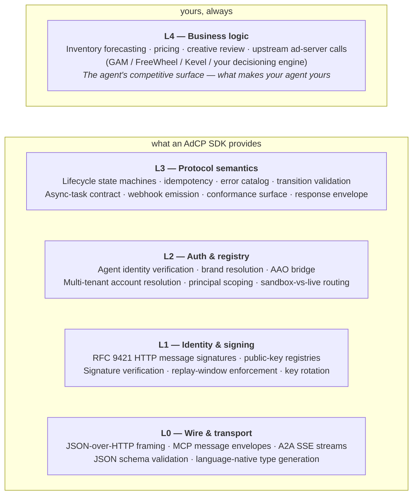

<Note>
**AdCP is the transaction and control plane** — planning, deal creation, creative submission, reporting. Impression-time decisioning happens in adjacent protocols ([TMP](/docs/trusted-match), RTB, VAST). AdCP latency budgets are seconds, often async-by-design — not the millisecond budgets you'd expect from a serve-time protocol. If you came here looking for a serve-time auction surface, you want [TMP](/docs/trusted-match).
</Note>

The first question when you sit down to build an AdCP agent is **where you want to spend your engineering time**. By the time a buyer's `create_media_buy` reaches your business logic, it has crossed five distinct layers — wire format, signing, auth, protocol semantics, and finally what you actually want to build. The lower you start, the more of the stack you own.

This page lays out those layers, what an SDK provides at each one, and what's left for you to write either way. Use it to pick the entry point that fits your team — whether that's letting an SDK absorb the protocol surface so you can focus on the L4 logic that differentiates your agent, or going lower because you have a specific reason to. The cost decompositions further down ([per-component L3 breakdown](#why-sdks-matter-more-in-adcp-than-in-eg-http), [version-adaptation](#version-adaptation)) are there to make either choice deliberate.

Two notes on framing before the layers:

- **The protocol surface has grown.** AdCP 3.0 added [a substantial L3 floor](/docs/building/cross-cutting/version-adaptation#what-changed-at-l3-in-3-0) — mandatory idempotency, published lifecycle state machines, the conformance test surface, RFC 9421 signatures as a baseline, expanded error catalog. If you last evaluated SDKs against an earlier version, the line between "what the SDK does" and "what I'd write myself" has moved.
- **AdCP looks like a thin protocol from the outside.** From the inside it has more L3 (state machines, idempotency, async-task contract, error semantics, conformance) than implementers tend to expect on a first read. The decompositions on this page exist so the L3 estimate is visible up front.

Audience: AdCP implementers in any language — whether you're building an agent, authoring an SDK, or evaluating one.

## The five layers

The same five layers exist on both sides of an AdCP conversation — **agent (server)** and **caller (client)**. The work is asymmetric, though: an agent **enforces** the protocol (state machines, idempotency, error semantics, conformance surface, webhook emission), while a caller **consumes** it (reads state, supplies idempotency keys, handles errors, receives webhooks). L0 (wire) and L1 (signing) are mostly symmetric; L2 (auth) and especially L3 (protocol semantics) are where the surface diverges. L4 exists on both sides, but it's a different shape — the agent's L4 is its inventory and decisioning, the caller's L4 is its planning and buying logic.

When this page describes a layer in agent-shaped terms, look for the *Client side* note at the end — it names the (typically smaller) caller-side surface. Most of the per-page cost commentary, the L3 person-month estimates, and the conformance discussion all describe the server side; building a caller is meaningfully lighter at L2–L3 because most of the work is consuming the protocol, not enforcing it.

**Caller-only?** Skim the *Client side* notes on each layer below, then jump to [Server vs client at each layer](#server-vs-client-at-each-layer) for the cost comparison.

### L0 — Wire & transport

What it does: takes protocol bytes off the wire and turns them into typed in-memory values. Schema validation catches malformed payloads at the door.

What's in it:

- HTTP routing (or stdio for MCP-over-stdio).
- MCP message framing (`tools/call` envelope, JSON-RPC 2.0).
- A2A SSE event streams.
- JSON schema validation against the spec's `*.json` files (see [Schemas](/docs/building/by-layer/L0/schemas)).
- Type generation: producing language-native types from the spec's schemas, so application code is statically checked.

If you only have L0, you have a parser. The buyer's `create_media_buy` is a typed object on your stack — and you have to do everything else yourself.

*Client side:* same primitives, mirror direction. The client serializes outbound requests against the same schemas and consumes responses through the same type-generation pipeline. L0 is essentially symmetric.

### L1 — Identity & signing

What it does: cryptographically verifies that the request came from who the headers claim it did, and that the body wasn't modified in transit. See [Security model](/docs/building/concepts/security-model) and the [implementation profile](/docs/building/by-layer/L1/security).

What's in it:

- RFC 9421 HTTP message signatures (`Signature-Input`, `Signature` headers).
- Public-key resolution from agent registries (or operator-published JWKS).
- Signature verification against the canonicalized request.
- Replay-window enforcement (`created` / `expires` parameters).
- Key rotation: handling `keyid` changes without dropping in-flight requests.

If you have L0+L1, you know who's calling you. You still don't know *what* they're allowed to do.

*Client side:* signs outbound requests with its own key; verifies webhook callbacks from the agent. Same RFC 9421 + replay-window + key-rotation primitives, just one inbound path (webhooks) instead of every request.

### L2 — Auth & registry

What it does: turns a verified identity into a scoped principal — which buyer, which brand, which advertiser account, which sandbox-vs-live tier. See [Accounts](/docs/accounts/overview) and [Calling an agent](/docs/protocol/calling-an-agent).

What's in it:

- Agent registry lookup (resolving agent metadata from a published [agent card](/docs/protocol/calling-an-agent)).
- Brand resolution: mapping the requesting agent to a buyer brand / advertiser identity via [Brand Protocol](/docs/brand-protocol).
- AAO ([AgenticAdvertising.org](https://agenticadvertising.org)) bridge: resolving an agent's member org, AAO Verified badges, and registry visibility — see [Registering an agent](/docs/registry/registering-an-agent) and [AAO Verified](/docs/building/verification/aao-verified).
- Multi-tenant account resolution: the same wire request maps to different accounts depending on the principal.
- Sandbox-vs-live account flagging — see [Sandbox](/docs/media-buy/advanced-topics/sandbox).
- Permission scoping: which AdCP tools this principal is allowed to call.

If you have L0+L1+L2, you have a verified, scoped principal asking to do something. You still don't know if the *something* is legal in the current state.

*Client side:* a small subset. The client publishes its own identity (agent card, brand domain), looks up the agent it's calling via the registry, and presents its credentials. There's no multi-tenant routing, no principal scoping, no sandbox/live boundary to enforce — the client *is* the principal, and chooses which agent to talk to.

### L3 — Protocol semantics

What it does: enforces what AdCP *means*. The wire shape is well-formed (L0); the caller is authentic (L1) and authorized (L2); now: is the request legal given the current state of the world?

What's in it:

- **Lifecycle state machines** — `MediaBuy` ([reference](/docs/media-buy/media-buys/lifecycle)), `Creative`, `Account`, `SISession`, `CatalogItem`, `Proposal`, `Audience`. Each with legal edges defined by the spec.
- **Transition validation** — enforce the legal edges per resource; emit `NOT_CANCELLABLE` for cancel-attempts against a state that forbids it; `INVALID_STATE` for other illegal moves. The cancellation-specific code takes precedence over the generic one whenever the attempted action is a cancel.
- **Idempotency** — `idempotency_key` required on every mutating tool; same key replays the cached response within TTL; cross-payload reuse fails with `IDEMPOTENCY_CONFLICT` (with no payload echo, per the stolen-key read-oracle threat model). See the [idempotency profile](/docs/building/by-layer/L1/security#idempotency).
- **Error code catalog** — codes with recovery semantics (`transient` / `correctable` / `terminal`). Choosing the right code is part of the spec contract. See [Error handling](/docs/building/by-layer/L3/error-handling).
- **Async-task contract** — tools that don't complete synchronously return a `task_id`; clients poll or receive webhook callbacks; the task's terminal artifact carries the original tool's response shape. See [Task lifecycle](/docs/building/by-layer/L3/task-lifecycle).
- **Webhook emission** — state changes notify subscribed buyers, with retry, idempotency, and signature. See [Webhooks](/docs/building/by-layer/L3/webhooks).
- **Conformance test surface** — `comply_test_controller` (sandbox-only) exposes `seed_*` / `force_*` / `simulate_*` so storyboards can drive state deterministically. See [comply_test_controller](/docs/building/by-layer/L3/comply-test-controller) and [Conformance](/docs/building/verification/conformance).
- **Response envelope** — `context`, `task_id`, `status` field, error envelope shape, `adcp_version` echo, capability advertisement.

If you have L0+L1+L2+L3, you have a complete AdCP protocol implementation. You still haven't done any business logic.

*Client side:* the consumer-side mirror, which is much smaller. The client *reads* state machines (handles each terminal status correctly) rather than enforcing transitions. It *supplies* `idempotency_key` on retries rather than maintaining the cache. It *classifies* error codes by recovery semantics (`transient` → retry, `correctable` → fix and resubmit, `terminal` → don't retry) rather than choosing the right one to emit. It *polls or receives* async-task results and webhook callbacks rather than emitting them. There's no `comply_test_controller` surface to expose, and no conformance bar to certify against on the consumer side. The L3 person-month estimate later on this page is server-side; client L3 is weeks of handler glue, not months.

### L4 — Business logic

This is what makes your agent yours.

What's in it:

- Inventory forecasting against your real ad server.
- Pricing logic, deal terms, contract semantics.
- Creative review policy (brand safety, format compliance).
- Upstream calls to GAM / FreeWheel / Kevel / Yahoo / your in-house decisioning engine.
- Optimization, pacing, fraud detection — anything that differentiates your inventory from a competitor's.

This is the layer an AdCP SDK leaves to you, **and only this layer**.

*Client side:* L4 is also yours, just a different shape. The caller's L4 is media planning, budget allocation, target-audience selection, deal evaluation, reporting ingest — whatever your buy-side application does with the agents it calls. See [Calling an agent](/docs/protocol/calling-an-agent) for the spec-side reference. The asymmetry runs through the whole stack: agent L4 differentiates *inventory*, caller L4 differentiates *demand*.

## Server vs client at each layer

The same five layers; very different cost. Use this when sizing the work for a caller-only build vs. an agent build.

| Layer | Agent (server) | Caller (client) |
|---|---|---|
| **L4** | Inventory, pricing, creative review, ad-server integration. What differentiates you as a seller. | Planning, budgeting, agent selection, reporting consumption. What differentiates you as a buyer. |
| **L3** | **Enforces** state machines, idempotency, error semantics, conformance test surface, webhook emission. ~3–4 person-months. | **Consumes** the same. Reads state, supplies idempotency keys, classifies errors, polls/receives async + webhooks. Weeks of handler glue. |
| **L2** | Multi-tenant principal resolution, sandbox/live boundary, brand resolution, permission scoping. | Publishes own identity; looks up the agent it's calling. Much smaller surface. |
| **L1** | Verifies inbound on every request; signs outbound webhooks. | Signs outbound on every request; verifies inbound webhooks. Same crypto, mirrored path. |
| **L0** | Receives + parses + validates against schemas. | Serializes + sends + validates against schemas. Symmetric. |

A from-scratch caller is a weeks-long job across L0–L3 — handler glue, signing, registry lookup, response parsing — not the [3–4 person-month L3 build](#why-sdks-matter-more-in-adcp-than-in-eg-http) the agent side requires. The rest of this page concentrates on the agent side because that's where the cost lives, but the layer model and the SDK coverage matrix apply equally to a caller-only build.

## What an SDK at each layer should provide

Implementer-facing checklist. An SDK that claims coverage of layer L*n* should expose, at minimum, the primitives below. Adopters use this as a self-evaluation tool when picking an SDK; SDK authors use it as a build target.

The checklist describes **server-side coverage** — the agent surface is where the bulk of an SDK's value lives. **Client-side coverage** at each layer is a subset: typed request builders + response parsers (L0), outbound signing + webhook verification (L1), agent-card publication + registry lookup (L2), state-machine *handlers* + idempotency-key generation + error-recovery classification + async-result polling (L3). A full-stack SDK ships both.

### L0 coverage

- Generated language-native types from the published JSON schemas (one type per request/response pair, plus shared resource types).
- A schema validator wired against the bundled schemas — so adopters can validate inbound and outbound payloads without hand-rolling the schema-loading dance.
- Transport adapters for at least one of \{MCP, A2A\}; ideally both. These typically wrap upstream protocol SDKs rather than reimplementing them.
- A schema-bundle accessor that finds the right schema files for the active AdCP version without forcing the adopter to hardcode paths.

### L1 coverage

- RFC 9421 message-signature signing for outbound requests.
- RFC 9421 verification for inbound requests, including replay-window enforcement on `created` / `expires` and `keyid`-based key lookup.
- A pluggable signing-provider abstraction: in-process keys for development, KMS / HSM providers for production.
- Test fixtures or a verifier-test harness so adopters can assert their signing wiring is correct without booting a full agent.

### L2 coverage

- An account-store abstraction that resolves an authenticated principal to a scoped account, with hooks for multi-tenant routing.
- Authentication primitives for at least API-key and bearer-token shapes, plus a way to compose them.
- Brand-resolution / agent-registry lookup (or a documented extension point if the SDK doesn't ship it natively).
- The sandbox-vs-live account flag, enforced at the SDK boundary so the conformance-test surface refuses to dispatch on production accounts.

### L3 coverage

- Lifecycle state-machine graphs for all spec-defined resources, with a transition-assertion primitive that emits the spec-correct error code (`NOT_CANCELLABLE` / `INVALID_STATE` / etc.).
- Idempotency cache with cross-payload conflict detection and the no-payload-echo invariant on `IDEMPOTENCY_CONFLICT` envelopes.
- Async-task store + dispatcher: tools opt into async; the SDK returns `task_id`, accepts polling, and emits the terminal artifact.
- Webhook emitter: signed, retried, idempotent.
- The conformance test surface (`comply_test_controller`), wired to drive state deterministically when the resolved account is in sandbox or mock mode (and rejected otherwise).
- Per-resource persistence primitives that handle the spec's echo contracts.
- Server-construction entry point that ties all of the above together with sane defaults.

### L4 coverage

Out of scope for any SDK. The adopter writes this.

## SDK coverage varies

Different language SDKs cover different subsets of L0–L3. There is no single SDK every implementer must use; what matters is that an implementation reaches the [conformance bar](/docs/building/verification/conformance) at L3, regardless of how much hand-rolling it took to get there.

Within a given language, the full-stack SDK is the default starting point. The layered model in this doc exists to explain what you'd be reimplementing if you went lower (special-purpose proxies, custom-stack integrations) or ported the SDK to a new language — not to suggest there's a meaningful win in starting lower for a typical agent build.

### Current SDK coverage

**Python and TypeScript are the first-class languages.** Both are committed to full L0–L4 coverage — TypeScript is GA across L0–L3 today; Python is finishing its 4.x cycle to the same bar. **Go** is moving in the same direction, with L0 and partial L1 in active development. **Other languages** are not on the official roadmap today, but we're open to community-maintained ports — if you want to help, see the [Builders Working Group](/docs/community/working-group) and the [Slack community](https://join.slack.com/t/agenticads/shared_invite/zt-3c5sxvdjk-x0rVmLB3OFHVUp~WutVWZg).

Snapshot of what each official SDK ships today. Refresh this table on SDK majors and on AdCP spec revs.

*Last updated: 2026-05-03 — `@adcp/sdk` 6.7.0 GA on npm; `adcp` (Python) 4.x in flight; `adcp-go` in active development.*

| SDK | Version | L0 | L1 | L2 | L3 | Adopter writes |
|---|---|---|---|---|---|---|
| **`@adcp/sdk`** (TypeScript) — [adcontextprotocol/adcp-client](https://github.com/adcontextprotocol/adcp-client) | 6.7.0 GA | ✅ | ✅ | ✅ | ✅ | L4 only |
| **`adcp`** (Python) — [adcontextprotocol/adcp-client-python](https://github.com/adcontextprotocol/adcp-client-python) | 4.x in flight | ✅ | ⚠️ | ⚠️ | ⚠️ | Row to refresh on 4.0 GA |
| **`adcp-go`** — [adcontextprotocol/adcp-go](https://github.com/adcontextprotocol/adcp-go) | dev | ⚠️ | ❌ | ❌ | ❌ | Types + transport only today; L1–L3 in scope |

Legend: ✅ shipped · ⚠️ partial / in flight · ❌ not yet covered.

What "shipped" means at each layer is the L0–L3 checklist above — these rows should not claim ✅ until every checklist item is satisfied in the published SDK build. For coverage detail beyond this snapshot, see each SDK's repo.

For shape comparison purposes, here are the three coverage archetypes an SDK can land in regardless of language:

| Archetype | L0 | L1 | L2 | L3 | Adopter writes |
|---|---|---|---|---|---|
| Full-stack SDK | ✅ | ✅ | ✅ | ✅ | L4 only |
| Transport + signing only | ✅ | ✅ | ⚠️ | ❌ | L2 + L3 + L4 |
| Types-only / generated bindings | ✅ | ❌ | ❌ | ❌ | L1 + L2 + L3 + L4 |

### Hosted implementations

Different shape from an SDK: a **deployable agent** you run rather than a library you import. Adopters configure rather than code. Useful when you want an AdCP surface in front of an existing system without writing handler code yourself.

| Implementation | Maintainer | Stack | Notes |
|---|---|---|---|
| **AdCP mock-server** | spec maintainers | Reference | The black-box AdCP agent storyboards run against. All language SDKs forward mock-mode traffic to it; shared infrastructure for [spec compliance](/docs/building/verification/conformance). |
| **Prebid SalesAgent** | [Prebid community](https://github.com/prebid/prebid-server) | Python | Open-source seller-side AdCP agent. Publishers run it as their AdCP-facing implementation; hand-rolled at L0–L3 today, evolving alongside the official SDKs. |

Hosted implementations satisfy the same L3 conformance bar that SDKs do — the spec is implementation-agnostic. The difference is operational shape: a hosted implementation is a service you deploy and configure, an SDK is code you compile into your own service.

The choice is a tradeoff between leverage and control. A full-stack SDK ships you the most code for free but couples you to its choices. A transport-only SDK gives you maximum control but signs you up for months of L1–L3 work before you can certify. Most production adopters want the full stack with the option to swap individual layers (custom signing provider, custom account store, custom idempotency backend) — which a well-architected full-stack SDK exposes as configuration, not as a fork.

## Where can you start?

You can implement at any layer. The lower you start, the more you build.

| Starting layer | What you write | What's done for you |
|---|---|---|
| L0 (from scratch) | All five layers | Nothing |
| L1 (you have a JSON-over-HTTP toolkit) | L1+L2+L3+L4 | L0 (parser, schema validation) |
| L2 (you have HTTP signatures via a library) | L2+L3+L4 | L0+L1 |
| L3 (you have an auth/registry library) | L3+L4 | L0+L1+L2 |
| L4 (you use a full-stack AdCP SDK) | L4 only | L0+L1+L2+L3 |

A full-stack AdCP SDK lifts you to L4. You implement upstream calls. The SDK threads the protocol envelope around them. Pick one if your team's value-add is L4 differentiation; build lower if you have a specific reason — and budget for the L1–L3 scope honestly.

See [Where to start](/docs/building) for a short decision page that picks an entry point based on what you're building.

## Why SDKs matter more in AdCP than in (e.g.) HTTP

A common comparison: *"HTTP is a protocol. People build HTTP servers from scratch all the time. Why would AdCP be different?"*

The answer is layer L3. HTTP's protocol semantics are minimal — methods, status codes, headers. A from-scratch HTTP server can ship in a weekend with an off-the-shelf parser.

AdCP's L3 is large:

- **State machines** — 7 resource types with published lifecycle graphs.
- **Async tasks** — every mutating tool can be sync or async; the contract for which terminal artifact closes the task is non-trivial.
- **Idempotency** — cache, replay, conflict, TTL — all wired correctly.
- **Error catalog** — codes with recovery classification. Picking the wrong one fails [conformance](/docs/building/verification/conformance).
- **Conformance test surface** — storyboards drive your state via the [`comply_test_controller`](/docs/building/by-layer/L3/comply-test-controller) tool. You ship a non-trivial controller surface.
- **Webhook emission** — signed, retried, idempotent.

A from-scratch AdCP agent is **~3–4 person-months of L3 work alone**, before any L4 differentiation. The breakdown, for one senior engineer to a mock-mode conformance bar, is roughly:

| L3 component | Honest estimate |
|---|---|
| 7 lifecycle state machines (define edges, validate transitions, emit the right `NOT_CANCELLABLE` / `INVALID_STATE` codes) | ~1 week each = **6–7 weeks** |
| Idempotency cache (cross-payload conflict detection + no-payload-echo invariant) | **1 week** |
| Async-task store + dispatcher (correct terminal-artifact contract per tool) | **1–2 weeks** |
| Error-code catalog wiring (recovery classification, code precedence) | **1–2 weeks** |
| `comply_test_controller` conformance surface (`seed_*` / `force_*` / `simulate_*`) | **1–2 weeks** |
| Webhook emission (signed, retried, idempotent, dedup-keyed) | **1 week** |
| RFC 9421 signing + verification + replay-window + key rotation (counted separately as L1, but commonly bundled in the same scope) | **2–3 weeks** |
| Integration, conformance debugging, spec re-reading | **2–3 weeks** |

That's **~14–18 weeks**, depending on team familiarity with HTTP message-signatures and lifecycle modeling. The estimate **excludes version-adaptation work** — every spec rev that adds a tool, an edge, or an error code adds rows to a translation matrix you carry forever. SDK adopters get those for free; from-scratch implementers pay them every release.

This is a single-engineer-to-mock-conformance estimate. **At publisher / large-platform scale, multiply by ~2× to ~3×** for SRE, security review, KMS / HSM integration with existing key infrastructure, load testing, and on-call burden — none of which is L3 spec work, all of which is real cost before the surface is production-grade.

"From scratch" reads cheap when L0 (the wire shape) is the only layer in view. L3 is where the actual scope hides — the table above is what we'd point a team at before they commit either way.

## Version adaptation

Three "version" axes move at the same time, and an SDK's job is to keep them from colliding inside your business logic:

| Axis | Example | What changes when it moves |
|---|---|---|
| **Spec version** | AdCP `2.5 → 3.0.5 → 3.1` | Wire shapes, error codes, lifecycle states, new tools |
| **SDK version** | SDK `5.x → 6.x` | API surface, ergonomics, compile-time guarantees |
| **Peer version (per call)** | Buyer at v3.0, seller at v2.5 | A single conversation crosses versions; payloads need translation |

A from-scratch agent has to handle all three by hand. SDKs ship three concrete mechanisms so adopters don't:

1. **Per-call spec-version pinning.** Set `adcpVersion` (or the language equivalent) on an agent; the SDK runs requests and responses through adapter modules so handler code stays on the canonical (current) shape regardless of what the peer speaks.
2. **SDK-major migration via co-existence imports.** Bumping an SDK major doesn't force a same-day rewrite — the prior major's surface remains available alongside the new entry point. Migrate one specialism at a time.
3. **Wire-level negotiation.** Every request carries `adcp_major_version`; servers declare what they support and return `VERSION_UNSUPPORTED` (a recovery-classified error) if the caller is out of range.

Code-level recipes per mechanism live in [Version Adaptation](/docs/building/cross-cutting/version-adaptation). For the spec-side rules, see [Versioning](/docs/reference/versioning).

### Why this matters

Versioning in AdCP is **continuous, not episodic**. Once 3.1 ships, you'll be talking to 3.0 and 3.1 callers simultaneously, indefinitely. Without translation adapters this is a fork in your codebase. With them it's a constructor flag.

The spec itself has already done one of these crossings. **2.5 → 3.0** added a substantial L3 floor — see [What changed at L3 in 3.0](/docs/building/cross-cutting/version-adaptation#what-changed-at-l3-in-3-0) for the canonical list. A from-scratch 2.5 agent was tractable; a from-scratch 3.0 agent is the [~3–4 person-month L3 build](#why-sdks-matter-more-in-adcp-than-in-eg-http) decomposed above.

The from-scratch path that worked for 2.5 doesn't scale to 3.0, and 3.0 isn't where the spec stops. SDKs exist because L3 grew faster than implementers could hand-roll, and the version-adaptation surface keeps growing each release.

## Where the work actually lives

Five places L3 cost concentrates, in rough order of magnitude. Useful as a self-check whether you're scoping a from-scratch build or re-evaluating a hand-rolled one:

1. **L3 is most of the work.** State machines, idempotency, error catalog, async tasks — ~3–4 person-months before any L4 differentiation. See the [decomposition](#why-sdks-matter-more-in-adcp-than-in-eg-http) for per-component weeks.
2. **Conformance is L3-driven.** Storyboards probe state transitions and error shapes (see [Conformance](/docs/building/verification/conformance)). Without transition validators, the spec gets re-derived from test failures.
3. **Versioning compounds.** Each spec rev that adds a tool, a lifecycle edge, or an error code is a new translation row the adapter layer carries. Owning the adapter layer means owning that matrix every release.
4. **RFC 9421 + key rotation is its own project.** Signing providers, KMS integration, replay windows — real engineering, none of it L4 differentiation.
5. **The mock-server is shared infrastructure.** SDKs wire mock-mode dispatch to it for free. Hand-rolled implementations either skip mock-mode (and lose spec-compliance certification) or rebuild it.

If you built before the SDKs covered much, this list is the input to a re-evaluation — not a verdict either way. The [migration guide](/docs/building/by-layer/L4/migrate-from-hand-rolled) walks the swap-one-layer-at-a-time path for teams who decide a partial swap is worth it: which layer to swap first, conflict modes to watch for, which intermediate states still pass conformance.

## What this means for compliance

Two kinds of compliance, both shaped by the layered model:

- **Spec compliance (L3 protocol test)** — does the implementation satisfy the AdCP wire contract? Storyboards walk the state machines, exercise the error codes, test the async-task contract. The adopter's upstream is irrelevant. Runs against **mock-mode** accounts: the agent forwards every tool call to the reference mock-server. This certifies the SDK's (or hand-rolled implementation's) L3 layer.
- **Live compliance (full-stack test, planned)** — does the actually deployed agent (adopter's L4 code against their test infra) behave correctly under storyboards end-to-end? Runs against **sandbox-mode** accounts: the adopter's code path is exercised, not the mock. This certifies that L0–L3 plus the adopter's upstream combined produce the right wire behavior.

The reference mock-server is the **spec-compliance oracle** — a black-box AdCP agent that storyboards run against. All language SDKs forward mock-mode traffic to it over HTTP, so the reference path is shared across the ecosystem. The mock-server is SDK-independent: a hand-rolled L0–L3 implementation can pass spec compliance by routing its own mock-flavored accounts to the same mock-server and verifying storyboard pass/fail against its own L3 wire behavior.

## TL;DR

- AdCP has five layers; the spec lives at L0–L3, your agent lives at L4.
- "From scratch" means implementing L0–L3 yourself. That's a lot — see the [per-component breakdown](#why-sdks-matter-more-in-adcp-than-in-eg-http).
- A full-stack AdCP SDK lifts you to L4. You write business logic; the SDK handles the protocol. Different language SDKs cover different subsets of L0–L3; pick one that matches how much of the protocol you want to inherit — see the [coverage matrix](#current-sdk-coverage).
- **Version adaptation is an SDK feature, not an adopter project.** Per-call spec-version adapters, co-existence imports across SDK majors, and on-wire `adcp_major_version` negotiation let you talk to peers on any supported version without forking your handlers. Hand-rolled agents inherit the entire translation matrix forever.
- Compliance comes in two flavors: **spec compliance** (mock-mode, protocol-only, L3 reference test) and **live compliance** (sandbox-mode, full-stack, L0–L4 end-to-end; planned).
- If you last evaluated SDKs before 3.0, the comparison has moved — see [the L3 floor 3.0 added](/docs/building/cross-cutting/version-adaptation#what-changed-at-l3-in-3-0). Re-evaluate against today's coverage, not the one you remember.
