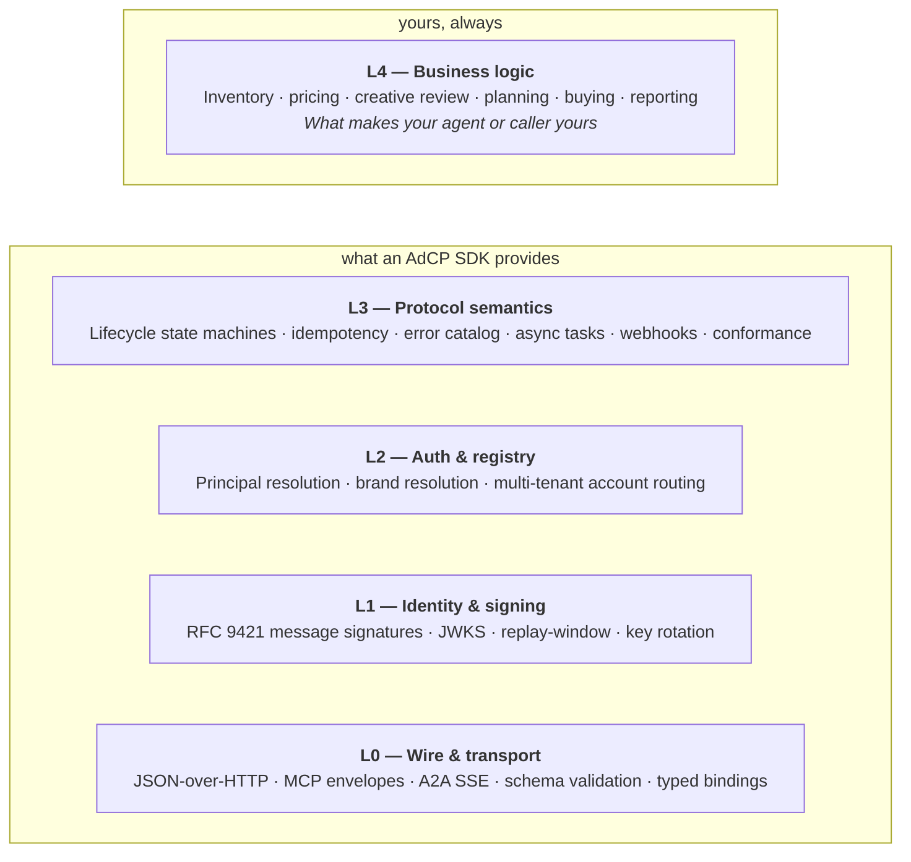

You're about to write AdCP code. The first decision is **where you want to spend your engineering time** — letting an AdCP SDK handle the protocol surface so you focus on what makes your agent or caller yours, or going lower.

This page picks an entry point. The [SDK stack reference](/docs/building/cross-cutting/sdk-stack) is the reasoning.

## The five layers

Every AdCP request crosses five layers between the wire and your business logic. SDKs absorb L0–L3; **L4 is the part you write either way.**

Where you start determines how much of L0–L3 you own. The work is asymmetric across the two sides of an AdCP conversation: an agent **enforces** the protocol (~3–4 person-months at L0–L3); a caller **consumes** it (weeks of handler glue). The [SDK stack reference](/docs/building/cross-cutting/sdk-stack) decomposes each layer and the [server-vs-client comparison](/docs/building/cross-cutting/sdk-stack#server-vs-client-at-each-layer) makes the cost asymmetry concrete.

## Recommended path

For ~95% of adopters: **start at L4 with the full-stack SDK in your language.**

<CardGroup cols={2}>
  <Card title="Build an agent" icon="server" href="/docs/building/by-layer/L4/build-an-agent">
    Server side, with engineering capacity. Point a coding agent at a skill file, get a storyboard-compliant AdCP agent in 2–8 minutes (protocol layer only — see [Operating an agent](/docs/building/operating/operating-an-agent) for the full going-live scope).
  </Card>
  <Card title="Build a caller" icon="phone" href="/docs/building/by-layer/L4/build-a-caller">
    Client side. Install the SDK, write the calls, handle async responses and errors, ingest reporting. Weeks-of-handler-glue scope, not months.
  </Card>
  <Card title="Run a prebuilt agent" icon="cube" href="/docs/building/operating/operating-an-agent">
    Small team or no engineering capacity. Self-host [Prebid SalesAgent](https://github.com/prebid/salesagent), or partner with a managed platform that runs an AdCP agent on your behalf. Configuration over code.
  </Card>
  <Card title="Migrate from hand-rolled" icon="code-merge" href="/docs/building/by-layer/L4/migrate-from-hand-rolled">
    Already running an AdCP agent built before the SDKs were mature? Swap one layer at a time, with conflict modes, per-step rollback, and intermediate states that pass conformance.
  </Card>
  <Card title="Go lower than L4" icon="layer-group" href="/docs/building/cross-cutting/sdk-stack">
    Porting an SDK to a new language, building a special-purpose proxy, or integrating into a stack that already owns L0–L2. Read the SDK stack reference for the per-layer contract.
  </Card>
</CardGroup>

After your first build: run [Validate your agent](/docs/building/verification/validate-your-agent) to confirm conformance against the storyboards, then enroll for the [AAO Verified](/docs/building/verification/aao-verified) trust mark.

## Two checks before you start

**1. What's your team's value-add?**

- **Inventory, pricing, creative review, decisioning** (agent L4) or **planning, buying, reporting** (caller L4) → start at L4.
- **You're an SDK author / language porter, building a proxy, or integrating into a stack that already owns L0–L2** → go lower. Read the [SDK stack reference](/docs/building/cross-cutting/sdk-stack) for what each layer must satisfy.
- **Anything else** → default to L4. See [what you write at each layer](/docs/building/cross-cutting/sdk-stack#where-can-you-start) before going lower.

**2. Do you already have a working agent built before the SDKs were mature?**

If yes: re-evaluate against [today's SDK coverage](/docs/building/cross-cutting/sdk-stack#current-sdk-coverage), not the SDK you remember. The [L3 changelog from 2.5](/docs/building/cross-cutting/version-adaptation#what-changed-at-l3-in-3-0) names the new floor; the [migration guide](/docs/building/by-layer/L4/migrate-from-hand-rolled) walks the swap-one-layer-at-a-time path.

## Cross-cutting concerns

Things every AdCP implementation needs, regardless of starting layer:

- **[Schemas](/docs/building/by-layer/L0/schemas)** — schema bundles, type generation, version pinning, supply-chain verification.
- **[Choose your SDK](/docs/building/by-layer/L4/choose-your-sdk)** — language coverage matrix, install commands, package exports, CLI tools.
- **[Version adaptation](/docs/building/cross-cutting/version-adaptation)** — per-call spec-version pinning, co-existence imports across SDK majors, on-wire `VERSION_UNSUPPORTED` negotiation. Lets you talk to peers on any supported version without forking handler code.
- **[Conformance](/docs/building/verification/conformance)** — the L3 protocol bar every agent must reach. Storyboards probe state transitions, error shapes, and the async-task contract.
- **[AAO Verified](/docs/building/verification/aao-verified)** — the public trust mark. Storyboard pass earns `(Spec)`; observed live traffic earns `(Live)`.
- **[Operating an agent](/docs/building/operating/operating-an-agent)** — runtime concerns once you're past first launch: monitoring, on-call, version drift, multi-tenant scaling.

## Going deeper

- **[Concepts](/docs/building/concepts)** — why AdCP exists, protocol comparison, security model, industry context. Start here if you're new and want context before code.
- **[L0 — Wire & transport](/docs/building/by-layer/L0)** — MCP and A2A integration, schema validation, type generation.
- **[L2 — Auth & registry](/docs/building/by-layer/L2)** — authentication, multi-tenant account state, principal scoping.
- **[L3 — Protocol semantics](/docs/building/by-layer/L3)** — task lifecycle, async operations, webhooks, error handling, conformance test surface.
- **[Talk to Sage](/docs/learning/overview)** — stuck on a concept? Sage is the AdCP teaching agent. She walks the protocol with you in conversation, and runs the certification path when you're ready to make it stick.

## Audience

AdCP implementers in any language — building an agent, building a caller, authoring an SDK, or evaluating one. **Python and TypeScript are the first-class languages** (TypeScript GA on `@adcp/sdk` 6.x; Python GA on `adcp` 3.x with 4.x in beta); **Go** has L0 and partial L1 in active development; community-maintained ports for other languages are welcome — see the [Builders Working Group](/docs/community/working-group).
