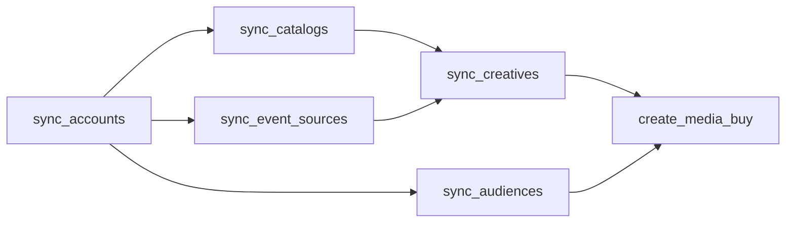

# Account state

AdCP accounts are stateful containers. Before a buyer can run a campaign on a seller's platform, they build up state on the account: product catalogs, creative assets, audience lists, conversion tracking. Each piece of state has its own sync task, its own approval workflow, and its own lifecycle.

This is different from earlier versions of AdCP where accounts were billing references and most operations were stateless. In AdCP 3.0, the account is the central object that ties everything together.

## State domains

An account holds six categories of state, each managed by a dedicated task:

| Domain | Sync task | What it manages | Lifecycle |
|--------|-----------|-----------------|-----------|
| **Identity** | `sync_accounts` | Who the buyer is, which brand, billing terms | Setup once, update rarely |
| **Catalogs** | `sync_catalogs` | Product feeds, inventory, stores, promotions, offerings | Continuous — feeds update hourly/daily |
| **Creatives** | `sync_creatives` | Creative assets with format-specific manifests | Per-campaign, updated as needed |
| **Audiences** | `sync_audiences` | First-party CRM audience lists | Incremental — add/remove members over time |
| **Event sources** | `sync_event_sources` | Conversion tracking configuration (pixels, S2S, app events) | Setup once per source, rarely changes |
| **Campaigns** | `create_media_buy` | Active campaigns with packages and targeting | Created when ready, updated throughout flight |

Each sync task follows the same pattern:
- **Upsert semantics** — items are matched by ID, created if new, updated if existing
- **Discovery mode** — omit the items array to see what's already on the account
- **Async approval** — platforms may review items before activating them
- **Per-item status** — individual items can succeed or fail independently

## Setup sequence

A typical buying workflow builds account state in dependency order. Each step requires the previous steps to be complete:



### 1. Establish the account

`sync_accounts` declares who the buyer is and how they pay. The seller returns an `account_id` and billing terms.

```json
{
  "accounts": [{
    "house": "acmecorp.com",
    "brand_id": "tide",
    "operator": "agency.com",
    "billing": "operator"
  }]
}
```

### 2. Sync catalogs

`sync_catalogs` makes product data available on the account. Formats declare what catalog types they need via `catalog_requirements`, so the buyer syncs the right feeds before submitting creatives.

```json
{
  "account_id": "acct_001",
  "catalogs": [
    {
      "catalog_id": "product-feed",
      "type": "product",
      "url": "https://feeds.acme.com/products.xml",
      "feed_format": "google_merchant_center",
      "update_frequency": "daily"
    },
    {
      "catalog_id": "store-locations",
      "type": "store",
      "url": "https://feeds.acme.com/stores.json",
      "feed_format": "custom",
      "update_frequency": "weekly"
    }
  ]
}
```

The platform fetches and validates each feed. Items may be approved, rejected, or flagged — similar to Google Merchant Center reviewing product listings.

### 3. Configure event sources

`sync_event_sources` sets up conversion tracking so the platform can attribute outcomes to ad exposure.

```json
{
  "account_id": "acct_001",
  "event_sources": [{
    "event_source_id": "web-pixel",
    "name": "Website Conversions",
    "type": "pixel",
    "events": ["purchase", "add_to_cart", "lead"]
  }]
}
```

### 4. Sync creatives

`sync_creatives` submits creative assets that reference the catalogs synced in step 2. For catalog-driven formats, the creative's `catalogs` field references synced catalogs by `catalog_id` instead of embedding items inline.

```json
{
  "account_id": "acct_001",
  "creatives": [{
    "creative_id": "product-carousel",
    "format_id": {
      "agent_url": "https://creative.retailer.com/adcp",
      "id": "product_carousel_with_inventory"
    },
    "catalogs": [{
      "catalog_id": "product-feed",
      "type": "product",
      "tags": ["summer"]
    }],
    "assets": {
      "banner_image": {
        "url": "https://cdn.acmecorp.com/carousel-hero.jpg",
        "width": 1200,
        "height": 628
      }
    }
  }]
}
```

### 5. Upload audiences

`sync_audiences` uploads first-party audience lists for targeting. Members are hashed before sending.

```json
{
  "account_id": "acct_001",
  "audiences": [{
    "audience_id": "high-value-customers",
    "name": "High Value Customers",
    "add": [
      { "hashed_email": "a1b2c3..." },
      { "hashed_email": "d4e5f6..." }
    ]
  }]
}
```

### 6. Create the campaign

With all state in place, `create_media_buy` activates a campaign that references the synced state:

```json
{
  "account_id": "acct_001",
  "name": "Summer Product Launch",
  "packages": [{
    "product_id": "sponsored-products",
    "creative_ids": ["product-carousel"],
    "targeting_overlay": {
      "audiences": { "include": ["high-value-customers"] }
    }
  }]
}
```

## Discovery

Every sync task supports **discovery mode**: call the task without an items array to see what state already exists on the account. This is how a buying agent learns what a seller already knows about the brand.

```json
// What catalogs does this account have?
{ "account_id": "acct_001" }

// Response: catalogs already on the account
{
  "catalogs": [
    { "catalog_id": "product-feed", "action": "unchanged", "item_count": 1250 },
    { "catalog_id": "store-locations", "action": "unchanged", "item_count": 45 }
  ]
}
```

This matters because sellers may already have brand data from other sources — a retailer might have the brand's product catalog from their commerce platform, or a publisher might have creatives from a previous campaign. Discovery lets the buyer build on existing state rather than re-uploading everything.

## Approval workflows

Sync tasks are often asynchronous. The platform may need to review items before they're active:

- **Catalogs**: Product listings go through content policy checks. Items can be approved, rejected, or flagged with warnings.
- **Creatives**: Generative creatives require human approval. Traditional creatives may need policy review.
- **Audiences**: Platforms need time to match hashed identifiers against their user base.
- **Event sources**: Conversion tracking may require pixel verification.

All sync tasks support `push_notification_config` for webhook callbacks when processing completes. For long-running operations, the platform returns async status updates (working, input-required, submitted) that the buyer polls or receives via webhook.

## State dependencies

Some state depends on other state. The platform enforces these dependencies:

- **Creatives reference catalogs** — a creative that uses `catalog_id: "product-feed"` requires that catalog to be synced first
- **Campaigns reference creatives and audiences** — `create_media_buy` requires the referenced `creative_ids` and audience IDs to exist on the account
- **Event sources enable optimization** — optimization goals on packages reference event sources for attribution

If a dependency is missing, the platform returns an error explaining what needs to be synced first.

## Stateless vs stateful operations

Not everything requires account state. Some tasks are stateless queries:

| Stateless (no account needed) | Stateful (account required) |
|---|---|
| `get_products` — discover inventory | `create_media_buy` — buy inventory |
| `list_creative_formats` — discover formats | `sync_creatives` — upload creatives |
| `get_signals` — discover signals | `activate_signal` — activate signals |
| `get_adcp_capabilities` — discover features | `sync_catalogs` — upload catalogs |

The pattern: **discovery is stateless, execution is stateful**. You can browse a seller's inventory without an account. You need an account to buy. Some discovery tasks accept an optional `account_id` to return per-account pricing or personalized results — but an account is never required for discovery.

## Vendor settlement

Vendor protocols — signals, governance, creative — use two shared tasks for post-campaign settlement. These tasks run between an orchestrator and a vendor agent (not a buying platform), using the `account_id` from the vendor relationship established via `sync_accounts` or `activate_signal`.

### report_usage

**Schema**: [`account/report-usage-request.json`](https://adcontextprotocol.org/schemas/v2/account/report-usage-request.json) / [`account/report-usage-response.json`](https://adcontextprotocol.org/schemas/v2/account/report-usage-response.json)

Orchestrators call `report_usage` to inform a vendor agent how their service was used after delivery. Multiple campaigns can be batched in a single request by varying `buyer_campaign_ref` across records. The vendor agent uses this data to track earned revenue and verify billing.

| Field | Type | Required | Description |
|-------|------|----------|-------------|
| `account_id` | string | Yes | The caller's account with this vendor agent |
| `operator_id` | string | Yes | The operator (agency or buyer) on whose behalf usage is reported. Characterizes billing responsibility. |
| `reporting_period` | object | Yes | `start` and `end` as ISO 8601 date-time in UTC |
| `usage` | UsageRecord[] | Yes | One record per service unit consumed (see below) |

Each usage record requires `kind`, `vendor_cost`, and `currency`. Signal records additionally require `signal_agent_segment_id`, `pricing_option_id`, and `impressions`; include `media_spend` for percent-of-media cost verification. Include `buyer_campaign_ref` per record to associate it with a specific campaign.

```json
{
  "account_id": "acct_pinnacle_signals",
  "operator_id": "pinnacle-media.com",
  "reporting_period": {
    "start": "2025-03-01T00:00:00Z",
    "end": "2025-03-31T23:59:59Z"
  },
  "usage": [
    {
      "buyer_campaign_ref": "mb_spring_launch_001",
      "kind": "signal",
      "signal_agent_segment_id": "luxury_auto_intenders",
      "pricing_option_id": "po_lux_auto_cpm",
      "impressions": 4200000,
      "media_spend": 21000.00,
      "vendor_cost": 2100.00,
      "currency": "USD"
    }
  ]
}
```

The response confirms how many records were accepted. Partial acceptance is valid — accepted records are stored even if some records fail validation.

```json
{ "accepted": 1 }
```

## Related documentation

- **[Accounts and agents](/docs/building/integration/accounts-and-agents)** — Account identity, billing models, and `sync_accounts` details
- **[Async operations](/docs/building/implementation/async-operations)** — How async approval workflows work
- **[Webhooks](/docs/building/implementation/webhooks)** — Receiving notifications when async operations complete
- **[Catalogs](/docs/creative/catalogs)** — Typed data feeds that provide the items publishers render in ads
