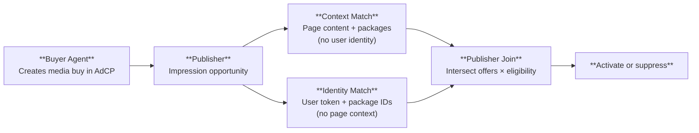

<Note>
New to AdCP? [AdCP vs RTB — One-Minute Explainer](/docs/adcp-vs-rtb) is written for readers coming from real-time bidding. This page is the technical deep dive for implementers.
</Note>

AdCP and OpenRTB are complementary standards that operate at different layers of the advertising stack. They are not competing — a platform can (and often will) implement both.

One of the most important connection points is **cross-publisher frequency capping**. AdCP enables it the same way OpenRTB enables programmatic buying: by exposing each impression to a buyer-controlled real-time decision layer before the ad server serves. In AdCP, that integration point is the **[Trusted Match Protocol (TMP)](/docs/trusted-match)**.

## What each standard does

| | OpenRTB | AdCP |
|---|---------|------|
| **Layer** | Impression-level transactions | Agent-level workflows |
| **Core operation** | Real-time bid request/response | Task-based campaign management |
| **Participants** | DSPs and SSPs | AI agents and advertising platforms |
| **Timing** | Real-time (milliseconds) | Asynchronous (seconds to days) |
| **Scope** | Single impression auction | End-to-end campaign lifecycle |
| **Maintained by** | IAB Tech Lab | AgenticAdvertising.org |
| **Maturity** | Production (v2.6) | Production (v3.0) |
| **Transport** | HTTP POST | MCP (tool calling) or A2A (agent-to-agent) |

## Where they overlap

Both standards touch media buying, but at different granularities:

- **OpenRTB** handles individual impression decisions: "Should I bid on this impression, and how much?"
- **AdCP** handles campaign-level decisions: "What inventory is available? Execute this campaign with this budget and targeting."

A single AdCP `create_media_buy` task might result in thousands of OpenRTB bid requests over the campaign's lifetime.

## Where they're different

**Scope.** OpenRTB is focused on the auction — bid requests, bid responses, win notifications, and billing events. AdCP covers the full campaign lifecycle: product discovery, creative management, audience activation, campaign execution, and delivery reporting.

**Communication model.** OpenRTB uses synchronous HTTP: a bid request arrives, and the bidder must respond within a few hundred milliseconds. AdCP is asynchronous: an agent submits a `create_media_buy` task, and the platform processes it on its own timeline, returning status updates.

**Participants.** OpenRTB connects demand-side platforms (DSPs) to supply-side platforms (SSPs) in automated auctions. AdCP connects AI agents to any advertising platform — including but not limited to DSPs and SSPs.

**Data model.** OpenRTB defines impression objects, bid objects, and deal objects. AdCP defines media products, media buys, creative formats, audience signals, and brand governance rules.

## How they work together

A typical integration uses both standards at different layers:

1. A **buyer agent** uses AdCP to discover available products on a publisher's platform (`get_products`)
2. The agent creates a campaign via AdCP (`create_media_buy`) with budget, targeting, and scheduling
3. At impression time, the publisher sends a **TMP Context Match** (page content, available packages) and an **Identity Match** (opaque user token, package IDs) to the TMP Router
4. TMP evaluates cross-publisher exposure and returns offers and eligibility decisions — the publisher joins them locally
5. The buyer agent checks delivery via AdCP (`get_media_buy_delivery`) to monitor overall campaign performance

In this model, AdCP handles the strategic layer (what to buy, how much to spend, who to target), TMP handles the real-time execution layer (which packages activate on which impressions), and OpenRTB handles the tactical auction layer where applicable (which specific impressions to win).

## TMP: The Real-Time Bridge

The [Trusted Match Protocol (TMP)](/docs/trusted-match) is how AdCP reaches impression-time decisioning. It gives the buyer a real-time look at each impression opportunity so cross-publisher data can affect the serve decision, without turning AdCP itself into an auction protocol.

TMP defines two structurally separated operations:

For cross-publisher frequency capping, this means:

1. AdCP defines the campaign, budget, and packages
2. At impression time, the publisher sends a Context Match request (which packages match this content?) and an Identity Match request (is this user eligible for these packages?)
3. The buyer's Identity Match agent checks exposure history across all publishers connected to the TMP Router — frequency caps, audience membership, and purchase history are evaluated here
4. The publisher joins the two responses locally: packages that matched the context *and* passed identity eligibility activate; everything else is suppressed

The buyer never sees both context and identity simultaneously. Cross-publisher frequency capping is enforced through the Identity Match path, where the buyer maintains a shared exposure store across publishers.

## Other standards in the ecosystem

AdCP and OpenRTB exist alongside several other standards:

| Standard | Purpose | Maintained by |
|----------|---------|---------------|
| **MCP** (Model Context Protocol) | AI tool calling — how an AI model calls external tools | Anthropic |
| **A2A** (Agent-to-Agent Protocol) | Multi-agent collaboration — how autonomous agents communicate | Google |
| **VAST** / **VPAID** | Video ad serving and interactive video | IAB Tech Lab |
| **ads.txt** / **sellers.json** | Supply chain transparency and authorized seller verification | IAB Tech Lab |
| **Open Measurement SDK** | Viewability and attention measurement | IAB Tech Lab |

AdCP uses MCP and A2A as transport layers. It references IAB content taxonomies and audience segment standards where applicable.

## Frequently asked questions

<AccordionGroup>

<Accordion title="Does AdCP replace OpenRTB?">
No. They serve different purposes. OpenRTB handles real-time impression auctions. AdCP handles campaign-level agent workflows. A platform can implement both.
</Accordion>

<Accordion title="Do I need to implement OpenRTB to use AdCP?">
No. AdCP works independently. A platform that doesn't use real-time bidding (for example, a direct-sold publisher or a commerce media network) can implement AdCP without any OpenRTB integration.
</Accordion>

<Accordion title="Can an AdCP agent trigger OpenRTB transactions?">
Yes. When a buyer agent creates a media buy via AdCP, the sell-side platform can use any internal mechanism to fulfill the order — including OpenRTB auctions, direct insertion orders, private marketplace deals, or TMP-mediated real-time activation for things like cross-publisher frequency caps.
</Accordion>

<Accordion title="Is AgenticAdvertising.org part of IAB Tech Lab?">
No. AgenticAdvertising.org is an independent member organization. It is not a subsidiary, working group, or affiliate of IAB Tech Lab. However, AdCP is designed to be compatible with IAB standards.
</Accordion>

</AccordionGroup>
