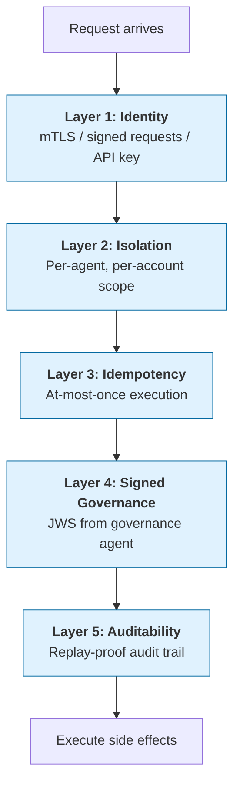

For CISOs, security architects, and third-party risk reviewers evaluating an AdCP deployment — on either side of the transaction (brands, agencies, publishers, platforms, data providers). The [implementation reference](/docs/building/implementation/security) has the normative rules; this page explains the model behind them.

## Why security is foundational, not an add-on

In traditional advertising, a human reviews an insertion order before money moves. In agentic advertising, the agent is the human. It evaluates briefs, negotiates terms, places buys, handles reporting, and decides whether to retry a failed transaction — often without a person in the loop until something already happened.

That shift concentrates risk in three ways:

- **Authority is portable.** A credential that can spend $10M/year fits in a token. A stolen token with the right scope can create real media buys against real budget, and the buy will look legitimate to every downstream system because it *is* legitimate — from the protocol's point of view.
- **Decisions are fast.** An agent can run a full plan-to-purchase loop in seconds. A compromised loop can burn through a day's budget in minutes. There is no ad ops team watching line items populate.
- **The attacker uses the same tools you do.** AI can red-team an API as fast as it can use one. If your agent has a documented surface (and it should — that's how other agents discover it), an adversary's agent can enumerate it, probe it, and fuzz it at machine speed. Security-by-obscurity is not a control.

These are the conditions AdCP was built to withstand. The rest of this page is how.

A breach surface in agentic ad tech is not "data exposure." It is **unauthorized financial commitments**, **bypassed governance**, **cross-tenant data leakage between advertisers on the same platform**, and **tampering with audit trails that regulators will later ask to see**. Each of those has a named threat model in the implementation reference. This page steps back and explains why.

## What changes in the threat model

**Everything from traditional API security still applies** — authentication, authorization, rate limiting, input validation, transport security, data-at-rest encryption, endpoint hardening, logging. An agent is an HTTP service on the public internet; every control you would apply to a REST API you still apply here. AdCP does not replace that baseline, and this page does not re-teach it.

What agentic advertising *adds* is a second layer of concerns, on top of the traditional ones:

| Traditional API security already covers... | Agentic advertising additionally requires... |
|---|---|
| Authenticating the human user | Authenticating the [agent](/docs/reference/glossary#a) *on behalf of* a brand or agency, and proving that brand authorized this specific spend |
| Preventing data exfiltration | Preventing *unauthorized state changes* — agents retry, loop, and fan out; a single successful injection can execute many times |
| Rate limiting abusive callers | Preventing **replay attacks**: an agent retrying a $1M media buy on a network timeout must never create two |
| Input validation | **Counterparty URL validation**: agents fetch from URLs other agents supply (webhooks, registries, JWKS, reporting buckets) — each is an [SSRF](/docs/reference/glossary#s) vector into your internal network |
| Audit logging | **Cryptographically signed governance attestation** that survives the transaction and is verifiable by a regulator years later, without trusting either party |
| Single-tenant isolation | **Multi-agent, multi-account isolation on shared infrastructure** — one compromised agent must not see another agent's buys, creatives, or targeting |

None of this is novel cryptography. What's new is the combination — well-understood primitives operating autonomously, at machine speed, across party boundaries — with the controls on the left now backstopping decisions humans used to make.

### Threats specific to agentic advertising

Three attack classes don't appear in a traditional API threat model but belong in this one:

- **Credential reuse across accounts under one agent.** An agency agent typically holds credentials that work across every brand in its authorized-account set. A stolen agent token is therefore a multi-brand breach, not a single-brand one. AdCP's per-`(agent, account)` cache scoping (see [Agent and Account Isolation](/docs/building/implementation/security#agent-and-account-isolation)) and signed governance tokens (bound to a specific plan and seller) limit *what* can be done with a stolen credential, but don't prevent the theft. Credential hygiene in agentic systems is proportionally more critical than in single-tenant APIs.
- **Shared-governance-agent supply chain.** A governance agent often signs for many brands from a single origin. Its compromise is a multi-tenant breach. The JWKS / revocation-list requirements in the [governance profile](/docs/building/implementation/security#signed-governance-context) limit the blast radius and make rotation observable, but the buyer's due-diligence posture toward its governance agent is a real-world security dependency — treat the governance agent as a processor with multi-customer blast radius and assess it accordingly.
- **Cross-principal key reuse on multi-tenant operators.** Any operator hosting agents on behalf of more than one principal — a governance agent serving multiple brands, a buyer agent serving multiple advertisers, a sales agent serving multiple publishers — MUST scope signing keys per principal rather than reuse one key across the fleet. Concretely, each `keyid` MUST bind to a single principal so that a single compromised key reduces to a single-principal breach and revocation is granular. A convention such as `{operator}:{principal}:{key_version}` is a useful operator-side bookkeeping aid, but the `kid` value itself is opaque to verifiers per RFC 7517 — verifiers MUST NOT parse `kid` structure to derive principal identity or make authorization decisions, and MUST resolve the owning principal via the authenticated signature → JWKS → agent entry chain, using the `kid` only as an index into the JWKS. Operators that invent a structured convention thus create an internal bookkeeping tool, not an on-wire authorization input. Operators SHOULD advertise the isolation property in their capability surface as `identity.per_principal_key_isolation: true` so counterparties can verify the property without reading out the JWKS by hand.
- **Prompt injection exfiltrating agent-side credentials.** Planners, creative-review agents, brief-interpretation pipelines all process untrusted text (briefs, creative metadata, product descriptions, campaign names) while holding credentials. A successful injection can cause the agent to issue unauthorized tool calls or leak tokens into logs, external URLs, or downstream agent messages. AdCP cannot prevent this at the protocol layer, but every operator running an LLM-powered agent needs input sandboxing, egress controls on tool calls (which URLs / which tools can the agent reach from within a given prompt context), and monitoring for anomalous credential use. This is the most likely near-term breach vector in the space and is not solved by protocol compliance alone.
- **Cross-principal tool-call confusion.** A buyer agent typically holds active credentials for *multiple* principals at once — several sellers (one set of credentials per seller) and several brand accounts (inside a single agency agent's authority set). LLM-driven agents often expose every one of those tool surfaces to the same planning loop. A prompt injected via text returned from seller X (a product description, a campaign name, a rejection reason) can cause the agent to call a tool on seller Y's endpoint, or to call `create_media_buy` for brand A using a budget authorized for brand B. This is the classical [confused deputy](https://en.wikipedia.org/wiki/Confused_deputy_problem) problem at LLM-tool-call granularity. The protocol-layer defense is in Layer 2 (account scoping on every tool call, refusing any cross-account action the caller does not hold authority for); the operator-layer defense is to tag each inbound string with its principal of origin, refuse tool calls whose target principal differs from the principal that supplied the string unless a human approves, and forbid a single LLM context from holding credentials for principals whose interests can conflict. This threat is distinct from ordinary prompt injection: the attacker does not need to escape the sandbox to use the *victim principal's* credentials — the victim's own agent does it for them.

### Structural privacy separation

AdCP is designed so that parties learn only what they need to act. This is enforced by protocol structure, not just policy. Examples:

- **[Trusted Match Protocol](/docs/trusted-match)** splits impression-time decisions into two independent calls: *Context Match* carries content signals (topic, sentiment, embeddings) with no user identity; *Identity Match* carries an opaque user token with no page context. Neither call alone reveals which user visited which page — the decomposition is the privacy property.
- **Signals Protocol** returns `activation_key` values to authenticated callers with deployment access only, and structurally separates marketplace catalog access (public) from private-signal disclosure (account-scoped).
- **Governance tokens** use `policy_decision_hash` instead of inline `policy_decisions` when the buyer's compliance posture is sensitive — the full decision log remains available to auditors via the signed `audit_log_pointer`, under the governance agent's access control.
- **Audience members** in `sync_audiences` use `hashed_email` and `hashed_phone` fields whose schemas require SHA-256 hashing on the buyer side and structurally reject cleartext. Note that an unsalted SHA-256 of an email or phone is pseudonymous PII, not anonymous — it is recoverable via precomputed dictionaries, so operators MUST treat hashed identifiers as PII for retention and consent. See [Privacy Considerations](/docs/reference/privacy-considerations#unsalted-hashed-identifiers-are-pseudonymous-not-anonymous).

"Structural" here means an attacker who compromises one leg of a split workflow gains no information that was designed to live only in the other leg. It's a weaker guarantee than cryptographic confidentiality but a stronger one than policy alone.

## AdCP's layered defense model

AdCP defends against these threats with five layers. Each one is a separate control; a failure in one does not collapse the others. This is the same defense-in-depth pattern used in payment systems — the five layers below describe *what* every compliant implementation must get right. *How* you build them is yours.

### Layer 1: Identity — who is actually calling?

Before any other check, the seller must establish *which authenticated agent* is making the request. AdCP defines three mechanisms; the version-gating determines which are permitted for which operation class:

- **RFC 9421 signed HTTP requests** — the buyer signs each request with a key declared in its public agent registry. *Recommended in 3.0 for all authenticated operations; REQUIRED for mutating / financial operations in 3.1+.*
- **mTLS** — the buyer presents a client certificate resolving to a registered domain. *Permitted for any operation in 3.0 and 3.1+.*
- **Bearer tokens** (pre-provisioned API key or JWT) — issued by the seller at onboarding, mapped to the buyer. *Permitted in 3.0 as the effective baseline; **PROHIBITED for mutating / financial operations in 3.1+**, read-only thereafter.*

The normative matrix and verifier rules live in [Authentication](/docs/building/integration/authentication#authentication-method); the 3.0 → 3.1 sunset for bearer on mutating operations is logged under [known limitations](/docs/reference/known-limitations#authentication-and-identity).

**What this defends against.** An attacker cannot claim to be Acme by setting an `iss` field or a `caller` header. Identity is bound to something the attacker cannot forge (a private key, a certificate, or a pre-shared secret). Every subsequent layer uses the authenticated agent as its scope — get this wrong and the rest of the stack is decorative.

### Layer 2: Isolation — one agent cannot see another

Every piece of state — media buys, creatives, idempotency cache entries, session IDs, governance tokens — is scoped to the agent that created it and the [account](/docs/reference/glossary#a) that authorized the work. Queries that forget the scope leak data across tenants; AdCP requires sellers to scope every read by the authenticated agent and its authorized accounts, and to return a generic "not found" rather than leak existence across the boundary.

Implementations typically enforce this at the database layer (Postgres row-level security is the canonical pattern) so a bug in one handler cannot punch through the wall.

Within the tenant boundary, not every caller gets the same grant. A seller may issue one agent a full media-buy scope and another agent a narrow read + webhook-attach scope (e.g., the [`attestation_verifier`](/docs/accounts/overview#standard-named-scope-attestation_verifier) scope for AAO Verified compliance engines). Callers discover their own grant via the `authorization` object attached to per-account entries in [`sync_accounts`](/docs/accounts/tasks/sync_accounts) and [`list_accounts`](/docs/accounts/tasks/list_accounts) responses; sellers enforce locally and reject out-of-scope requests with `SCOPE_INSUFFICIENT`, `READ_ONLY_SCOPE`, or `FIELD_NOT_PERMITTED`.

**What this defends against.** Competitive intelligence leaks. An attacker authenticated as Agent A cannot probe Agent B's media buys, creatives, or idempotency keys — not by ID guessing, not by timing side-channels, not by error-message differencing. A legitimately-authenticated agent with a narrow scope cannot escalate into tasks or fields it was not granted.

### Layer 3: Idempotency — at-most-once execution

Every mutating AdCP request carries a required [`idempotency_key`](/docs/reference/glossary#i). The seller stores the first successful response under that key, scoped to the authenticated agent, with a declared replay TTL (minimum 1h, recommended 24h, maximum 7d). A retry with the same key and the same payload returns the cached response and marks it `replayed: true`. A retry with a *different* payload under the same key is rejected with `IDEMPOTENCY_CONFLICT`.

This is the control that makes retries safe. Without it, a network timeout on `create_media_buy` forces the buyer to choose between double-booking (retry) and abandoning a legitimate buy (don't retry). With it, the same bytes always produce the same outcome — exactly once.

**What this defends against.** Double-booking from retries. Replay attacks from a stolen-then-reused request. Duplicate webhooks from agent side effects ("Campaign created!" notifications, downstream tool calls, LLM memory writes). `replayed: true` lets every downstream system know whether a response represents a new event or a cached one.

The full normative rules, including payload canonicalization and the oracle-resistance properties of the error taxonomy, are in [Request Safety](/docs/building/implementation/security#idempotency).

### Layer 4: Signed governance — cryptographic proof of approval

When a plan is approved for spend, the governance agent issues a signed JWS token — not a shared secret, not an opaque cookie, but a public-key-verifiable attestation bound to:

- **`sub`** — the specific plan being authorized
- **`aud`** — the specific seller allowed to act on it
- **`phase`** — whether this is intent, purchase, modification, or delivery
- **`exp`** — when the authorization expires (15 min for intent, ≤30 days for execution)
- **`jti`** — a unique token ID used for replay dedup

The seller fetches the governance agent's public keys via JWKS, verifies the signature, runs the 15-step verification checklist, and only then treats the request as approved. Auditors and regulators can verify the same token years later using the same public keys — neither buyer nor seller can retroactively forge an approval.

**What this defends against.** Unauthorized spend. A compromised buyer credential alone cannot create a media buy — the attacker also needs a valid, unrevoked governance token signed by the buyer's governance agent, bound to this specific seller, for this specific plan, for this specific operation, within its validity window (±60s clock-skew tolerance on `iat`/`nbf`/`exp`; see the [implementation reference](/docs/building/implementation/security#signed-governance-context) for exact bounds), whose `jti` has not been seen before.

### Layer 5: Auditability — the trail survives the transaction

Every protocol event produces structured, correlated records: the signed governance token, the `idempotency_key` and its `replayed` flag, the request ID chain, and — for governance-controlled events — a revocable audit log pointer. These are *queryable by auditors* via `get_plan_audit_logs`, not private to either buyer or seller.

Key properties:

- **Revocation.** Governance agents publish a signed revocation list at a well-known path. Compromised keys and rescinded plans can be invalidated without trusting the CDN serving the list.
- **Retention.** Revoked public keys remain discoverable for 7+ years so historical tokens remain verifiable after rotation.
- **Approval provenance.** Because the governance attestation is signed and public-key-verifiable, any party holding the artifact can verify it was approved by the holder of the signing key at the stated time. This approaches non-repudiation — but only conditionally. The buyer cannot later claim the plan was *never approved* so long as (a) the signing key was not compromised at time-of-signing (revocation lists bound this — a post-hoc claim of "the key was already stolen when I signed" is falsifiable against the revocation timeline) and (b) the signer retains ordinary custody of its signing key. The seller side is *weaker*: an attestation proves the plan existed, not that it was delivered or acknowledged. For full bilateral non-repudiation, the seller should return a signed `plan_receipt` binding `{plan_id, received_at, plan_sha256}`. Absent a signed receipt, "never received" remains deniable.

**What this defends against.** After-the-fact tampering. Claim drift between parties in a dispute. Regulatory inquiries that arrive long after the credentials have rotated.

## What gets signed — and what doesn't

Three application-layer signing surfaces exist in 3.x:

- **Inbound request signing.** Buyers (and sellers acting as buyer-side clients) sign their outbound tool calls with [RFC 9421](/docs/building/implementation/security#request-signing). Key purpose `adcp_use: "request-signing"`.
- **Outbound webhook signing.** Sellers sign asynchronous [webhook deliveries](/docs/building/implementation/security#webhook-callbacks) — task completion, status changes, downstream events. RFC 9421. Key purpose `adcp_use: "webhook-signing"`.
- **Governance attestation signing.** Governance agents sign the JWS tokens that authorize spend (Layer 4 above). Distinct profile from RFC 9421, with its own key purpose, JWKS, and revocation list.

What is **not** signed at the application layer is the **synchronous RPC response body** returned by `tools/call` (or the A2A artifact). Integrity of the immediate reply rests on TLS for the duration of the connection. Long-lived integrity for results that need to survive past that connection — the actual outcome of a media buy, report data, the audit trail — flows through signed webhooks and the signed governance audit chain, both of which are verifiable independently of the original transport.

This is a deliberate scoping decision in 3.x. Adding response-body signing would require a fourth `adcp_use` purpose, a paired verifier specialism, and a paired conformance grader, while most of the integrity benefit is already captured downstream. If a buyer needs body integrity on a result that has no webhook follow-up, the right shape is to lift that result onto a signed webhook rather than to sign the synchronous reply. The decision is logged for revisiting in 4.0 if the threat model evolves; tracked in [#3737](https://github.com/adcontextprotocol/adcp/issues/3737).

## What to verify before going live

If you are approving an AdCP deployment — as a brand CISO, a security architect at a publisher, or the IT lead at an agency — these are the questions to ask your team (or your vendor). Each maps to one of the layers above.

### Identity

- [ ] How is the calling agent authenticated? (RFC 9421 signed requests, mTLS, or Bearer/API key — not a header field, not `iss`. For mutating / financial operations, plan the migration off Bearer before the 3.1 sunset — see [Authentication](/docs/building/integration/authentication#authentication-method).)
- [ ] Where are tokens stored? (KMS / secret manager — not files, not env vars at rest)
- [ ] Is the rotation cadence right-sized to blast radius and documented? (≤24h is a reasonable default for write-capable tokens; tighter windows are appropriate for tokens that commit spend at scale or cross organizational boundaries.)
- [ ] What is the revocation path, and who can execute it in under an hour?

### Isolation

- [ ] Is agent/account isolation enforced at the database layer (row-level security), not just in application code?
- [ ] Do error messages leak existence across agents or accounts? ("Not found" for both "doesn't exist" and "exists but not yours")
- [ ] Are idempotency keys, session IDs, and governance tokens scoped per authenticated agent, never shared across the tenant boundary?

### Idempotency

- [ ] Is `capabilities.idempotency.replay_ttl_seconds` declared, and does the declared value match the implementation's actual cache retention?
- [ ] Does the implementation reject missing or malformed keys with `INVALID_REQUEST` before touching business logic?
- [ ] Is the idempotency cache shared across instances (so a restart doesn't allow a silent double-execution)?
- [ ] Are successful responses cached? (Errors must not be cached, or the system locks buyers out for their TTL.)

### SSRF discipline

- [ ] Does every outbound fetch to a counterparty URL (webhooks, JWKS, adagents.json, reporting buckets) run the full 6-point check: HTTPS-only, reserved-IP deny list, IP pinning, no redirects, size and timeout caps, suppressed error detail?
- [ ] Is the reserved-IP deny list enumerated from an authoritative source (IANA, cloud-provider documentation) and reviewed each time you add a new cloud provider or region? See the [implementation reference](/docs/building/implementation/security#webhook-url-validation-ssrf) for the current enumeration.

### Governance verification

- [ ] If this agent accepts `governance_context`, does it run all 15 verification steps or reject?
- [ ] Is the revocation list polled on the declared cadence with a documented fetch-failure safe default?
- [ ] Are JWKS caches bounded above by the revocation polling interval?

### Auditability

- [ ] Is the full governance token persisted verbatim (including the envelope it arrived in) for the retention period?
- [ ] Can an auditor query by `jti`, `plan_id`, or authenticated agent identifier and reconstruct the full chain of custody?
- [ ] Are logs append-only and tamper-evident (e.g., object storage with legal hold, not a mutable table)?

### Operational readiness

- [ ] Is there a runbook for: compromised credential revocation, webhook secret rotation, governance key rotation, incident communication to counterparties?
- [ ] Is there monitoring for: `IDEMPOTENCY_CONFLICT` rate spikes (probing attacks), failed governance verifications (spoofing attempts), SSRF rejections from a single counterparty, unusual cross-agent or cross-account access patterns, 401/403 spikes from a single peer?
- [ ] Has the team tabletopped at least one of: credential theft, governance key compromise, cross-tenant data leak, prompt-injection-driven credential exfiltration?
- [ ] Is there a documented DR/RPO target for the idempotency cache specifically (not just the application database)? The cache is correctness-critical, not just performance-critical.
- [ ] What is the penetration-test cadence, and does the scope include the MCP and A2A surfaces (not only REST)?

### Data handling and subprocessors

- [ ] Is there a documented subprocessor list for the agent's data flow, and does it include the LLM providers the agent uses?
- [ ] Is the DPA with each LLM provider explicit about whether prompts, brand assets, first-party signals, or creative metadata may be retained or used for model training?
- [ ] Is data residency configurable to meet EU / UK / other regional requirements, and is the configuration visible in the agent's capabilities or contract?
- [ ] Is log retention aligned with both forensics needs (90 days minimum for security logs) and privacy obligations (limits on PII retention)? The two can conflict; the runbook should name the decision.
- [ ] If the agent is an LLM-powered planner, is there a sandbox model for tool calls arising from prompts authored from untrusted text (briefs, user chat, creative metadata)? What egress controls limit which URLs / which tools the agent can reach from within a given prompt context?

<Note>
**On using this checklist.** Internal use or under NDA is fine. Publishing a fully-answered copy externally — especially one with specific "no" answers — gives adversaries a map of which controls a vendor hasn't invested in. Treat a completed checklist as reconnaissance-sensitive.
</Note>

## Where humans stay in the loop

Security in agentic advertising is not an argument for removing humans — it's an argument for placing them where they have the most leverage and the least latency cost. AdCP's [Embedded Human Judgment](/docs/governance/embedded-human-judgment) principles specify five load-bearing places:

1. **Intent setting** — humans define campaign goals, audiences, and budget envelopes before any agent acts.
2. **Boundary setting** — humans define the policies, constraints, and thresholds the agent must operate within. Plan-level `audience_constraints` and governance policies are machine-enforceable expressions of human judgment.
3. **Exception handling** — when governance returns `conditions` or `denied`, or when a `TERMS_REJECTED` lands, the decision escalates to a human by design.
4. **Override authority** — humans can pause, cancel, or modify an active buy at any time. The protocol's lifecycle tasks (`pause`, `resume`, `cancel`, `update_media_buy`) are explicit about which states accept which interventions.
5. **Audit and accountability** — every spend commitment produces a signed, replay-proof trail a human can inspect after the fact.

A useful reading: the security controls on this page defend the *boundary* the humans set. They do not replace the humans.

## What AdCP does not do in 3.0

Knowing what a protocol doesn't do is part of evaluating it. The canonical, maintained list lives at [**Known Limitations**](/docs/reference/known-limitations) and spans security, privacy, commerce, authentication, governance, and conformance. The security-relevant items it covers include: no end-user authentication, no protocol-level breach-notification SLA or CVD policy, no protocol-level PII transport, no LLM prompt-injection guarantee, no data-residency mechanism at the protocol layer, no OAuth 2.1 normative requirement, no synchronous RPC response-body signing (see [What gets signed](#what-gets-signed--and-what-doesnt) above), no cross-currency buy support, no protocol-level delivery-dispute flow, and no in-protocol payment or settlement.

None of these are hidden. Each is a visible edge of the specification and a candidate for future work.

## Trust anchors and the key-discovery gap

The identity, governance, and pointer-file layers above all rest on the same hidden assumption: that the public keys verifying signatures can be discovered honestly. In 3.0, that discovery path is counterparty-rooted in every case:

- **RFC 9421 buyer keys** — JWKS fetched from the buyer agent's own domain or `.well-known` path.
- **Governance JWS keys** — JWKS fetched from the governance agent's own domain.
- **Agent signing keys** — publisher-attested in `brand.json` `agents[].signing_keys[]`, fetched from the publisher's own `/.well-known`.
- **`adagents.json` authoritative pointers** — fetched from the publisher's own `/.well-known`, with the pointer-swap threat documented in [managed-networks security](/docs/governance/property/managed-networks#security-considerations).

Every one of those steps trusts the counterparty's own infrastructure as the root of trust. TLS does not close this — the certificate is issued to the hostname the attacker has compromised, so it verifies clean. An attacker who controls a counterparty's CDN, DNS, or `/.well-known` path can therefore serve attacker-controlled keys, and every signature made with those keys will verify against them.

What 3.0 actually delivers is **trust-on-first-use with continuity**: verifiers cache the first-seen keys, pin rotations against the prior key set, and alert on unexpected changes. This raises the bar — an attacker must either control the counterparty origin for long enough to look routine, or swap keys at onboarding before the victim has cached anything — but it does not close the gap. It is an honest description of the 3.x posture, not a claimed cryptographic root of trust.

### What raises the bar in 3.x

Implementers SHOULD layer independent attestation sources rather than rely on any single origin. Each control below converts a silent key-swap into a detectable event within a bounded window:

- **Multi-source cross-check.** When a signing key appears in `brand.json`, verify it matches the key used on signed agent responses *and* a DNS-based attestation (a TXT record at the publisher's apex binding the key fingerprint to the domain, rotated in lock-step with the key material). Compromise of the HTTPS origin alone does not also forge DNS; an attacker must break both surfaces simultaneously.
- **Publication-delay / continuity windows.** Treat a never-before-seen key as provisional for a declared period (24–72 h) during which high-value operations continue to be verified against the previously cached key, and alerts fire on the rotation. A legitimate rotation survives this with operator acknowledgement; an attacker-injected key surfaces before any spend moves.
- **Out-of-band key-change signalling.** Publishers, governance agents, and buyer agents SHOULD announce key rotations through channels the counterparty origin cannot forge — vendor status pages, ads.txt cross-references, partner announcement lists, direct operator notification. The protocol does not prescribe the channel; the requirement is that a channel exists and the verifier watches it.
- **Rotation-validity discipline.** Keys past their declared rotation window are an attack surface, not a preference signal. Verifiers SHOULD reject signatures made with a key past its declared validity rather than silently falling back to older cached material, and SHOULD refuse to accept a rotation that sets `not_after` in the past as a legitimate rollover.

These controls do not substitute for a root of trust. They make a key-swap attack detectable and costly rather than silent and cheap — which is the security posture 3.x can honestly deliver.

### What AdCP 4.0 needs: a centralized publisher-key registry

The permanent fix is a centralized registry analogous in spirit to Certificate Transparency for TLS or `sellers.json` for the ad-tech identity layer. The minimal protocol-relevant properties:

1. **Publisher enrollment.** Each publisher, governance agent, and sales-agent domain registers a root verification key under its domain identity. The registry binds `{domain, root_key_fingerprint, enrolled_at}` and attests domain control through a documented challenge (DNS, HTTPS, or equivalent).
2. **Append-only rotation log.** Rotations are appended, not overwritten. The registry publishes a transparency log so a key rotation cannot be backdated, withdrawn, or selectively served to different verifiers.
3. **Public queryability.** Buyers, sellers, and validators query the registry by domain and receive the current root-key set plus the rotation history. The registry is a discovery index, not a signing authority — it never holds private keys and cannot issue signatures on any party's behalf.
4. **Governance-neutral operation.** The registry is operated by an industry body with published governance, documented key-ceremony transparency for the registry's own signing keys, and a succession plan independent of any single vendor.
5. **Backwards-compatible wire format.** Keys in the registry surface through the same JWKS format that verifiers already consume. A 3.x verifier's switch to registry-anchored trust is a configuration change (point JWKS discovery at the registry-index URL), not a new protocol surface.

This is **explicitly not a 3.x requirement.** It is logged as a 4.0 track so implementers who build the in-protocol attestation surfaces today — `brand.json` `agents[].signing_keys[]`, `authoritative_location`, signed governance JWS — can shape their data so a later registry lookup can anchor it without protocol breakage. Specifically, implementers SHOULD keep key declarations at stable single-purpose URIs, SHOULD carry key fingerprints alongside full key material (the registry can only anchor what it can unambiguously identify), and SHOULD NOT conflate signing keys with transport keys.

Until the registry exists, the multi-source controls above are the 3.x normative baseline. They are the difference between "an attacker who compromises one counterparty origin gets silent authority" and "the compromise produces a detectable signal within a bounded window." 3.x promises the second; it does not promise the first.

## What is outside the protocol

AdCP specifies the wire. It does not specify — and cannot substitute for — any of the following:

- **Secret storage.** Use KMS, Vault, Secrets Manager, or equivalent. Protocol compliance does not magically protect a token sitting in a committed `.env` file.
- **Endpoint hardening.** Your agent is a service on the public internet. WAF, rate limiting, DDoS protection, TLS configuration, OS patching, dependency scanning — all on you.
- **Monitoring and incident response.** The protocol emits the signals worth watching (idempotency conflicts, governance failures, SSRF rejections). Detecting and responding to them is your operations team's job.
- **Human controls.** Approval thresholds, spend caps, pause authority — these are policy configurations inside your agent or your governance platform, not the protocol.
- **Physical and personnel security.** The usual controls over who can touch production, who holds break-glass credentials, and who can push to main.

Think of AdCP as specifying the locks on the doors. You still own the building.

## Further reading

- **[Security (implementation reference)](/docs/building/implementation/security)** — Normative rules for HMAC, idempotency, SSRF, agent/account isolation, and governance verification
- **[Embedded Human Judgment](/docs/governance/embedded-human-judgment)** — The five principles that keep humans in the loop on decisions with real consequences
- **[Trusted Match Protocol](/docs/trusted-match)** — The two-call decomposition (Context Match / Identity Match) that delivers structural privacy separation at serve time
- **[Webhooks](/docs/building/implementation/webhooks)** — Signature format, replay windows, rotation
- **[Signed Governance Context](/docs/building/implementation/security#signed-governance-context)** — The 15-step verification checklist
- **[Operating an Agent](/docs/building/operating-an-agent)** — Credential management, monitoring, and incident response as operating concerns
- **[How Agents Communicate](/docs/building/understanding/how-agents-communicate)** — `adagents.json`, `brand.json`, and the discovery trust chain
