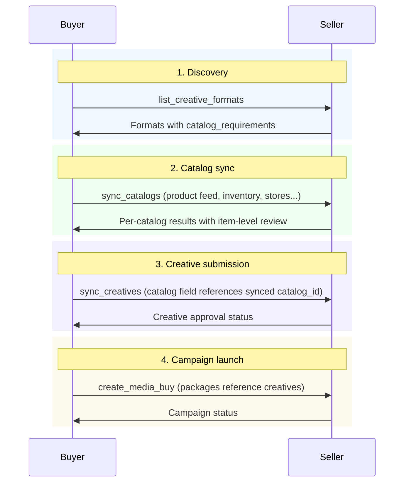

# Catalogs

Catalogs are typed data feeds that provide the items publishers render in ads. A product catalog supplies the SKUs for a sponsored product carousel. A hotel catalog carries property listings for travel ads. A job catalog provides the postings for recruitment campaigns. An inventory feed tells the publisher what's in stock at which store.

Catalogs are a foundational building block in AdCP:

- **Formats declare** what catalog types they need via `catalog_requirements`
- **Buyers sync** catalogs to seller accounts via `sync_catalogs`, with platform review and approval
- **Creatives reference** synced catalogs by `catalog_id` instead of embedding items inline

## Where sync_catalogs fits

`sync_catalogs` is a **buyer-to-seller** task. The buyer pushes catalog feeds to the seller's account, and the seller reviews and approves them before they can be used in campaigns.

### The actors

| Actor | Role |
|-------|------|
| **Buyer** | Calls `sync_catalogs` to push catalog feeds to the seller account. Owns the feed data (product URLs, inline items, inventory feeds). |
| **Seller** | Receives catalogs, validates items, runs content policy review, and returns per-item approval status. May also have existing catalogs from other sources (e.g., a retailer's commerce platform). |
| **Orchestrator** | Coordinates the sequence — discovers format requirements, syncs catalogs, then submits creatives that reference them. |

### Lifecycle position

`sync_catalogs` sits between format discovery and creative submission. The buyer must know what catalog types a format needs before syncing, and must have approved catalogs before creatives can reference them.



This is the same dependency order documented in [Account state](/docs/building/integration/account-state): `sync_catalogs` → `sync_creatives` → `create_media_buy`.

### When to use sync_catalogs vs inline

Not every workflow requires `sync_catalogs`. Use it when:

- **Platform review is needed** — product catalogs that go through content policy checks (like Google Merchant Center)
- **Feeds change frequently** — point to a URL and let the platform re-fetch on a schedule
- **Multiple creatives share the same feed** — sync once, reference by `catalog_id` from many creatives
- **The seller may already have the data** — use discovery mode to see what's already on the account

For simple campaigns with a few items, inline catalogs on the creative's `catalogs` field work fine — no sync step needed.

## Catalog types

Catalog types fall into two categories: **structural** types that describe the data's role, and **vertical** types that define industry-specific item schemas.

### Structural types

| Type | Item Schema | Description |
|------|-------------|-------------|
| `offering` | [Offering](https://adcontextprotocol.org/schemas/v1/core/offering.json) | AdCP Offering objects — campaigns, vacancies, events, services |
| `product` | *(freeform)* | Ecommerce product entries (Google Merchant Center, Shopify, etc.) |
| `inventory` | *(freeform)* | Stock and availability per product per location |
| `store` | [StoreItem](https://adcontextprotocol.org/schemas/v1/core/store-item.json) | Physical locations with addresses and catchment areas |
| `promotion` | *(freeform)* | Sales, deals, and promotional pricing |

### Vertical types

Each vertical type has a defined AdCP item schema, so formats can declare `catalog_type: "hotel"` and both sides know the required fields without consulting platform-specific documentation.

| Type | Item Schema | Maps To |
|------|-------------|---------|
| `hotel` | [HotelItem](https://adcontextprotocol.org/schemas/v1/core/hotel-item.json) | Google Hotel Center, Meta hotel catalogs |
| `flight` | [FlightItem](https://adcontextprotocol.org/schemas/v1/core/flight-item.json) | Google DynamicFlightsAsset, Meta flight catalogs |
| `job` | [JobItem](https://adcontextprotocol.org/schemas/v1/core/job-item.json) | LinkedIn Jobs XML, Google DynamicJobsAsset, schema.org JobPosting |
| `vehicle` | [VehicleItem](https://adcontextprotocol.org/schemas/v1/core/vehicle-item.json) | Meta Automotive Inventory, Microsoft Auto Inventory feeds |
| `real_estate` | [RealEstateItem](https://adcontextprotocol.org/schemas/v1/core/real-estate-item.json) | Google DynamicRealEstateAsset, Meta home listing catalogs |
| `education` | [EducationItem](https://adcontextprotocol.org/schemas/v1/core/education-item.json) | Google DynamicEducationAsset, schema.org Course |
| `destination` | [DestinationItem](https://adcontextprotocol.org/schemas/v1/core/destination-item.json) | Meta destination catalogs, Google travel ads |
| `app` | [AppItem](https://adcontextprotocol.org/schemas/v1/core/app-item.json) | Google App Campaigns, Apple Search Ads, Meta App Ads, TikTok App Campaigns, Snapchat App Install Ads |

## Typed catalog assets

Vertical catalog items support an `assets` array using the same `OfferingAssetGroup` structure as offering-type catalogs. This solves a concrete problem: standard catalog feeds have a single `image_url` field, but a hotel ad on Snap needs a 1080×1920 vertical image, a display banner needs a 1920×1080 landscape hero, and the advertiser's logo goes in a separate slot. Without typed pools, a creative agent has to guess which image to use for which slot.

By providing assets grouped by role, each catalog item self-describes the images it carries:

```json
{
  "hotel_id": "grand-amsterdam",
  "name": "Grand Hotel Amsterdam",
  "price": { "amount": 289, "currency": "EUR", "period": "night" },
  "image_url": "https://images.acmehotels.com/grand-amsterdam/hero.jpg",
  "assets": [
    {
      "asset_group_id": "images_landscape",
      "asset_type": "image",
      "items": [
        { "url": "https://images.acmehotels.com/grand-amsterdam/landscape.jpg", "width": 1920, "height": 1080 }
      ]
    },
    {
      "asset_group_id": "images_vertical",
      "asset_type": "image",
      "items": [
        { "url": "https://images.acmehotels.com/grand-amsterdam/vertical.jpg", "width": 1080, "height": 1920 }
      ]
    },
    {
      "asset_group_id": "logo",
      "asset_type": "image",
      "items": [
        { "url": "https://images.acmehotels.com/logo.png", "width": 400, "height": 200 }
      ]
    }
  ]
}
```

The `asset_group_id` vocabulary is not standardized at the protocol level — each format defines which group IDs it uses via `offering_asset_constraints` in `catalog_requirements`. Common conventions: `images_landscape` (16:9), `images_vertical` (9:16), `images_square` (1:1), `logo`, `video`.

Formats use `field_bindings` (see [Format catalog requirements](#format-catalog-requirements)) to explicitly declare which template slot maps to which asset group.

## The Catalog object

**Schema URL**: [`/schemas/core/catalog.json`](https://adcontextprotocol.org/schemas/v1/core/catalog.json)

```typescript
interface Catalog {
  // Identity (required for sync_catalogs, optional for inline use)
  catalog_id?: string;  // Buyer's identifier — also used to reference synced catalogs
  name?: string;        // Human-readable name

  // Type and sourcing
  type: CatalogType;           // Structural or vertical type
  url?: string;               // External feed URL
  feed_format?: FeedFormat;   // Feed format (google_merchant_center, facebook_catalog, shopify, linkedin_jobs, custom)
  update_frequency?: string;  // How often to re-fetch (realtime, hourly, daily, weekly)
  items?: object[];            // Inline data — schema depends on catalog type

  // Selectors
  ids?: string[];    // Filter by item ID (offering_id or SKU)
  gtins?: string[];  // Filter by GTIN (product type only)
  tags?: string[];   // Filter by tag
  category?: string; // Filter by category
  query?: string;    // Natural language filter

  // Integration
  conversion_events?: EventType[]; // Events to attribute to catalog items
  content_id_type?: ContentIdType; // Identifier type for event attribution

  // Feed normalization (for external feeds via url)
  feed_field_mappings?: CatalogFieldMapping[]; // Map non-standard feed fields to AdCP schema
}
```

| Field | Type | Required | Description |
|-------|------|----------|-------------|
| `catalog_id` | string | For sync | Buyer's identifier. Required for `sync_catalogs`. When used in creatives, references a synced catalog. |
| `name` | string | No | Human-readable name |
| `type` | CatalogType | Yes | Structural: `"offering"`, `"product"`, `"inventory"`, `"store"`, `"promotion"`. Vertical: `"hotel"`, `"flight"`, `"job"`, `"vehicle"`, `"real_estate"`, `"education"`, `"destination"`, `"app"`. |
| `url` | uri | No | External feed URL. Mutually exclusive with `items`. |
| `feed_format` | FeedFormat | No | Format of external feed (`google_merchant_center`, `facebook_catalog`, `shopify`, `linkedin_jobs`, `custom`) |
| `update_frequency` | string | No | Re-fetch schedule (`realtime`, `hourly`, `daily`, `weekly`) |
| `items` | object[] | No | Inline catalog data. Item schema depends on `type` — each vertical type has a defined schema (HotelItem, JobItem, etc.). Mutually exclusive with `url`. |
| `ids` | string[] | No | Filter to specific item IDs (offering_id or SKU) |
| `gtins` | string[] | No | Filter product catalogs by GTIN (cross-retailer matching) |
| `tags` | string[] | No | Filter to items with these tags (OR logic) |
| `category` | string | No | Filter to items in this category |
| `query` | string | No | Natural language filter |
| `conversion_events` | EventType[] | No | Event types that represent conversions for items in this catalog (e.g., `submit_application` for job catalogs, `purchase` for product catalogs) |
| `content_id_type` | ContentIdType | No | Identifier type for matching conversion event `content_ids` to catalog items. Values: `sku`, `gtin`, or vertical-specific IDs (`job_id`, `hotel_id`, etc.). Omit for custom identifier schemes. |
| `feed_field_mappings` | CatalogFieldMapping[] | No | Normalization rules for external feeds. Maps non-standard field names, date formats, price encodings, and image URLs to the AdCP catalog item schema. See [Feed field mappings](#feed-field-mappings). |

## Conversion events

The `conversion_events` field creates an explicit link between catalog items and the conversion tracking system. When a buyer syncs a catalog with conversion events declared, the platform knows which events to attribute to which catalog items. The event's `content_ids` field carries the item IDs that connect back.

The `content_id_type` field declares what identifier type `content_ids` values represent — for example, `gtin` for cross-retailer product matching or `job_id` for job postings. This tells the platform which field on catalog items to match against. Omit `content_id_type` when using a custom identifier scheme.

Natural mappings by vertical:

| Catalog type | Primary event types |
|---|---|
| `product` | `purchase`, `add_to_cart` |
| `hotel` | `purchase` (booking) |
| `flight` | `purchase` (booking) |
| `job` | `submit_application` |
| `vehicle` | `lead`, `schedule` (test drive) |
| `real_estate` | `lead`, `schedule` (viewing) |
| `education` | `submit_application`, `complete_registration` |
| `destination` | `purchase` (booking) |
| `app` | `app_install`, `app_launch` |

These mappings are not enforced by the schema — they're declared by the buyer when syncing a catalog. A job catalog that also tracks `lead` events alongside `submit_application` is perfectly valid.

```json
{
  "catalog_id": "job-feed",
  "type": "job",
  "content_id_type": "job_id",
  "conversion_events": ["submit_application", "complete_registration"],
  "url": "https://careers.acme.com/feed.xml",
  "feed_format": "linkedin_jobs"
}
```

## Sourcing catalogs

There are three ways to provide catalog data, each suited to a different stage of maturity:

### Inline items

Any catalog type can embed items directly via the `items` array. The item schema depends on the catalog `type`:

```json
{
  "catalogs": [{
    "type": "offering",
    "items": [
      {"offering_id": "summer-sale", "name": "Summer Sale", "landing_url": "https://acme.com/summer"}
    ]
  }]
}
```

Vertical types use their industry-specific item schema:

```json
{
  "catalogs": [{
    "type": "hotel",
    "items": [
      {
        "hotel_id": "grand-amsterdam",
        "name": "Grand Hotel Amsterdam",
        "location": {"lat": 52.3676, "lng": 4.9041},
        "star_rating": 5,
        "price": {"amount": 289, "currency": "EUR", "period": "night"},
        "amenities": ["spa", "pool", "restaurant", "wifi"]
      }
    ]
  }]
}
```

### External feed URL

For feeds managed outside AdCP, point to a URL and let the platform fetch:

```json
{
  "catalogs": [{
    "catalog_id": "product-feed",
    "type": "product",
    "url": "https://feeds.acmecorp.com/products.xml",
    "feed_format": "google_merchant_center",
    "update_frequency": "daily"
  }]
}
```

### Reference to synced catalog

For catalogs already on the account via `sync_catalogs`, reference by `catalog_id`:

```json
{
  "catalogs": [{
    "catalog_id": "gmc-primary",
    "type": "product",
    "ids": ["SKU-123", "SKU-456"]
  }]
}
```

## Syncing catalogs

For catalogs that change frequently or require platform review, use `sync_catalogs` to give them a managed lifecycle on the account. This is the same pattern as `sync_creatives` — upsert semantics, async approval, per-item status.

### Why sync?

- **Platform review**: Product catalogs go through content policy checks (like Google Merchant Center reviewing product listings). `sync_catalogs` returns per-item approval status.
- **Feed management**: Point to an external feed URL and the platform re-fetches on a schedule, rather than the buyer re-syncing on every change.
- **Multi-feed creatives**: Formats can require multiple catalog types (product + inventory + store). Syncing catalogs separately lets creatives reference them by `catalog_id`.
- **Approval workflow**: Async responses notify the buyer when items are approved, rejected, or flagged for issues.

### Sync request

```json
{
  "account_id": "acct_acmecorp",
  "catalogs": [
    {
      "catalog_id": "product-feed",
      "name": "Acme Product Catalog",
      "type": "product",
      "url": "https://feeds.acmecorp.com/products.xml",
      "feed_format": "google_merchant_center",
      "update_frequency": "daily"
    },
    {
      "catalog_id": "inventory-feed",
      "name": "Store Inventory",
      "type": "inventory",
      "url": "https://feeds.acmecorp.com/inventory.json",
      "feed_format": "custom",
      "update_frequency": "hourly"
    },
    {
      "catalog_id": "store-locations",
      "name": "Retail Locations",
      "type": "store",
      "url": "https://feeds.acmecorp.com/stores.json",
      "feed_format": "custom",
      "update_frequency": "weekly"
    }
  ]
}
```

### Sync response with item-level review

```json
{
  "catalogs": [
    {
      "catalog_id": "product-feed",
      "action": "created",
      "platform_id": "plat_cat_001",
      "item_count": 1250,
      "items_approved": 1180,
      "items_pending": 45,
      "items_rejected": 25,
      "item_issues": [
        {
          "item_id": "SKU-789",
          "status": "rejected",
          "reasons": ["Missing required field: image_url"]
        },
        {
          "item_id": "SKU-456",
          "status": "warning",
          "reasons": ["Price format not recognized — using raw value"]
        }
      ],
      "next_fetch_at": "2025-03-01T06:00:00Z"
    },
    {
      "catalog_id": "inventory-feed",
      "action": "created",
      "platform_id": "plat_cat_002",
      "item_count": 8500,
      "items_approved": 8500,
      "next_fetch_at": "2025-02-28T13:00:00Z"
    }
  ]
}
```

### Discovery mode

Omit `catalogs` to list all catalogs on the account without modification:

```json
{
  "account_id": "acct_acmecorp"
}
```

This matters because sellers may already have brand data from other sources — a retailer might have the brand's product catalog from their commerce platform. Discovery lets the buyer build on existing state rather than re-uploading everything.

## Feed field mappings

External feeds rarely match the AdCP catalog item schema exactly. Field names differ, dates use platform-specific formats, prices may be encoded as integer cents, and images arrive as untyped URLs. `feed_field_mappings` provides a declarative normalization layer — included on the catalog object in the `sync_catalogs` request — so buyers can describe the translation without preprocessing every feed.

```json
{
  "catalog_id": "hotel-feed",
  "type": "hotel",
  "url": "https://feeds.partner.com/hotels.xml",
  "feed_format": "custom",
  "feed_field_mappings": [
    { "feed_field": "hotel_name",      "catalog_field": "name" },
    { "feed_field": "nightly_cents",   "catalog_field": "price.amount",   "transform": "divide", "by": 100 },
    { "catalog_field": "price.currency", "value": "USD" },
    { "feed_field": "avail_date",      "catalog_field": "valid_from",     "transform": "date", "format": "YYYYMMDD", "timezone": "UTC" },
    { "feed_field": "primary_photo",   "asset_group_id": "images_landscape" },
    { "feed_field": "snap_photo",      "asset_group_id": "images_vertical" },
    { "feed_field": "logo_url",        "asset_group_id": "logo" },
    { "feed_field": "facility_list",   "catalog_field": "amenities",      "transform": "split", "separator": "," },
    { "feed_field": "star_class",      "catalog_field": "star_rating",    "default": 0 }
  ]
}
```

Each mapping entry is one of:

| Pattern | What it does |
|---------|-------------|
| `feed_field` + `catalog_field` | Renames a feed field to its schema equivalent (dot notation for nested fields) |
| `feed_field` + `asset_group_id` | Places a URL into a typed asset pool on the item's `assets` array |
| `value` + `catalog_field` | Injects a static literal — useful for fields the feed omits (e.g., currency when always USD) |
| Any of the above + `transform` | Applies a named coercion before writing |
| Any of the above + `default` | Fallback when the feed field is absent or null |

### Supported transforms

| Transform | Parameters | Example |
|-----------|-----------|---------|
| `date` | `format` (input date pattern), `timezone` (IANA, default UTC) | `"YYYYMMDD"` → `"2025-03-01"` |
| `divide` | `by` (divisor, must be > 0) | `1000` ÷ `100` → `10.00` |
| `boolean` | — | `"yes"` / `"1"` / `"true"` → `true` |
| `split` | `separator` (default `,`) | `"spa,pool,wifi"` → `["spa", "pool", "wifi"]` |

Multiple mappings can assemble a nested object. The `price.amount` and `price.currency` mappings above each write one field of the `price` object independently.

## Format catalog requirements

Formats that render product listings, store locators, or promotional content declare what catalog feeds they need via `catalog_requirements`. This tells buying agents which catalogs to sync before submitting creatives.

```json
{
  "format_id": {
    "agent_url": "https://creative.retailer.com/adcp",
    "id": "product_carousel_with_inventory"
  },
  "name": "Product Carousel with Inventory",
  "catalog_requirements": [
    {
      "catalog_type": "product",
      "required": true,
      "min_items": 3,
      "required_fields": ["title", "price", "image_url"]
    },
    {
      "catalog_type": "inventory",
      "required": true,
      "required_fields": ["store_id", "quantity", "in_stock"]
    }
  ]
}
```

Buying agents check `catalog_requirements` after discovering formats, sync the required catalogs via `sync_catalogs`, then submit creatives that reference those catalogs.

### Field bindings

Formats can declare `field_bindings` inside each `catalog_requirements` entry to explicitly map template slots to catalog item fields or asset pools. This makes the format self-describing — creative agents don't have to guess which catalog field maps to which template slot.

```json
{
  "catalog_requirements": [
    {
      "catalog_type": "hotel",
      "required": true,
      "required_fields": ["name", "price.amount"],
      "offering_asset_constraints": [
        { "asset_group_id": "images_landscape", "asset_type": "image", "required": true, "min_count": 1 },
        { "asset_group_id": "images_vertical",  "asset_type": "image", "required": true, "min_count": 1 }
      ],
      "field_bindings": [
        { "asset_id": "headline",       "catalog_field": "name" },
        { "asset_id": "price_badge",    "catalog_field": "price.amount" },
        { "asset_id": "hero_image",     "asset_group_id": "images_landscape" },
        { "asset_id": "snap_background","asset_group_id": "images_vertical" },
        { "asset_id": "logo",           "asset_group_id": "logo" }
      ]
    }
  ]
}
```

For repeatable groups (carousels where each slide is one catalog item), use `format_group_id` with `catalog_item: true`:

```json
{
  "field_bindings": [
    {
      "format_group_id": "slide",
      "catalog_item": true,
      "per_item_bindings": [
        { "asset_id": "title",  "catalog_field": "name" },
        { "asset_id": "price",  "catalog_field": "price.amount" },
        { "asset_id": "image",  "asset_group_id": "images_landscape" }
      ]
    }
  ]
}
```

Field bindings are **optional** — creative agents can still infer mappings from field names and asset types when bindings are absent. Providing them removes ambiguity and enables pre-render validation.

| Binding variant | Required fields | What it does |
|----------------|----------------|-------------|
| Scalar | `asset_id` + `catalog_field` | Maps individual template asset to catalog item field (dot notation) |
| Asset pool | `asset_id` + `asset_group_id` | Maps individual template asset to typed asset pool on the catalog item |
| Catalog group | `format_group_id` + `catalog_item: true` | Iterates a format repeatable_group over catalog items |

## Catalogs in creatives

Creatives reference catalogs via the `catalogs` field on the creative object. This is a data reference — it tells the creative what items to render (products for a carousel, locations for a store locator). It is not a campaign expansion directive; campaign structure and budget allocation are handled by `create_media_buy` packages.

When a format declares `catalog_requirements`, the buying agent syncs the required catalogs to the account, then sets the `catalogs` field on the creative to reference the synced data.

### Workflow

1. **Discover format requirements** — Call `list_creative_formats` and check `catalog_requirements` for what feeds to sync.

2. **Sync catalogs** — Use `sync_catalogs` to push the required feeds to the account. Wait for approval.

3. **Submit the creative** — Reference the synced catalog by `catalog_id` in the creative's `catalogs` array:

```json
{
  "creatives": [
    {
      "creative_id": "product-carousel",
      "format_id": {
        "agent_url": "https://creative.retailer.com/adcp",
        "id": "product_carousel_with_inventory"
      },
      "catalogs": [{
        "catalog_id": "product-feed",
        "type": "product",
        "tags": ["summer"]
      }],
      "assets": {
        "banner_image": {
          "url": "https://cdn.acmecorp.com/carousel-hero.jpg",
          "width": 1200,
          "height": 628
        }
      }
    }
  ]
}
```

## Offerings

**Schema URL**: [`/schemas/core/offering.json`](https://adcontextprotocol.org/schemas/v1/core/offering.json)

An Offering is an individual promotable item within an `offering`-type catalog — a campaign, product, service, promotion, or vacancy. Each offering is a semantic unit with its own name, validity window, landing URL, creative assets, and geographic scope.

```typescript
interface Offering {
  // Identity (required)
  offering_id: string;
  name: string;

  // Description
  description?: string;
  tagline?: string;

  // Validity window
  valid_from?: string;  // ISO 8601 datetime
  valid_to?: string;    // ISO 8601 datetime

  // Destinations
  checkout_url?: string;  // Purchase/conversion URL
  landing_url?: string;   // Information page

  // Creative assets
  assets?: OfferingAssetGroup[];  // Structured asset groups

  // Geographic scope
  geo_targets?: {
    countries?: string[];
    regions?: string[];
    metros?: { system: string; values: string[] }[];
    postal_areas?: { system: string; values: string[] }[];
  };

  // Discovery
  keywords?: string[];
  categories?: string[];
}
```

| Field | Type | Required | Description |
|-------|------|----------|-------------|
| `offering_id` | string | Yes | Unique identifier |
| `name` | string | Yes | Human-readable name |
| `description` | string | No | Detailed description |
| `tagline` | string | No | Short promotional tagline |
| `valid_from` | datetime | No | When offering becomes available |
| `valid_to` | datetime | No | When offering expires |
| `checkout_url` | uri | No | URL for purchase flow |
| `landing_url` | uri | No | Per-item click-through URL. For catalog-driven formats, this is the destination platforms map to the ad's link-out. Every offering should have one. |
| `assets` | OfferingAssetGroup[] | No | Structured asset groups for this offering |
| `geo_targets` | object | No | Geographic scope — where this offering is relevant |
| `keywords` | string[] | No | Keywords for intent matching |
| `categories` | string[] | No | Categories for filtering |

### OfferingAssetGroup

**Schema URL**: [`/schemas/core/offering-asset-group.json`](https://adcontextprotocol.org/schemas/v1/core/offering-asset-group.json)

A typed pool of creative assets within an offering. Uses the same `asset_group_id` vocabulary as format-level asset definitions, enabling formats to declare per-group constraints on what each offering must provide.

```typescript
interface OfferingAssetGroup {
  asset_group_id: string;        // e.g., 'headlines', 'images_landscape'
  asset_type: AssetContentType;  // Type of all items in this group
  items: Asset[];                // The assets (must match asset_type)
}
```

| Field | Type | Required | Description |
|-------|------|----------|-------------|
| `asset_group_id` | string | Yes | Matches format-level vocabulary (e.g., `headlines`, `descriptions`, `images_landscape`) |
| `asset_type` | AssetContentType | Yes | Content type of all items in this group |
| `items` | Asset[] | Yes | The assets; each item must match the declared `asset_type` |

### OfferingAssetConstraint

**Schema URL**: [`/schemas/core/requirements/offering-asset-constraint.json`](https://adcontextprotocol.org/schemas/v1/core/requirements/offering-asset-constraint.json)

Declared by a format to specify what asset groups each offering must provide. Used within `catalog_requirements` to constrain what offerings in a catalog must provide.

```typescript
interface OfferingAssetConstraint {
  asset_group_id: string;
  asset_type: AssetContentType;
  required?: boolean;             // default: true
  min_count?: number;
  max_count?: number;
  asset_requirements?: AssetRequirements;
}
```

| Field | Type | Required | Description |
|-------|------|----------|-------------|
| `asset_group_id` | string | Yes | The group this constraint applies to |
| `asset_type` | AssetContentType | Yes | Expected content type |
| `required` | boolean | No | Whether the group must be present. Defaults to `true`. |
| `min_count` | integer | No | Minimum items required |
| `max_count` | integer | No | Maximum items allowed |
| `asset_requirements` | object | No | Technical requirements per item (e.g., `max_length` for text, `min_width` for images) |

### Format requirements for offerings

Call `list_creative_formats` and check `catalog_requirements` to see what catalog types are needed and what each offering must provide:

```json
{
  "catalog_requirements": [
    {
      "catalog_type": "offering",
      "required": true,
      "offering_asset_constraints": [
        {
          "asset_group_id": "headlines",
          "asset_type": "text",
          "required": true,
          "min_count": 3,
          "max_count": 15,
          "asset_requirements": {"max_length": 30}
        },
        {
          "asset_group_id": "descriptions",
          "asset_type": "text",
          "required": true,
          "min_count": 2,
          "max_count": 5,
          "asset_requirements": {"max_length": 90}
        },
        {
          "asset_group_id": "images_landscape",
          "asset_type": "image",
          "required": true,
          "min_count": 1,
          "max_count": 20,
          "asset_requirements": {"aspect_ratio": "1.91:1", "min_width": 1200, "min_height": 628}
        },
        {
          "asset_group_id": "images_square",
          "asset_type": "image",
          "required": true,
          "min_count": 1,
          "max_count": 20,
          "asset_requirements": {"aspect_ratio": "1:1", "min_width": 600, "min_height": 600}
        }
      ]
    }
  ]
}
```

## Stores

**Schema URL**: [`/schemas/core/store-item.json`](https://adcontextprotocol.org/schemas/v1/core/store-item.json)

A StoreItem represents a physical location within a `store`-type catalog. Each store carries coordinates, an optional address, and one or more catchment areas that define the geographic reach around that location.

```typescript
interface StoreItem {
  store_id: string;              // Unique identifier
  name: string;                  // Human-readable name
  location: { lat: number; lng: number };  // WGS 84 coordinates

  address?: {
    street?: string;
    city?: string;
    region?: string;             // ISO 3166-2 preferred
    postal_code?: string;
    country?: string;            // ISO 3166-1 alpha-2
  };

  catchments?: Catchment[];      // Reachable areas around this store
  phone?: string;                // E.164 format
  url?: string;                  // Store detail page
  hours?: Record<DayOfWeek, string>;  // e.g., "09:00-21:00"
  tags?: string[];               // For filtering (e.g., "flagship", "pickup")
}
```

| Field | Type | Required | Description |
|-------|------|----------|-------------|
| `store_id` | string | Yes | Unique identifier for targeting, inventory, and creative references |
| `name` | string | Yes | Human-readable store name |
| `location` | object | Yes | Lat/lng coordinates (WGS 84) |
| `address` | object | No | Structured address for display and geocoding fallback |
| `catchments` | Catchment[] | No | Catchment areas for proximity targeting |
| `phone` | string | No | Phone number (E.164) |
| `url` | uri | No | Store-specific page URL |
| `hours` | object | No | Operating hours by day of week |
| `tags` | string[] | No | Tags for filtering in targeting and creative selection |

### Catchment areas

**Schema URL**: [`/schemas/core/catchment.json`](https://adcontextprotocol.org/schemas/v1/core/catchment.json)

A catchment defines the geographic area a store serves. Three methods are supported — provide exactly one per catchment:

**Isochrone inputs** — the platform resolves the shape from travel time and transport mode, accounting for road networks, transit routes, and terrain:

```json
{
  "catchment_id": "drive",
  "label": "15-min drive",
  "travel_time": { "value": 15, "unit": "min" },
  "transport_mode": "driving"
}
```

**Simple radius** — a circle around the store's coordinates:

```json
{
  "catchment_id": "local",
  "radius": { "value": 5, "unit": "km" }
}
```

**Pre-computed GeoJSON** — the buyer has already calculated the boundary (via TravelTime, Mapbox, etc.) or has custom trade area data:

```json
{
  "catchment_id": "trade-area",
  "label": "Primary trade area",
  "geometry": {
    "type": "Polygon",
    "coordinates": [[[4.85, 52.35], [4.95, 52.35], [4.95, 52.40], [4.85, 52.40], [4.85, 52.35]]]
  }
}
```

A store can have multiple catchments — different modes produce different boundaries. An urban flagship might define a 10-minute walking catchment AND a 15-minute driving catchment:

```json
{
  "store_id": "amsterdam-flagship",
  "name": "Amsterdam Flagship",
  "location": { "lat": 52.3676, "lng": 4.9041 },
  "catchments": [
    {
      "catchment_id": "walk",
      "travel_time": { "value": 10, "unit": "min" },
      "transport_mode": "walking"
    },
    {
      "catchment_id": "drive",
      "travel_time": { "value": 15, "unit": "min" },
      "transport_mode": "driving"
    },
    {
      "catchment_id": "transit",
      "travel_time": { "value": 20, "unit": "min" },
      "transport_mode": "public_transport"
    }
  ]
}
```

The `catchment_id` is what targeting references — a campaign can target the `walk` catchment of specific stores or the `drive` catchment of all stores in the catalog.

### Inline store catalog

```json
{
  "catalog_id": "retail-locations",
  "name": "Retail Locations",
  "type": "store",
  "items": [
    {
      "store_id": "amsterdam-flagship",
      "name": "Amsterdam Flagship",
      "location": { "lat": 52.3676, "lng": 4.9041 },
      "address": {
        "street": "Kalverstraat 1",
        "city": "Amsterdam",
        "region": "NL-NH",
        "postal_code": "1012 NX",
        "country": "NL"
      },
      "catchments": [
        {
          "catchment_id": "walk",
          "travel_time": { "value": 10, "unit": "min" },
          "transport_mode": "walking"
        },
        {
          "catchment_id": "drive",
          "travel_time": { "value": 15, "unit": "min" },
          "transport_mode": "driving"
        }
      ],
      "tags": ["flagship", "pickup"]
    },
    {
      "store_id": "warehouse-east",
      "name": "East Warehouse Store",
      "location": { "lat": 52.2942, "lng": 4.9581 },
      "catchments": [
        {
          "catchment_id": "local",
          "radius": { "value": 10, "unit": "km" }
        }
      ],
      "tags": ["warehouse", "parking"]
    }
  ]
}
```

## SI integration

Offerings in a catalog can be promoted through Sponsored Intelligence conversations. The brand's SI agent URL is declared on the [brand identity](/docs/brand-protocol/brand-json), not on the catalog — SI is a brand-level capability.

The `offering_id` connects a catalog item to a conversation:

1. **User expresses intent** — "I need flights to LA next week"
2. **Publisher matches to offering** — Uses `keywords` to find relevant offerings, checks `valid_from`/`valid_to`
3. **Publisher initiates SI session** — Passes `offering_id` and user context to the brand's SI agent
4. **Brand agent responds** — With contextual information, UI elements, and a conversational experience

Display creatives and SI can coexist: the same offering can serve a display ad and also be available for a conversational experience.

## Use cases

### Universal format (asset pool)

The buyer provides multiple offerings, each with their own creative asset pool. The publisher picks the most relevant offering and assembles the best headline/image combination:

```json
{
  "brand": { "domain": "acme.com" },
  "catalogs": [{
    "type": "offering",
    "items": [
      {
        "offering_id": "summer-sale",
        "name": "Summer Sale",
        "landing_url": "https://acme.com/summer",
        "assets": [
          {"asset_group_id": "headlines", "asset_type": "text", "items": [
            {"content": "Shop the Summer Sale"},
            {"content": "50% Off Everything"}
          ]},
          {"asset_group_id": "images_landscape", "asset_type": "image", "items": [
            {"url": "https://cdn.acme.com/summer-hero.jpg", "width": 1200, "height": 628}
          ]}
        ]
      },
      {
        "offering_id": "new-arrivals",
        "name": "New Arrivals",
        "landing_url": "https://acme.com/new",
        "assets": [
          {"asset_group_id": "headlines", "asset_type": "text", "items": [
            {"content": "Just Arrived"},
            {"content": "New This Week"}
          ]},
          {"asset_group_id": "images_landscape", "asset_type": "image", "items": [
            {"url": "https://cdn.acme.com/new-arrivals.jpg", "width": 1200, "height": 628}
          ]}
        ]
      }
    ]
  }]
}
```

### Product catalog with synced feeds

For retail media, sync product and inventory feeds, then reference them in creatives:

```json
{
  "brand": { "domain": "acmecorp.com" },
  "catalogs": [{
    "catalog_id": "product-feed",
    "type": "product",
    "tags": ["summer"]
  }]
}
```

The publisher assembles the creative from the synced product data and real-time inventory.

### Conversational-only

No pre-built creatives — just offerings available for SI conversations. The brand's SI agent URL is discovered from the [brand identity](/docs/brand-protocol/brand-json):

```json
{
  "brand": { "domain": "saas-company.com" },
  "catalogs": [{
    "type": "offering",
    "items": [
      {
        "offering_id": "enterprise-demo",
        "name": "Enterprise Demo",
        "description": "See our platform in action with a personalized demo",
        "keywords": ["demo", "enterprise", "trial", "pricing"]
      },
      {
        "offering_id": "free-trial",
        "name": "14-Day Free Trial",
        "checkout_url": "https://saas-company.com/signup",
        "keywords": ["trial", "free", "signup"]
      }
    ]
  }]
}
```

### Location-specific offerings

For brands with multiple physical locations — restaurants, retail chains, job vacancies — each offering declares its geographic scope via `geo_targets`:

```json
{
  "brand": { "domain": "acme-restaurants.com" },
  "catalogs": [{
    "type": "offering",
    "items": [
      {
        "offering_id": "vacancy-amsterdam-chef",
        "name": "Head Chef — Amsterdam",
        "landing_url": "https://careers.acme-restaurants.com/vacancies/41",
        "geo_targets": {
          "countries": ["NL"],
          "regions": ["NL-NH"]
        },
        "assets": [
          {"asset_group_id": "headlines", "asset_type": "text", "items": [
            {"content": "Head Chef Wanted in Amsterdam"},
            {"content": "Join Our Amsterdam Kitchen Team"}
          ]}
        ]
      }
    ]
  }]
}
```

Geo targets on offerings are about what the offering IS — the Amsterdam vacancy genuinely doesn't exist for someone in Rotterdam. Campaign-wide geo targeting belongs on `targeting_overlay` in the package.

## Catalogs in the media buy lifecycle

Catalogs flow through the entire media buy lifecycle — from product discovery to delivery reporting.

### Catalog-driven discovery

Pass a `catalog` on [`get_products`](/docs/media-buy/task-reference/get_products) to find products that match your catalog items. The seller matches catalog items against its inventory and returns products where matches exist. Products declare which catalog types they support via `catalog_types`.

### Catalog-driven packages

Include a `catalog` field on a package in [`create_media_buy`](/docs/media-buy/task-reference/create_media_buy) to make it catalog-driven. One budget envelope promotes the entire catalog — the platform optimizes delivery across items based on performance. This is the AdCP equivalent of catalog-based campaign types like Google Performance Max or Meta Dynamic Product Ads.

### Variants as catalog items

For catalog-driven packages, each catalog item rendered as a distinct ad execution is a [creative variant](/docs/creative/task-reference/get_creative_delivery). The variant's manifest includes the catalog reference with the specific item rendered.

### Per-item delivery reporting

[`get_media_buy_delivery`](/docs/media-buy/task-reference/get_media_buy_delivery) returns `by_catalog_item` breakdowns within each package, showing per-item impressions, spend, clicks, conversions, and ROAS.

### Conversion attribution

Conversion events carry `content_ids` that identify which catalog items were involved. The catalog's `content_id_type` declares the identifier type. Attribution is broad — a user might click item A but convert on item B. The event fires with the actual `content_id`. See [conversion tracking](/docs/media-buy/conversion-tracking).

### Item-level tracking via macros

For impression-level attribution (which item was clicked, which was viewed), use [catalog item macros](/docs/creative/universal-macros#catalog-item-macros) in your creative's tracker pixel URLs. The macros mirror the `content_id_type` enum — the same identifiers used at serve time that appear in conversion events:

```json
{
  "impression_pixel": {
    "url": "https://track.brand.com/imp?catalog={CATALOG_ID}&item={OFFERING_ID}&creative={CREATIVE_ID}&cb={CACHEBUSTER}",
    "url_type": "tracker_pixel"
  }
}
```

At serve time, the platform substitutes `{OFFERING_ID}` with the specific offering being rendered. For a carousel showing 5 offerings, each item's impression fires with that item's identifier.

Use the macro matching your catalog's `content_id_type`:

| `content_id_type` | Macro |
|---|---|
| `sku` | `{SKU}` |
| `gtin` | `{GTIN}` |
| `offering_id` | `{OFFERING_ID}` |
| `job_id` | `{JOB_ID}` |
| `hotel_id` | `{HOTEL_ID}` |
| `flight_id` | `{FLIGHT_ID}` |
| `vehicle_id` | `{VEHICLE_ID}` |
| `listing_id` | `{LISTING_ID}` |
| `store_id` | `{STORE_ID}` |
| `program_id` | `{PROGRAM_ID}` |
| `destination_id` | `{DESTINATION_ID}` |
| `app_id` | `{APP_ITEM_ID}` |

This creates a closed attribution loop: the same identifiers appear in impression trackers (via macros at serve time), click trackers, and conversion events (via `content_ids` at event time).

## Best practices

### Match `asset_group_id` to the format's vocabulary

Read the format definition from `list_creative_formats` before building offerings. The `asset_group_id` values must match exactly what the format declares in its `offering_asset_constraints`. Group IDs like `headlines`, `images`, or `videos` are format-defined vocabulary, not protocol constants — each format chooses its own IDs. The protocol provides the container and constraint mechanism; the format defines the vocabulary.

### Provide more assets than the minimum

Formats that use asset pools select the best-performing combination. Providing the maximum allowed items gives the publisher more to work with.

### Set validity windows

For time-limited promotions, always set `valid_from` and `valid_to`. Publishers filter expired offerings automatically.

### Use `geo_targets` for inherently location-specific offerings

When an offering's identity is tied to a geographic location — a job vacancy, an in-store promotion, a local event — declare its scope with `geo_targets`. This is not ad targeting; it's a property of what the offering IS.

### Always provide `landing_url` on catalog offerings

For catalog-driven creatives, `landing_url` is the per-item click-through destination that platforms map to the ad's link-out URL (swipe-up, CTA button, carousel card link). Every offering in a catalog should have a `landing_url`. Include `checkout_url` as well when direct conversion is supported.

### Budget distribution across catalog items

Budget allocation across catalog items is a platform optimization decision — some platforms distribute evenly, others allocate based on performance signals. The protocol does not prescribe a specific distribution method. Budget lives on `create_media_buy` packages, not on individual offerings. If your campaign requires specific per-item budget caps, use separate packages per offering.

## Related documentation

- **[Account state](/docs/building/integration/account-state)** — How catalogs fit into account state and the setup sequence
- **[Brand identity](/docs/brand-protocol/brand-json)** — Brand identity and assets
- **[SI overview](/docs/sponsored-intelligence/overview)** — Conversational brand experiences
- **[sync_creatives](/docs/media-buy/task-reference/sync_creatives)** — Submitting creative manifests
- **[list_creative_formats](/docs/creative/task-reference/list_creative_formats)** — Discovering format requirements
