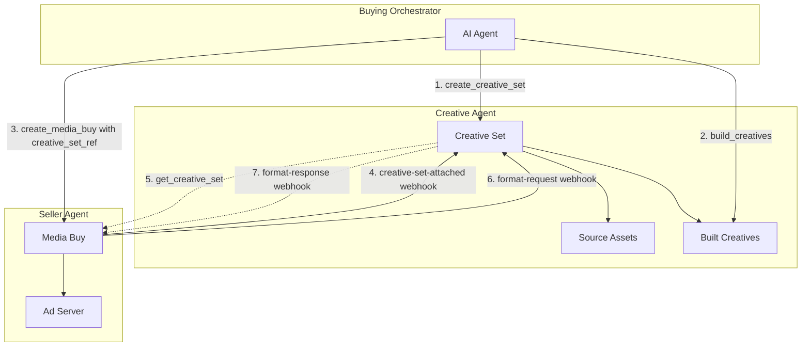

Creative Sets enable **stateful creative management** where creatives are built on-demand and synced between creative agents and seller agents. Instead of uploading static creatives to each media buy, advertisers maintain a central creative workspace that seller agents can pull from and request new formats as needed.

## Why Creative Sets?

Traditional creative workflows require advertisers to:
1. Build all creative formats upfront
2. Upload them to each sales agent separately
3. Manually rebuild when formats change or new formats are needed

Creative Sets solve this by:
- **Central workspace**: One source of truth for source assets, brand context, and trackers
- **On-demand building**: Seller agents can request formats they need
- **Automatic sync**: Webhook-based communication keeps everyone in sync
- **Governance**: Optional review of creatives before approval

## Architecture Overview



## The Workflow

### Phase 1: Setup

The buying orchestrator creates a creative set on a creative agent:

```json
// create_creative_set request
{
  "name": "Spring Campaign 2025",
  "brand_manifest_url": "https://brand.com/manifest.json",
  "assets": [
    { "asset_id": "hero_image", "url": "https://cdn.brand.com/hero.jpg" },
    { "asset_id": "logo", "url": "https://cdn.brand.com/logo.svg" },
    { "asset_id": "video_30s", "url": "https://cdn.brand.com/spring.mp4" }
  ],
  "trackers": {
    "click": "https://track.brand.com/click?dest={LANDING_URL_ENC}&cb={CACHEBUSTER}",
    "impression": ["https://track.brand.com/imp?cb={CACHEBUSTER}"]
  },
  "allow_format_requests": true,
  "allow_adaptation_requests": true
}
```

### Phase 2: Build Initial Creatives

The orchestrator builds creatives for known formats:

```json
// build_creatives request
{
  "creative_set_id": "cs_spring2025",
  "target_formats": [
    { "agent_url": "https://creative.adcontextprotocol.org", "id": "display_300x250" },
    { "agent_url": "https://creative.adcontextprotocol.org", "id": "video_30s" }
  ],
  "prompt": "Modern, clean design emphasizing our spring sale. Focus on the 30% discount."
}
```

### Phase 3: Create Media Buy

When creating a media buy, include the `creative_set_ref`:

```json
// create_media_buy request (partial)
{
  "creative_set_ref": {
    "agent_url": "https://creative.brand.com",
    "creative_set_id": "cs_spring2025",
    "authentication": {
      "schemes": ["bearer"],
      "credentials": "eyJ..."
    }
  },
  "packages": [...]
}
```

### Phase 4: Seller Attachment

When the seller agent receives the media buy, it sends a `creative-set-attached` webhook:

```json
// creative-set-attached webhook
{
  "creative_set_id": "cs_spring2025",
  "media_buy_id": "mb_12345",
  "seller_agent_url": "https://seller.example.com",
  "format_ids": [
    { "agent_url": "https://creative.adcontextprotocol.org", "id": "display_300x250" },
    { "agent_url": "https://creative.adcontextprotocol.org", "id": "display_728x90" }
  ],
  "callback_url": "https://seller.example.com/webhooks/creative-updates"
}
```

### Phase 5: On-Demand Format Building

If the seller needs a format that doesn't exist, they send a `format-request` webhook:

```json
// format-request webhook
{
  "creative_set_id": "cs_spring2025",
  "format_id": { "agent_url": "https://creative.adcontextprotocol.org", "id": "display_728x90" },
  "media_buy_id": "mb_12345",
  "seller_agent_url": "https://seller.example.com",
  "callback_url": "https://seller.example.com/webhooks/format-ready"
}
```

The creative agent builds the format and responds:

```json
// format-response webhook
{
  "creative_set_id": "cs_spring2025",
  "creative_id": "cr_new_728x90",
  "format_id": { "agent_url": "https://creative.adcontextprotocol.org", "id": "display_728x90" },
  "media_buy_id": "mb_12345",
  "status": "ready"
}
```

## Key Concepts

### Creative Set Reference

The `creative_set_ref` in a media buy tells the seller agent where to fetch creatives:

| Field | Description |
|-------|-------------|
| `agent_url` | Creative agent hosting the set |
| `creative_set_id` | Unique identifier for the set |
| `authentication` | Credentials for the seller to access the set |

### Tracker Configuration

Trackers are URL templates with macro placeholders. The creative agent embeds these in built creatives; the seller expands macros at serve time.

Common macros:
- `{CACHEBUSTER}` - Random value for cache busting
- `{LANDING_URL}` - Destination URL
- `{LANDING_URL_ENC}` - URL-encoded destination
- `{CREATIVE_ID}` - Creative identifier
- `{MEDIA_BUY_ID}` - Media buy identifier

### Governance Agent

Optional governance agents review creatives before approval:

```json
{
  "governance_agent": {
    "agent_url": "https://governance.brand.com",
    "creative_standards_id": "brand_2025",
    "authentication": {...}
  }
}
```

## Webhooks Reference

### Seller → Creative Agent

| Webhook | When | Purpose |
|---------|------|---------|
| `creative-set-attached` | Media buy created | Register interest, list required formats |
| `creative-set-detached` | Media buy ended | Unsubscribe from updates |
| `format-request` | Format needed | Request new format build |
| `adaptation-request` | Variant needed | Request CTA change, localization, etc. |
| `creative-approval-update` | Approval changed | Notify creative agent of seller's approval decision |

### Creative Agent → Seller

| Webhook | When | Purpose |
|---------|------|---------|
| `format-response` | Format built | Notify seller format is ready |
| `adaptation-response` | Adaptation built | Notify seller adaptation is ready |

## Implementation Checklist

### For Creative Agent Implementers

- [ ] Implement `create_creative_set` task
- [ ] Implement `get_creative_set` task with format filtering
- [ ] Implement `build_creatives` task
- [ ] Handle `creative-set-attached` webhook
- [ ] Handle `format-request` webhook (if `allow_format_requests`)
- [ ] Handle `adaptation-request` webhook (if `allow_adaptation_requests`)
- [ ] Send `format-response` and `adaptation-response` webhooks

### For Seller Agent Implementers

- [ ] Parse `creative_set_ref` from `create_media_buy`
- [ ] Send `creative-set-attached` webhook on media buy creation
- [ ] Call `get_creative_set` to fetch creatives
- [ ] Send `format-request` for missing formats
- [ ] Handle `format-response` webhooks
- [ ] Send `creative-set-detached` on media buy end

## Related Documentation

- [Protocol Specification](/docs/creative/creative-sets/specification) - RFC 2119 formal specification
- [Task Reference](/docs/creative/creative-sets/tasks) - API documentation for creative set tasks
- [Webhooks](/docs/creative/creative-sets/webhooks) - Webhook payload reference
- [Creative Manifests](/docs/creative/creative-manifests) - Structure of built creatives
- [Universal Macros](/docs/creative/universal-macros) - Macro reference
- [Brand Manifest](/docs/creative/brand-manifest) - Brand context specification
