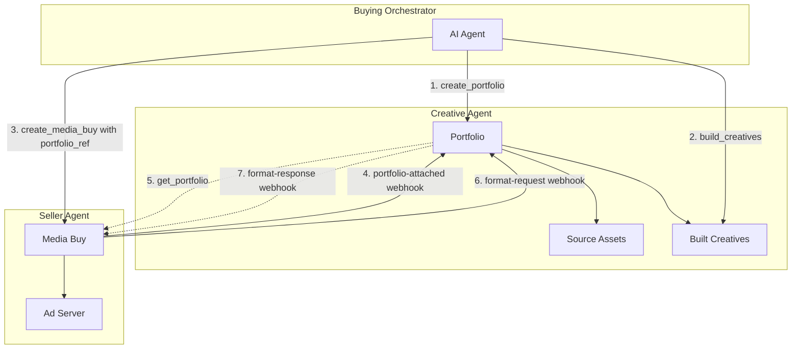

Portfolios are **creative collections** that can hold source assets (images, videos, copy), assembled creatives (the built ads), or both. Unlike platforms that hide assembled creatives (Google PMax) or only store static assets (traditional libraries), AdCP portfolios give buyers **full visibility and portability** - you can see both the ingredients AND the dishes, and take them anywhere.

## Why Portfolios?

Traditional creative workflows require advertisers to:
1. Build all creative formats upfront
2. Upload them to each platform or ad server separately
3. Manually rebuild when formats change or new formats are needed

Portfolios solve this by:
- **Central workspace**: One source of truth for source assets, brand context, and trackers
- **On-demand building**: Seller agents can request formats they need
- **Automatic sync**: Webhook-based communication keeps everyone in sync
- **Governance**: Optional review of creatives before approval

## Architecture Overview



## The Workflow

### Phase 1: Setup

The buying orchestrator creates a portfolio on a creative agent:

```json
// create_portfolio request
{
  "name": "Spring Campaign 2025",
  "brand_manifest_url": "https://brand.com/manifest.json",
  "assets": [
    { "asset_id": "hero_image", "url": "https://cdn.brand.com/hero.jpg" },
    { "asset_id": "logo", "url": "https://cdn.brand.com/logo.svg" },
    { "asset_id": "video_30s", "url": "https://cdn.brand.com/spring.mp4" }
  ],
  "trackers": {
    "click": "https://track.brand.com/click?dest={LANDING_URL_ENC}&cb={CACHEBUSTER}",
    "impression": ["https://track.brand.com/imp?cb={CACHEBUSTER}"]
  },
  "allow_format_requests": true,
  "allow_adaptation_requests": true
}
```

### Phase 2: Build Initial Creatives

The orchestrator builds creatives for known formats:

```json
// build_creatives request
{
  "portfolio_id": "cs_spring2025",
  "target_formats": [
    { "agent_url": "https://creative.adcontextprotocol.org", "id": "display_300x250" },
    { "agent_url": "https://creative.adcontextprotocol.org", "id": "video_30s" }
  ],
  "prompt": "Modern, clean design emphasizing our spring sale. Focus on the 30% discount."
}
```

### Phase 3: Create Media Buy

When creating a media buy, include the `portfolio_ref`:

```json
// create_media_buy request (partial)
{
  "portfolio_ref": {
    "agent_url": "https://creative.brand.com",
    "portfolio_id": "cs_spring2025",
    "authentication": {
      "schemes": ["bearer"],
      "credentials": "eyJ..."
    }
  },
  "packages": [...]
}
```

### Phase 4: Seller Attachment

When the seller agent receives the media buy, it sends a `portfolio-attached` webhook:

```json
// portfolio-attached webhook
{
  "portfolio_id": "cs_spring2025",
  "media_buy_id": "mb_12345",
  "seller_agent_url": "https://seller.example.com",
  "format_ids": [
    { "agent_url": "https://creative.adcontextprotocol.org", "id": "display_300x250" },
    { "agent_url": "https://creative.adcontextprotocol.org", "id": "display_728x90" }
  ],
  "callback_url": "https://seller.example.com/webhooks/creative-updates"
}
```

### Phase 5: On-Demand Format Building

If the seller needs a format that doesn't exist, they send a `format-request` webhook:

```json
// format-request webhook
{
  "portfolio_id": "cs_spring2025",
  "format_id": { "agent_url": "https://creative.adcontextprotocol.org", "id": "display_728x90" },
  "media_buy_id": "mb_12345",
  "seller_agent_url": "https://seller.example.com",
  "callback_url": "https://seller.example.com/webhooks/format-ready"
}
```

The creative agent builds the format and responds:

```json
// format-response webhook
{
  "portfolio_id": "cs_spring2025",
  "creative_id": "cr_new_728x90",
  "format_id": { "agent_url": "https://creative.adcontextprotocol.org", "id": "display_728x90" },
  "media_buy_id": "mb_12345",
  "status": "ready"
}
```

## Key Concepts

### Portfolio Reference

The `portfolio_ref` in a media buy tells the seller agent where to fetch creatives:

| Field | Description |
|-------|-------------|
| `agent_url` | Creative agent hosting the portfolio |
| `portfolio_id` | Unique identifier for the portfolio |
| `authentication` | Credentials for the seller to access the portfolio |

### Tracker Configuration

Trackers are URL templates with macro placeholders. The creative agent embeds these in built creatives; the seller expands macros at serve time.

Common macros:
- `{CACHEBUSTER}` - Random value for cache busting
- `{LANDING_URL}` - Destination URL
- `{LANDING_URL_ENC}` - URL-encoded destination
- `{CREATIVE_ID}` - Creative identifier
- `{MEDIA_BUY_ID}` - Media buy identifier

### Governance Agent

Optional governance agents review creatives before approval:

```json
{
  "governance_agent": {
    "agent_url": "https://governance.brand.com",
    "creative_standards_id": "brand_2025",
    "authentication": {...}
  }
}
```

## Webhooks Reference

### Seller → Creative Agent

| Webhook | When | Purpose |
|---------|------|---------|
| `portfolio-attached` | Media buy created | Register interest, list required formats |
| `portfolio-detached` | Media buy ended | Unsubscribe from updates |
| `format-request` | Format needed | Request new format build |
| `adaptation-request` | Variant needed | Request CTA change, localization, etc. |
| `creative-approval-update` | Approval changed | Notify creative agent of seller's approval decision |

### Creative Agent → Seller

| Webhook | When | Purpose |
|---------|------|---------|
| `format-response` | Format built | Notify seller format is ready |
| `adaptation-response` | Adaptation built | Notify seller adaptation is ready |

## Implementation Checklist

### For Creative Agent Implementers

- [ ] Implement `create_portfolio` task
- [ ] Implement `get_portfolio` task with format filtering
- [ ] Implement `build_creatives` task
- [ ] Handle `portfolio-attached` webhook
- [ ] Handle `format-request` webhook (if `allow_format_requests`)
- [ ] Handle `adaptation-request` webhook (if `allow_adaptation_requests`)
- [ ] Send `format-response` and `adaptation-response` webhooks

### For Seller Agent Implementers

- [ ] Parse `portfolio_ref` from `create_media_buy`
- [ ] Send `portfolio-attached` webhook on media buy creation
- [ ] Call `get_portfolio` to fetch creatives
- [ ] Send `format-request` for missing formats
- [ ] Handle `format-response` webhooks
- [ ] Send `portfolio-detached` on media buy end

## Related Documentation

- [Protocol Specification](/docs/creative/portfolios/specification) - RFC 2119 formal specification
- [Task Reference](/docs/creative/portfolios/tasks) - API documentation for portfolio tasks
- [Webhooks](/docs/creative/portfolios/webhooks) - Webhook payload reference
- [Creative Manifests](/docs/creative/creative-manifests) - Structure of built creatives
- [Universal Macros](/docs/creative/universal-macros) - Macro reference
- [Brand Manifest](/docs/creative/brand-manifest) - Brand context specification
