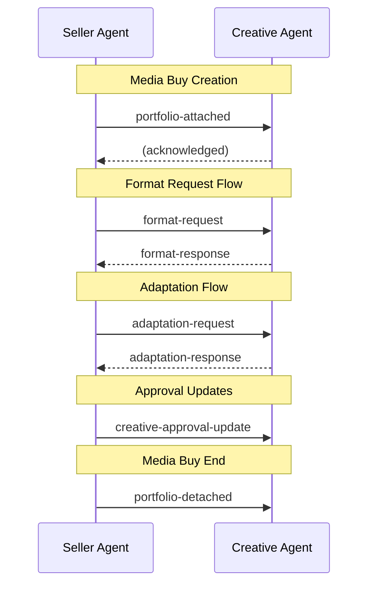

Creative sets use webhooks for bidirectional communication between creative agents and seller agents. This enables real-time sync without polling.

## Webhook Flow



## Seller → Creative Agent

### portfolio-attached

Sent when a seller agent receives a media buy with a `portfolio_ref`. Registers the seller's interest and lists required formats.

```json
{
  "portfolio_id": "cs_abc123",
  "media_buy_id": "mb_12345",
  "seller_agent_url": "https://seller.example.com",
  "format_ids": [
    { "agent_url": "https://creative.adcontextprotocol.org", "id": "display_300x250" },
    { "agent_url": "https://creative.adcontextprotocol.org", "id": "display_728x90" }
  ],
  "callback_url": "https://seller.example.com/webhooks/creative-updates",
  "attached_at": "2025-01-15T10:00:00Z"
}
```

| Field | Required | Description |
|-------|----------|-------------|
| `portfolio_id` | Yes | The portfolio being attached |
| `media_buy_id` | Yes | The media buy this set is attached to |
| `seller_agent_url` | Yes | URL of the seller agent |
| `format_ids` | No | Formats required for this media buy |
| `callback_url` | No | URL for creative agent to send updates |
| `attached_at` | No | Timestamp of attachment |

**Creative agent behavior:**
- Register the seller as a subscriber for this portfolio
- If `format_ids` contains formats not in the set and `allow_format_requests` is true, consider auto-building them
- Send creative updates to `callback_url` until detached

---

### portfolio-detached

Sent when a media buy ends, is cancelled, or the portfolio is replaced.

```json
{
  "portfolio_id": "cs_abc123",
  "media_buy_id": "mb_12345",
  "seller_agent_url": "https://seller.example.com",
  "reason": "media_buy_ended",
  "detached_at": "2025-02-15T10:00:00Z"
}
```

| Field | Required | Description |
|-------|----------|-------------|
| `portfolio_id` | Yes | The portfolio being detached |
| `media_buy_id` | Yes | The media buy this set was attached to |
| `seller_agent_url` | Yes | URL of the seller agent |
| `reason` | No | `media_buy_ended`, `media_buy_cancelled`, `creative_replaced`, `manual` |
| `detached_at` | No | Timestamp of detachment |

**Creative agent behavior:**
- Unsubscribe the seller from updates for this media buy
- Stop sending webhooks to the seller's callback URL

---

### format-request

Sent when a seller needs a format that doesn't exist in the portfolio. Only processed if `allow_format_requests` is true on the portfolio.

```json
{
  "portfolio_id": "cs_abc123",
  "format_id": { "agent_url": "https://creative.adcontextprotocol.org", "id": "display_728x90" },
  "media_buy_id": "mb_12345",
  "seller_agent_url": "https://seller.example.com",
  "callback_url": "https://seller.example.com/webhooks/format-ready",
  "priority": "normal",
  "requested_at": "2025-01-15T11:00:00Z"
}
```

| Field | Required | Description |
|-------|----------|-------------|
| `portfolio_id` | Yes | The portfolio to build from |
| `format_id` | Yes | The format to build |
| `media_buy_id` | Yes | The media buy this format is needed for |
| `seller_agent_url` | Yes | URL of the requesting seller |
| `callback_url` | No | URL to notify when ready |
| `priority` | No | `normal` (default) or `urgent` |
| `requested_at` | No | Request timestamp |

**Creative agent behavior:**
1. Validate `allow_format_requests` is true
2. Check if format can be built from available assets
3. Build the creative using the set's `generation_prompt`
4. Send `format-response` webhook when complete

---

### adaptation-request

Sent when a seller needs a variation of an existing creative (CTA change, localization, resize, etc.). Only processed if `allow_adaptation_requests` is true.

```json
{
  "portfolio_id": "cs_abc123",
  "source_creative_id": "cr_display_001",
  "media_buy_id": "mb_12345",
  "seller_agent_url": "https://seller.example.com",
  "adaptation_type": "cta_change",
  "parameters": {
    "cta_text": "Shop Now - 30% Off"
  },
  "callback_url": "https://seller.example.com/webhooks/adaptation-ready",
  "requested_at": "2025-01-15T12:00:00Z"
}
```

| Field | Required | Description |
|-------|----------|-------------|
| `portfolio_id` | Yes | The portfolio |
| `source_creative_id` | Yes | Creative to adapt from |
| `media_buy_id` | Yes | Media buy this is for |
| `seller_agent_url` | Yes | Requesting seller |
| `adaptation_type` | Yes | Type: `cta_change`, `copy_variant`, `localization`, `resize`, `custom` |
| `parameters` | No | Type-specific parameters |
| `callback_url` | No | Notification URL |

**Adaptation types and parameters:**

| Type | Parameters |
|------|------------|
| `cta_change` | `cta_text` |
| `copy_variant` | `headline`, `body_copy` |
| `localization` | `locale` |
| `resize` | `target_format_id` |
| `custom` | `prompt` |

---

### creative-approval-update

Sent when the seller's approval status for a creative changes.

```json
{
  "portfolio_id": "cs_abc123",
  "creative_id": "cr_display_001",
  "media_buy_id": "mb_12345",
  "seller_agent_url": "https://seller.example.com",
  "status": "approved",
  "updated_at": "2025-01-15T13:00:00Z"
}
```

| Field | Required | Description |
|-------|----------|-------------|
| `portfolio_id` | Yes | The portfolio |
| `creative_id` | Yes | The creative being approved/rejected |
| `media_buy_id` | Yes | Media buy this applies to |
| `seller_agent_url` | Yes | Seller making the decision |
| `status` | Yes | `pending`, `approved`, `rejected` |
| `rejection_reason` | No | Reason if rejected |
| `updated_at` | No | Update timestamp |

---

## Creative Agent → Seller

### format-response

Sent after processing a `format-request`.

```json
{
  "portfolio_id": "cs_abc123",
  "creative_id": "cr_display_002",
  "format_id": { "agent_url": "https://creative.adcontextprotocol.org", "id": "display_728x90" },
  "media_buy_id": "mb_12345",
  "status": "ready",
  "completed_at": "2025-01-15T11:05:00Z"
}
```

| Field | Required | Description |
|-------|----------|-------------|
| `portfolio_id` | Yes | The portfolio |
| `creative_id` | No | New creative ID (if successful) |
| `format_id` | Yes | The requested format |
| `media_buy_id` | Yes | The media buy |
| `status` | Yes | `ready`, `failed`, `pending_approval` |
| `error` | No | Error details if failed |
| `completed_at` | No | Completion timestamp |

**Status values:**
- `ready` - Creative is built and available via `get_portfolio`
- `failed` - Build failed (see `error` field)
- `pending_approval` - Built but awaiting advertiser/governance approval

---

### adaptation-response

Sent after processing an `adaptation-request`.

```json
{
  "portfolio_id": "cs_abc123",
  "creative_id": "cr_display_003",
  "source_creative_id": "cr_display_001",
  "adaptation_type": "cta_change",
  "media_buy_id": "mb_12345",
  "status": "ready",
  "completed_at": "2025-01-15T12:05:00Z"
}
```

| Field | Required | Description |
|-------|----------|-------------|
| `portfolio_id` | Yes | The portfolio |
| `creative_id` | No | New creative ID (if successful) |
| `source_creative_id` | Yes | Original creative |
| `adaptation_type` | Yes | Type of adaptation |
| `media_buy_id` | Yes | The media buy |
| `status` | Yes | `ready`, `failed`, `pending_approval` |
| `error` | No | Error details if failed |
| `completed_at` | No | Completion timestamp |

## Security Considerations

### Authentication

Webhooks should be authenticated. Options:
1. **Shared secret** - Include HMAC signature in headers
2. **Bearer token** - Use token from `portfolio_ref.authentication`
3. **Mutual TLS** - Certificate-based authentication

### Idempotency

Webhook receivers should handle duplicate deliveries:
- Use `portfolio_id` + `media_buy_id` + timestamp for deduplication
- Respond with 200 even if already processed

### Retry Policy

Webhook senders should retry on failure:
- Retry 3-5 times with exponential backoff
- Stop retrying after `portfolio-detached` received
