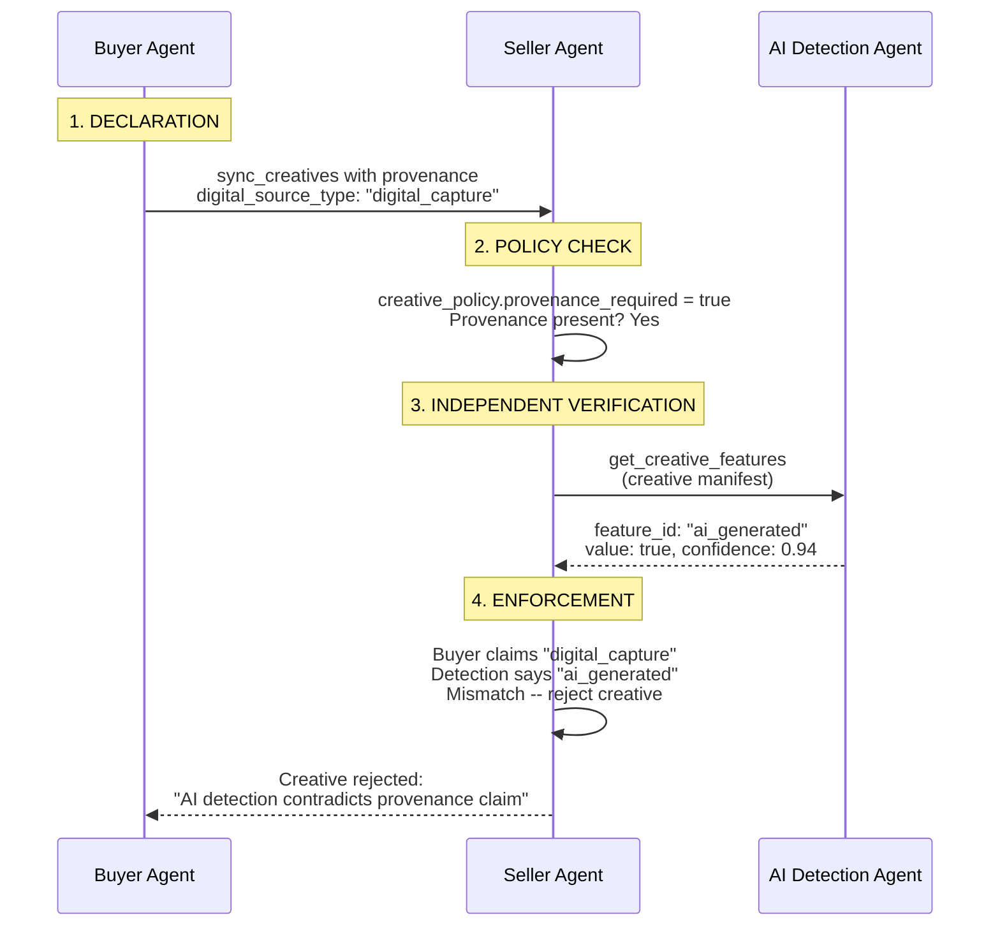

Provenance metadata declares how creative content was produced — whether AI was involved, which tools were used, and what disclosure obligations apply. As regulations like the EU AI Act and California SB 942 require machine-readable AI disclosure in advertising, AdCP carries this metadata at the protocol level so every party in the supply chain can declare, transmit, and verify it using the same structure. Provenance attaches to creative manifests, individual assets, or content-standards artifacts. It is a claim by the declaring party — receiving parties verify claims independently using their own detection tools.

<Info>
EU AI Act Article 50 enforcement begins August 2026. California SB 942 is already in effect. Major platforms mandate AI content labeling today. AdCP's provenance metadata provides the structured, machine-readable disclosure that these regulations require — carried through the programmatic supply chain where no standard for it previously existed.
</Info>

## The provenance object

Provenance is an optional object that can attach to creative assets, creative manifests, individual typed assets, and content artifacts. No fields are required at the provenance level -- each section is independently useful.

**Schema**: [provenance.json](https://adcontextprotocol.org/schemas/latest/core/provenance.json)

| Field | Type | Description |
|-------|------|-------------|
| `digital_source_type` | enum | IPTC-aligned classification of AI involvement |
| `ai_tool` | object | AI system used (`name` required, plus optional `version` and `provider`) |
| `human_oversight` | enum | Level of human involvement in the creation process |
| `declared_by` | object | Party attaching this provenance claim (`role` required, plus optional `agent_url`) |
| `created_time` | string (date-time) | When the content was created (ISO 8601) |
| `c2pa` | object | C2PA Content Credentials reference (`manifest_url` required) |
| `disclosure` | object | Regulatory disclosure requirements and jurisdiction details |
| `verification` | array | Third-party verification or detection results |
| `ext` | object | Standard extension point |

### Full example

```json
{
  "$schema": "/schemas/core/provenance.json",
  "digital_source_type": "trained_algorithmic_media",
  "ai_tool": {
    "name": "DALL-E 3",
    "version": "3.0",
    "provider": "OpenAI"
  },
  "human_oversight": "selected",
  "declared_by": {
    "agent_url": "https://creative.pinnaclemedia.example.com",
    "role": "agency"
  },
  "created_time": "2026-02-15T14:30:00Z",
  "c2pa": {
    "manifest_url": "https://cdn.pinnaclemedia.example.com/c2pa/manifests/hero_img_abc123.c2pa"
  },
  "disclosure": {
    "required": true,
    "jurisdictions": [
      {
        "country": "US",
        "region": "CA",
        "regulation": "ca_sb_942",
        "label_text": "Created with AI"
      },
      {
        "country": "DE",
        "regulation": "eu_ai_act_article_50",
        "label_text": "KI-generiert"
      }
    ]
  },
  "verification": [
    {
      "verified_by": "Reality Defender",
      "verified_time": "2026-02-15T15:00:00Z",
      "result": "ai_generated",
      "confidence": 0.97,
      "details_url": "https://realitydefender.example.com/reports/abc123"
    }
  ]
}
```

## Digital source type

The `digital_source_type` enum classifies AI involvement in content production, aligned with the [IPTC digitalsourcetype vocabulary](https://cv.iptc.org/newscodes/digitalsourcetype/).

**Schema**: [digital-source-type.json](https://adcontextprotocol.org/schemas/latest/enums/digital-source-type.json)

| Value | Description | When to use |
|-------|-------------|-------------|
| `digital_capture` | Captured by a digital device (camera, scanner, screen recording) with no AI involvement | Photos from a product shoot, screen recordings of app demos |
| `digital_creation` | Created by a human using digital tools (Photoshop, Illustrator, After Effects) without AI generation | Hand-designed banner ads, manually composed layouts |
| `trained_algorithmic_media` | Generated entirely by a trained AI model (DALL-E, Midjourney, Stable Diffusion, Sora) | AI-generated hero images, AI-produced video spots |
| `composite_with_trained_algorithmic_media` | Human-created content combined with AI-generated elements | Product photo with AI-generated background, human-shot video with AI visual effects |
| `algorithmic_media` | Produced by deterministic algorithms without machine learning (procedural generation, rule-based systems) | Programmatic visualizations, procedural pattern generation |
| `composite_capture` | Multiple digital captures composited together without AI | Panoramic stitching, multi-exposure HDR composites |
| `composite_synthetic` | Composite of multiple elements where at least one is AI-generated | Stock photo composited with AI-generated background, AI text overlay on captured video |
| `human_edits` | Content augmented, corrected, or enhanced by humans using non-generative tools | Color-corrected product photography, manually retouched portraits, human copy editing |
| `data_driven_media` | Assembled from structured data feeds (DCO templates, product catalogs, weather-triggered variants) | Dynamic creative optimization, catalog-driven product carousels, weather-responsive ads |

### Choosing the right value

For mixed-production creatives, choose the value that best describes the **overall creative** at the level where provenance is attached. If you need to distinguish AI involvement per-asset, attach provenance at the individual asset level instead (see [Inheritance](#inheritance) below).

Common patterns:

- **AI image + human copy**: Attach `trained_algorithmic_media` to the image asset, `digital_creation` to the text asset, and `composite_with_trained_algorithmic_media` at the manifest level
- **DCO with AI-generated headlines**: `data_driven_media` at the manifest level, `trained_algorithmic_media` on the AI-generated text assets
- **Human photographer + AI background removal**: `composite_with_trained_algorithmic_media` at the manifest level

## Human oversight

The `human_oversight` enum describes the level of human involvement in an AI-assisted creation process.

| Value | Description |
|-------|-------------|
| `none` | Fully automated with no human involvement in generation |
| `prompt_only` | Human provided the prompt or instructions but did not review outputs |
| `selected` | Human selected from multiple AI-generated candidates |
| `edited` | Human edited or refined AI-generated output |
| `directed` | Human directed the creative process with AI as an assistive tool |

This field is relevant when `digital_source_type` indicates AI involvement. For non-AI content, omit it.

## Inheritance

Provenance attaches at three levels in the creative hierarchy. The most specific provenance wins, and replacement is **full-object** -- there is no field-level merging.

```
creative-asset.provenance        (1) default for the creative in the library
  creative-manifest.provenance   (2) default for this manifest
    individual asset .provenance (3) override for a specific asset
```

### Resolution rules

1. If an individual asset has `provenance`, use it
2. Otherwise, if the manifest has `provenance`, use it
3. Otherwise, if the creative asset has `provenance`, use it
4. Otherwise, no provenance is declared for that asset

### Example: mixed creative

A creative where the image is AI-generated but the copy is human-written. The manifest-level provenance covers the overall creative. The image asset overrides with its own, more specific provenance.

```json
{
  "$schema": "/schemas/core/creative-manifest.json",
  "format_id": {
    "agent_url": "https://creative.adcontextprotocol.org",
    "id": "display_300x250"
  },
  "provenance": {
    "digital_source_type": "composite_with_trained_algorithmic_media",
    "declared_by": { "role": "agency" }
  },
  "assets": {
    "banner_image": {
      "url": "https://cdn.novabrands.example.com/hero_ai.jpg",
      "width": 300,
      "height": 250,
      "provenance": {
        "digital_source_type": "trained_algorithmic_media",
        "ai_tool": {
          "name": "DALL-E 3",
          "version": "3.0",
          "provider": "OpenAI"
        },
        "human_oversight": "selected",
        "declared_by": { "role": "agency" },
        "c2pa": {
          "manifest_url": "https://cdn.novabrands.example.com/c2pa/hero_ai.c2pa"
        }
      }
    },
    "headline": {
      "content": "Nutrition dogs love"
    },
    "clickthrough_url": {
      "url": "https://novabrands.example.com/products"
    }
  }
}
```

In this example:
- `banner_image` uses its own provenance: `trained_algorithmic_media` with full AI tool details
- `headline` inherits the manifest-level provenance: `composite_with_trained_algorithmic_media`
- `clickthrough_url` also inherits the manifest-level provenance

Note that the image's provenance is a complete replacement. Even though the manifest-level provenance has `declared_by`, the image asset must re-declare it in its own provenance object if that information should carry through.

### Artifact inheritance

For content artifacts (publisher content), the same pattern applies:

```
artifact.provenance                  (1) default for the artifact
  artifact.assets[].provenance       (2) override for a specific inline asset
```

```json
{
  "$schema": "/schemas/content-standards/artifact.json",
  "property_id": { "type": "domain", "value": "aimagazine.example.com" },
  "artifact_id": "article_ai_trends_2026",
  "provenance": {
    "digital_source_type": "digital_creation",
    "declared_by": { "role": "platform" }
  },
  "assets": [
    {
      "type": "text",
      "role": "title",
      "content": "AI trends reshaping the industry in 2026"
    },
    {
      "type": "image",
      "url": "https://cdn.aimagazine.example.com/illustration.jpg",
      "alt_text": "Conceptual illustration of neural networks",
      "provenance": {
        "digital_source_type": "trained_algorithmic_media",
        "ai_tool": { "name": "Midjourney", "version": "v7" },
        "human_oversight": "directed",
        "declared_by": { "role": "platform" }
      }
    }
  ]
}
```

The article text inherits `digital_creation` from the artifact. The illustration overrides with its own `trained_algorithmic_media` provenance.

## Trust model

<Warning>
Provenance is a **claim** by the declaring party. It is not proof. The enforcing party should verify independently.
</Warning>

In advertising, the party declaring provenance and the party enforcing it have competing incentives. A buyer submitting a creative has reason to claim the content is human-made — AI-generated creatives may face placement restrictions, mandatory disclosure labels, or outright rejection on certain inventory. A seller accepting that creative has the opposite incentive: publishing AI-generated content without proper disclosure creates regulatory liability for the publisher, not the advertiser. AdCP handles this tension by treating provenance as a claim, not a fact. The buyer declares; the seller verifies. Verification happens at each enforcement point independently, using AI detection services (via `get_creative_features`), C2PA manifest validation, or both. No party needs to trust any other party's assertion. The protocol provides the structure for claims and the integration points for verification — the supply chain provides the adversarial pressure that keeps both honest.

The `declared_by` field identifies who attached the provenance claim. The `verification` array carries any detection results the declaring party wants to disclose. But the party enforcing a provenance requirement runs its own verification through existing governance infrastructure.



### Declaring party roles

| Role | Description |
|------|-------------|
| `creator` | The party that created or generated the content |
| `advertiser` | The brand or advertiser that owns the content |
| `agency` | Agency acting on behalf of the advertiser |
| `platform` | Ad platform or publisher that processed the content |
| `tool` | Automated tool or service that attached provenance metadata |

### Buyer-attached verification

The `verification` array on the provenance object lets the declaring party share detection results for transparency. Multiple services can independently evaluate the same content:

```json
{
  "verification": [
    {
      "verified_by": "Hive Moderation",
      "verified_time": "2026-02-15T15:00:00Z",
      "result": "ai_generated",
      "confidence": 0.96,
      "details_url": "https://hive.example.com/reports/abc123"
    },
    {
      "verified_by": "Reality Defender",
      "verified_time": "2026-02-15T15:05:00Z",
      "result": "ai_generated",
      "confidence": 0.93
    }
  ]
}
```

These results are **supplementary**. A seller that requires provenance verification runs its own detection through [`get_creative_features`](/docs/governance/creative/get_creative_features) rather than trusting the buyer's attached results.

Verification results use one of four outcomes:

| Result | Description |
|--------|-------------|
| `authentic` | Content verified as non-AI-generated |
| `ai_generated` | Content detected as AI-generated |
| `ai_modified` | Content detected as AI-modified (original non-AI content with AI alterations) |
| `inconclusive` | Detection was unable to reach a confident determination |

### Example: provenance through a campaign

Acme Brands is running a spring campaign. Their agency, Meridian Media, uses an AI image generator to produce a set of display banners — photorealistic product shots with AI-generated backgrounds. Meridian attaches provenance to the creative manifest: `digital_source_type` is `composite_with_trained_algorithmic_media`, `ai_tool` identifies the generator, and `disclosure.required` is `true` with `eu_ai_act_article_50` and `ca_sb_942` listed as applicable regulations.

The campaign is submitted to Pinnacle Publishing through AdCP. Pinnacle's ad operations platform checks the provenance claim, then runs the creative through its verification pipeline via `get_creative_features`. The AI detection service returns `ai_modified` with 0.94 confidence — consistent with the declared source type. Pinnacle's system confirms the claim, applies the required disclosure label to the ad unit, and clears the creative for serving. The provenance metadata, the detection result, and the disclosure decision are all recorded and auditable.

If Meridian had declared `digital_capture` instead — claiming no AI involvement — Pinnacle's detection service would have flagged the inconsistency. The creative would be held for review, not served.

## C2PA integration

The `c2pa` field provides a soft reference to [C2PA Content Credentials](https://c2pa.org/) -- the cryptographic provenance standard developed by the Coalition for Content Provenance and Authenticity.

```json
{
  "c2pa": {
    "manifest_url": "https://cdn.acmecorp.example.com/c2pa/manifests/hero_abc123.c2pa"
  }
}
```

### Why a URL reference

C2PA bindings are typically embedded in the media file itself. But ad tech pipelines routinely transcode, resize, and reformat creative assets -- breaking file-level C2PA bindings in the process. A URL reference to the original C2PA manifest store survives this transcoding, preserving the chain of provenance through the supply chain.

The reference is a pointer, not a replacement for C2PA. Any party in the chain can fetch the manifest from the URL and verify the original content credentials, even after the media file has been transcoded.

### Usage pattern

1. Creator generates content and produces a C2PA manifest
2. Creator uploads the manifest store to a stable URL
3. Creator attaches the `manifest_url` in AdCP provenance
4. Downstream parties (agencies, platforms, sellers) can verify the original credentials at any time by fetching the manifest

## Disclosure requirements

The `disclosure` object declares regulatory obligations for AI-generated content.

```json
{
  "disclosure": {
    "required": true,
    "jurisdictions": [
      {
        "country": "US",
        "region": "CA",
        "regulation": "ca_sb_942",
        "label_text": "Created with AI"
      },
      {
        "country": "DE",
        "regulation": "eu_ai_act_article_50",
        "label_text": "KI-generiert"
      },
      {
        "country": "CN",
        "regulation": "cn_deep_synthesis",
        "label_text": "AI-generated content"
      }
    ]
  }
}
```

| Field | Required | Description |
|-------|----------|-------------|
| `required` | Yes | Whether AI disclosure is required based on applicable regulations |
| `jurisdictions` | No | Array of jurisdictions where disclosure obligations apply |
| `jurisdictions[].country` | Yes | ISO 3166-1 alpha-2 country code |
| `jurisdictions[].region` | No | Sub-national region code (e.g., `CA` for California) |
| `jurisdictions[].regulation` | Yes | Regulation identifier |
| `jurisdictions[].label_text` | No | Required disclosure label text in the local language |

### Known regulation identifiers

| Identifier | Regulation | Status |
|------------|-----------|--------|
| `eu_ai_act_article_50` | EU AI Act Article 50 | Enforcement August 2026 |
| `ca_sb_942` | California SB 942 | Live since January 2026 |
| `cn_deep_synthesis` | China Deep Synthesis Provisions | In effect |

Regulation identifiers are conventions, not a closed enum. New regulations can be referenced without protocol changes.

## Creative policy enforcement

Sellers can require provenance on submitted creatives through the `provenance_required` field in `creative-policy`:

```json
{
  "$schema": "/schemas/core/creative-policy.json",
  "co_branding": "optional",
  "landing_page": "any",
  "templates_available": false,
  "provenance_required": true
}
```

When `provenance_required` is `true`:

1. Buyers must attach provenance to creative submissions
2. The seller may independently verify claims via `get_creative_features`
3. Creatives without provenance are rejected

This field is surfaced in product discovery through `get_products`, so buyers know the requirement before submitting creatives.

## Where provenance attaches

| Schema | Field | Description |
|--------|-------|-------------|
| `creative-asset` | `provenance` | Default for the creative in the library |
| `creative-manifest` | `provenance` | Default for all assets in this manifest |
| `image-asset` | `provenance` | Override for a specific image |
| `video-asset` | `provenance` | Override for a specific video |
| `audio-asset` | `provenance` | Override for a specific audio file |
| `text-asset` | `provenance` | Override for specific text content |
| `html-asset` | `provenance` | Override for HTML content |
| `css-asset` | `provenance` | Override for CSS content |
| `javascript-asset` | `provenance` | Override for JavaScript content |
| `vast-asset` | `provenance` | Override for a VAST tag |
| `daast-asset` | `provenance` | Override for a DAAST tag |
| `url-asset` | `provenance` | Override for a URL asset |
| `artifact` | `provenance` | Default for the content artifact |
| `artifact.assets[]` (text, image, video, audio) | `provenance` | Override for a specific inline asset |

## Schema reference

| Schema | Location |
|--------|----------|
| Provenance object | [`/schemas/core/provenance.json`](https://adcontextprotocol.org/schemas/latest/core/provenance.json) |
| Digital source type enum | [`/schemas/enums/digital-source-type.json`](https://adcontextprotocol.org/schemas/latest/enums/digital-source-type.json) |
| Creative asset (with provenance) | [`/schemas/core/creative-asset.json`](https://adcontextprotocol.org/schemas/latest/core/creative-asset.json) |
| Creative manifest (with provenance) | [`/schemas/core/creative-manifest.json`](https://adcontextprotocol.org/schemas/latest/core/creative-manifest.json) |
| Creative policy (provenance_required) | [`/schemas/core/creative-policy.json`](https://adcontextprotocol.org/schemas/latest/core/creative-policy.json) |
| Artifact (with provenance) | [`/schemas/content-standards/artifact.json`](https://adcontextprotocol.org/schemas/latest/content-standards/artifact.json) |

## Related

- [Provenance verification](/docs/governance/creative/provenance-verification) -- How the governance infrastructure verifies AI provenance claims
- [Creative Governance](/docs/governance/creative/index) -- Feature-based creative evaluation via `get_creative_features`
- [Content Standards](/docs/governance/content-standards/index) -- Privacy-preserving brand suitability for publisher content
- [Generative Creative](/docs/creative/generative-creative) -- AI-powered creative generation with `build_creative`
