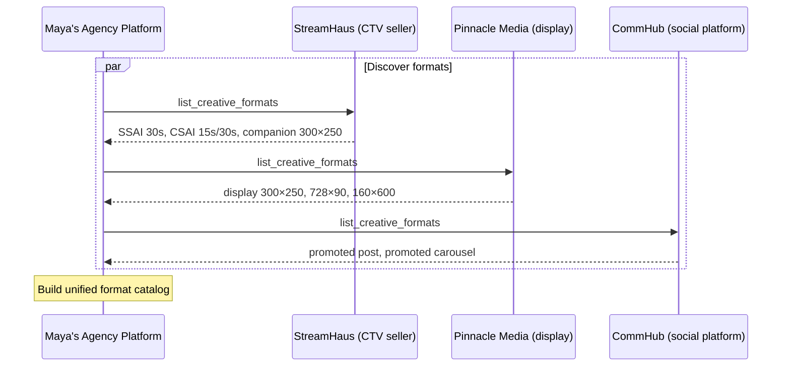
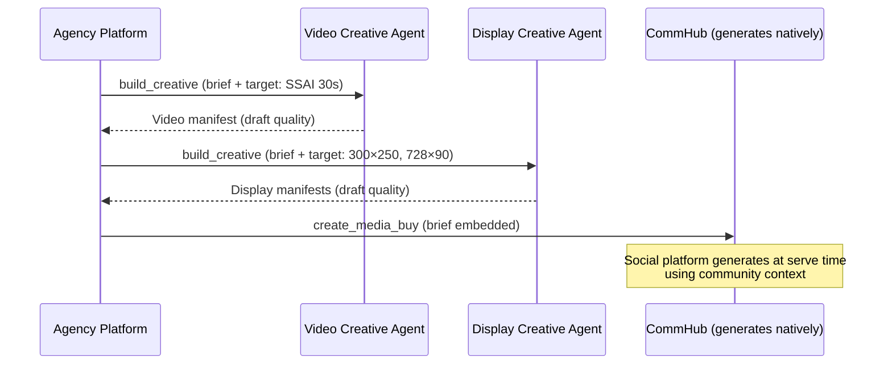
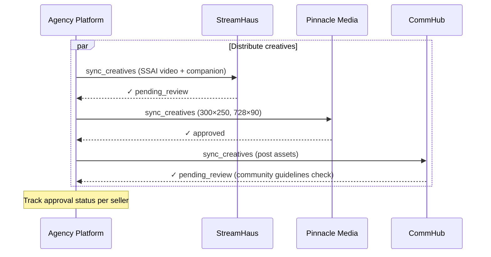
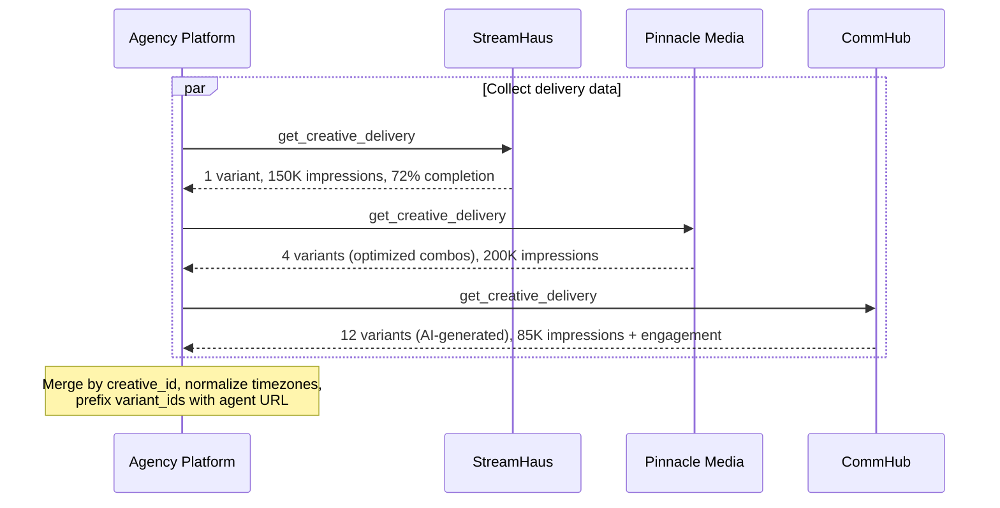

Maya is a creative strategist at a mid-size agency. She's launching a holiday campaign for Acme Outdoor across three channels: CTV, display, and social. She has one brief. She needs it running everywhere by Friday.

This walkthrough follows her journey through AdCP — from brief to delivery reporting — showing how the protocol connects creative tools, publishers, and AI agents into a single workflow.

## Step 1: Write the brief

Maya starts with what she knows best: the creative direction.


In AdCP, the brief is the `message` field on `build_creative`. Maya doesn't need to write JSON — her agency platform translates her direction into the protocol format:

```json
{
  "message": "Holiday campaign for Acme Outdoor. Warm, adventurous tone. Hero product: Trail Pro 3000 hiking boot. Key message: 'Gift the adventure.' Use brand colors and winter imagery.",
  "brand": { "domain": "acme-outdoor-example.com" },
  "quality": "draft"
}
```

The brand identity — colors, logos, typography, tone — lives at `acme-outdoor-example.com/.well-known/brand.json`. Every agent in the chain reads it from there. Maya's team maintains it once.

<Accordion title="Agency language → protocol terms">

| What Maya says | What the protocol calls it |
|---|---|
| Creative brief | `message` on `build_creative` |
| Brand guidelines | `brand.json` at `/.well-known/brand.json` |
| Comp / mockup | Preview (from `preview_creative`) |
| Final creative | Production-quality manifest |
| Trafficking | `sync_creatives` to each seller |
| Campaign report | `get_creative_delivery` across agents |

</Accordion>

## Step 2: Discover what each seller supports

Before generating anything, Maya's platform checks what formats each seller accepts. This happens automatically — but here's what's going on under the hood.

Her platform calls `list_creative_formats` on each connected agent:



Now Maya's platform knows: StreamHaus needs video files and VAST tags. Pinnacle needs display banners. CommHub needs feed-native content assets. One brief, three different output types.

## Step 3: Generate and preview


Maya's platform routes the brief to the right creative agents. A CTV specialist handles video. A display agent handles banners. The social platform generates feed-native content that matches each community's voice.



For CTV and display, Maya gets back draft-quality manifests she can preview immediately. For social, the platform will generate at serve time — but Maya can still preview what it would look like.


Maya asks to see the CTV spot in a living room context and the social post in two different communities:

```json
{
  "request_type": "single",
  "creative_manifest": { "...": "video manifest from build_creative" },
  "inputs": [
    { "name": "Living room primetime", "context_description": "CTV app, evening, family household" },
    { "name": "Mobile commute", "context_description": "Phone screen, morning, commuter" }
  ]
}
```

She reviews the drafts. The CTV spot needs a warmer color grade. She sends feedback via another `build_creative` call with an updated message. The agent iterates. This is the tissue session — fast, low-fidelity, focused on getting the direction right.

When Maya's happy, she promotes to production quality:

```json
{ "quality": "production" }
```

## Step 4: Distribute to sellers


Now the finished creatives need to reach each seller. Maya's platform calls `sync_creatives` on each one — same creative, adapted to each seller's required format:



Different sellers have different review processes. Pinnacle auto-approves based on brand safety rules. StreamHaus and CommHub do manual review. Maya's platform tracks approval state per seller — a creative approved on one and pending on another is normal, not an error.

CommHub also checks community guidelines beyond standard ad policy. If a promoted post is rejected from a specific community, `list_creatives` shows the `rejection_reason` referencing that community's rules.

## Step 5: Campaign runs — AI generates variants

The campaign goes live. Here's where it gets interesting.

On StreamHaus, the CTV spot runs as-is — one creative, one variant (Tier 1). On Pinnacle, the display ads run with asset group optimization — the platform tests different headline and image combinations (Tier 2). On CommHub, the social platform generates promoted posts that match each community's voice and trending topics (Tier 3).

Maya doesn't manage any of this. The protocol handles it. But she can see everything that happened.

## Step 6: Review delivery and variants


One week in, Maya pulls delivery data. Her platform calls `get_creative_delivery` on each agent and merges the results:



The social platform's response includes engagement metrics in the `ext` field — upvotes, comments, shares — alongside standard delivery metrics. Display variants include the manifest showing which headline/image combination each variant used. CTV includes completion rates and quartile data.

## Step 7: Replay what ran


Maya wants to see exactly what CommHub's AI generated for the hiking community. She finds the top-performing variant in the delivery data and replays it:

```json
{
  "request_type": "variant",
  "variant_id": "gen_hiking_community_v3"
}
```

The platform renders exactly what was served — the generated headline, the community-adapted imagery, the engagement UI. Maya can see that the AI leaned into trail photography and used language that resonated with the hiking community. She takes this insight back to her next brief.

## The full picture


Every step uses a standard AdCP task. Every agent — creative tools, publishers, social platforms — speaks the same protocol. Maya writes one brief, and AdCP handles the rest: format adaptation, multi-agent routing, cross-seller distribution, variant tracking, and unified reporting.

## Try it yourself

- **Talk to Addie**: Ask "How do I run a multi-format campaign across CTV and social?" and walk through each step
- **Read the task references**: [build_creative](/docs/creative/task-reference/build_creative), [preview_creative](/docs/creative/task-reference/preview_creative), [sync_creatives](/docs/creative/task-reference/sync_creatives), [get_creative_delivery](/docs/creative/task-reference/get_creative_delivery)
- **Learn the creative tiers**: [Generative creative](/docs/creative/generative-creative) explains Tier 1 (standard), Tier 2 (optimization), and Tier 3 (generative) in depth
- **Build an orchestrator**: [Multi-agent orchestration](/docs/creative/multi-agent-orchestration) covers the engineering patterns behind Maya's platform
- **Get certified**: The [Buyer track](/docs/learning/tracks/buyer) teaches the full creative workflow through interactive modules
