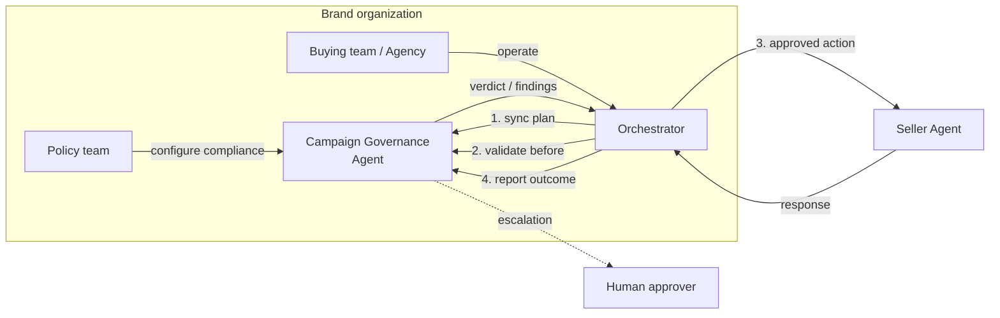

<Warning>
**Draft for AdCP 3.0** - Campaign Governance is under active development by the AgenticAdvertising.org Governance Working Group. Feedback welcome via [GitHub Discussions](https://github.com/adcontextprotocol/adcp/discussions).
</Warning>

# Campaign Governance Protocol

Campaign Governance provides automated validation for buy-side advertising transactions. When AI agents buy media autonomously, Campaign Governance acts as an independent review layer -- validating every action against authorized plans, brand policies, budget limits, and compliance requirements.

## The problem

The existing AdCP governance domains solve *where* ads run (Property Governance), *what content is adjacent* (Content Standards), *what creatives are safe* (Creative Governance), and *who the brand is* (Brand Protocol). None of them govern **what gets bought and why**.

As orchestrators become more autonomous -- running campaigns overnight, reallocating budgets across sellers, adjusting targeting in response to performance signals -- the gap between "agent decides" and "human approves" widens. Without a governance layer on the buy side:

- An agent could exceed authorized budgets or reallocate spend outside approved parameters
- Targeting could drift in ways that violate brand policy or create discriminatory patterns
- Campaign configuration could diverge from the approved plan without anyone noticing
- Seller responses could differ from what was requested, with no automated verification
- Compliance policies are fragmented -- copy-pasted as natural language strings into every campaign plan, with no standard library, no machine-readable format, and no separation between who defines policies and who executes campaigns

Campaign Governance fills this gap by providing a protocol for an independent governance agent to validate every buy-side action before it executes and verify outcomes after.

## How it works

The orchestrator pushes campaign plans via [`sync_plans`](/docs/governance/campaign/tasks/sync_plans), then calls [`validate_plan_action`](/docs/governance/campaign/tasks/validate_plan_action) before every action it sends to a seller. After receiving the seller's response, it calls [`report_plan_outcome`](/docs/governance/campaign/tasks/report_plan_outcome) to close the loop. The governance agent tracks budget from confirmed outcomes -- not just attempted actions.

The governance agent runs **buyer-side**. The brand's policy team configures it with compliance policies; the buying team (or agency) operates the orchestrator. The seller never sees governance requests.

## Separation of duties

Campaign Governance enforces an automated separation between **who defines policies** and **who executes campaigns**:

- The **policy team** selects applicable compliance policies from the [policy registry](#policy-resolution), configures brand-specific rules, and maintains the brand's compliance profile. This configuration lives at the brand level (in brand.json), not in individual campaign plans.
- The **buying team** (or agency) operates the orchestrator, creates campaign plans, and executes media buys. Plans specify campaign context -- budget, channels, flight dates, authorized markets -- but never carry compliance policies.
- The **governance agent** resolves applicable policies from the brand's compliance configuration and validates every orchestrator action against them.

The orchestrator cannot bypass or modify compliance policies because it does not carry them. When a regulation changes, the policy team updates the brand configuration once and all active campaigns pick up the change automatically.

## Policy resolution

The governance agent resolves applicable policies through the brand reference in the plan:

1. The plan includes `brand.domain` (required) and `countries`/`regions` (authorized markets for this campaign)
2. The governance agent resolves the brand via the [Brand Protocol](/docs/brand-protocol/index) and retrieves its compliance configuration
3. The brand configuration references standardized policies from the **policy registry** by ID and includes any custom brand-specific policies
4. The governance agent intersects these policies with the plan's authorized markets -- only policies applicable to those markets are active for this plan
5. The resolved policy set is what gets evaluated during `validate_plan_action`
6. Media buys targeting outside the authorized markets are rejected regardless of policy compliance

The **policy registry** is a community-maintained library of standardized, machine-readable advertising compliance policies -- covering jurisdictions (UK HFSS restrictions, US COPPA, EU GDPR), verticals (alcohol, pharma, gambling, financial services), and brand safety baselines. Brands select applicable policies from the registry rather than writing their own. See the [specification](/docs/governance/campaign/specification#brand-compliance-configuration) for details.

## The governance loop

Every seller interaction follows a before/after pattern:

1. **Before**: The orchestrator calls `validate_plan_action` with the tool and payload it intends to send. The governance agent returns a verdict.
2. **Execute**: If approved, the orchestrator sends the action to the seller.
3. **After**: The orchestrator calls `report_plan_outcome` with the seller's response. The governance agent updates its state and flags any discrepancies.

This pattern applies to discovery (`get_products`), purchase (`create_media_buy`, `update_media_buy`), and periodic delivery reporting.

## Lifecycle phases

Campaign Governance is stateful across three phases:

| Phase | When | What gets validated |
|-------|------|-------------------|
| **Discovery** | Before `get_products` | Search intent matches plan, products from authorized sellers, prices reasonable |
| **Purchase** | Before `create_media_buy` / `update_media_buy` | Budget within limits, targeting compliant, flight dates match, creative assignments appropriate |
| **Delivery** | Periodic reporting | Pacing within parameters, spend rate consistent, delivery metrics on track |

Each phase builds on context from earlier phases. During **purchase**, the governance agent knows which products were discovered (and approved) during **discovery**. During **delivery**, it monitors execution against what was purchased.

## Validation categories

| Category | What it checks |
|----------|---------------|
| `budget_authority` | Spend within authorized limits, per-seller concentration, reallocation magnitude |
| `strategic_alignment` | Channel mix, audience match, publisher quality tier, brief consistency |
| `bias_fairness` | Protected category targeting, audience composition, disparate impact |
| `regulatory_compliance` | Jurisdiction-specific regulations resolved from the brand's compliance configuration and the plan's authorized countries/regions |
| `seller_verification` | Configuration accuracy, undisclosed changes, delivery plausibility |
| `brand_policy` | Brand-level compliance policies resolved from the brand configuration and policy registry -- competitor separation, category adjacency, custom brand rules |

Governance agents declare which categories they evaluate via `get_adcp_capabilities`.

## Verdicts

Every validation returns a structured verdict:

| Verdict | Meaning | Orchestrator action |
|---------|---------|-------------------|
| `approved` | Passes all checks | Proceed |
| `rejected` | Violates a hard policy | Do not proceed; report to user |
| `modification_required` | Could pass with specific changes | Apply suggested modifications, re-validate |
| `escalated` | Requires human review | Pause and notify human approver |

Escalations use severity levels:

- **`info`** -- Logged for audit, no action required
- **`warning`** -- Agent may proceed but human should review within a deadline
- **`critical`** -- Agent must not proceed until human approves

Human escalation integrates with the existing AdCP HITL mechanism. An escalated action returns `input-required` status in the protocol envelope, and the orchestrator pauses until the human resolves it via the standard `context_id` continuation.

## Relationship to other governance domains

Campaign Governance composes with the existing domains -- it does not duplicate them:

| Domain | Relationship |
|--------|-------------|
| **[Property Governance](/docs/governance/property/index)** | Campaign Governance validates that the orchestrator *uses* property lists correctly (e.g., not bypassing them). Property Governance provides the lists. |
| **[Content Standards](/docs/governance/content-standards/index)** | Campaign Governance validates that content standards references are included in media buys. Content Standards handles the actual content evaluation. |
| **[Creative Governance](/docs/governance/creative/index)** | Campaign Governance validates that creative assignments match format requirements. Creative Governance scans the creatives themselves. |
| **[Brand Protocol](/docs/brand-protocol/index)** | Campaign Governance resolves the brand's compliance configuration via the Brand Protocol. The brand's policy team configures compliance policies in brand.json; the governance agent applies them automatically. |

## Industry precedent

Campaign Governance formalizes patterns that exist in ad tech today as manual processes:

| Manual process | Campaign Governance equivalent |
|---------------|-------------------------------|
| Agency trading desk QA | Automated validation against the IO |
| DSP pre-bid rules | Budget authority and targeting compliance checks |
| Advertiser approval workflows | Human escalation for high-risk actions |
| Post-campaign audit | Seller verification and delivery validation |
| Compliance review | Regulatory checks by jurisdiction |

## Next steps

<CardGroup cols={2}>
  <Card title="Specification" icon="file-lines" href="/docs/governance/campaign/specification">
    Data models, validation logic, capability declaration, and orchestrator integration patterns.
  </Card>
  <Card title="Tasks" icon="list-check" href="/docs/governance/campaign/tasks/index">
    Task reference: `sync_plans`, `validate_plan_action`, `report_plan_outcome`, and `get_plan_audit_logs`.
  </Card>
</CardGroup>
