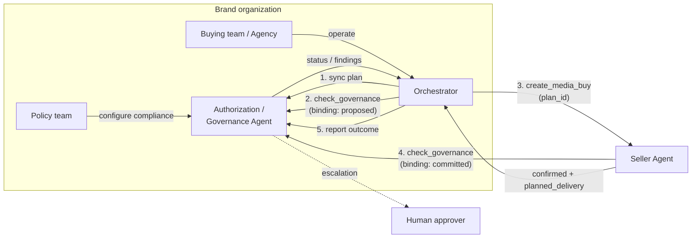

# Campaign Governance Protocol

Campaign Governance provides automated validation for buy-side advertising transactions. When AI agents buy media autonomously, Campaign Governance acts as an independent review layer -- validating every action against authorized plans, brand policies, budget limits, and compliance requirements.

## The problem

An AI agent interprets a brief, picks a seller, negotiates a media buy, and takes it live -- all without a human watching. This is the "no eyes" problem: autonomous agents making real financial commitments with no independent check that the purchase matches what was authorized.

The existing AdCP governance domains solve *where* ads run (Property Governance), *what content is adjacent* (Content Standards), *what creatives are safe* (Creative Governance), and *who the brand is* (Brand Protocol). None of them govern **what gets bought and why**.

Without a governance layer on the buy side:

- An agent could exceed authorized budgets or reallocate spend outside approved parameters
- The agent could misinterpret a brief -- buying in New Mexico when the brief said Mexico
- Targeting could drift in ways that violate brand policy or create discriminatory patterns
- Seller responses could differ from what was requested, with no automated verification
- Compliance policies are fragmented -- copy-pasted as natural language strings into every campaign plan, with no standard library and no separation between who defines policies and who executes campaigns

Campaign Governance fills this gap with three mechanisms: **plans** that define what's allowed (independent of the agent), **seller-side governance checks** that verify purchases independently of the buyer, and a **policy registry** that standardizes compliance rules across governance agents.

Governance supports incremental adoption through three operating modes: **audit** (log everything, never block), **advisory** (flag issues for post-hoc review), and **enforce** (block on violations). Organizations can start in audit mode to build confidence before enabling enforcement.

### Industry precedent

Campaign Governance formalizes patterns that exist in ad tech today as manual processes:

| Manual process | Campaign Governance equivalent |
|---------------|-------------------------------|
| Agency trading desk QA | Automated validation against the IO |
| DSP pre-bid rules | Budget authority and targeting compliance checks |
| Advertiser approval workflows | Human escalation for high-risk actions |
| Post-campaign audit | Seller verification and delivery validation |
| Compliance review | Regulatory checks by jurisdiction |

## How it works

The orchestrator pushes campaign plans via [`sync_plans`](/docs/governance/campaign/tasks/sync_plans), then calls [`check_governance`](/docs/governance/campaign/tasks/check_governance) with `binding: "proposed"` before every action it sends to a seller. The seller independently calls `check_governance` with `binding: "committed"` before executing. After receiving the seller's response, the orchestrator calls [`report_plan_outcome`](/docs/governance/campaign/tasks/report_plan_outcome) to close the loop. The governance agent tracks budget from confirmed outcomes -- not just attempted actions.

Three parties participate in campaign governance:

- The **orchestrator** validates actions against the plan before sending them to sellers (buyer-side governance loop).
- The **seller** independently checks purchases by calling the buyer's governance agent with its planned delivery parameters (seller-side governance check).
- The **governance agent** validates both the orchestrator's intended actions and the seller's planned delivery against the same campaign plan.

This creates a trust model where neither the buyer nor the seller can unilaterally misrepresent what was approved. The orchestrator cannot skip governance (the seller checks independently), and the seller cannot deliver something different from what was approved (the governance agent has a record of the planned delivery).

## Separation of duties

Campaign Governance enforces an automated separation between **who defines policies** and **who executes campaigns**:

- The **policy team** selects applicable compliance policies from the [policy registry](#policy-resolution), configures brand-specific rules, and maintains the brand's compliance profile. This configuration lives at the brand level (in brand.json), not in individual campaign plans.
- The **buying team** (or agency) operates the orchestrator, creates campaign plans, and executes media buys. Plans specify campaign context -- budget, channels, flight dates, authorized markets -- and can reference additional registry policies or campaign-specific rules when needed.
- The **governance agent** resolves applicable policies from the brand's compliance configuration and validates every orchestrator action against them.

The orchestrator cannot bypass or modify the brand's compliance policies -- those are resolved from the brand configuration by the governance agent. Plans can layer on additional policies via `policy_ids` and `custom_policies`, but the brand's baseline always applies. When a regulation changes, the policy team updates the brand configuration once and all active campaigns pick up the change automatically.

## Policy resolution

The governance agent resolves applicable policies through the brand reference in the plan:

1. The plan includes `brand.domain` (required) and optionally `countries`/`regions` (authorized markets for this campaign)
2. The governance agent resolves the brand via the [Brand Protocol](/docs/brand-protocol/index) and retrieves its compliance configuration
3. The brand configuration references standardized policies from the **policy registry** by ID and includes any custom brand-specific policies
4. The governance agent intersects these policies with the plan's authorized markets -- only policies applicable to those markets are active for this plan
5. The resolved policy set is what gets evaluated during `check_governance`
6. Media buys targeting outside the authorized markets are denied regardless of policy compliance

The **[policy registry](/docs/governance/policy-registry)** is a community-maintained library of standardized, machine-readable advertising compliance policies -- covering jurisdictions (UK HFSS restrictions, US COPPA, EU GDPR), verticals (alcohol, pharma, gambling, financial services), and brand safety baselines. Brands select applicable policies from the registry rather than writing their own.

## The governance loop

Every seller interaction follows a before/after pattern:

1. **Before**: The orchestrator calls `check_governance` with `binding: "proposed"`, the tool, and payload it intends to send. The governance agent returns a status.
2. **Execute**: If approved, the orchestrator sends the action to the seller, including `plan_id` and `buyer_campaign_ref`.
3. **Check**: If the account has `governance_agents`, the seller calls `check_governance` with `binding: "committed"` and its `planned_delivery` -- what it will actually run. The governance agent approves or denies.
4. **After**: The orchestrator calls `report_plan_outcome` with the seller's response. The governance agent updates its state and flags any discrepancies.

This pattern applies to discovery (`get_products`), purchase (`create_media_buy`, `update_media_buy`), and periodic delivery reporting.

## Planned delivery

When a seller confirms a media buy, it returns a `planned_delivery` object describing what it will actually deliver -- the geographic targeting, channels, flight dates, frequency caps, and budget it will use. This may differ from what the buyer requested (e.g., the seller may apply additional frequency caps or adjust geo to match available inventory).

`planned_delivery` serves two purposes:

1. **Governance check**: The seller sends `planned_delivery` to the buyer's governance agent, which confirms it matches the campaign plan. This prevents the seller from delivering something the buyer didn't approve.
2. **Discrepancy detection**: The buyer can compare `planned_delivery` against the original request and flag differences via `report_plan_outcome`, catching configuration drift before delivery begins.

## Seller-side governance checks

Buyer-side governance has a trust limitation: the orchestrator attests to its own compliance. An LLM agent could hallucinate governance approval, skip validation, or misrepresent what was validated. You can't trust the agent that's spending money to also be the one that checks whether spending that money is OK.

Seller-side governance checks solve this. The buyer registers `governance_agents` (URLs with credentials) when syncing accounts. When the seller receives a `create_media_buy`, it calls the governance agent with what it plans to deliver. The governance agent checks against the plan and returns `approved`, `denied`, or `conditions`.

This also catches misinterpretation. If the brief says "Mexico" and the seller interprets it as "New Mexico," the governance agent sees the geo mismatch against the plan and denies the buy -- before it goes live.

The webhook covers the full media buy lifecycle:

- **Purchase**: POST before confirming `create_media_buy` -- is this buy approved?
- **Modification**: POST before confirming `update_media_buy` -- is this change OK?
- **Delivery**: POST periodically during delivery -- is delivery still on track?

The governance agent maintains all state. The seller just posts what's happening -- no chaining, no conversation history, no state to track across servers.

Governance checks are optional at every phase. Sellers can start with purchase-only (one POST per buy) and add modification and delivery checks incrementally. See the [specification](/docs/governance/campaign/specification#governance-checks) for the full protocol.

Sellers that implement governance checks gain a competitive advantage: they can prove to buyers that purchases were independently verified before execution. This reduces dispute risk, automates compliance verification, and signals trust to buyers with strict oversight requirements.

## Adoption path

Campaign Governance supports three operating modes, configured on the governance agent by the buyer's policy team:

| Mode | Behavior | When to use |
|------|----------|-------------|
| `audit` | Log all checks, never block. Always returns `approved` with findings attached. | Initial rollout. Build confidence in calibration before enabling enforcement. |
| `advisory` | Return real statuses (`denied`, `conditions`, `escalated`) but the seller treats all responses as non-blocking. | Post-hoc human review. The governance agent expresses opinions; humans act on them. |
| `enforce` | Block on `denied` or `escalated`. Require resolution before proceeding. | Production governance. The default. |

Start in `audit` mode to see what governance would flag. Move to `advisory` to test findings with real campaigns. Switch to `enforce` when confidence is established. This works the same way for a single brand buying direct and for a holding company with 35 brands and multiple agency partners.

### For small brands

A brand buying direct (no agency, no policy team) still gets:
- Automated budget limits and geo enforcement from the campaign plan
- Compliance coverage from the [policy registry](/docs/governance/policy-registry) -- registry policies are community-maintained, no per-brand configuration required
- Seller-side verification via governance checks
- Full audit trail via `get_plan_audit_logs`

Set `authority_level: "agent_limited"` with a `reallocation_threshold` to define guardrails. The governance agent handles the rest.

### For multi-agency and holding company setups

Plans support [delegations](/docs/governance/campaign/specification#delegations) that scope which agents can execute against a plan -- by authority level, budget limit, market, and expiration. A brand can delegate `full` authority to one agency for European markets and `execute_only` authority to another for North America.

For holding companies managing multiple brands, [portfolio governance](/docs/governance/campaign/specification#portfolio-governance) defines cross-brand constraints: total portfolio spend caps, shared policy enforcement, and corporate-level exclusions that no individual brand plan can override.

### Finding confidence

Governance findings include optional [confidence scores](/docs/governance/campaign/specification#finding-confidence) (0-1) that distinguish "this definitely violates GDPR" (0.95) from "this might violate depending on how audience segments resolve" (0.6). This helps brands respond appropriately -- high-confidence findings can be auto-resolved, medium-confidence findings get flagged for human review.

### Drift detection

The [audit log](/docs/governance/campaign/tasks/get_plan_audit_logs) includes aggregate metrics -- escalation rate, auto-approval rate, human override rate -- with trend indicators. A declining escalation rate may mean the system is well-calibrated or that oversight is eroding. Surfacing the trend lets the organization make that call.

## Lifecycle phases

Campaign Governance is stateful across three phases:

| Phase | When | What gets validated |
|-------|------|-------------------|
| **Discovery** | Before `get_products` | Search intent matches plan, products from authorized sellers, prices reasonable |
| **Purchase** | Before `create_media_buy` / `update_media_buy` | Budget within limits, targeting compliant, flight dates match, creative assignments appropriate |
| **Delivery** | Periodic reporting | Pacing within parameters, spend rate consistent, delivery metrics on track |

Each phase builds on context from earlier phases. During **purchase**, the governance agent knows which products were discovered (and approved) during **discovery**. During **delivery**, it monitors execution against what was purchased.

## Validation categories

| Category | What it checks |
|----------|---------------|
| `budget_authority` | Spend within authorized limits, per-seller concentration, reallocation magnitude |
| `strategic_alignment` | Channel mix, audience match, publisher quality tier, brief consistency |
| `bias_fairness` | Protected category targeting, audience composition, disparate impact |
| `regulatory_compliance` | Jurisdiction-specific regulations resolved from the brand's compliance configuration and the plan's authorized countries/regions |
| `seller_verification` | Configuration accuracy, undisclosed changes, delivery plausibility |
| `brand_policy` | Brand-level compliance policies resolved from the brand configuration and policy registry -- competitor separation, category adjacency, custom brand rules |

Governance agents declare which categories they evaluate via `get_adcp_capabilities`.

## Statuses

Every governance check returns a structured status:

| Status | Meaning | Caller action |
|--------|---------|---------------|
| `approved` | Passes all checks | Proceed |
| `denied` | Violates a hard policy | Do not proceed; report to user |
| `conditions` | Could pass with specific changes | Apply conditions, re-call `check_governance` |
| `escalated` | Requires human review | Pause and notify human approver |

Finding severity levels indicate urgency:

- **`info`** -- Logged for audit. Used on `approved` responses for advisory findings.
- **`warning`** -- Human should review. Used on `approved` responses when action is allowed but attention is needed.
- **`critical`** -- Action is blocked. Used on `escalated` responses when human approval is required.

When the status is `escalated`, the caller MUST NOT proceed regardless of severity. Non-blocking concerns use `approved` status with `findings` attached.

Human escalation integrates with the existing AdCP HITL mechanism. An escalated action returns `input-required` status in the protocol envelope, and the orchestrator pauses until the human resolves it via the standard `context_id` continuation.

## Relationship to other governance domains

Campaign Governance composes with the existing domains -- it does not duplicate them:

| Domain | Relationship |
|--------|-------------|
| **[Property Governance](/docs/governance/property/index)** | Campaign Governance validates that the orchestrator *uses* property lists correctly (e.g., not bypassing them). Property Governance provides the lists. |
| **[Content Standards](/docs/governance/content-standards/index)** | Campaign Governance validates that content standards references are included in media buys. Content Standards handles the actual content evaluation. |
| **[Creative Governance](/docs/governance/creative/index)** | Campaign Governance validates that creative assignments match format requirements. Creative Governance scans the creatives themselves. |
| **[Brand Protocol](/docs/brand-protocol/index)** | Campaign Governance resolves the brand's compliance configuration via the Brand Protocol. The brand's policy team configures compliance policies in brand.json; the governance agent applies them automatically. |

## Next steps

<CardGroup cols={3}>
  <Card title="Safety model" icon="shield-check" href="/docs/governance/campaign/safety-model">
    How the three-party trust model, separation of duties, and structural controls make agentic advertising safe.
  </Card>
  <Card title="Specification" icon="file-lines" href="/docs/governance/campaign/specification">
    Data models, validation logic, capability declaration, and orchestrator integration patterns.
  </Card>
  <Card title="Tasks" icon="list-check" href="/docs/governance/campaign/tasks/index">
    Task reference: `sync_plans`, `check_governance`, `report_plan_outcome`, and `get_plan_audit_logs`.
  </Card>
</CardGroup>
