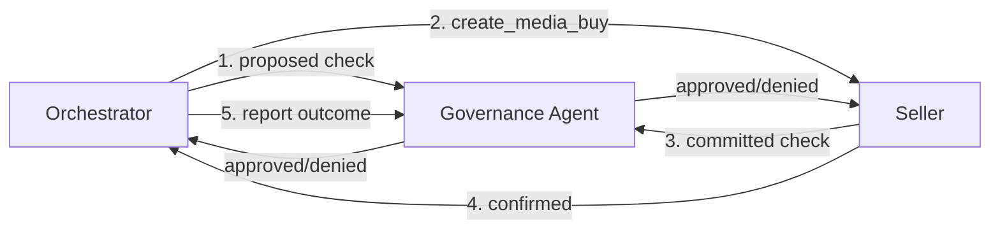

# Why agentic advertising is safe

Autonomous AI agents buying media raises a legitimate question: how do you trust software to spend real money on your behalf? Campaign Governance answers this with structural controls -- not by trusting any single agent, but by making it impossible for any single party to act unilaterally.

## Three-party trust model

Campaign Governance distributes validation across three independent parties:

1. The **orchestrator** checks its intended action against the plan before sending it to any seller (`binding: "proposed"`)
2. The **seller** independently checks its planned delivery against the same plan before executing (`binding: "committed"`)
3. The **governance agent** validates both sides against the campaign plan, maintaining state across the full lifecycle

No party grades its own homework. The orchestrator cannot skip governance because the seller checks independently. The seller cannot deliver something different from what was approved because the governance agent has a record of the planned delivery.

## Separation of duties

Three roles with non-overlapping responsibilities:

| Role | Responsibility | Cannot do |
|------|---------------|-----------|
| **Policy team** | Configure compliance policies, select registry policies, define brand rules | Execute campaigns or spend budget |
| **Buying team** | Create plans, operate orchestrator, execute media buys | Modify compliance policies or bypass governance |
| **Governance agent** | Validate actions against plans and policies, track budget, escalate violations | Initiate spending or modify plans |

The orchestrator cannot bypass compliance because it does not carry the policies -- they are resolved from the brand's configuration by the governance agent. When a regulation changes, the policy team updates the configuration once and all active campaigns pick up the change automatically.

## Crawl-walk-run adoption

Campaign Governance supports three operating modes so organizations can build confidence incrementally:

| Mode | What happens | Risk |
|------|-------------|------|
| **Audit** | Log everything, never block. Always returns `approved` with findings attached. | Zero. See what governance would flag without affecting live campaigns. |
| **Advisory** | Return real statuses (`denied`, `conditions`, `escalated`) but don't block execution. | Minimal. Humans review findings post-hoc and act on them. |
| **Enforce** | Block on violations. Require resolution before proceeding. | Production governance with full protection. |

Start in audit mode to evaluate false positive rates and calibrate policies. Move to advisory to test findings with real campaigns. Switch to enforce when confidence is established. The `mode` field on each governance check response lets audit trails distinguish "denied in advisory mode (action proceeded)" from "denied in enforce mode (action blocked)."

## Budget protection

Budget is committed based on confirmed outcomes, not intended actions:

1. `check_governance` with `binding: "proposed"` checks whether the spend fits the plan. No budget is committed.
2. The orchestrator sends the action to the seller.
3. `report_plan_outcome` reports the seller's confirmed amount. Only then is budget committed.

If a seller reduces the amount, the governance agent commits the actual amount and flags the discrepancy. If the action fails, the governance agent commits zero. Budget state reflects reality, not intent.

Concurrent media buys are handled through optimistic concurrency control or budget reservation, preventing concurrent approvals that together exceed the plan budget.

## Confidence and explainability

Governance findings include confidence scores (0 to 1) and explanations that distinguish certain violations from ambiguous ones:

- **High confidence (0.9+)**: Definitive violation. A GDPR breach on a campaign explicitly targeting EU users.
- **Medium confidence (0.6-0.9)**: Depends on context the governance agent cannot fully resolve. Audience segments that may include minors, geo targeting that partially overlaps regulated jurisdictions.
- **Low confidence (below 0.6)**: Speculative. Flagged for human review rather than acted on autonomously.

Every finding includes a human-readable `explanation` and structured `details` for programmatic consumption. Escalations include the `reason`, `severity`, and optionally the `approval_tier` needed to resolve them. Nothing is a black box.

## Drift detection

The audit log surfaces aggregate metrics that detect oversight erosion over time:

- **Escalation rate** -- fraction of checks escalated to humans, with trend direction
- **Auto-approval rate** -- fraction of checks approved without human intervention
- **Human override rate** -- fraction of escalations where the human disagreed with the governance agent

Organizations set thresholds on these metrics. When a threshold is breached, the governance agent includes a finding on the next check. A declining escalation rate may mean well-calibrated governance or eroding oversight -- the threshold breach surfaces the question so the organization can decide.

## Multi-brand and agency governance

For holding companies with multiple brands and agency partners:

- **Delegations** scope which agents can act on a plan, by authority level, budget limit, market, and expiration. A brand can grant `full` authority to one agency for Europe and `execute_only` to another for North America.
- **Portfolio governance** defines cross-brand constraints: total portfolio spend caps, shared policy enforcement, and corporate-level exclusions that no individual brand plan can override.

## For small brands

A brand buying direct with no agency and no policy team still gets:

- Automated budget limits and geo enforcement from the campaign plan
- Compliance coverage from the [policy registry](/docs/governance/policy-registry) -- community-maintained, no per-brand configuration required
- Seller-side verification via governance checks
- Full audit trail via `get_plan_audit_logs`

Set [`authority_level: "agent_limited"`](/docs/governance/campaign/specification#budget-authority-levels) with a `reallocation_threshold` to define guardrails. The governance agent handles the rest.

## Comparison to manual processes

| Manual process | Campaign Governance equivalent |
|---------------|-------------------------------|
| Agency trading desk QA | Automated validation against the plan |
| DSP pre-bid rules | Budget authority and targeting compliance checks |
| Advertiser approval workflows | Human escalation with `approval_tier` routing |
| Post-campaign audit | `get_plan_audit_logs` with drift metrics |
| Compliance review | Policy registry + jurisdiction-scoped validation |

The difference is that Campaign Governance applies these controls to every transaction, not just the ones that happen to get reviewed. Manual processes are sampling-based and retrospective. Campaign Governance is exhaustive and real-time.
