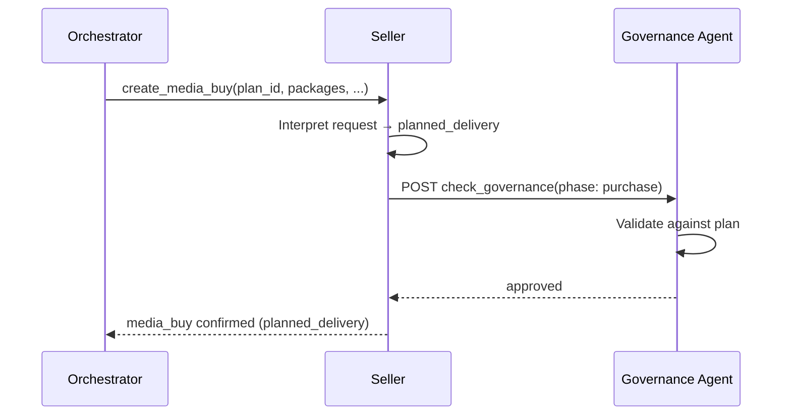
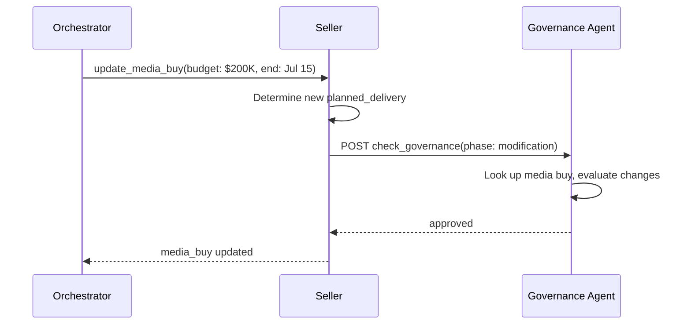
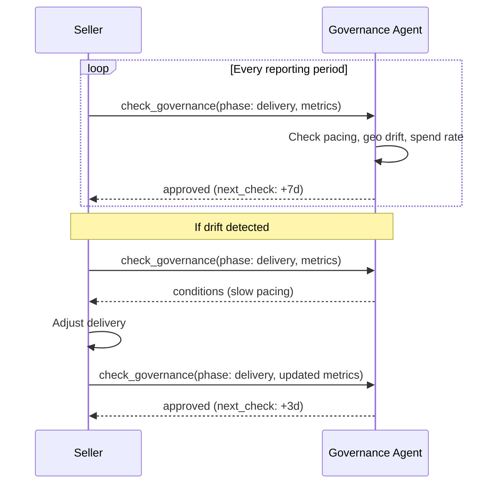
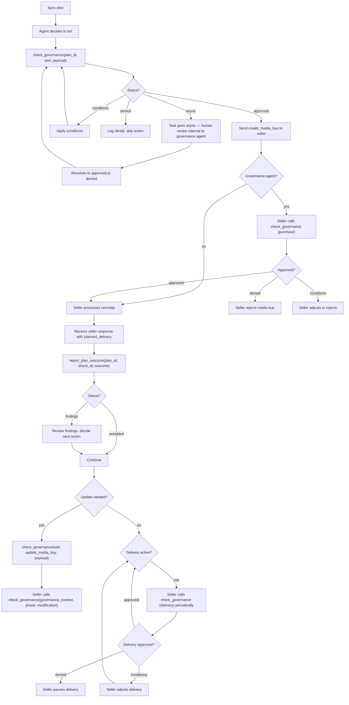

# Campaign Governance specification

**Status**: Request for Comments
**Last Updated**: March 2026

The key words "MUST", "MUST NOT", "REQUIRED", "SHALL", "SHALL NOT", "SHOULD", "SHOULD NOT", "RECOMMENDED", "MAY", and "OPTIONAL" in this document are to be interpreted as described in [RFC 2119](https://www.rfc-editor.org/rfc/rfc2119).

This document defines the data models, validation logic, and integration patterns for Campaign Governance.

## Campaign plan

The campaign plan is the source of truth for all validation. Plans are pushed to the governance agent via [`sync_plans`](/docs/governance/campaign/tasks/sync_plans) and define the plan parameters for a campaign -- budget limits, channels, flight dates, and plan markets. The governance agent resolves applicable policies from the brand's compliance configuration. Plans can also reference registry policies directly via `policy_ids` and include campaign-specific rules via `custom_policies`.

```json
{
  "plan_id": "plan_q1_2026_launch",
  "brand": {
    "domain": "acmecorp.com"
  },
  "objectives": "Drive awareness for spring product launch among 25-54 adults in the US, focusing on premium video and high-impact display.",
  "budget": {
    "total": 500000,
    "currency": "USD",
    "reallocation_threshold": 25000,
    "per_seller_max_pct": 40
  },
  "channels": {
    "required": ["olv"],
    "allowed": ["olv", "display", "ctv", "audio"],
    "mix_targets": {
      "olv": { "min_pct": 40, "max_pct": 70 },
      "display": { "min_pct": 10, "max_pct": 30 },
      "ctv": { "min_pct": 0, "max_pct": 20 },
      "audio": { "min_pct": 0, "max_pct": 10 }
    }
  },
  "flight": {
    "start": "2026-03-15T00:00:00Z",
    "end": "2026-06-15T00:00:00Z"
  },
  "countries": ["US"],
  "policy_ids": ["us_coppa", "alcohol_advertising"],
  "custom_policies": ["No competitor brand adjacency"],
  "approved_sellers": null,
  "ext": {}
}
```

### Purchase types

Governance plans govern all financial commitments, not just media buys. The `purchase_type` field on `check_governance` identifies which kind of commitment is being validated:

| Purchase type | Tool | What's governed |
|--------------|------|-----------------|
| `media_buy` (default) | `create_media_buy`, `update_media_buy` | Media inventory purchases |
| `rights_license` | `acquire_rights`, `update_rights` | Brand rights licensing fees |
| `signal_activation` | `activate_signal` | Data signal activation fees |
| `creative_services` | `build_creative` | Creative generation fees |

All purchase types share the same governance loop: `sync_plans` → `check_governance` → execute → `report_plan_outcome`. The governance agent validates budget authority, geo compliance, and flight compliance across all types. Media-buy-specific validations (channel compliance, seller concentration, delivery pacing) apply only when `purchase_type` is `media_buy` or when the payload contains the relevant fields.

When `purchase_type` is omitted, the governance agent assumes `media_buy`.

<Note>
**Future purchase types**: Content standards, property list curation, and measurement/verification services (brand lift studies, viewability, fraud detection) all carry `pricing_options` in their schemas and bill through `report_usage`. These services currently lack an explicit activation tool where the buyer commits to the service — the billing relationship is implicit. When the protocol adds activation surfaces for these services, corresponding purchase types will be added to enable governance checks at the point of commitment.
</Note>

### Budget reallocation

`budget.reallocation_threshold` (required number) governs budget reallocation autonomy. It does not cover mandatory human review of decisions that affect data subjects — for that, see the plan-level `human_review_required` field.

| Value | Meaning |
|-------|---------|
| `0` | Every reallocation requires human approval |
| positive number below `budget.total` | Agent may reallocate up to this amount without escalation; larger moves escalate for human review |
| equal to `budget.total` (or greater) | Agent may reallocate freely within the plan's total budget |

### Budget allocations

Plans can optionally partition the total budget across purchase types using `allocations`:

```json
{
  "budget": {
    "total": 500000,
    "currency": "USD",
    "reallocation_threshold": 25000,
    "allocations": {
      "media_buy": { "amount": 400000 },
      "rights_license": { "amount": 75000 },
      "signal_activation": { "amount": 25000 }
    }
  }
}
```

When `allocations` is present, the governance agent validates spend against both the per-type allocation and the overall total. When absent, all spend counts against the single total regardless of purchase type. Allocations are guardrails, not hard partitions — the sum of allocations MAY differ from the total.

When `allocations` is present but a purchase type is not listed (e.g., `signal_activation` is attempted against a plan that only allocates for `media_buy` and `rights_license`), the governance agent validates the action against the plan's total budget only. Unlisted types are not denied — they draw from the shared pool. To restrict spending to listed types only, set `custom_policies` with explicit constraints.

### Human review required

`human_review_required` is a plan-level boolean (default `false`) that mandates human oversight of every action on the plan, independent of budget reallocation autonomy.

The governance agent sets `human_review_required: true` automatically when any resolved policy or policy_category on the plan carries `requires_human_review: true`. This includes regulated verticals such as `fair_housing`, `fair_lending`, `fair_employment`, and `pharmaceutical_advertising`, and the `eu_ai_act_annex_iii` policy covering decisions in Annex III use cases.

When `human_review_required` is true, the governance agent MUST escalate any action on the plan for human review before execution — regardless of the plan's `reallocation_threshold`. A permissive reallocation threshold does not bypass human review when the plan carries `human_review_required: true`; the two dimensions compose.

This field is distinct from `budget.reallocation_threshold`:

| Field | Scope | Purpose |
|-------|-------|---------|
| `budget.reallocation_threshold` | Operational | Controls agent autonomy for budget reallocation within the plan |
| `human_review_required` | Regulatory | Mandates human review of decisions affecting individuals (e.g., GDPR Art 22, EU AI Act Annex III) |

Callers MAY set `human_review_required: true` explicitly on a plan even when no triggering policy is present. Callers MUST NOT set it to `false` to override a policy that requires human review — the governance agent re-evaluates the flag from resolved policies on every sync and overrides a caller-supplied `false` when a triggering policy is present.

### Spend-commit invocation

Buyer-side governance invocation is enforceable, not advisory. When a governance agent is configured on the plan, the buyer agent MUST invoke [`check_governance`](/docs/governance/campaign/tasks/check_governance) before sending any spend-commit request to a seller — full stop — producing an **intent-phase** `governance_context` token to attach to that request. The governance agent decides internally whether to auto-approve, apply conditions, deny, or escalate to human review per the plan's `budget.reallocation_threshold` and `human_review_required` fields. No dollar figures, no baseline arithmetic, no operator-declared floors appear in the invocation rule — those auto-approve fast-paths belong inside the governance agent's own policy, not in the buyer's decision about whether to call at all.

#### Spend-commit tasks

The invocation MUST applies to every AdCP task that attaches financial obligation at the moment of the request:

- [`create_media_buy`](/docs/media-buy/task-reference/create_media_buy) — committed budget across packages
- [`update_media_buy`](/docs/media-buy/task-reference/update_media_buy) — incremental commit delta (new budget − previously committed)
- [`acquire_rights`](/docs/brand-protocol/tasks/acquire_rights) — rights pricing
- [`update_rights`](/docs/brand-protocol/tasks/update_rights) — incremental commit delta
- [`activate_signal`](/docs/signals/tasks/activate_signal) — activation fees
- [`build_creative`](/docs/creative/task-reference/build_creative) — creative generation fees
- Any future spend-commit task

Invocation is NOT required for discovery tasks (e.g., `get_products`, `get_signals`), reporting tasks (e.g., `get_media_buy_delivery`), or operational-status tasks. The MUST fires specifically at the moment of financial obligation.

When no governance agent is configured on the plan, `check_governance` invocation is neither required nor meaningful — there is nothing to call. Sellers MAY refuse to transact on plans lacking a configured governance agent as a matter of their own commercial policy (enterprise sellers typically will); the protocol does not mandate one, and the brand's published configuration is how a seller discovers whether one exists.

Orchestrators fanning out the same plan to multiple sellers produce one intent token per seller, because `aud` is bound byte-for-byte to the target seller. This is the correct protocol shape, but it means the governance agent sees the buyer's full shopping list on a plan. Operators who treat shopping intent as commercially sensitive SHOULD choose governance agents whose data-handling posture they trust.

#### Seller enforcement

A seller receiving a spend-commit request for a plan with a configured governance agent MUST require a valid, in-date **intent-phase** `governance_context` token on the request, verified per the [seller verification checklist](/docs/building/implementation/security#seller-verification-checklist). The token MUST carry `phase: "intent"`, match the request's `plan_id` (via `sub`), and be addressed (`aud`) to this seller. A request without a token, with a token that fails verification, or with a token issued for a different plan, a different seller, or a non-intent phase MUST be rejected with `PERMISSION_DENIED`. The seller then performs its own execution check by calling `check_governance` with `planned_delivery` and the received `governance_context`; that call produces the `purchase`-phase token (bound to the seller-assigned `media_buy_id`) used for the remainder of the media buy lifecycle. This two-step flow is what makes the buyer-side MUST real: a buyer that skips `check_governance` cannot produce a valid intent token, and the spend-commit is rejected before the seller ever reaches its execution check.

Sellers MUST persist the accepted intent token and any lifecycle tokens they subsequently hold, keyed at minimum by `jti` with `iss`, `aud`, `sub` (plan_id), `phase`, decision outcome, and the timestamp of acceptance. Retention follows the seller's regulatory retention period. Without seller-side retention, the audit log is single-sourced from the governance agent; independent reconciliation between seller records and `get_plan_audit_logs` is the cross-check that catches a compromised or misbehaving governance agent.

Seller-side governance (if the seller itself has configured a governance agent on the account) is an **independent layer**. A buyer's successful `check_governance` does not obligate the seller to accept the request; the seller's own compliance policies MAY still reject the action via `PERMISSION_DENIED`.

An approved token carries an `exp` that is authoritative at verification time; a policy change inside the token's validity window is accepted residual risk of any signed-decision system. Tight `exp` values (intent tokens SHOULD expire within 15 minutes per the JWS profile) bound the window rather than closing it. Operators who cannot tolerate the window MUST set `reallocation_threshold` to `0` or `human_review_required: true` so every action goes through an internal human review regardless of caching.

#### Audit logging

Every `check_governance` invocation MUST produce an audit log entry — retrievable via [`get_plan_audit_logs`](/docs/governance/campaign/tasks/get_plan_audit_logs) — capturing:

1. Invocation timestamp as a timezone-offset ISO 8601 string
2. Tool being validated (`create_media_buy`, `acquire_rights`, etc.) and commit amount in the plan's currency
3. Outcome (`approved`, `denied`, or `conditions`; and whether human review was invoked internally)
4. Human actor identity and authority, when a human signal was recorded
5. `check_id` for cross-reference from the downstream spend-commit task's audit entry and from `report_plan_outcome`

The buyer-side intent check and the seller-side execution check each produce a distinct `check_id`; `report_plan_outcome` correlates via `plan_id` rather than a single check identifier. Auditors reconstructing a spend-commit reconcile the buyer-side entry, the seller-side entry, and the seller's persisted token record.

#### Interaction with idempotency

- **Retry of an identical payload carrying the prior intent-phase `governance_context`:** no re-invocation. The cached governance response is reused; the token signature and freshness are re-validated. Seller-side replay-dedup keys (see the [verification checklist](/docs/building/implementation/security#seller-verification-checklist)) MUST treat a repeated `jti` carrying the same `idempotency_key` as a legitimate retry rather than a replay attack — this is the one narrow carve-out.
- **Re-plan with a different payload (new `idempotency_key` per [Idempotency](/docs/building/implementation/security#idempotency)):** a fresh `check_governance` invocation is required. A new `governance_context` token is issued.

A retry after a human approval does not re-invoke governance; the existing token remains the authorization until it expires. Post-execution lifecycle retries operate against the seller's `purchase`-phase token, which is a distinct artifact governed by the seller's execution check, not the buyer's intent check.

### Channel mix targets

The `mix_targets` field defines acceptable allocation ranges. The governance agent validates that aggregate spend across all media buys stays within these ranges. A `create_media_buy` that would push video spend above 70% of total budget triggers a `conditions` or `denied` status.

### Delegations

Plans can include a `delegations` array that specifies which agents are authorized to execute against the plan and with what constraints. This makes the brand–agency delegation relationship explicit in the protocol.

```json
{
  "plan_id": "plan_q1_2026_launch",
  "brand": { "domain": "acmecorp.com" },
  "delegations": [
    {
      "agent_url": "https://buying.pinnacle-media.com",
      "authority": "full",
      "budget_limit": { "amount": 300000, "currency": "USD" },
      "markets": ["FR", "DE", "GB"],
      "expires_at": "2026-06-30T00:00:00Z"
    },
    {
      "agent_url": "https://buying.nova-agency.com",
      "authority": "execute_only",
      "markets": ["US"],
      "expires_at": "2026-06-30T00:00:00Z"
    }
  ]
}
```

Authority levels:

| Level | Meaning |
|-------|---------|
| `full` | Can execute any action within the delegation's budget and market constraints |
| `execute_only` | Can execute pre-approved actions but cannot initiate new campaigns or reallocate budget |
| `propose_only` | Can propose actions for governance review but cannot execute without explicit approval |

When delegations are present, the governance agent validates that the `caller` URL in `check_governance` matches a delegation's `agent_url` before approving actions. Matching is by exact URI comparison (case-sensitive, after normalization per RFC 3986). An agent requesting a media buy in France must have a delegation that includes France in its `markets`. An agent with `execute_only` authority cannot reallocate budget between channels.

When delegations are absent, the governance agent does not restrict which agents can act on the plan.

<Note>
`delegations.authority` governs what a delegated executor-agent can do on behalf of the plan. It is unrelated to the plan's budget autonomy (`budget.reallocation_threshold` / `budget.reallocation_unlimited`) and unrelated to `plan.human_review_required`. Three separate concerns: per-agent scope, budget ops, and per-decision review.
</Note>


### Portfolio governance

For holding companies and multi-brand organizations, a plan can include a `portfolio` object that defines cross-brand constraints. Portfolio plans govern member plans -- any action validated against a member plan is also validated against the portfolio plan's constraints.

```json
{
  "plan_id": "portfolio_q1_2026_global",
  "brand": { "domain": "acmecorp.com" },
  "objectives": "Global Q1 media governance across all Acme brands",
  "budget": { "total": 50000000, "currency": "USD", "reallocation_threshold": 2000000 },
  "flight": { "start": "2026-01-01T00:00:00Z", "end": "2026-06-30T00:00:00Z" },
  "countries": ["US", "GB", "FR", "DE", "JP"],
  "portfolio": {
    "member_plan_ids": ["plan_sparkle_q1", "plan_glow_q1", "plan_nova_q1"],
    "total_budget_cap": { "amount": 50000000, "currency": "USD" },
    "shared_policy_ids": ["eu_gdpr_advertising", "eu_ai_act_article_50"],
    "shared_exclusions": [
      "No advertising on properties owned by competitor holding companies"
    ]
  }
}
```

Portfolio constraints:

- **`total_budget_cap`**: Maximum aggregate spend across all member plans. The governance agent tracks committed budget across all member plans and denies actions that would exceed the cap.
- **`shared_policy_ids`**: Registry policies enforced across all member plans, regardless of individual brand compliance configuration. Corporate-level regulations that no brand team can override.
- **`shared_exclusions`**: Natural language exclusion rules applied to all member plans.

The governance agent validates member plan actions against both the member plan's own constraints and the portfolio plan's constraints. A denial from either level blocks the action.

When a portfolio plan references a `member_plan_id` that the governance agent does not yet recognize, the governance agent SHOULD accept the portfolio plan and begin enforcing portfolio constraints as member plans are synced. This allows portfolio plans to be synced before their member plans without requiring a specific ordering.

<Note>
**Concurrency**: An orchestrator may send `create_media_buy` requests to multiple sellers simultaneously, each triggering a `committed` check. Budget checks are point-in-time and do not reserve budget, so concurrent approvals may together exceed the plan budget. The governance agent detects overspend at outcome reporting time. To prevent concurrent overspend, use [delegations](#delegations) with per-agent `budget_limit` to partition the budget across executing agents.
</Note>

## Brand compliance configuration

Compliance policies live at the brand level, not in individual campaign plans. The brand's policy team configures the brand's compliance profile, and the governance agent resolves it when processing plans for that brand.

<Note>
The schema and hosting mechanism for brand compliance configuration are under development by the AgenticAdvertising.org Governance Working Group. The following describes the conceptual model; implementations may vary.
</Note>

A brand's compliance configuration contains two kinds of policies:

- **Registry policies**: References to standardized policies in the [AdCP policy registry](/docs/governance/policy-registry), identified by ID. Each reference MAY include configuration parameters that customize the policy for the brand.
- **Custom policies**: Brand-specific rules expressed as natural language strings, evaluated by the governance agent using the same approach as [prompt-based policies](/docs/governance/overview#prompt-based-policies).

The policy team selects registry policies that apply to the brand, configures parameters where needed, and adds any custom policies specific to the brand. The buying team never interacts with this configuration -- they create campaign plans that reference the brand, and the governance agent resolves applicable policies automatically.

The brand's industries inform automatic policy matching -- for example, a brand in the beverage industry would receive any registry policies tagged for that industry.

## Policy registry

The policy registry is a community-maintained library of standardized, machine-readable advertising compliance policies. Brands reference policies by ID rather than writing their own.

The registry covers three categories:

| Category | Examples |
|----------|----------|
| **Jurisdiction** | UK HFSS restrictions, US COPPA, EU GDPR age-gating, California AI disclosure (SB 942) |
| **Vertical** | Alcohol age verification, pharma fair balance, gambling self-exclusion, financial services APR disclosure |
| **Brand safety** | Brand safety baselines, content suitability tiers |

Each policy in the registry has an ID, applicable jurisdictions, a description, and machine-readable rules that governance agents can evaluate programmatically. Policies are versioned as regulations change; brand references MAY pin a specific version, and unversioned references resolve to the current version. The registry format and hosting mechanism are under development by the AgenticAdvertising.org Governance Working Group.

This model follows the pattern established by [IEEE 7012](https://standards.ieee.org/ieee/7012/7192/) (Machine Readable Personal Privacy Terms), which maintains a neutral roster of standardized agreements that parties reference rather than draft individually.

## Policy resolution

Policies are declared directly on the plan via `policy_ids` and `custom_policies`. When a plan is synced, the governance agent resolves the active policy set:

1. Load registry policies referenced by `policy_ids`
2. Intersect with the plan's `countries` and `regions` -- only policies applicable to the plan's markets are active
3. Include all `custom_policies` (these apply regardless of geography)

The plan's `countries` and `regions` fields also serve as **geo enforcement**: the governance agent MUST reject governed actions targeting markets outside the plan's allowed geography. A plan with `regions: ["US-MA"]` rejects actions not explicitly targeting Massachusetts, even if they are otherwise compliant. These fields use the same ISO codes and semantics as `product-filters`, `offerings`, and `create_media_buy`.

The resolved policy set is what the governance agent evaluates during [`check_governance`](/docs/governance/campaign/tasks/check_governance). For the `brand_policy` and `regulatory_compliance` categories, the governance agent validates against this resolved set.

If the plan has no `policy_ids` or `custom_policies`, the governance agent operates with an empty policy set for policy-based categories. Other categories (`budget_authority`, `strategic_alignment`, etc.) still apply based on the plan's parameters.

## Audience governance

Campaign plans declare audience targeting constraints, restricted attributes, and policy categories. The governance agent uses these to validate that seller targeting complies with regulatory requirements and campaign intent.

### Three-layer model

Audience governance separates three concerns:

| Layer | Field | Purpose | Example |
|-------|-------|---------|---------|
| **Identity** | `brand.industries` | What the company does | `["pharmaceuticals", "consumer_packaged_goods"]` |
| **Regulatory regime** | `plan.policy_categories` | What regulations apply to this campaign | `["pharmaceutical_advertising", "health_wellness"]` |
| **Data restrictions** | `plan.restricted_attributes` | What personal data is off-limits for targeting | `["health_data"]` |

A pharmaceutical company is always pharma (identity), but a general awareness campaign might not trigger pharmaceutical advertising regulations (regime), and only campaigns in EU jurisdictions might restrict health data targeting (restrictions).

### Audience constraints

Plans can declare `audience.include` and `audience.exclude` arrays using audience selectors. Each selector is either a signal reference (pointing to a specific data provider signal) or a natural language description.

The governance agent evaluates these constraints against seller targeting in `check_governance`:
1. Compare `planned_delivery.audience_targeting` against the plan's `audience.include`/`exclude`
2. Compare `planned_delivery.audience_targeting` against the same constraints (for committed checks)
3. Detect divergence between what the orchestrator requested and what the seller will activate

### Structural governance matching

Signal definitions can self-declare `restricted_attributes` and `policy_categories`. When they do, the governance agent performs **structural matching** — a set intersection between the plan's restrictions and the signal's declarations. This is deterministic and requires no LLM inference.

For signals without declared governance metadata, the governance agent falls back to **semantic matching** — inferring sensitivity from the signal name and description. Structural matching produces higher-confidence findings than semantic matching.

Restricted attributes apply to both `include` and `exclude` targeting. Using restricted data to exclude an audience (e.g., excluding people with health conditions from pharmaceutical ads) is as prohibited as using it for inclusion — both constitute use of restricted personal data for targeting decisions.

### Audience distribution drift

During delivery, sellers report `audience_distribution` in `delivery_metrics`. Index values indicate demographic composition relative to a declared baseline (census, platform, or custom). A value of 1.0 means parity; values significantly above or below indicate skew.

The governance agent tracks both per-period indices and cumulative indices across all reporting periods. This enables detection of systematic bias that might not be visible in any single reporting period.

## State tracking

The governance agent tracks state at two levels:

- **Plan level**: Total budget committed, channel allocation percentages, plan status
- **Campaign level**: Per-`governance_context` committed budget, active media buy references, validation history

A single plan can span multiple campaigns. When [`check_governance`](/docs/governance/campaign/tasks/check_governance) checks budget authority, it considers all campaigns tied to the plan. When [`report_plan_outcome`](/docs/governance/campaign/tasks/report_plan_outcome) reports a seller confirmation, the governance agent commits the budget from the seller's actual amount -- not the requested amount.

### Plan status

| Status | Meaning |
|--------|---------|
| `active` | Accepting validation requests and outcome reports |
| `suspended` | Paused pending human review of a critical escalation |
| `completed` | Plan finished; read-only |

When status is `suspended`, the governance agent MUST reject all `check_governance` and `report_plan_outcome` requests with a `CAMPAIGN_SUSPENDED` error until the escalation is resolved.

### Budget tracking

Budget is committed based on **confirmed outcomes**, not validated actions. The flow:

1. `check_governance` with `tool` + `payload` (intent check) checks whether the proposed spend fits within the plan. No budget is committed yet.
2. The orchestrator executes the action with the seller.
3. `report_plan_outcome` reports the seller's confirmed amount. The governance agent commits this amount to the plan budget.

This ensures budget tracking reflects reality. If a seller reduces the budget from \$150K to \$120K, the governance agent commits \$120K and returns findings about the discrepancy. If the action fails entirely, the governance agent commits \$0.

An execution check approval validates the seller's planned delivery against the plan but does not commit budget. Budget is only committed when the orchestrator calls `report_plan_outcome` with the seller's confirmed response.

Budget checks are point-in-time: `check_governance` validates against the current committed total but does not reserve budget. If multiple agents execute concurrently against the same plan, two checks could both pass and the combined outcomes could exceed the authorized budget. The governance agent detects overspend at outcome reporting time and returns a `budget_authority` finding. To prevent concurrent overspend, use [delegations](#delegations) with per-agent `budget_limit` to partition the budget across executing agents.

### Drift detection

The audit log includes `drift_metrics` that surface aggregate governance trends over the plan's lifetime:

```json
{
  "summary": {
    "checks_performed": 847,
    "drift_metrics": {
      "human_review_rate": 0.03,
      "human_review_rate_trend": "declining",
      "auto_approval_rate": 0.91,
      "human_override_rate": 0.02,
      "mean_confidence": 0.88
    }
  }
}
```

These metrics detect oversight drift -- the gradual migration of control away from humans. A declining human review rate may indicate the governance agent is well-calibrated, or it may indicate that oversight is eroding. Surfacing the trend lets the organization make that judgment.

| Metric | What it measures |
|--------|-----------------|
| `human_review_rate` | Fraction of checks that required internal human review |
| `human_review_rate_trend` | Direction over the plan's lifetime (`increasing`, `stable`, `declining`) |
| `auto_approval_rate` | Fraction of checks approved without human intervention |
| `human_override_rate` | Fraction of human reviews where the human overrode the governance agent |
| `mean_confidence` | Average confidence score across findings (when confidence is reported) |

Organizations can set thresholds on drift metrics. When a metric crosses its threshold, the governance agent SHOULD include a finding (severity `warning`) on the next governance check:

```json
{
  "drift_metrics": {
    "human_review_rate": 0.01,
    "human_review_rate_trend": "declining",
    "auto_approval_rate": 0.97,
    "thresholds": {
      "human_review_rate_min": 0.02,
      "auto_approval_rate_max": 0.95
    }
  }
}
```

In this example, both thresholds are breached -- the human review rate (0.01) is below the minimum (0.02) and the auto-approval rate (0.97) exceeds the maximum (0.95). This could indicate that the governance agent is approving too broadly, or that policies are well-calibrated for a low-risk campaign. The threshold breach surfaces the question; the organization decides the answer.

Organizations set only the thresholds relevant to their concern. A `human_review_rate_min` catches oversight erosion; a `human_review_rate_max` catches policy miscalibration. A `human_override_rate_max` catches a governance agent whose recommendations are consistently wrong. All threshold fields are optional.

### Plan amendments

Calling `sync_plans` with an existing `plan_id` updates the plan (upsert). The governance agent increments `plan_version` and applies the new parameters immediately. Active media buys that were approved under the previous plan version are not automatically re-validated -- the governance agent evaluates them against the updated plan on the next `check_governance` call (e.g., the next delivery check). If an amendment reduces the budget below the currently committed amount, the governance agent flags this as a finding on the next governance check.

## Validation logic

The governance agent evaluates each [validation category](/docs/governance/campaign/index#validation-categories) independently:

- If **any** category has status `failed` and the failure is correctable, the status is `conditions` with suggested fixes
- If **any** category has status `failed` and the failure is not correctable by the caller, the status is `denied`
- If all categories pass but the overall risk profile warrants human review, the governance agent handles the review internally (the task goes async) and eventually resolves to `approved` or `denied`
- If all categories pass, the status is `approved`

The `conditions` array is only present when the status is `conditions`. Each condition identifies a specific field, its current value, a suggested value, and the reason for the change.

### Finding confidence

Governance findings include an optional `confidence` score (0-1) and `uncertainty_reason` that distinguish certain violations from ambiguous ones:

```json
{
  "category_id": "regulatory_compliance",
  "severity": "critical",
  "confidence": 0.85,
  "uncertainty_reason": "Targeting includes 'New Mexico' which partially overlaps LATAM HFSS jurisdiction boundaries",
  "explanation": "Potential HFSS jurisdiction violation based on targeting geography."
}
```

Confidence informs the appropriate response:
- **High confidence (0.9+)**: The finding is definitive. A GDPR violation on a campaign explicitly targeting EU users.
- **Medium confidence (0.6-0.9)**: The finding depends on context the governance agent cannot fully resolve. Audience segments that may include minors, geo targeting that partially overlaps regulated jurisdictions.
- **Low confidence (below 0.6)**: The finding is speculative. The governance agent flags it for human review rather than acting on it autonomously.

Without confidence, every finding is presented as equally certain, which either over-blocks (if treated as certain) or trains people to ignore findings (if many are false positives). Governance agents SHOULD include confidence when the evaluation involves natural language interpretation or probabilistic matching.

### Phase inference

The governance agent infers the validation phase from the `tool` parameter in `check_governance`:

| tool | Phase |
|------|-------|
| `get_products` | Discovery -- validates search intent, seller eligibility, product suitability |
| `create_media_buy` | Purchase -- validates budget authority, targeting compliance, flight dates |
| `update_media_buy` | Purchase -- validates change magnitude, reallocation thresholds |
| `acquire_rights` | Purchase -- validates budget authority, geo compliance, flight dates |
| `update_rights` | Purchase -- validates change magnitude, reallocation thresholds |
| `activate_signal` | Purchase -- validates budget authority, geo compliance, flight dates |
| `build_creative` | Purchase -- validates budget authority, geo compliance |

Phase context is cumulative. During **purchase**, the governance agent considers what was discovered during **discovery**.

The `check_id` returned by `check_governance` is used by `report_plan_outcome` to link the seller's response back to the validated action.

## Capability declaration

Governance agents declare their Campaign Governance support in `get_adcp_capabilities`:

```json
{
  "governance": {
    "campaign_governance": {
      "categories": [
        {
          "category_id": "budget_authority",
          "description": "Validates spend against plan budget limits and allocation rules."
        },
        {
          "category_id": "strategic_alignment",
          "description": "Validates that purchases match campaign brief and channel mix targets."
        },
        {
          "category_id": "bias_fairness",
          "description": "Checks targeting for discriminatory patterns and protected category compliance.",
          "jurisdictions": ["US", "EU", "UK"]
        },
        {
          "category_id": "regulatory_compliance",
          "description": "Validates jurisdiction-specific advertising regulations.",
          "jurisdictions": ["US", "EU", "UK"]
        },
        {
          "category_id": "seller_verification",
          "description": "Compares seller setup against original requests to detect discrepancies."
        },
        {
          "category_id": "brand_policy",
          "description": "Enforces brand-level compliance policies resolved from the brand configuration and policy registry."
        }
      ]
    }
  }
}
```

## Integration with `create_media_buy`

The buyer includes `plan_id` on the `create_media_buy` request and `governance_context` on the protocol envelope. These fields tell the seller which governance plan applies, enabling seller-side governance checks.

```json
{
  "tool": "create_media_buy",
  "arguments": {
    "plan_id": "plan_q1_2026_launch",
    "account": { "agent_url": "https://seller.example.com", "id": "acc_123" },
    "brand": { "domain": "acmecorp.com" },
    "start_time": "2026-03-15T00:00:00Z",
    "end_time": "2026-06-15T00:00:00Z",
    "packages": ["..."]
  }
}
```

The seller's response includes `planned_delivery` -- what the seller will actually run:

```json
{
  "seller_reference": "mb_seller_456",
  "packages": ["..."],
  "planned_delivery": {
    "geo": { "countries": ["US"] },
    "channels": ["olv"],
    "start_time": "2026-03-15T00:00:00Z",
    "end_time": "2026-06-15T00:00:00Z",
    "total_budget": 150000,
    "currency": "USD",
    "frequency_cap": { "max_impressions": 3, "per": "user", "window": { "interval": 1, "unit": "days" } },
    "audience_summary": "Adults 25-54, US, premium video inventory",
    "enforced_policies": ["us_coppa"]
  }
}
```

`planned_delivery` is the seller's interpretation of the request -- the actual delivery parameters they will use. It serves two purposes:

1. **Governance checks** -- When the account has `governance_agents`, the seller sends `planned_delivery` to the governance agent(s) for verification before confirming the media buy.
2. **Transparency** -- The buyer can compare `planned_delivery` against what they requested to catch discrepancies early, before delivery begins.

## Governance checks

Campaign Governance's buyer-side validation has a trust limitation: the buyer's orchestrator grades its own homework. An LLM agent could hallucinate governance approval, skip validation, or misrepresent what was validated. Seller-side governance checks close this gap by giving sellers an independent way to confirm that purchases are approved.

The seller POSTs to the buyer's `governance_agents` URLs when governed action events occur. The governance agent maintains all state and correlates requests by `plan_id` + `governance_context` -- the seller does not need to track governance history or chain IDs across calls.

### Both checks must pass

Every governed action **MUST** pass both the buyer-side intent check and the seller-side planned-delivery check. Both calls hit the same authority (the buyer's governance agent), so there is no "two agents disagreeing" case — but the invariant that both calls must succeed is load-bearing:

- The buyer-side intent check confirms the *plan permits the spend in principle*.
- The seller-side planned-delivery check confirms the *seller's actual delivery parameters are consistent with the approved plan*.

These are not redundant. A buyer's intent check can pass (the plan allows $100K on premium video) while the seller's planned-delivery check fails (the seller's planned line-up includes inventory the plan excludes). If either returns `denied`, the action **MUST NOT** proceed. When both return `approved` with non-empty `conditions`, the applied set is the **union** of both responses' conditions. Contradictory conditions (one side requires X, the other requires NOT X) resolve to `denied` with a structured `finding` rather than silent precedence.

A seller that rejects a trade for its own content-standards or commercial reasons is not participating in a governance conflict — that is a separate, commerce-layer rejection (e.g., `TERMS_REJECTED`) and follows the regular rejection path. Governance speaks only for the buyer's plan.

### Setup

The buyer syncs governance agents via [`sync_governance`](/docs/accounts/tasks/sync_governance), pairing each account with the governance agent endpoints to call. Each agent includes authentication credentials so the governance agent can verify the seller's identity:

```json
{
  "tool": "sync_governance",
  "arguments": {
    "accounts": [
      {
        "account": {
          "brand": { "domain": "acmecorp.com" },
          "operator": "pinnacle-media.com"
        },
        "governance_agents": [
          {
            "url": "https://governance.pinnacle-media.com",
            "authentication": {
              "schemes": ["Bearer"],
              "credentials": "gov_token_acme_pinnacle_2026_xyzxyzxyz..."
            }
          }
        ]
      }
    ]
  }
}
```

The seller stores these endpoints and presents the credentials when calling `check_governance`. The governance agent MUST verify that the Bearer token matches a registered credential for the account associated with the `plan_id`, and MUST reject requests with unrecognized or mismatched credentials.

### Governance modes

Governance mode (audit, advisory, enforce) is an internal implementation detail of the governance agent, not a protocol-level field. The caller sends `check_governance` and receives `approved`, `denied`, or `conditions` — it does not need to know what mode produced that decision.

This means:
- A governance agent in audit mode internally always returns `approved` with findings attached
- A governance agent in advisory mode internally may return `denied` but the organization treats it as non-blocking
- A governance agent in enforce mode returns `denied` and expects the caller to stop

Mode is configured by the buyer's policy team on the governance agent itself, not via the protocol. The governance agent MAY include mode information in its audit logs or `get_plan_audit_logs` response for post-hoc analysis, but callers MUST NOT branch behavior based on mode — they act on the status they receive.

See the [safety model](/docs/governance/campaign/safety-model) for the crawl-walk-run adoption path.

### Governance context

The `governance_context` field is an opaque string issued by the governance agent in the `check_governance` response. It correlates any governed action's lifecycle and is the primary audit/reporting key. The governance agent encodes whatever internal state it needs (plan reference, budget snapshot, check history) into this value.

Callers MUST NOT interpret `governance_context`. They persist and forward it:

- **Buyer**: receives `governance_context` from `check_governance` response, attaches it to the protocol envelope when sending the media buy to the seller.
- **Seller**: receives `governance_context` in the envelope, stores it alongside the media buy, and includes it on all subsequent `check_governance` calls for that media buy's lifecycle.
- **Governance agent**: uses `governance_context` to reconnect each lifecycle event to the original plan, campaign grouping, and budget state.

On the first `check_governance` call (before any context exists), the governance agent extracts what it needs from `payload` and `plan_id`. On subsequent calls, `governance_context` provides the continuity so the governance agent does not need to re-derive state from the payload.

Governance agents SHOULD treat `governance_context` as a lookup key into server-side state or a signed token, not as a plain-text encoding of governance state. If state is encoded directly, it MUST be signed (e.g., HMAC) so tampering by intermediaries is detectable.

### Governance phases

Governance checks cover the full media buy lifecycle through three phases:

| Phase | Trigger | What's validated |
|-------|---------|------------------|
| `purchase` | `create_media_buy`, `acquire_rights`, `activate_signal`, `build_creative` | Budget, geo, channels, flight dates, policies |
| `modification` | `update_media_buy`, `update_rights` | Change magnitude, reallocation, new parameters |
| `delivery` | Periodic (seller-initiated) | Pacing, spend rate, geo drift, channel distribution |

The `phase` field defaults to `purchase` if omitted, so existing implementations continue to work without changes.

The governance agent maintains all state and correlates requests by `plan_id` + `governance_context`. The seller does not chain check IDs or track conversation history -- it posts what happened, and the governance agent looks up context.

### Purchase phase

When the seller receives a `create_media_buy` request on an account with `governance_agents`:

1. The seller interprets the request and determines its `planned_delivery`.
2. The seller calls `check_governance` with `phase: "purchase"`, the `plan_id`, and `planned_delivery`.
3. The governance agent validates the planned delivery against the campaign plan.
4. If `approved`, the seller confirms the media buy.
5. If `denied`, the seller rejects the media buy with an `GOVERNANCE_DENIED` error.
6. If `conditions`, the seller adjusts its planned delivery to meet the conditions and re-verifies, or rejects.



### Modification phase

When the seller receives an `update_media_buy` request:

1. The seller interprets the update and determines the new `planned_delivery`.
2. The seller calls `check_governance` with `phase: "modification"`, the updated `planned_delivery`, and a `modification_summary`.
3. The governance agent looks up the governed action by `plan_id` + `governance_context` and evaluates the changes against the plan.
4. If `approved`, the seller confirms the update.
5. If `denied` or `conditions`, the seller follows the same flow as purchase phase.



The governance agent can apply different logic to modifications than to initial purchases. For example, a small budget increase within `reallocation_threshold` might be auto-approved, while a large budget increase or new geo market might require stricter scrutiny.

### Delivery phase

The seller calls `check_governance` with `phase: "delivery"` periodically during active delivery. This creates a direct reporting channel between the seller and the buyer's governance agent.

1. The seller collects delivery metrics for the reporting period.
2. The seller calls `check_governance` with `phase: "delivery"`, the current `planned_delivery`, and `delivery_metrics`.
3. If `approved`, the response includes `next_check` -- when the seller should report again.
4. If `denied`, the seller pauses delivery immediately.
5. If `conditions`, the seller adjusts delivery (e.g., slow pacing, shift geo targeting) and re-verifies immediately.

The governance agent opts in to delivery reporting by including `next_check` in the purchase approval response. If the purchase response has no `next_check`, the governance agent does not expect delivery reports.



The governance agent controls the reporting cadence through `next_check`. It can tighten the cadence (shorter intervals) when it detects drift or conditions, and relax it (longer intervals) when delivery is stable. The governance agent MAY treat a missed `next_check` deadline as a finding on the next delivery check.

### Verification examples

**Purchase request:**

```json
{
  "tool": "check_governance",
  "arguments": {
    "plan_id": "plan_q1_2026_launch",
    "caller": "https://seller.example.com",
    "governance_context": "gc_from_buyer_envelope",
    "phase": "purchase",
    "planned_delivery": {
      "geo": { "countries": ["US"] },
      "channels": ["olv"],
      "start_time": "2026-03-15T00:00:00Z",
      "end_time": "2026-06-15T00:00:00Z",
      "total_budget": 150000,
      "currency": "USD",
      "frequency_cap": { "max_impressions": 3, "per": "user", "window": { "interval": 1, "unit": "days" } },
      "audience_summary": "Adults 25-54, US, premium video inventory",
      "enforced_policies": ["us_coppa"]
    }
  }
}
```

**Authorized (purchase with delivery opt-in):**

```json
{
  "check_id": "auth_001",
  "status": "approved",
  "plan_id": "plan_q1_2026_launch",
  "explanation": "Planned delivery is within plan parameters. Budget: $150,000 of $500,000 plan total. Geo: US (within plan). Channel: OLV (within 40-70% target range).",
  "expires_at": "2026-03-15T01:00:00Z",
  "next_check": "2026-03-22T00:00:00Z"
}
```

The `next_check` field signals that the governance agent expects delivery reporting. If absent, no delivery reports are expected.

**Denied (purchase):**

```json
{
  "check_id": "auth_002",
  "status": "denied",
  "plan_id": "plan_q1_2026_launch",
  "explanation": "Planned delivery targets CA (Canada) which is not an authorized market for this plan.",
  "findings": [
    {
      "category_id": "strategic_alignment",
      "severity": "critical",
      "explanation": "Geo targeting includes CA but plan only authorizes US.",
      "details": {
        "plan_countries": ["US"],
        "planned_countries": ["US", "CA"]
      }
    }
  ]
}
```

**Authorized (delivery):**

```json
{
  "check_id": "auth_004",
  "status": "approved",
  "plan_id": "plan_q1_2026_launch",
  "explanation": "Delivery on track. Week 1 spend: $12,500 of $150,000 (8.3%). Pacing is on target for 13-week flight.",
  "next_check": "2026-03-29T00:00:00Z"
}
```

### Enforcement

When `governance_agents` is present on the account, the seller MUST call `check_governance` before confirming any media buy. The buyer provided the endpoints specifically so that purchases are independently verified -- skipping it defeats the purpose.

When `governance_agents` is absent, the seller processes media buy requests normally. The buyer-side governance loop (intent check -> execute -> `report_plan_outcome`) still applies, but there is no seller-side verification.

Sellers MUST NOT require governance checks as a prerequisite for all accounts. A seller that refuses to process media buys from accounts without `governance_agents` would break interoperability with buyers who do not use Campaign Governance.

The `delivery` phase is optional even when `purchase` phase governance is used. A seller MAY support purchase approval without ongoing delivery reporting. The governance agent indicates whether it expects delivery reports through the presence of `next_check` in the purchase response.

If the governance agent is unreachable (timeout, network error), the seller MUST NOT proceed with the media buy. Governance checks are a prerequisite for confirming purchases on accounts with registered `governance_agents`. The seller SHOULD retry the check after a brief delay and reject the media buy with a `GOVERNANCE_UNAVAILABLE` error if the agent remains unreachable.

When the orchestrator receives `GOVERNANCE_UNAVAILABLE` from a seller, it SHOULD retry the `create_media_buy` after a delay. If the governance agent remains unavailable, the orchestrator SHOULD escalate to a human rather than attempting alternative sellers -- the governance outage affects all sellers on the same account. A prior intent check approval from the orchestrator does not substitute for the seller's execution check; the seller validates independently and cannot use the orchestrator's approval.

### Performance expectations

Governance agent implementations SHOULD respond to `check_governance` calls within 5 seconds for intent checks and 10 seconds for execution checks. Sellers SHOULD configure appropriate timeouts and treat timeouts the same as unavailability (retry, then reject with `GOVERNANCE_UNAVAILABLE`).

### Wire format

The seller calls each governance agent at its registered URL using MCP over HTTP (Streamable HTTP transport). The request is an MCP `tools/call` invocation with tool name `check_governance` and the request arguments as the tool input. Authentication uses the Bearer token from the agent's `authentication.credentials` in the `Authorization` header.

### Multi-agent composition

Accounts MAY register multiple governance agents via [`sync_governance`](/docs/accounts/tasks/sync_governance), each responsible for different validation categories. For example, one agent handles budget authority and strategic alignment while another handles regulatory compliance and brand policy.

When multiple governance agents are registered, the seller MUST call each agent whose `categories` overlap with the action being validated. All applicable agents must approve for the action to proceed (unanimous approval). If any agent returns `denied`, the action is blocked.

For accounts with a single governance agent, pass a one-element array.

### Governance checks and the governance loop

Governance checks complement the buyer-side governance loop, they do not replace it:

| Concern | Intent checks (orchestrator, `tool` + `payload`) | Execution checks (seller, `governance_context` + `planned_delivery`) |
|---------|--------------------------------------|---------------------------------------|
| **Who checks** | Buyer's governance agent, called by orchestrator | Buyer's governance agent, called by seller |
| **When** | Before the buyer sends the request | Before confirm, on update, during delivery |
| **What's validated** | The buyer's intended action | The seller's planned and actual delivery |
| **Trust model** | Self-attested | Independently verified |
| **Budget tracking** | Yes (plan state) | Governance agent maintains state |
| **Ongoing monitoring** | Via `report_plan_outcome` | Via `delivery` phase |

The `delivery` phase gives the governance agent real-time visibility into what sellers are actually delivering. The buyer-side `report_plan_outcome` depends on the orchestrator reporting honestly; the `delivery` phase gets reports directly from the seller.

The buyer-side and seller-side governance checks MAY be handled by the same agent or by separate agents. The protocol does not prescribe the relationship -- only that the seller can call the `governance_agents` URLs registered on the account.

## Orchestrator integration pattern



The governance check is a synchronous call in the orchestrator's action loop. The orchestrator calls `check_governance` with `tool` + `payload` (intent check) before sending requests to sellers. Seller-side execution checks are transparent to the orchestrator — the orchestrator sends the same `create_media_buy` request regardless of whether governance checks are configured. Modification and delivery phase checks happen between the seller and governance agent, independent of the orchestrator's governance loop.

## Audit trail

Every plan maintains an ordered audit trail of all validated actions and reported outcomes, retrievable via [`get_plan_audit_logs`](/docs/governance/campaign/tasks/get_plan_audit_logs). The trail includes:

- Check ID, timestamp, and tool
- The status and category evaluations
- Outcome status and committed budget
- Any findings from outcome reports
- Any internal escalations and their resolutions (recorded by the governance agent)
- The human approver identity (when human review occurred internally)
- Delivery metrics over time

This audit trail serves compliance and reporting needs. For regulated categories (political advertising, financial services), the trail provides evidence that governance was applied to every transaction.

## Conformance testing

A conformance test suite for governance agent implementations is planned. Test vectors provide structured input/output pairs -- a plan, a set of policies, a `check_governance` request, and the expected response status and findings. Governance agents can run these vectors to verify that their policy evaluation produces consistent results.

The policy registry's exemplars (pass/fail scenarios per policy) provide the raw material. Test vectors formalize these into executable assertions that any governance agent can validate against. The AdCP client test library will include these vectors as part of its standard test suite.

## Property list governance

Campaign governance intersects with property governance when media buys reference property lists. A governance agent MAY validate that property lists referenced in media buy requests meet the plan's brand safety and compliance requirements, ensuring that property lists align with the brand's compliance configuration and enforced policies.
