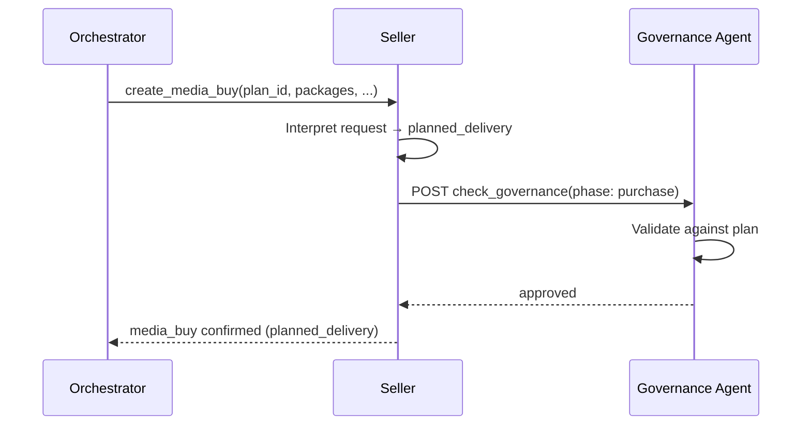
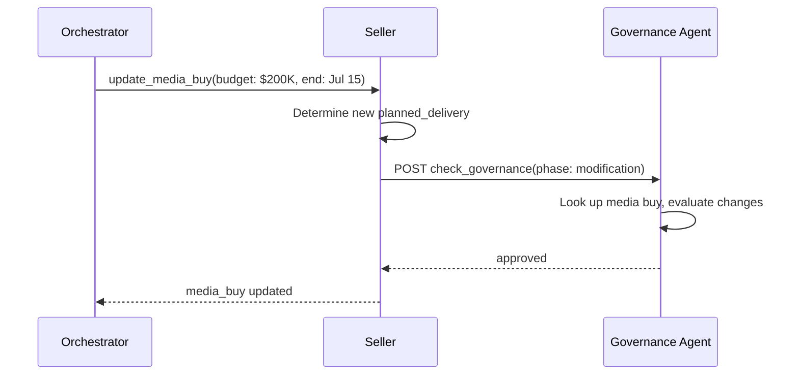
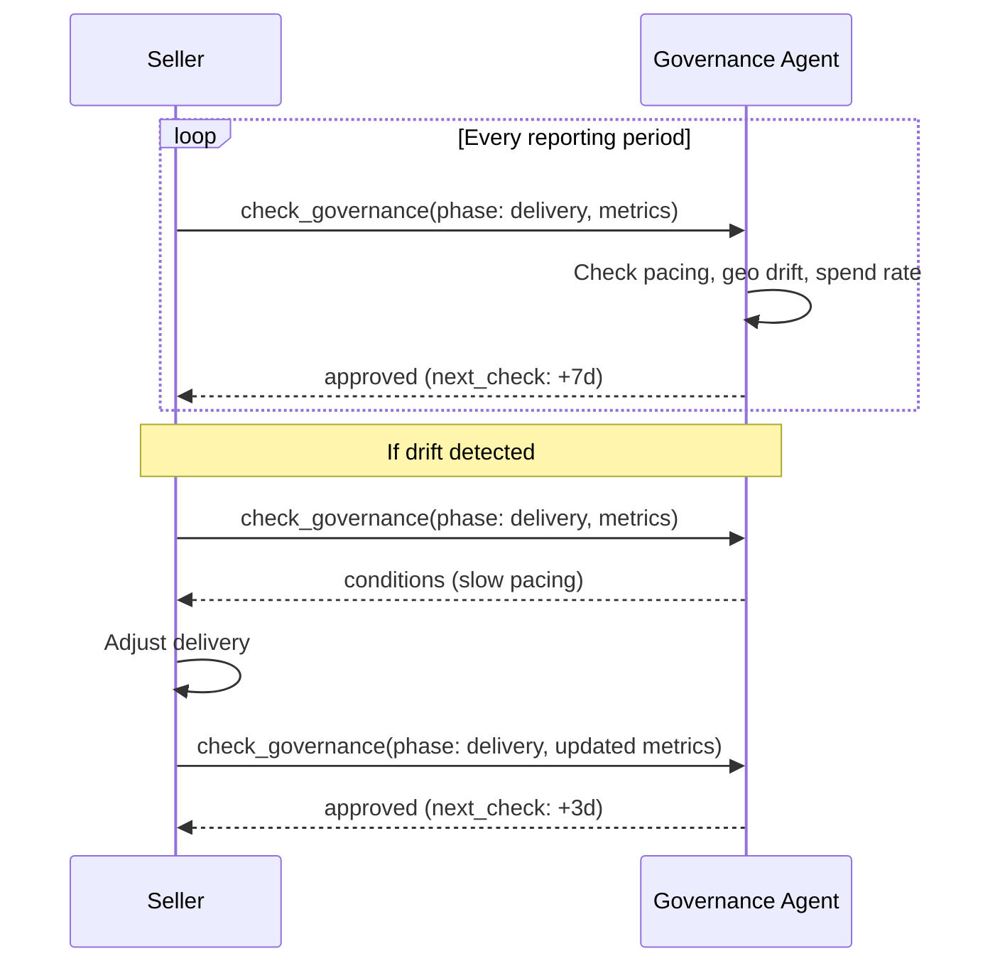
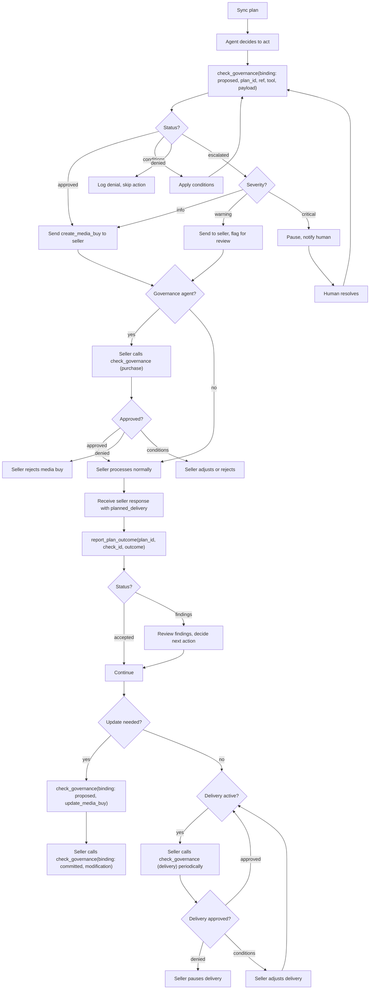

<Warning>
**Draft for AdCP 3.0** - This specification is under active development. Feedback welcome via [GitHub Discussions](https://github.com/adcontextprotocol/adcp/discussions).
</Warning>

# Campaign Governance specification

**Status**: Request for Comments
**Last Updated**: March 2026

The key words "MUST", "MUST NOT", "REQUIRED", "SHALL", "SHALL NOT", "SHOULD", "SHOULD NOT", "RECOMMENDED", "MAY", and "OPTIONAL" in this document are to be interpreted as described in [RFC 2119](https://www.rfc-editor.org/rfc/rfc2119).

This document defines the data models, validation logic, and integration patterns for Campaign Governance.

## Campaign plan

The campaign plan is the source of truth for all validation. Plans are pushed to the governance agent via [`sync_plans`](/docs/governance/campaign/tasks/sync_plans) and define the plan parameters for a campaign -- budget limits, channels, flight dates, and plan markets. Compliance policies are resolved from the brand's configuration, not carried in the plan.

```json
{
  "plan_id": "plan_q1_2026_launch",
  "brand": {
    "domain": "acmecorp.com"
  },
  "objectives": "Drive awareness for spring product launch among 25-54 adults in the US, focusing on premium video and high-impact display.",
  "budget": {
    "total": 500000,
    "currency": "USD",
    "authority_level": "agent_limited",
    "per_seller_max_pct": 40,
    "reallocation_threshold": 25000
  },
  "channels": {
    "required": ["olv"],
    "allowed": ["olv", "display", "ctv", "audio"],
    "mix_targets": {
      "olv": { "min_pct": 40, "max_pct": 70 },
      "display": { "min_pct": 10, "max_pct": 30 },
      "ctv": { "min_pct": 0, "max_pct": 20 },
      "audio": { "min_pct": 0, "max_pct": 10 }
    }
  },
  "flight": {
    "start": "2026-03-15T00:00:00Z",
    "end": "2026-06-15T00:00:00Z"
  },
  "countries": ["US"],
  "approved_sellers": null,
  "ext": {}
}
```

### Budget authority levels

| Level | Meaning |
|-------|---------|
| `agent_full` | Agent can execute any spend within the total budget without human approval |
| `agent_limited` | Agent can execute within thresholds but MUST escalate large changes (defined by `reallocation_threshold`) |
| `human_required` | Every spend commitment requires human approval |

### Channel mix targets

The `mix_targets` field defines acceptable allocation ranges. The governance agent validates that aggregate spend across all media buys stays within these ranges. A `create_media_buy` that would push video spend above 70% of total budget triggers a `conditions` or `escalated` status.

## Brand compliance configuration

Compliance policies live at the brand level, not in individual campaign plans. The brand's policy team configures the brand's compliance profile, and the governance agent resolves it when processing plans for that brand.

<Note>
The brand.json schema extension for compliance configuration is a separate effort. The following is an illustrative, non-normative example of what the configuration would contain.
</Note>

The brand compliance configuration contains two kinds of policies:

- **Registry policies**: References to standardized policies in the AdCP policy registry, identified by ID. Each reference MAY include configuration parameters that customize the policy for the brand.
- **Custom policies**: Brand-specific rules that are not in the registry.

```json
{
  "compliance": {
    "registry_policies": [
      { "policy_id": "age_gating_18_plus" },
      { "policy_id": "uk_hfss_restrictions" },
      { "policy_id": "viewability_required", "config": { "channels": ["olv", "ctv"] } }
    ],
    "custom_policies": [
      "Do not run adjacent to competitor brands in the beverage category"
    ],
    "verticals": ["cpg", "beverage"]
  }
}
```

The policy team selects registry policies that apply to the brand, configures parameters where needed, and adds any custom policies specific to the brand. The buying team never interacts with this configuration -- they create campaign plans that reference the brand, and the governance agent resolves applicable policies automatically.

Custom policies are natural language strings evaluated by the governance agent using the same approach as [prompt-based policies](/docs/governance/overview#prompt-based-policies) in the Governance Protocol. Unlike registry policies, they are not machine-readable in a structured sense and require AI interpretation. The registry is the preferred mechanism; custom policies exist for brand-specific rules that do not yet have standardized equivalents.

The `verticals` field declares the brand's industry verticals. The governance agent uses this to match vertical-specific registry policies -- for example, a brand declaring `"beverage"` would automatically receive any registry policies tagged for the beverage vertical.

## Policy registry

The policy registry is a community-maintained library of standardized, machine-readable advertising compliance policies. Brands reference policies by ID rather than writing their own.

The registry covers three categories:

| Category | Examples |
|----------|----------|
| **Jurisdiction** | UK HFSS restrictions, US COPPA, EU GDPR age-gating, California AI disclosure (SB 942) |
| **Vertical** | Alcohol age verification, pharma fair balance, gambling self-exclusion, financial services APR disclosure |
| **Brand safety** | Brand safety baselines, content suitability tiers |

Each policy in the registry has an ID, applicable jurisdictions, a description, and machine-readable rules that governance agents can evaluate programmatically. Policies are versioned as regulations change; brand references MAY pin a specific version, and unversioned references resolve to the current version. The registry format and hosting mechanism are under development by the AgenticAdvertising.org Governance Working Group.

This model follows the pattern established by [IEEE 7012](https://standards.ieee.org/ieee/7012/7192/) (Machine Readable Personal Privacy Terms), which maintains a neutral roster of standardized agreements that parties reference rather than draft individually.

## Policy resolution

When a plan is synced, the governance agent resolves applicable policies through the brand reference:

1. Resolve the brand from `brand.domain` via the [Brand Protocol](/docs/brand-protocol/index)
2. Retrieve the brand's compliance configuration
3. Load referenced registry policies by ID, plus any vertical-specific registry policies matched by the brand's `verticals` declaration
4. Intersect with the plan's `countries` and `regions` -- only policies applicable to the plan markets are active
5. Include all custom brand policies (these apply regardless of geography)

The plan's `countries` and `regions` fields also serve as **geo enforcement**: the governance agent MUST reject media buys targeting markets outside the plan's allowed geography. A plan with `regions: ["US-MA"]` rejects buys not explicitly targeting Massachusetts, even if they are otherwise compliant. These fields use the same ISO codes and semantics as `product-filters`, `offerings`, and `create_media_buy`.

The resolved policy set is what the governance agent evaluates during [`check_governance`](/docs/governance/campaign/tasks/check_governance). For the `brand_policy` and `regulatory_compliance` categories, the governance agent validates against this resolved set.

If the brand has no compliance configuration, the governance agent operates with an empty policy set for the `brand_policy` and `regulatory_compliance` categories. Other categories (`budget_authority`, `strategic_alignment`, etc.) still apply based on the plan's parameters.

If the brand's compliance configuration changes (policies added or removed), existing plans pick up the changes on the next validation. The governance agent SHOULD re-resolve policies per request rather than caching indefinitely.

## State tracking

The governance agent tracks state at two levels:

- **Plan level**: Total budget committed, channel allocation percentages, plan status
- **Campaign level**: Per-`buyer_campaign_ref` committed budget, active media buy references, validation history

A single plan can span multiple campaigns. When [`check_governance`](/docs/governance/campaign/tasks/check_governance) checks budget authority, it considers all campaigns tied to the plan. When [`report_plan_outcome`](/docs/governance/campaign/tasks/report_plan_outcome) reports a seller confirmation, the governance agent commits the budget from the seller's actual amount -- not the requested amount.

### Plan status

| Status | Meaning |
|--------|---------|
| `active` | Accepting validation requests and outcome reports |
| `suspended` | Paused pending human review of a critical escalation |
| `completed` | Plan finished; read-only |

When status is `suspended`, the governance agent MUST reject all `check_governance` and `report_plan_outcome` requests with a `CAMPAIGN_SUSPENDED` error until the escalation is resolved.

### Budget tracking

Budget is committed based on **confirmed outcomes**, not validated actions. The flow:

1. `check_governance` with `binding: "proposed"` checks whether the proposed spend fits within the plan. No budget is committed yet.
2. The orchestrator executes the action with the seller.
3. `report_plan_outcome` reports the seller's confirmed amount. The governance agent commits this amount to the plan budget.

This ensures budget tracking reflects reality. If a seller reduces the budget from $150K to $120K, the governance agent commits $120K and returns findings about the discrepancy. If the action fails entirely, the governance agent commits $0 and releases any reservation.

A `committed` approval validates the seller's planned delivery against the plan but does not commit budget. Budget is only committed when the orchestrator calls `report_plan_outcome` with the seller's confirmed response.

### Plan amendments

Calling `sync_plans` with an existing `plan_id` updates the plan (upsert). The governance agent increments `plan_version` and applies the new parameters immediately. Active media buys that were approved under the previous plan version are not automatically re-validated -- the governance agent evaluates them against the updated plan on the next `check_governance` call (e.g., the next delivery check). If an amendment reduces the budget below the currently committed amount, the governance agent flags this as a finding on the next governance check.

## Validation logic

The governance agent evaluates each [validation category](/docs/governance/campaign/index#validation-categories) independently:

- If **any** category has status `failed` and the failure is correctable, the status is `conditions` with suggested fixes
- If **any** category has status `failed` and the failure is not correctable by the caller, the status is `denied`
- If all categories pass but the overall risk profile warrants human review, the status is `escalated`
- If all categories pass, the status is `approved`

The `conditions` array is only present when the status is `conditions`. Each condition identifies a specific field, its current value, a suggested value, and the reason for the change.

### Phase inference

The governance agent infers the validation phase from the `tool` parameter in `check_governance`:

| tool | Phase |
|------|-------|
| `get_products` | Discovery -- validates search intent, seller eligibility, product suitability |
| `create_media_buy` | Purchase -- validates budget authority, targeting compliance, flight dates |
| `update_media_buy` | Purchase -- validates change magnitude, reallocation thresholds |

Phase context is cumulative. During **purchase**, the governance agent considers what was discovered during **discovery**.

The `check_id` returned by `check_governance` is used by `report_plan_outcome` to link the seller's response back to the validated action.

## Capability declaration

Governance agents declare their Campaign Governance support in `get_adcp_capabilities`:

```json
{
  "governance": {
    "campaign_governance": {
      "categories": [
        {
          "category_id": "budget_authority",
          "description": "Validates spend against plan budget limits and allocation rules."
        },
        {
          "category_id": "strategic_alignment",
          "description": "Validates that purchases match campaign brief and channel mix targets."
        },
        {
          "category_id": "bias_fairness",
          "description": "Checks targeting for discriminatory patterns and protected category compliance.",
          "jurisdictions": ["US", "EU", "UK"]
        },
        {
          "category_id": "regulatory_compliance",
          "description": "Validates jurisdiction-specific advertising regulations.",
          "jurisdictions": ["US", "EU", "UK"]
        },
        {
          "category_id": "seller_verification",
          "description": "Compares seller setup against original requests to detect discrepancies."
        },
        {
          "category_id": "brand_policy",
          "description": "Enforces brand-level compliance policies resolved from the brand configuration and policy registry."
        }
      ]
    }
  }
}
```

## Integration with `create_media_buy`

The buyer includes `plan_id` and `buyer_campaign_ref` as first-class fields on the `create_media_buy` request. These fields tell the seller which governance plan applies, enabling seller-side governance checks.

```json
{
  "tool": "create_media_buy",
  "arguments": {
    "buyer_ref": "q1-launch-pinnacle-001",
    "buyer_campaign_ref": "q1-2026-spring-launch",
    "plan_id": "plan_q1_2026_launch",
    "account": { "agent_url": "https://seller.example.com", "id": "acc_123" },
    "brand": { "domain": "acmecorp.com" },
    "start_time": "2026-03-15T00:00:00Z",
    "end_time": "2026-06-15T00:00:00Z",
    "packages": ["..."]
  }
}
```

The seller's response includes `planned_delivery` -- what the seller will actually run:

```json
{
  "media_buy_id": "mb_seller_456",
  "buyer_ref": "q1-launch-pinnacle-001",
  "buyer_campaign_ref": "q1-2026-spring-launch",
  "packages": ["..."],
  "planned_delivery": {
    "geo": { "countries": ["US"] },
    "channels": ["olv"],
    "start_time": "2026-03-15T00:00:00Z",
    "end_time": "2026-06-15T00:00:00Z",
    "total_budget": 150000,
    "currency": "USD",
    "frequency_cap": { "max_impressions": 3, "per": "user", "window": { "interval": 1, "unit": "days" } },
    "audience_summary": "Adults 25-54, US, premium video inventory",
    "enforced_policies": ["us_coppa"]
  }
}
```

`planned_delivery` is the seller's interpretation of the request -- the actual delivery parameters they will use. It serves two purposes:

1. **Governance checks** -- When the account has an `governance_agent`, the seller sends `planned_delivery` to the governance agent for verification before confirming the media buy.
2. **Transparency** -- The buyer can compare `planned_delivery` against what they requested to catch discrepancies early, before delivery begins.

## Governance checks

Campaign Governance's buyer-side validation has a trust limitation: the buyer's orchestrator grades its own homework. An LLM agent could hallucinate governance approval, skip validation, or misrepresent what was validated. Governance webhooks close this gap by giving sellers an independent way to confirm that purchases are approved.

The seller POSTs to the buyer's `governance_agent` URL when media buy events occur. The governance agent maintains all state and correlates requests by `plan_id` + `media_buy_id` -- the seller does not need to track governance history or chain IDs across calls.

### Setup

The buyer registers an `governance_agent` when syncing accounts with the seller. The agent includes authentication credentials so the governance agent can verify the seller's identity:

```json
{
  "tool": "sync_accounts",
  "arguments": {
    "accounts": [
      {
        "brand": { "domain": "acmecorp.com" },
        "operator": "pinnacle-media.com",
        "billing": "operator",
        "governance_agent": {
          "url": "https://governance.pinnacle-media.com",
          "authentication": {
            "schemes": ["Bearer"],
            "credentials": "gov_token_acme_pinnacle_2026_xyz..."
          }
        }
      }
    ]
  }
}
```

The seller stores this endpoint and presents the credentials when calling `check_governance`. This ensures only recognized sellers can make governance requests -- the governance agent rejects calls without valid credentials.

### Governance phases

Governance checks cover the full media buy lifecycle through three phases:

| Phase | Trigger | What's validated |
|-------|---------|------------------|
| `purchase` | `create_media_buy` | Budget, geo, channels, flight dates, policies |
| `modification` | `update_media_buy` | Change magnitude, reallocation, new parameters |
| `delivery` | Periodic (seller-initiated) | Pacing, spend rate, geo drift, channel distribution |

The `phase` field defaults to `purchase` if omitted, so existing implementations continue to work without changes.

The governance agent maintains all state and correlates requests by `plan_id` + `media_buy_id`. The seller does not chain check IDs or track conversation history -- it posts what happened, and the governance agent looks up context.

### Purchase phase

When the seller receives a `create_media_buy` request on an account with an `governance_agent`:

1. The seller interprets the request and determines its `planned_delivery`.
2. The seller calls `check_governance` with `phase: "purchase"`, the `plan_id`, and `planned_delivery`.
3. The governance agent validates the planned delivery against the campaign plan.
4. If `approved`, the seller confirms the media buy.
5. If `denied`, the seller rejects the media buy with an `GOVERNANCE_DENIED` error.
6. If `conditions`, the seller adjusts its planned delivery to meet the conditions and re-verifies, or rejects.



### Modification phase

When the seller receives an `update_media_buy` request:

1. The seller interprets the update and determines the new `planned_delivery`.
2. The seller POSTs to the `governance_agent` with `phase: "modification"`, the updated `planned_delivery`, and a `modification_summary`.
3. The governance agent looks up the media buy by `plan_id` + `media_buy_id` and evaluates the changes against the plan.
4. If `approved`, the seller confirms the update.
5. If `denied` or `conditions`, the seller follows the same flow as purchase phase.



The governance agent can apply different logic to modifications than to initial purchases. For example, a small budget increase within `reallocation_threshold` might be auto-approved, while a large budget increase or new geo market might require stricter scrutiny.

### Delivery phase

The seller calls `check_governance` with `phase: "delivery"` periodically during active delivery. This creates a direct reporting channel between the seller and the buyer's governance agent.

1. The seller collects delivery metrics for the reporting period.
2. The seller POSTs to the `governance_agent` with `phase: "delivery"`, the current `planned_delivery`, and `delivery_metrics`.
3. If `approved`, the response includes `next_check` -- when the seller should report again.
4. If `denied`, the seller pauses delivery immediately.
5. If `conditions`, the seller adjusts delivery (e.g., slow pacing, shift geo targeting) and re-verifies immediately.

The governance agent opts in to delivery reporting by including `next_check` in the purchase approval response. If the purchase response has no `next_check`, the governance agent does not expect delivery reports.



The governance agent controls the reporting cadence through `next_check`. It can tighten the cadence (shorter intervals) when it detects drift or conditions, and relax it (longer intervals) when delivery is stable. The governance agent MAY treat a missed `next_check` deadline as a finding on the next delivery check.

### Verification examples

**Purchase request:**

```json
{
  "tool": "check_governance",
  "arguments": {
    "plan_id": "plan_q1_2026_launch",
    "buyer_campaign_ref": "q1-2026-spring-launch",
    "caller": "https://seller.example.com",
    "media_buy_id": "mb_seller_456",
    "buyer_ref": "q1-launch-pinnacle-001",
    "phase": "purchase",
    "planned_delivery": {
      "geo": { "countries": ["US"] },
      "channels": ["olv"],
      "start_time": "2026-03-15T00:00:00Z",
      "end_time": "2026-06-15T00:00:00Z",
      "total_budget": 150000,
      "currency": "USD",
      "frequency_cap": { "max_impressions": 3, "per": "user", "window": { "interval": 1, "unit": "days" } },
      "audience_summary": "Adults 25-54, US, premium video inventory",
      "enforced_policies": ["us_coppa"]
    }
  }
}
```

**Authorized (purchase with delivery opt-in):**

```json
{
  "check_id": "auth_001",
  "status": "approved",
  "plan_id": "plan_q1_2026_launch",
  "buyer_campaign_ref": "q1-2026-spring-launch",
  "explanation": "Planned delivery is within plan parameters. Budget: $150,000 of $500,000 plan total. Geo: US (within plan). Channel: OLV (within 40-70% target range).",
  "expires_at": "2026-03-15T01:00:00Z",
  "next_check": "2026-03-22T00:00:00Z"
}
```

The `next_check` field signals that the governance agent expects delivery reporting. If absent, no delivery reports are expected.

**Denied (purchase):**

```json
{
  "check_id": "auth_002",
  "status": "denied",
  "plan_id": "plan_q1_2026_launch",
  "buyer_campaign_ref": "q1-2026-spring-launch",
  "explanation": "Planned delivery targets CA (Canada) which is not an plan market for this plan.",
  "findings": [
    {
      "category_id": "strategic_alignment",
      "severity": "critical",
      "explanation": "Geo targeting includes CA but plan only authorizes US.",
      "details": {
        "plan_countries": ["US"],
        "planned_countries": ["US", "CA"]
      }
    }
  ]
}
```

**Authorized (delivery):**

```json
{
  "check_id": "auth_004",
  "status": "approved",
  "plan_id": "plan_q1_2026_launch",
  "buyer_campaign_ref": "q1-2026-spring-launch",
  "explanation": "Delivery on track. Week 1 spend: $12,500 of $150,000 (8.3%). Pacing is on target for 13-week flight.",
  "next_check": "2026-03-29T00:00:00Z"
}
```

### Enforcement

When `governance_agent` is present on the account, the seller MUST call `check_governance` before confirming any media buy. The buyer provided the endpoint specifically so that purchases are independently verified -- skipping it defeats the purpose.

When `governance_agent` is absent, the seller processes media buy requests normally. The buyer-side governance loop (`check_governance(binding: proposed)` -> execute -> `report_plan_outcome`) still applies, but there is no seller-side verification.

Sellers MUST NOT require governance checks as a prerequisite for all accounts. A seller that refuses to process media buys from accounts without an `governance_agent` would break interoperability with buyers who do not use Campaign Governance.

The `delivery` phase is optional even when `purchase` phase governance is used. A seller MAY support purchase approval without ongoing delivery reporting. The governance agent indicates whether it expects delivery reports through the presence of `next_check` in the purchase response.

If the governance agent is unreachable (timeout, network error), the seller MUST NOT proceed with the media buy. Governance checks are a prerequisite for confirming purchases on accounts with a registered `governance_agent`. The seller SHOULD retry the check after a brief delay and reject the media buy with a `GOVERNANCE_UNAVAILABLE` error if the agent remains unreachable.

### Governance checks and the governance loop

Governance checks complements the buyer-side governance loop, it does not replace it:

| Concern | Buyer-side (`check_governance`, `binding: "proposed"`) | Seller-side (`check_governance`, `binding: "committed"`) |
|---------|--------------------------------------|---------------------------------------|
| **Who checks** | Buyer's governance agent, called by orchestrator | Buyer's governance agent, called by seller |
| **When** | Before the buyer sends the request | Before confirm, on update, during delivery |
| **What's validated** | The buyer's intended action | The seller's planned and actual delivery |
| **Trust model** | Self-attested | Independently verified |
| **Budget tracking** | Yes (plan state) | Governance agent maintains state |
| **Ongoing monitoring** | Via `report_plan_outcome` | Via `delivery` phase |

The `delivery` phase gives the governance agent real-time visibility into what sellers are actually delivering. The buyer-side `report_plan_outcome` depends on the orchestrator reporting honestly; the `delivery` phase gets reports directly from the seller.

The governance agent MAY be the same agent as the governance agent, or a separate agent. The protocol does not prescribe the relationship -- only that the seller can call the `governance_agent` URL registered on the account.

## Orchestrator integration pattern



The governance check is a synchronous call in the orchestrator's action loop. The orchestrator calls `check_governance` with `binding: "proposed"` before sending requests to sellers. Seller-side governance checks use `binding: "committed"` and are transparent to the orchestrator -- the orchestrator sends the same `create_media_buy` request regardless of whether governance checks are configured. Modification and delivery phase checks happen between the seller and governance agent, independent of the orchestrator's governance loop.

## Audit trail

Every plan maintains an ordered audit trail of all validated actions and reported outcomes, retrievable via [`get_plan_audit_logs`](/docs/governance/campaign/tasks/get_plan_audit_logs). The trail includes:

- Check ID, timestamp, and tool
- The status and category evaluations
- Outcome status and committed budget
- Any findings from outcome reports
- Any escalations and their resolutions
- The human approver identity (when escalated)
- Delivery metrics over time

This audit trail serves compliance and reporting needs. For regulated categories (political advertising, financial services), the trail provides evidence that governance was applied to every transaction.
