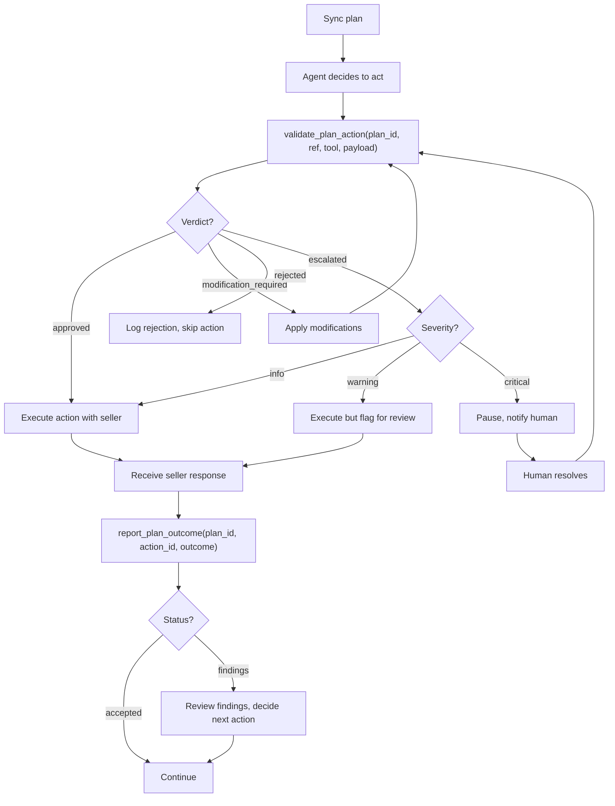

<Warning>
**Draft for AdCP 3.0** - This specification is under active development. Feedback welcome via [GitHub Discussions](https://github.com/adcontextprotocol/adcp/discussions).
</Warning>

# Campaign Governance specification

**Status**: Request for Comments
**Last Updated**: March 2026

The key words "MUST", "MUST NOT", "REQUIRED", "SHALL", "SHALL NOT", "SHOULD", "SHOULD NOT", "RECOMMENDED", "MAY", and "OPTIONAL" in this document are to be interpreted as described in [RFC 2119](https://www.rfc-editor.org/rfc/rfc2119).

This document defines the data models, validation logic, and integration patterns for Campaign Governance.

## Campaign plan

The campaign plan is the source of truth for all validation. Plans are pushed to the governance agent via [`sync_plans`](/docs/governance/campaign/tasks/sync_plans) and define the authorized parameters for a campaign -- budget limits, channels, flight dates, and target jurisdictions. Compliance policies are resolved from the brand's configuration, not carried in the plan.

```json
{
  "plan_id": "plan_q1_2026_launch",
  "brand": {
    "domain": "acmecorp.com"
  },
  "objectives": "Drive awareness for spring product launch among 25-54 adults in the US, focusing on premium video and high-impact display.",
  "budget": {
    "total": 500000,
    "currency": "USD",
    "authority_level": "agent_limited",
    "per_seller_max_pct": 40,
    "reallocation_threshold": 25000
  },
  "channels": {
    "required": ["olv"],
    "allowed": ["olv", "display", "ctv", "audio"],
    "mix_targets": {
      "olv": { "min_pct": 40, "max_pct": 70 },
      "display": { "min_pct": 10, "max_pct": 30 },
      "ctv": { "min_pct": 0, "max_pct": 20 },
      "audio": { "min_pct": 0, "max_pct": 10 }
    }
  },
  "flight": {
    "start": "2026-03-15T00:00:00Z",
    "end": "2026-06-15T00:00:00Z"
  },
  "compliance": {
    "jurisdictions": ["US"]
  },
  "approved_sellers": null,
  "ext": {}
}
```

### Budget authority levels

| Level | Meaning |
|-------|---------|
| `agent_full` | Agent can execute any spend within the total budget without human approval |
| `agent_limited` | Agent can execute within thresholds but MUST escalate large changes (defined by `reallocation_threshold`) |
| `human_required` | Every spend commitment requires human approval |

### Channel mix targets

The `mix_targets` field defines acceptable allocation ranges. The governance agent validates that aggregate spend across all media buys stays within these ranges. A `create_media_buy` that would push video spend above 70% of total budget triggers a `modification_required` or `escalated` verdict.

## Brand compliance configuration

Compliance policies live at the brand level, not in individual campaign plans. The brand's policy team configures the brand's compliance profile, and the governance agent resolves it when processing plans for that brand.

<Note>
The brand.json schema extension for compliance configuration is a separate effort. The following is an illustrative, non-normative example of what the configuration would contain.
</Note>

The brand compliance configuration contains two kinds of policies:

- **Registry policies**: References to standardized policies in the AdCP policy registry, identified by ID. Each reference MAY include configuration parameters that customize the policy for the brand.
- **Custom policies**: Brand-specific rules that are not in the registry.

```json
{
  "compliance": {
    "registry_policies": [
      { "policy_id": "age_gating_18_plus" },
      { "policy_id": "uk_hfss_restrictions" },
      { "policy_id": "viewability_required", "config": { "channels": ["olv", "ctv"] } }
    ],
    "custom_policies": [
      "Do not run adjacent to competitor brands in the beverage category"
    ],
    "verticals": ["cpg", "beverage"]
  }
}
```

The policy team selects registry policies that apply to the brand, configures parameters where needed, and adds any custom policies specific to the brand. The buying team never interacts with this configuration -- they create campaign plans that reference the brand, and the governance agent resolves applicable policies automatically.

Custom policies are natural language strings evaluated by the governance agent using the same approach as [prompt-based policies](/docs/governance/overview#prompt-based-policies) in the Governance Protocol. Unlike registry policies, they are not machine-readable in a structured sense and require AI interpretation. The registry is the preferred mechanism; custom policies exist for brand-specific rules that do not yet have standardized equivalents.

The `verticals` field declares the brand's industry verticals. The governance agent uses this to match vertical-specific registry policies -- for example, a brand declaring `"beverage"` would automatically receive any registry policies tagged for the beverage vertical.

## Policy registry

The policy registry is a community-maintained library of standardized, machine-readable advertising compliance policies. Brands reference policies by ID rather than writing their own.

The registry covers three categories:

| Category | Examples |
|----------|----------|
| **Jurisdiction** | UK HFSS restrictions, US COPPA, EU GDPR age-gating, California AI disclosure (SB 942) |
| **Vertical** | Alcohol age verification, pharma fair balance, gambling self-exclusion, financial services APR disclosure |
| **Brand safety** | Brand safety baselines, content suitability tiers |

Each policy in the registry has an ID, applicable jurisdictions, a description, and machine-readable rules that governance agents can evaluate programmatically. Policies are versioned as regulations change; brand references MAY pin a specific version, and unversioned references resolve to the current version. The registry format and hosting mechanism are under development by the AgenticAdvertising.org Governance Working Group.

This model follows the pattern established by [IEEE 7012](https://standards.ieee.org/ieee/7012/7192/) (Machine Readable Personal Privacy Terms), which maintains a neutral roster of standardized agreements that parties reference rather than draft individually.

## Policy resolution

When a plan is synced, the governance agent resolves applicable policies through the brand reference:

1. Resolve the brand from `brand.domain` via the [Brand Protocol](/docs/brand-protocol/index)
2. Retrieve the brand's compliance configuration
3. Load referenced registry policies by ID, plus any vertical-specific registry policies matched by the brand's `verticals` declaration
4. Intersect with the plan's `compliance.jurisdictions` -- only policies applicable to the campaign's target markets are active (using ISO 3166-1 alpha-2 country codes)
5. Include all custom brand policies (these apply regardless of jurisdiction)

The resolved policy set is what the governance agent evaluates during [`validate_plan_action`](/docs/governance/campaign/tasks/validate_plan_action). For the `brand_policy` and `regulatory_compliance` categories, the governance agent validates against this resolved set.

If the brand has no compliance configuration, the governance agent operates with an empty policy set for the `brand_policy` and `regulatory_compliance` categories. Other categories (`budget_authority`, `strategic_alignment`, etc.) still apply based on the plan's parameters.

If the brand's compliance configuration changes (policies added or removed), existing plans pick up the changes on the next validation. The governance agent SHOULD re-resolve policies per request rather than caching indefinitely.

## State tracking

The governance agent tracks state at two levels:

- **Plan level**: Total budget committed, channel allocation percentages, plan status
- **Campaign level**: Per-`buyer_campaign_ref` committed budget, active media buy references, validation history

A single plan can span multiple campaigns. When [`validate_plan_action`](/docs/governance/campaign/tasks/validate_plan_action) checks budget authority, it considers all campaigns tied to the plan. When [`report_plan_outcome`](/docs/governance/campaign/tasks/report_plan_outcome) reports a seller confirmation, the governance agent commits the budget from the seller's actual amount -- not the requested amount.

### Plan status

| Status | Meaning |
|--------|---------|
| `active` | Accepting validation requests and outcome reports |
| `suspended` | Paused pending human review of a critical escalation |
| `completed` | Plan finished; read-only |

When status is `suspended`, the governance agent MUST reject all `validate_plan_action` and `report_plan_outcome` requests with a `CAMPAIGN_SUSPENDED` error until the escalation is resolved.

### Budget tracking

Budget is committed based on **confirmed outcomes**, not validated actions. The flow:

1. `validate_plan_action` checks whether the proposed spend fits within the plan. No budget is committed yet.
2. The orchestrator executes the action with the seller.
3. `report_plan_outcome` reports the seller's confirmed amount. The governance agent commits this amount to the plan budget.

This ensures budget tracking reflects reality. If a seller reduces the budget from $150K to $120K, the governance agent commits $120K and returns findings about the discrepancy. If the action fails entirely, the governance agent commits $0 and releases any reservation.

## Validation logic

The governance agent evaluates each [validation category](/docs/governance/campaign/index#validation-categories) independently:

- If **any** category has status `failed` and the failure is correctable, the verdict is `modification_required` with suggested fixes
- If **any** category has status `failed` and the failure is not correctable by the agent, the verdict is `rejected`
- If all categories pass but the overall risk profile warrants human review, the verdict is `escalated`
- If all categories pass, the verdict is `approved`

The `modifications` array is only present when the verdict is `modification_required`. Each modification identifies a specific field, its current value, a suggested value, and the reason for the change.

### Phase inference

The governance agent infers the validation phase from the `tool` parameter in `validate_plan_action`:

| tool | Phase |
|------|-------|
| `get_products` | Discovery -- validates search intent, seller eligibility, product suitability |
| `create_media_buy` | Purchase -- validates budget authority, targeting compliance, flight dates |
| `update_media_buy` | Purchase -- validates change magnitude, reallocation thresholds |

Phase context is cumulative. During **purchase**, the governance agent considers what was discovered during **discovery**.

The `action_id` returned by `validate_plan_action` is used by `report_plan_outcome` to link the seller's response back to the validated action.

## Capability declaration

Governance agents declare their Campaign Governance support in `get_adcp_capabilities`:

```json
{
  "governance": {
    "campaign_governance": {
      "categories": [
        {
          "category_id": "budget_authority",
          "description": "Validates spend against authorized budget limits and allocation rules."
        },
        {
          "category_id": "strategic_alignment",
          "description": "Validates that purchases match campaign brief and channel mix targets."
        },
        {
          "category_id": "bias_fairness",
          "description": "Checks targeting for discriminatory patterns and protected category compliance.",
          "jurisdictions": ["US", "EU", "UK"]
        },
        {
          "category_id": "regulatory_compliance",
          "description": "Validates jurisdiction-specific advertising regulations.",
          "jurisdictions": ["US", "EU", "UK"]
        },
        {
          "category_id": "seller_verification",
          "description": "Compares seller setup against original requests to detect discrepancies."
        },
        {
          "category_id": "brand_policy",
          "description": "Enforces brand-level compliance policies resolved from the brand configuration and policy registry."
        }
      ]
    }
  }
}
```

## Integration with `create_media_buy`

Orchestrators MAY reference their governance validation when sending requests to sellers. This allows the seller to know that governance was applied (useful for audit trails) without needing to interact with the governance agent.

```json
{
  "tool": "create_media_buy",
  "arguments": {
    "buyer_ref": "q1-launch-pinnacle-001",
    "account": { "agent_url": "https://seller.example.com", "id": "acc_123" },
    "brand": { "domain": "acmecorp.com" },
    "start_time": "2026-03-15T00:00:00Z",
    "end_time": "2026-06-15T00:00:00Z",
    "packages": ["..."],
    "ext": {
      "campaign_governance": {
        "plan_id": "plan_q1_2026_launch",
        "buyer_campaign_ref": "q1-2026-spring-launch",
        "action_id": "act_xyz789",
        "verdict": "approved"
      }
    }
  }
}
```

The `ext.campaign_governance` block is informational. Sellers MAY log it for transparency but MUST NOT reject requests based on governance data. Governance is the buyer's concern.

## Orchestrator integration pattern



The governance agent is a synchronous call in the orchestrator's action loop. For latency-sensitive operations, implementations MAY cache governance decisions for repeated similar actions within the same campaign.

## Audit trail

Every plan maintains an ordered audit trail of all validated actions and reported outcomes, retrievable via [`get_plan_audit_logs`](/docs/governance/campaign/tasks/get_plan_audit_logs). The trail includes:

- Action ID, timestamp, and tool
- The verdict and category evaluations
- Outcome status and committed budget
- Any findings from outcome reports
- Any escalations and their resolutions
- The human approver identity (when escalated)
- Delivery metrics over time

This audit trail serves compliance and reporting needs. For regulated categories (political advertising, financial services), the trail provides evidence that governance was applied to every transaction.
