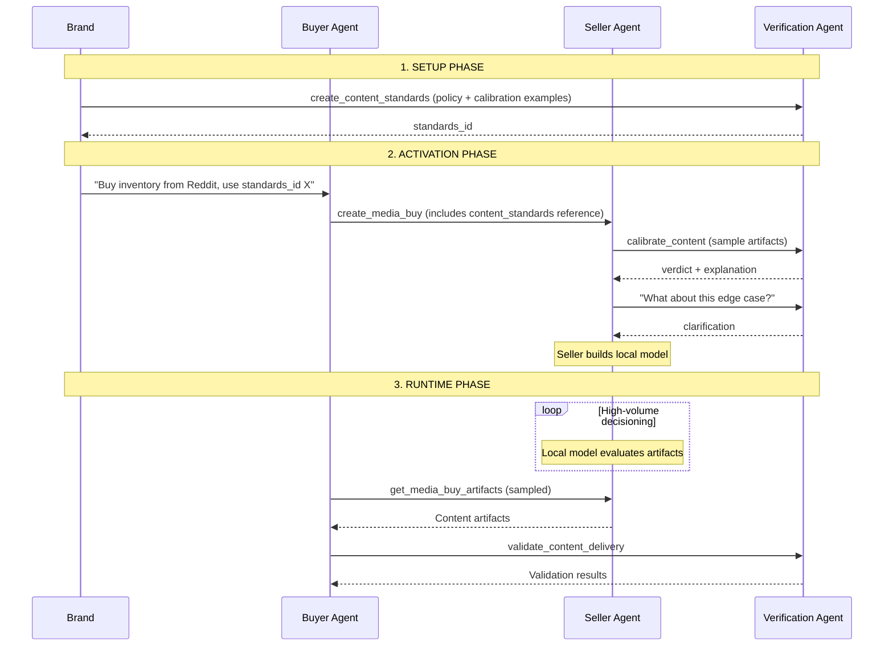
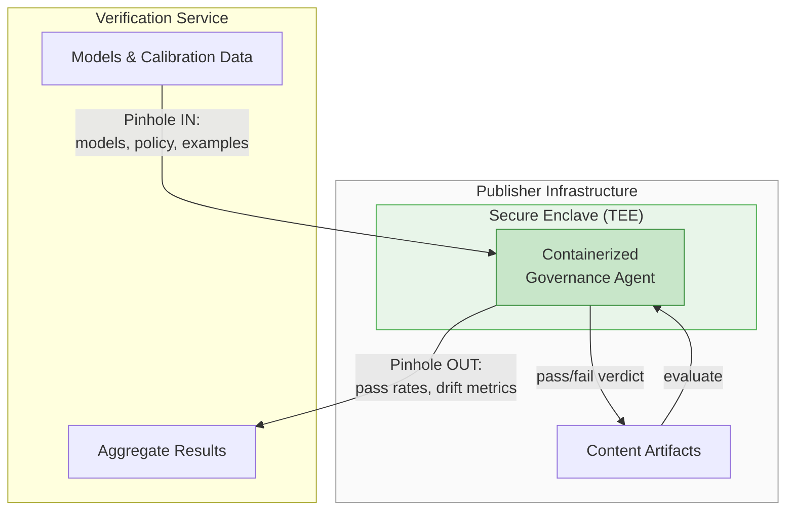

# Content Standards Protocol

The Content Standards Protocol enables **privacy-preserving brand suitability** for ephemeral and sensitive content that cannot leave a publisher's infrastructure.

## The Problem

Traditional brand suitability relies on third-party verification: send your content to IAS or DoubleVerify, they evaluate it, return a verdict. This works for static web pages. It fundamentally cannot work for:

- **AI-generated content** - ChatGPT responses, DALL-E images that exist only in a user session
- **Private conversations** - Content in messaging apps, private social feeds
- **Ephemeral content** - Stories, live streams, real-time feeds that disappear
- **Privacy-regulated content** - GDPR-protected data that cannot be exported

For these platforms, **there is no traditional verification option**. The content simply cannot leave. OpenAI cannot send user conversations to an external service. A messaging app cannot export private chats. A streaming platform cannot share real-time content before it disappears.

Yet these are exactly the environments where advertising is growing fastest - and where brands most need suitability guarantees. Without a privacy-preserving approach, brands either avoid these channels entirely or accept unknown risk.

## The Solution: Calibration-Based Alignment

Content Standards solves this by **using agents to protect privacy**. It's a three-phase model where no sensitive content ever leaves the publisher's infrastructure:

| Phase | Where It Runs | What Happens |
|-------|---------------|--------------|
| **1. Calibration** | External (safe data only) | Publisher and verification agent align on policy interpretation using synthetic examples or public samples - no PII, no sensitive content |
| **2. Local Execution** | Inside publisher's walls | Publisher runs evaluation on every impression using a local model trained during calibration - content never leaves |
| **3. Validation** | Statistical sampling | Verification agent audits a sample to detect drift - both parties can verify the system is working without exposing PII |

This inverts the traditional model. Instead of "send us your content, we'll evaluate it," it's "we'll teach you our standards, you evaluate locally, we'll audit statistically."

**The key insight**: The execution engine runs entirely inside the publisher's infrastructure. For OpenAI, that means brand suitability evaluation happens within their firewall - user conversations never leave. For a messaging app, it means private content stays private. The calibration and validation phases provide confidence that the local model is working correctly, without ever requiring access to sensitive data.

## What It Covers

- **Brand safety** - Is this content safe for *any* brand? (universal thresholds like hate speech, illegal content)
- **Brand suitability** - Is this content appropriate for *my* brand? (brand-specific preferences and tone)

## Key Concepts

Content standards evaluation involves four key questions that buyers and sellers negotiate:

1. **What content?** - What [artifacts](./artifacts) to evaluate (the ad-adjacent content)
2. **How much adjacency?** - How many artifacts around the ad slot to consider
3. **What sampling rate?** - What percentage of traffic to evaluate
4. **How to calibrate?** - How to align on policy interpretation before runtime

These parameters are negotiated between buyer and seller during product discovery and media buy creation.

## Workflow



**Key insight**: Runtime decisioning happens locally at the seller (for scale). Buyers pull content samples from sellers and validate against the verification agent.

## Adjacency

How much content around the ad slot should be evaluated?

| Context | Adjacency Examples |
|---------|-------------------|
| **News article** | The article where the ad appears |
| **Social feed** | 1-2 posts above and below the ad slot |
| **Podcast** | The segment before and after the ad break |
| **CTV** | 1-2 scenes before and after the ad pod |
| **Infinite scroll** | Posts within the visible viewport |

Adjacency requirements are defined by the seller in their product catalog (`get_products`). The buyer can filter products based on adjacency guarantees:

```json
{
  "product_id": "reddit_feed_standard",
  "content_standards_adjacency_definition": {
    "before": 2,
    "after": 2,
    "unit": "posts"
  }
}
```

### Adjacency Units

| Unit | Use Case |
|------|----------|
| `posts` | Social feeds, forums, comment threads |
| `scenes` | CTV, streaming video content |
| `segments` | Podcasts, audio content |
| `seconds` | Time-based adjacency in video/audio |
| `viewports` | Infinite scroll contexts |
| `articles` | News sites, content aggregators |

Different products may offer different adjacency guarantees at different price points.

## Sampling Rate

What percentage of traffic should be evaluated by the verification agent?

| Rate | Use Case |
|------|----------|
| **100%** | Premium brand suitability - every impression validated |
| **10-25%** | Standard monitoring - statistical confidence |
| **1-5%** | Spot checking - drift detection only |

Sampling rate is negotiated in the media buy:

```json
{
  "governance": {
    "content_standards": {
      "agent_url": "https://safety.ias.com/adcp",
      "standards_id": "nike_brand_safety",
      "sampling_rate": 0.25
    }
  }
}
```

Higher sampling rates typically cost more but provide stronger guarantees. The seller is responsible for implementing the agreed sampling rate and reporting actual coverage.

## Validation Thresholds

When a seller calibrates their local model against a verification agent, there's an expected drift - the local model won't match the verification agent 100% of the time. **Validation thresholds** define acceptable drift between local execution and validation samples.

Sellers advertise their content safety capabilities in their product catalog:

```json
{
  "product_id": "reddit_feed_premium",
  "content_standards": {
    "validation_threshold": 0.95,
    "validation_threshold_description": "Local model matches verification agent 95% of the time"
  }
}
```

| Threshold | Meaning |
|-----------|---------|
| **0.99** | Premium - local model is 99% aligned with verification agent |
| **0.95** | Standard - local model is 95% aligned |
| **0.90** | Budget - local model is 90% aligned |

**This is a contractual guarantee.** If the seller's validation results show more drift than the advertised threshold, buyers can expect remediation (makegoods, refunds, etc.) just like any other delivery discrepancy.

The threshold answers the key buyer question: "If I accept your local model, how confident can I be that you're enforcing my standards correctly?"

## Policies

Content Standards uses **natural language prompts** rather than rigid keyword lists:

```json
{
  "policy": "Sports and fitness content is ideal. Lifestyle content about health is good. Entertainment is generally acceptable. Avoid content about violence, controversial politics, adult themes, or content portraying sedentary lifestyle positively. Block hate speech, illegal activities, or ongoing litigation against our company.",
  "calibration_exemplars": {
    "pass": [
      {
        "property_id": {"type": "domain", "value": "espn.com"},
        "artifact_id": "nba_championship_recap_2024",
        "assets": [{"type": "text", "role": "title", "content": "Championship Game Recap"}]
      }
    ],
    "fail": [
      {
        "property_id": {"type": "domain", "value": "tabloid.example.com"},
        "artifact_id": "scandal_story_123",
        "assets": [{"type": "text", "role": "title", "content": "Celebrity Scandal Exposed"}]
      }
    ]
  }
}
```

The policy prompt enables AI-powered verification agents to understand context and nuance. **Calibration** examples provide a training/test set that helps the agent interpret the policy correctly.

See [Artifacts](./artifacts) for details on artifact structure and secured asset access.

## Scoped Standards

Buyers typically maintain multiple standards configurations for different contexts - UK TV campaigns have different regulations than US display, and children's brands need stricter safety than adult beverages.

```json
{
  "standards_id": "uk_tv_zero_calorie",
  "name": "UK TV - zero-calorie brands",
  "countries_all": ["GB"],
  "channels_any": ["ctv", "linear_tv"],
  "languages_any": ["en"]
}
```

<Info>
**Code Format Conventions**

Country and language codes are **case-insensitive** - implementations must normalize before comparison. Recommended formats follow ISO standards:
- **Countries**: Uppercase ISO 3166-1 alpha-2 (e.g., `GB`, `US`, `DE`)
- **Languages**: Lowercase ISO 639-1 or BCP 47 (e.g., `en`, `de`, `fr`)
</Info>

**The buyer selects the appropriate `standards_id` when creating a media buy.** The seller receives a reference to the resolved standards - they don't need to do scope matching themselves.

## Calibration

Before running campaigns, sellers calibrate their local models against the verification agent. This is a **dialogue-based process** that may involve human review on either side:

1. Seller sends sample artifacts to the verification agent
2. Verification agent returns verdicts with detailed explanations
3. Seller asks follow-up questions about edge cases
4. Process repeats until alignment is achieved

**Human-in-the-loop**: Calibration often involves humans on both sides. A brand suitability specialist at the buyer might review edge cases flagged by the verification agent. A content operations team at the seller might curate calibration samples and validate the local model's learning. The protocol supports async workflows where either party can pause for human review before responding.

```json
// Seller: "Does this pass?"
{
  "artifact": {
    "property_id": {"type": "domain", "value": "reddit.com"},
    "artifact_id": "r_news_politics_123",
    "assets": [{"type": "text", "role": "title", "content": "Political News Article"}]
  }
}

// Verification agent: "No, because..."
{
  "verdict": "fail",
  "explanation": "Political content is excluded by brand policy, even when balanced.",
  "policy_alignment": {
    "violations": [{
      "policy_text": "Avoid content about controversial politics",
      "violation_reason": "Article discusses ongoing political controversy"
    }]
  }
}
```

See [calibrate_content](./tasks/calibrate_content) for the full task specification.

## Tasks

### Discovery

| Task | Description |
|------|-------------|
| [list_content_standards](./tasks/list_content_standards) | List available standards configurations |
| [get_content_standards](./tasks/get_content_standards) | Retrieve a specific standards configuration |

### Management

| Task | Description |
|------|-------------|
| [create_content_standards](./tasks/create_content_standards) | Create a new standards configuration |
| [update_content_standards](./tasks/update_content_standards) | Update an existing standards configuration |
| [delete_content_standards](./tasks/delete_content_standards) | Delete a standards configuration |

### Calibration & Validation

| Task | Description |
|------|-------------|
| [calibrate_content](./tasks/calibrate_content) | Collaborative dialogue to align on policy interpretation |
| [get_media_buy_artifacts](./tasks/get_media_buy_artifacts) | Retrieve content artifacts from a media buy |
| [validate_content_delivery](./tasks/validate_content_delivery) | Batch validation of content artifacts |

## Typical Providers

- **IAS** - Integral Ad Science
- **DoubleVerify** - Brand suitability and verification
- **Scope3** - Sustainability-focused brand suitability with prompt-based policies
- **Custom** - Brand-specific implementations

## Future: Secure Enclaves

The current model trusts the publisher to faithfully implement the calibrated standards. A future evolution uses **secure enclaves** (Trusted Execution Environments / TEEs) to provide cryptographic guarantees:



**Content never crosses the pinhole** - only models flow in, only aggregates flow out.

### The Pinhole Interface

The enclave maintains a narrow, well-defined interface to the verification service:

**Inbound (verification service → enclave):**
- Updated brand suitability models
- Policy changes and calibration exemplars
- Configuration updates

**Outbound (enclave → verification service):**
- Aggregated validation results (pass rates, drift metrics)
- Statistical summaries
- Attestation proofs

**Never crosses the boundary:**
- Raw content artifacts
- User data or PII
- Individual impression-level data

This pinhole is the interface that needs standardization - it defines exactly what flows in and out while keeping sensitive content locked inside the publisher's walls.

### Why This Matters

- **Publisher** hosts a secure enclave inside their infrastructure
- **Governance agent** (from IAS, DoubleVerify, etc.) runs as a container within the enclave
- **Content** flows into the enclave for evaluation but never leaves the publisher's walls
- **Both parties** can verify the governance code is running unmodified via attestation
- **Models stay current** - the enclave can receive updates without exposing content

This provides the same privacy guarantees as local execution, but with cryptographic proof that the correct algorithm is running. The brand knows their standards are being enforced faithfully. The publisher proves compliance without exposing content.

This architecture aligns with the [IAB Tech Lab ARTF (Agentic RTB Framework)](https://iabtechlab.com/standards/artf/), which defines how service providers can package offerings as containers deployed into host infrastructure. ARTF enables hosts to "provide greater access to data and more interaction opportunities to service agents without concerns about leakage, misappropriation or latency" - exactly the model Content Standards requires for privacy-preserving brand suitability.

## Related

- [Artifacts](./artifacts) - What artifacts are and how to structure them
- [Brand Manifest](../../creative/brand-manifest) - Static brand identity that can link to standards agents
