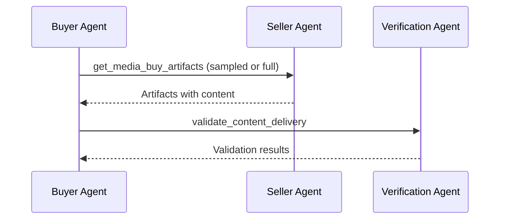

# get_media_buy_artifacts

Retrieve content artifacts from a media buy for validation. This is separate from `get_media_buy_delivery` which returns performance metrics - artifacts contain the actual content (text, images, video) where ads were placed.

**Response time**: < 5s (batch of 1,000 artifacts)

## Data Flow



The buyer requests artifacts from the seller using the same media buy parameters. The seller returns content samples based on the agreed sampling rate. The buyer then validates these against the verification agent.

## Request

**Schema**: [get-media-buy-artifacts-request.json](https://adcontextprotocol.org/schemas/v3/content-standards/get-media-buy-artifacts-request.json)

| Parameter | Type | Required | Description |
|-----------|------|----------|-------------|
| `account_id` | string | No | Filter to a specific account. Only returns artifacts for media buys belonging to this account. When omitted, returns artifacts across all accessible accounts. Optional if the agent has a single account. |
| `media_buy_id` | string | Yes | Media buy to get artifacts from |
| `package_ids` | array | No | Filter to specific packages |
| `sampling` | object | No | Sampling parameters (defaults to media buy agreement) |
| `time_range` | object | No | Filter to specific time period |
| `pagination` | object | No | Pagination parameters (see below) |

### Sampling Options

```json
{
  "sampling": {
    "rate": 0.25,
    "method": "random"
  }
}
```

| Method | Description |
|--------|-------------|
| `random` | Random sample across all deliveries |
| `stratified` | Sample proportionally across packages/properties |
| `recent` | Most recent deliveries first |
| `failures_only` | Only artifacts that failed local evaluation |

### Pagination

Uses higher limits than standard pagination because artifact result sets can be very large.

| Parameter | Type | Default | Description |
|-----------|------|---------|-------------|
| `pagination.max_results` | integer | 1000 | Maximum artifacts per page (1-10,000) |
| `pagination.cursor` | string | - | Opaque cursor from a previous response |

## Response

**Schema**: [get-media-buy-artifacts-response.json](https://adcontextprotocol.org/schemas/v3/content-standards/get-media-buy-artifacts-response.json)

### Success Response

```json
{
  "$schema": "/schemas/content-standards/get-media-buy-artifacts-response.json",
  "media_buy_id": "mb_nike_reddit_q1",
  "artifacts": [
    {
      "record_id": "imp_12345",
      "timestamp": "2025-01-15T10:30:00Z",
      "package_id": "pkg_feed_standard",
      "artifact": {
        "property_id": {"type": "domain", "value": "reddit.com"},
        "artifact_id": "r_fitness_abc123",
        "assets": [
          {"type": "text", "role": "title", "content": "Best protein sources for muscle building", "language": "en"},
          {"type": "text", "role": "paragraph", "content": "Looking for recommendations on high-quality protein sources for recovery", "language": "en"},
          {"type": "image", "url": "https://cdn.reddit.com/fitness-image.jpg", "alt_text": "Person lifting weights"}
        ]
      },
      "country": "US",
      "channel": "social",
      "brand_context": {"brand_id": "nike_global", "sku_id": "air_max_2025"},
      "local_verdict": "pass"
    },
    {
      "record_id": "imp_12346",
      "timestamp": "2025-01-15T10:35:00Z",
      "package_id": "pkg_feed_standard",
      "artifact": {
        "property_id": {"type": "domain", "value": "reddit.com"},
        "artifact_id": "r_news_politics_456",
        "assets": [
          {"type": "text", "role": "title", "content": "Election Results Analysis", "language": "en"},
          {"type": "text", "role": "paragraph", "content": "The latest polling data shows a tight race between candidates", "language": "en"}
        ]
      },
      "country": "US",
      "channel": "social",
      "brand_context": {"brand_id": "nike_global", "sku_id": "air_max_2025"},
      "local_verdict": "fail"
    }
  ],
  "sampling_info": {
    "total_deliveries": 100000,
    "sampled_count": 1000,
    "effective_rate": 0.01,
    "method": "random"
  },
  "pagination": {
    "cursor": "eyJvZmZzZXQiOjEwMDB9",
    "has_more": true
  }
}
```

### Response Fields

| Field | Description |
|-------|-------------|
| `artifacts` | Array of delivery records with full artifact content |
| `artifacts[].country` | ISO 3166-1 alpha-2 country code where delivery occurred |
| `artifacts[].channel` | Channel type (display, video, audio, social) |
| `artifacts[].brand_context` | Brand/SKU information for policy evaluation (schema TBD) |
| `artifacts[].local_verdict` | Seller's local model verdict (pass/fail/unevaluated) |
| `sampling_info` | How the sample was generated |
| `pagination` | Cursor for fetching more results |

## Use Cases

### Validate Sample Against Standards

```python
# Get artifacts from seller
artifacts_response = seller_agent.get_media_buy_artifacts(
    media_buy_id="mb_nike_reddit_q1",
    sampling={"rate": 0.25, "method": "random"}
)

# Convert to validation records
records = [
    {
        "record_id": a["record_id"],
        "timestamp": a["timestamp"],
        "media_buy_id": artifacts_response["media_buy_id"],
        "artifact": a["artifact"],
        "country": a.get("country"),
        "channel": a.get("channel"),
        "brand_context": a.get("brand_context")
    }
    for a in artifacts_response["artifacts"]
]

# Validate against verification agent
validation = verification_agent.validate_content_delivery(
    standards_id="nike_brand_safety",
    records=records
)

# Check for drift between local and verified verdicts
for i, result in enumerate(validation["results"]):
    local = artifacts_response["artifacts"][i]["local_verdict"]
    verified = result["verdict"]
    if local != verified:
        print(f"Drift detected: {result['record_id']} - local={local}, verified={verified}")
```

### Focus on Local Failures

```python
# Get only artifacts that failed local evaluation
failures = seller_agent.get_media_buy_artifacts(
    media_buy_id="mb_nike_reddit_q1",
    sampling={"method": "failures_only"},
    pagination={"max_results": 100}
)

# Verify these were correctly flagged
validation = verification_agent.validate_content_delivery(
    standards_id="nike_brand_safety",
    records=[{"record_id": a["record_id"], "artifact": a["artifact"]}
             for a in failures["artifacts"]]
)

# Check false positive rate
false_positives = sum(1 for r in validation["results"] if r["verdict"] == "pass")
print(f"False positive rate: {false_positives / len(failures['artifacts']):.1%}")
```

## Delivery vs Artifacts

| Aspect | get_media_buy_delivery | get_media_buy_artifacts |
|--------|------------------------|-------------------------|
| **Purpose** | Performance reporting | Content validation |
| **Data size** | Small (metrics) | Large (full content) |
| **Frequency** | Regular reporting | Sampled validation |
| **Contains** | Impressions, clicks, spend | Text, images, video |
| **Consumer** | Buyer for optimization | Verification agent |

## Related Tasks

- [validate_content_delivery](./validate_content_delivery) - Validate the artifacts
- [calibrate_content](./calibrate_content) - Understand why artifacts pass/fail
- [get_media_buy_delivery](../../../media-buy/task-reference/get_media_buy_delivery) - Get performance metrics
