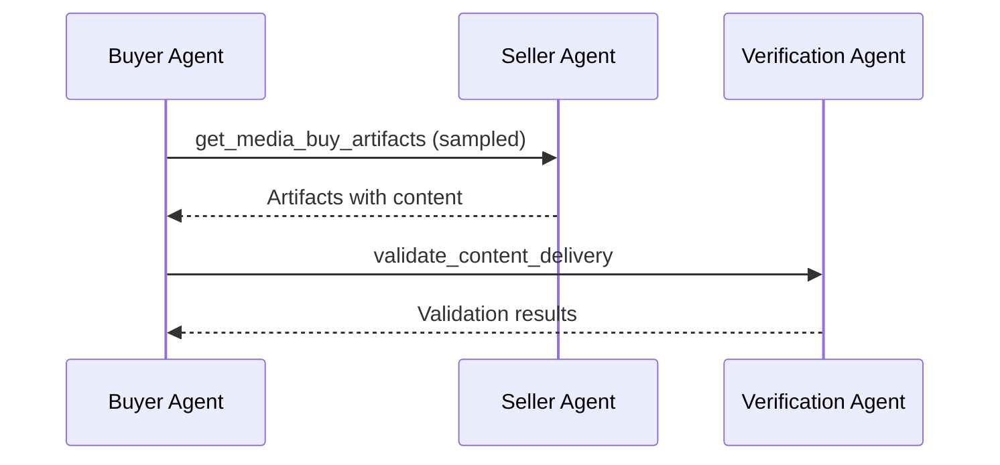

# validate_content_delivery

Validate delivery records against content safety policies. Designed for batch auditing of where ads were actually delivered.

**Asynchronous**: Accept immediately, process in background. Returns a `validation_id` for status polling.

## Data Flow

Content artifacts are separate from delivery metrics. Use `get_media_buy_artifacts` to retrieve content for validation:



**Why through the buyer?**

- The **buyer** owns the media buy and knows which `standards_id` applies
- The **buyer** requests artifacts from sellers (separate from performance metrics)
- The **buyer** is accountable for brand safety compliance
- The **verification agent** works on behalf of the buyer

This keeps responsibilities clear: sellers provide content samples via `get_media_buy_artifacts`, buyers validate samples against the verification agent.

## Request

**Schema**: [validate-content-delivery-request.json](https://adcontextprotocol.org/schemas/v3/content-standards/validate-content-delivery-request.json)

| Parameter | Type | Required | Description |
|-----------|------|----------|-------------|
| `standards_id` | string | Yes | Standards configuration to validate against |
| `records` | array | Yes | Delivery records to validate (max 10,000) |
| `feature_ids` | array | No | Specific features to evaluate (defaults to all) |
| `include_passed` | boolean | No | Include passed records in results (default: true) |

### Delivery Record

```json
{
  "record_id": "imp_12345",
  "timestamp": "2025-01-15T10:30:00Z",
  "media_buy_id": "mb_nike_reddit_q1",
  "artifact": {
    "property_id": {"type": "domain", "value": "example.com"},
    "artifact_id": "article_12345",
    "assets": [
      {"type": "text", "role": "title", "content": "Article Title"}
    ]
  },
  "country": "US",
  "channel": "display",
  "brand_context": {
    "brand_id": "nike_global",
    "sku_id": "air_max_2025"
  }
}
```

| Field | Required | Description |
|-------|----------|-------------|
| `record_id` | Yes | Unique identifier for this delivery record |
| `artifact` | Yes | Content artifact where ad was delivered |
| `media_buy_id` | No | Media buy this record belongs to (for multi-buy batches) |
| `timestamp` | No | When the delivery occurred |
| `country` | No | ISO 3166-1 alpha-2 country code for targeting context |
| `channel` | No | Channel type (display, video, audio, social) |
| `brand_context` | No | Brand/SKU information for policy evaluation (schema TBD) |

## Response

**Schema**: [validate-content-delivery-response.json](https://adcontextprotocol.org/schemas/v3/content-standards/validate-content-delivery-response.json)

### Success Response

```json
{
  "$schema": "/schemas/content-standards/validate-content-delivery-response.json",
  "summary": {
    "total_records": 1000,
    "passed_records": 950,
    "failed_records": 50
  },
  "results": [
    {
      "record_id": "imp_12345",
      "verdict": "pass",
      "features": [
        {
          "feature_id": "brand_safety",
          "status": "passed",
          "value": "safe"
        }
      ]
    },
    {
      "record_id": "imp_12346",
      "verdict": "fail",
      "features": [
        {
          "feature_id": "brand_safety",
          "status": "failed",
          "value": "high_risk",
          "message": "Content contains violence"
        }
      ]
    }
  ]
}
```

## Use Cases

### Post-Campaign Audit

```python
def audit_campaign_delivery(campaign_id, standards_id, content_standards_agent):
    """Audit all delivery records from a campaign."""
    # Fetch delivery records from your ad server
    records = fetch_delivery_records(campaign_id)

    # Validate in batches
    batch_size = 10000
    all_results = []

    for i in range(0, len(records), batch_size):
        batch = records[i:i + batch_size]
        response = content_standards_agent.validate_content_delivery(
            standards_id=standards_id,
            records=batch
        )
        all_results.extend(response["results"])

    return all_results
```

### Real-Time Monitoring Sample

```python
import random

def sample_and_validate(records, standards_id, sample_size=1000):
    """Validate a random sample for real-time monitoring."""
    sample = random.sample(records, min(sample_size, len(records)))
    return content_standards_agent.validate_content_delivery(
        standards_id=standards_id,
        records=sample
    )
```

### Filter for Issues Only

```python
# Only get failed records to reduce response size
response = content_standards_agent.validate_content_delivery(
    standards_id="nike_emea_safety",
    records=delivery_records,
    include_passed=False  # Only return failures
)

for result in response["results"]:
    print(f"Issue with {result['record_id']}")
    for feature in result["features"]:
        if feature["status"] == "failed":
            print(f"  - {feature['feature_id']}: {feature['message']}")
```

## Related Tasks

- [get_media_buy_artifacts](./get_media_buy_artifacts) - Get content artifacts from seller
- [calibrate_content](./calibrate_content) - Understand why artifacts pass/fail
- [get_content_standards](./get_content_standards) - Retrieve the policies
