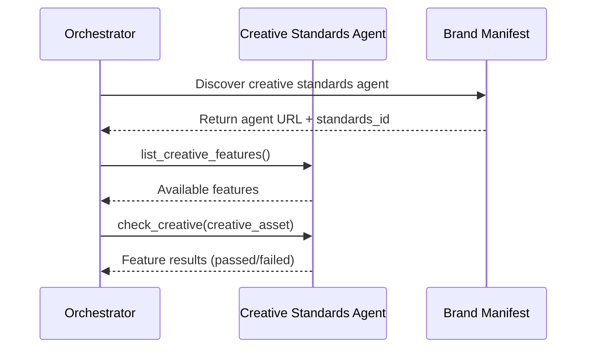

# Creative Standards Protocol

The Creative Standards Protocol enables AI agents to evaluate creative assets against brand execution guidelines. Unlike Content Standards (which evaluates where ads run), Creative Standards evaluates how the creative itself adheres to brand guidelines.

## Use Cases

- **Logo usage compliance**: Verify logos meet size, clear space, and placement requirements
- **Color palette adherence**: Check that creatives use approved brand colors
- **Typography compliance**: Ensure fonts and text styling follow brand guidelines
- **Messaging consistency**: Evaluate taglines and copy against approved messaging
- **Visual style adherence**: Check imagery, photography style, and visual elements
- **Co-branding requirements**: Verify partner brand usage meets guidelines

## Architecture

Creative Standards follows the same agent + token pattern as other governance protocols:

```
┌─────────────────┐     ┌──────────────────────────┐
│  Orchestrator   │────▶│  Creative Standards      │
│  (AI Agent)     │     │  Agent                   │
└─────────────────┘     │  (Brand/Agency Service)  │
        │               └──────────────────────────┘
        │                         │
        │                         ▼
        │               ┌──────────────────────────┐
        │               │  Brand Guidelines        │
        │               │  (Design System, Assets) │
        │               └──────────────────────────┘
        │
        ▼
┌─────────────────┐
│  Brand Manifest │
│  (Discovery)    │
└─────────────────┘
```

## Tasks

The Creative Standards Protocol provides four tasks:

| Task | Purpose |
|------|---------|
| [list_creative_features](/docs/governance/creative-standards/tasks/list_creative_features) | Discover available creative compliance features |
| [get_creative_standards](/docs/governance/creative-standards/tasks/get_creative_standards) | Retrieve creative execution guidelines |
| [check_creative](/docs/governance/creative-standards/tasks/check_creative) | Evaluate a single creative asset |
| [validate_creative_delivery](/docs/governance/creative-standards/tasks/validate_creative_delivery) | Batch validate delivered creatives |

## Feature Types

Creative features follow the same type system as property and content features:

### Binary Features
Pass/fail checks with clear criteria:
- `logo_present`: Is the brand logo included?
- `approved_tagline`: Does the copy use an approved tagline?
- `click_url_valid`: Does the clickthrough URL work?

### Quantitative Features
Numeric values within acceptable ranges:
- `logo_clear_space_px`: Minimum clear space around logo (pixels)
- `text_contrast_ratio`: WCAG contrast ratio compliance
- `logo_min_size_px`: Minimum logo dimensions

### Categorical Features
Values from defined sets:
- `color_palette`: Which approved palette is used (primary, secondary, seasonal)
- `typography_family`: Font family from brand approved list
- `imagery_style`: Photography style (lifestyle, product, abstract)

## Integration with Brand Manifest

The [Brand Manifest](/docs/creative/brand-manifest) can reference a Creative Standards agent for automated compliance checking:

```json
{
  "brand_id": "acme_corp",
  "governance": {
    "creative_standards_agent": {
      "url": "https://creative-compliance.acme.com",
      "standards_id": "acme_global_2024"
    }
  }
}
```

## Example Flow



## Relationship to Other Protocols

- **Content Standards**: Evaluates where ads run (content safety)
- **Creative Standards**: Evaluates how creatives look (brand compliance)
- **Property Governance**: Publisher-side inventory characteristics
- **Brand Manifest**: Discovery layer that can link to all governance agents
