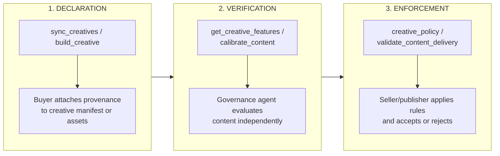
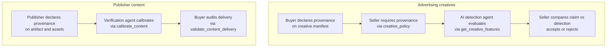

When a creative arrives with a provenance claim, the receiving party needs to decide whether to trust it. This page describes how AdCP handles that decision: provenance claims travel with the creative from buyer to seller, and each enforcement point — the publisher, the SSP, the verification vendor — runs its own independent check. No single party's attestation is taken at face value. This separation between declaration and verification is what makes the system work when the parties involved have competing incentives.

## Three-moment lifecycle

AI provenance flows through three distinct moments, each handled by existing AdCP tasks.



| Moment | When | Who | Task |
|--------|------|-----|------|
| **Declaration** | Creative submission | Buyer, agency, or creative tool | `sync_creatives`, `build_creative` |
| **Verification** | Before trafficking or during calibration | Seller's governance agent | `get_creative_features`, `calibrate_content` |
| **Enforcement** | Acceptance decision or post-delivery audit | Seller agent, buyer agent | `creative_policy`, `validate_content_delivery` |

Each moment is independent. A buyer can declare provenance without any verification having occurred. A seller can verify without requiring a declaration. Enforcement can happen with or without both.

## What buyers can declare

Provenance carries three families of evidence. Each survives a different set of supply-chain operations.

| Field | What it carries | Survives transcoding? |
|---|---|---|
| `c2pa.manifest_url` | Sidecar reference to a detached cryptographic manifest | No — file-level bindings break under ad-server transcoding, resize, and re-encode |
| `embedded_provenance[]` | Provenance metadata embedded *within* the content stream (manifest wrapper or invisible markers) | Yes — designed to persist through CMS ingestion, copy-paste, reformatting, and CDN re-encoding |
| `watermarks[]` | Identifier or fingerprint encoded into the content (audio, image, video, or text watermark) | Yes — survives transformations that preserve perceptual content |

`embedded_provenance` carries a structured provenance record (the chain of custody). `watermarks` encode an identifier (who generated it, who owns it). A single asset may carry both; pick the right field for what you actually attached.

## The verifier contract: seller publishes, buyer represents, seller confirms

Earlier drafts of this work imagined buyers nominating verification endpoints unilaterally. That pattern shipped SSRF risk, vendor sprawl, and a fundamentally wrong trust model: the seller is the verifier-of-record because the seller bears the regulatory liability for what it publishes. The protocol now reflects that.

The contract is three steps, each with a clear actor:

1. **Seller publishes** the governance agents it accepts on `creative_policy.accepted_verifiers[]` (returned by `get_products`). Each entry carries `agent_url`, optional `feature_id` (which feature the seller will request against the agent), and optional `providers[]` (which `provider` labels the agent covers). The seller has already vetted these endpoints; calls to them are inside the seller's allowlist.
2. **Buyer represents** which of those agents was used by attaching a `verify_agent: { agent_url, feature_id? }` pointer on each `embedded_provenance[]` or `watermarks[]` entry. The buyer's `agent_url` MUST match (canonicalized) one of the seller's published `accepted_verifiers[].agent_url`. This is buyer-supplied evidence, not buyer-driven routing.
3. **Seller confirms** by cross-checking the buyer's `verify_agent.agent_url` against the published list (rejecting off-list URLs with `PROVENANCE_VERIFIER_NOT_ACCEPTED` before any outbound call), then invoking `get_creative_features` against the matching on-list agent and reconciling the result against the buyer's claim. The seller MAY use a different on-list agent than the buyer nominated; the seller is the verifier-of-record. When it does substitute, `error.details` carries both the agent it called and `substituted_for` so the buyer can audit.

```json
// 1. Seller publishes — returned by get_products on each Product
{
  "creative_policy": {
    "accepted_verifiers": [
      {
        "agent_url": "https://governance.encypher.seller.example",
        "feature_id": "encypher.markers_present_v2",
        "providers": ["Encypher"]
      },
      {
        "agent_url": "https://governance.imatag.seller.example",
        "feature_id": "imatag.watermark_detected",
        "providers": ["Imatag"]
      }
    ]
  }
}

// 2. Buyer represents — attached to creative on sync_creatives
{
  "embedded_provenance": [
    {
      "method": "provenance_markers",
      "provider": "Encypher",
      "verify_agent": {
        "agent_url": "https://governance.encypher.seller.example",
        "feature_id": "encypher.markers_present_v2"
      }
    }
  ]
}

// 3. Seller confirms — cross-check, then call, then reconcile.
//    Off-list URL → PROVENANCE_VERIFIER_NOT_ACCEPTED, no outbound call.
//    On-list URL with contradicting verifier result → PROVENANCE_CLAIM_CONTRADICTED.
```

Sellers MUST NOT call URLs that are not in `accepted_verifiers` — that closes the buyer-controlled-URL trust gap. Buyers that omit `verify_agent` (e.g., on a self-verifiable C2PA text manifest with a public key the seller already trusts) leave the agent selection entirely to the seller's discovery.

## What sellers can require

Sellers express what they need on `creative_policy`, returned by `get_products` so buyers see requirements before submitting:

| Field | Effect |
|---|---|
| `provenance_required: true` | Creative MUST carry *some* provenance object, anywhere in the inheritance chain. Submission without provenance is rejected with `PROVENANCE_REQUIRED`. |
| `provenance_requirements.{require_digital_source_type, require_disclosure_metadata, require_embedded_provenance}` | Field-level requirements. Submission missing the named field is rejected with the corresponding `PROVENANCE_*_MISSING` code. Field-level requirements are seller-enforced — JSON Schema validation does not check them. |
| `accepted_verifiers[]` | Governance agents the seller will call to verify provenance claims. Buyers' `verify_agent` references MUST be a canonicalized match of one of these `agent_url` values. |

Sellers that publish a requirement MUST enforce it on `sync_creatives` — that's the structural-rejection contract. The truth-of-claim contract (does the buyer's `digital_source_type` actually match the content?) lives in `get_creative_features` and surfaces as `PROVENANCE_CLAIM_CONTRADICTED`.

### Rejection error codes

When `sync_creatives` rejects a creative for provenance reasons, the per-creative result carries a structured error with one of:

| Code | Meaning | `error.field` points at |
|---|---|---|
| `PROVENANCE_REQUIRED` | No provenance object anywhere on the creative, but `provenance_required: true` | The manifest path where provenance was expected |
| `PROVENANCE_DIGITAL_SOURCE_TYPE_MISSING` | Resolved provenance has no `digital_source_type` | The resolved `provenance.digital_source_type` path |
| `PROVENANCE_DISCLOSURE_MISSING` | Resolved provenance has no `disclosure.required` (or true without jurisdictions) | The resolved `provenance.disclosure` path |
| `PROVENANCE_EMBEDDED_MISSING` | Resolved provenance has no `embedded_provenance` entry | The resolved `provenance.embedded_provenance` path |
| `PROVENANCE_VERIFIER_NOT_ACCEPTED` | `verify_agent.agent_url` is not on the seller's `accepted_verifiers` list | The offending `verify_agent.agent_url` path |
| `PROVENANCE_CLAIM_CONTRADICTED` | Verifier (called from `accepted_verifiers`) actively refutes the buyer's claim | The provenance field whose claim was refuted; `error.details` is limited to `{ agent_url, feature_id, claimed_value, observed_value, confidence }` plus `substituted_for` when the seller used an on-list agent other than the one the buyer nominated |

Buyers receiving these codes can self-correct without negotiating with the seller — the failure is machine-readable. Auto-retry without correction will not pass.

## AI detection via get_creative_features

AI detection is a creative governance feature, evaluated by specialist agents through `get_creative_features` -- the same task used for security scanning, creative quality, and content categorization. AI detection does not require a separate protocol or workflow.

### Agent declares AI detection capabilities

An AI detection agent advertises its features via `get_adcp_capabilities`:

```json
{
  "governance": {
    "creative_features": [
      {
        "feature_id": "ai_generated",
        "type": "binary",
        "description": "Whether the creative contains AI-generated content",
        "methodology_url": "https://detector.example.com/methodology"
      },
      {
        "feature_id": "ai_modified",
        "type": "binary",
        "description": "Whether the creative contains AI-modified elements",
        "methodology_url": "https://detector.example.com/methodology"
      },
      {
        "feature_id": "ai_confidence",
        "type": "quantitative",
        "range": { "min": 0, "max": 1 },
        "description": "Confidence score for AI detection result",
        "methodology_url": "https://detector.example.com/methodology"
      }
    ]
  }
}
```

### Seller evaluates a creative

The seller sends the creative manifest to the AI detection agent:

```json
{
  "creative_manifest": {
    "format_id": {
      "agent_url": "https://creative.adcontextprotocol.org",
      "id": "display_300x250"
    },
    "assets": {
      "banner_image": {
        "url": "https://cdn.novabrands.example.com/hero.jpg",
        "width": 300,
        "height": 250
      },
      "headline": {
        "content": "Nutrition dogs love"
      }
    }
  },
  "feature_ids": ["ai_generated", "ai_modified", "ai_confidence"]
}
```

### Agent returns detection results

```json
{
  "results": [
    { "feature_id": "ai_generated", "value": true, "confidence": 0.94 },
    { "feature_id": "ai_modified", "value": false },
    { "feature_id": "ai_confidence", "value": 0.94 }
  ],
  "detail_url": "https://detector.example.com/reports/ctx_xyz789"
}
```

### Seller applies enforcement logic

The seller compares the detection result against the buyer's provenance claim:

```javascript
const provenance = creative.manifest.provenance;
const detection = await detectionAgent.getCreativeFeatures({
  creative_manifest: creative.manifest,
  feature_ids: ['ai_generated']
});

if (detection.errors) {
  // Detection failed - handle based on policy
  return;
}

const aiDetected = detection.results.find(
  f => f.feature_id === 'ai_generated'
);

// Case 1: Provenance claims non-AI, detection says AI
if (
  provenance?.digital_source_type === 'digital_capture' &&
  aiDetected?.value === true &&
  aiDetected?.confidence > 0.9
) {
  // Reject - provenance claim contradicts detection
  return;
}

// Case 2: AI content in jurisdiction requiring disclosure
if (
  aiDetected?.value === true &&
  !provenance?.disclosure?.required
) {
  // Reject - AI content without required disclosure metadata
  return;
}
```

### Multi-agent evaluation

AI detection fits naturally into the multi-agent creative governance pattern. A seller evaluating a creative can call multiple specialist agents in parallel:

| Agent | Features | Provenance relevance |
|-------|----------|---------------------|
| Security scanner | `auto_redirect`, `cloaking` | None -- independent concern |
| AI detection | `ai_generated`, `ai_modified` | Verifies provenance claims |
| Content categorizer | `iab_casinos_gambling` | None -- independent concern |
| Creative quality | `brand_consistency` | None -- independent concern |

The orchestrator calls all agents via `get_creative_features`, aggregates results, and applies its requirements across all of them. AI detection is one column in the evaluation matrix, not a separate workflow.

## Content standards integration

For publisher content (artifacts), provenance verification uses the content standards infrastructure: `calibrate_content` for alignment and `validate_content_delivery` for auditing.

### Artifact provenance

Publishers declare provenance on artifacts the same way buyers declare it on creatives:

```json
{
  "property_id": { "type": "domain", "value": "newssite.example.com" },
  "artifact_id": "article_trends_2026",
  "provenance": {
    "digital_source_type": "digital_creation",
    "declared_by": { "role": "platform" }
  },
  "assets": [
    {
      "type": "text",
      "role": "title",
      "content": "Industry trends to watch in 2026"
    },
    {
      "type": "image",
      "url": "https://cdn.newssite.example.com/ai-illustration.jpg",
      "alt_text": "Conceptual illustration",
      "provenance": {
        "digital_source_type": "trained_algorithmic_media",
        "ai_tool": { "name": "Midjourney", "version": "v7" },
        "declared_by": { "role": "platform" }
      }
    }
  ]
}
```

### Calibration for AI provenance

During `calibrate_content`, the verification agent can evaluate whether artifact provenance claims are accurate. This uses the same calibration dialogue as brand suitability -- the verification agent returns verdicts with explanations:

```json
{
  "verdict": "fail",
  "explanation": "The article's hero image shows strong indicators of AI generation (GAN artifacts, inconsistent lighting) but is marked as digital_creation. The provenance claim does not match detection results.",
  "features": [
    {
      "feature_id": "provenance_accuracy",
      "status": "failed",
      "explanation": "Image asset provenance claims digital_creation but AI detection confidence is 0.92."
    },
    {
      "feature_id": "brand_safety",
      "status": "passed",
      "explanation": "No safety concerns with the content itself."
    }
  ]
}
```

### Post-delivery validation

Buyers can audit AI provenance in delivered content through `validate_content_delivery`, the same task used for brand suitability auditing:

```json
{
  "standards_id": "acme_ai_disclosure_policy",
  "records": [
    {
      "record_id": "imp_54321",
      "media_buy_id": "mb_acme_q1",
      "artifact": {
        "property_id": { "type": "domain", "value": "newssite.example.com" },
        "artifact_id": "article_trends_2026",
        "provenance": {
          "digital_source_type": "digital_creation",
          "declared_by": { "role": "platform" }
        },
        "assets": [
          {
            "type": "image",
            "url": "https://cdn.newssite.example.com/ai-illustration.jpg"
          }
        ]
      }
    }
  ]
}
```

## Compliance profiles

Different regulatory environments require different levels of provenance enforcement. Here are example configurations.

<CodeGroup>
```json EU (strict)
{
  "profile": "eu_strict",
  "creative_policy": {
    "provenance_required": true
  },
  "enforcement_rules": {
    "ai_detection_required": true,
    "ai_detection_confidence_threshold": 0.85,
    "disclosure_required_for": [
      "trained_algorithmic_media",
      "composite_with_trained_algorithmic_media",
      "human_edits"
    ],
    "reject_on_mismatch": true,
    "jurisdictions": [
      {
        "country": "DE",
        "regulation": "eu_ai_act_article_50",
        "label_text": "KI-generiert"
      },
      {
        "country": "FR",
        "regulation": "eu_ai_act_article_50",
        "label_text": "Contenu généré par l'IA"
      }
    ]
  }
}
```

```json US/California (moderate)
{
  "profile": "us_california",
  "creative_policy": {
    "provenance_required": true
  },
  "enforcement_rules": {
    "ai_detection_required": true,
    "ai_detection_confidence_threshold": 0.90,
    "disclosure_required_for": [
      "trained_algorithmic_media",
      "composite_with_trained_algorithmic_media"
    ],
    "reject_on_mismatch": true,
    "jurisdictions": [
      {
        "country": "US",
        "region": "CA",
        "regulation": "ca_sb_942",
        "label_text": "Created with AI"
      }
    ]
  }
}
```

```json Permissive
{
  "profile": "permissive",
  "creative_policy": {
    "provenance_required": false
  },
  "enforcement_rules": {
    "ai_detection_required": false,
    "log_provenance_if_present": true,
    "reject_on_mismatch": false
  }
}
```
</CodeGroup>

<Info>
These profiles are illustrative configurations, not schema-defined objects. Each seller implements enforcement logic suited to their regulatory requirements. The AdCP schemas provide the data model; the enforcement rules are implementation decisions.
</Info>

## For regulators

AdCP provides a machine-readable, protocol-level mechanism for AI disclosure in programmatic advertising. Every creative and content artifact in the supply chain can carry structured provenance metadata that declares the digital source type, the AI tools used, the level of human oversight, and the applicable disclosure requirements by jurisdiction — including specific regulation identifiers such as `eu_ai_act_article_50`, `ca_sb_942`, and `cn_deep_synthesis`.

This metadata uses the IPTC digital source type vocabulary, the same classification system adopted by C2PA Content Credentials, Meta, and Google for AI content labeling. AdCP does not invent a new taxonomy. It carries an existing, widely adopted one through the advertising supply chain where it has not previously been available in structured form.

### Verification is independent, not self-reported

Provenance in AdCP is explicitly a claim, not a certification. The declaring party — typically the advertiser or their agency — attaches provenance when submitting a creative. The enforcing party — typically the publisher or their supply-side platform — verifies that claim independently using AI detection services, C2PA manifest validation, or both. This verification happens through existing AdCP governance mechanisms (`get_creative_features` for creatives, `calibrate_content` for publisher content) and does not require new infrastructure.

This architecture addresses a structural problem in advertising compliance: the party submitting the creative has an incentive to understate AI involvement (to avoid placement restrictions or disclosure requirements), while the party publishing the creative bears the regulatory liability for non-disclosure. By treating provenance as a verifiable claim rather than a trusted assertion, the protocol ensures that compliance does not depend on the good faith of any single participant.

### Mapping to regulatory requirements

**EU AI Act Article 50**: Requires that AI-generated content be labeled in a machine-readable way. AdCP's `digital_source_type` field provides this classification at the asset level. The `disclosure.jurisdictions` array allows creatives to carry jurisdiction-specific label text. Enforcement points can filter or flag creatives based on `digital_source_type` values that indicate AI generation (`trained_algorithmic_media`, `composite_with_trained_algorithmic_media`).

**California SB 942**: Requires disclosure when content is generated or substantially modified by AI. The `digital_source_type` and `human_oversight` fields together provide the information needed to determine whether a creative meets the disclosure threshold. The `disclosure.required` flag provides a direct signal for enforcement.

**Platform mandates (Meta, Google, TikTok)**: Major platforms already require AI content labeling using IPTC-aligned metadata. AdCP's provenance structure is directly compatible with these requirements because it uses the same underlying vocabulary.

AdCP does not determine which regulations apply to a given creative. It provides the structured metadata that allows each enforcement point to apply its own jurisdictional rules. The protocol carries the data; the enforcing party makes the compliance decision.

### Verification flow



## Implementation checklist

### Buyers (brands and agencies)

| Requirement | Description |
|-------------|-------------|
| Attach provenance to creatives | Set `provenance` on `creative-asset` or `creative-manifest` when submitting via `sync_creatives` |
| Classify AI involvement | Use the correct `digital_source_type` for each creative and asset |
| Declare AI tooling | Populate `ai_tool` when AI systems were used in production |
| Set human oversight level | Indicate `human_oversight` when AI is involved |
| Declare disclosure obligations | Populate `disclosure.jurisdictions` for each applicable regulation |
| Preserve C2PA references | Include `c2pa.manifest_url` when content credentials exist |
| Use transcoding-resilient declarations | When the pipeline includes intermediaries that transcode or re-encode assets, attach `embedded_provenance[]` and/or `watermarks[]` rather than relying on `c2pa.manifest_url` alone |
| Represent the verifier from the seller's allowlist | Populate `verify_agent.agent_url` on `embedded_provenance[]` / `watermarks[]` entries with a value drawn from the product's `creative_policy.accepted_verifiers[].agent_url`. Off-list URLs are rejected without an outbound call |
| Read seller requirements upfront | Inspect `creative_policy.provenance_required`, `creative_policy.provenance_requirements`, and `creative_policy.accepted_verifiers` from `get_products` and pre-flight your creative shape before calling `sync_creatives` |
| Handle rejection codes | Treat `PROVENANCE_REQUIRED`, `PROVENANCE_*_MISSING`, `PROVENANCE_VERIFIER_NOT_ACCEPTED`, and `PROVENANCE_CLAIM_CONTRADICTED` as machine-readable correctable errors — auto-retry without correction will not pass |
| Run pre-submission detection | Optionally attach `verification` results from your own detection services |

### Sellers (publishers and platforms)

| Requirement | Description |
|-------------|-------------|
| Set creative policy | Add `provenance_required: true` to `creative-policy` if provenance is required |
| Publish field-level requirements | Set `provenance_requirements.require_*` flags for fields you intend to enforce — buyers read these from `get_products` and self-correct before submission |
| Publish accepted verifiers | Populate `creative_policy.accepted_verifiers[]` with the governance agents you operate or have allowlisted. Buyers' `verify_agent` references MUST be a canonicalized match of one of these `agent_url` values |
| Enforce structural requirements | Reject `sync_creatives` submissions that omit any required field with the matching `PROVENANCE_*` error code (per-creative `errors[]`, `error.field` pointing at the missing path) |
| Cross-check `verify_agent` before calling | Confirm the buyer's `verify_agent.agent_url` is on `accepted_verifiers` (canonicalized) before any outbound call. Off-list URLs MUST be rejected with `PROVENANCE_VERIFIER_NOT_ACCEPTED` and never called |
| Run AI detection | Call `get_creative_features` against the on-list governance agent that matches the buyer's representation (or one you select from `accepted_verifiers` if the buyer omits `verify_agent`) |
| Compare claims vs detection | Implement logic to compare `digital_source_type` against `ai_generated` feature results |
| Reject contradictions | Use `PROVENANCE_CLAIM_CONTRADICTED` with `error.details` limited to `{ agent_url, feature_id, claimed_value, observed_value, confidence }` (and `substituted_for` when you called an on-list agent other than the one the buyer nominated) |
| Enforce disclosure | Verify that AI content includes appropriate `disclosure` metadata for target jurisdictions |
| Declare artifact provenance | Attach `provenance` to content artifacts submitted via content standards |

### Creative agents

| Requirement | Description |
|-------------|-------------|
| Attach provenance to generated content | When `build_creative` generates AI content, attach provenance with `digital_source_type`, `ai_tool`, and `human_oversight` |
| Set `declared_by` role to `tool` | Creative agents that attach provenance should identify themselves with role `tool` |
| Carry through C2PA | If source assets have C2PA manifests, carry the reference through to the generated manifest |

### Governance agents (AI detection)

| Requirement | Description |
|-------------|-------------|
| Declare detection features | Advertise `ai_generated` and related features via `get_adcp_capabilities` |
| Implement `get_creative_features` | Accept creative manifests and return detection results |
| Return confidence scores | Include `confidence` on detection results for probabilistic assessments |
| Provide detail URLs | Link to full reports via `detail_url` for audit trails |

## Related

- [AI provenance and disclosure](/docs/creative/provenance) -- The provenance schema reference, digital source type enum, and inheritance model
- [Creative Governance](/docs/governance/creative/index) -- Feature-based creative evaluation via `get_creative_features`
- [`get_creative_features`](/docs/governance/creative/get_creative_features) -- Task reference for creative feature evaluation
- [Content Standards](/docs/governance/content-standards/index) -- Privacy-preserving brand suitability for publisher content
- [`calibrate_content`](/docs/governance/content-standards/tasks/calibrate_content) -- Calibration task for content standards alignment
- [`validate_content_delivery`](/docs/governance/content-standards/tasks/validate_content_delivery) -- Post-delivery content validation
