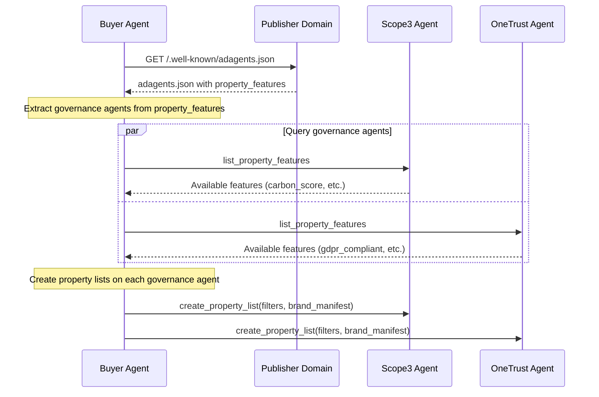

The `adagents.json` file provides a standardized way for publishers to declare their properties and authorize sales agents. This is the foundation of Property Governance - it defines what properties exist and who can sell them.

<Tip>
**[AdAgents.json Builder](https://adcontextprotocol.org/adagents)** - Validate existing files or create new ones with guided validation
</Tip>

## File Location

Publishers must host the `adagents.json` file at:

```
https://example.com/.well-known/adagents.json
```

Following [RFC 8615](https://datatracker.ietf.org/doc/html/rfc8615) well-known URI conventions, this location ensures consistent discoverability across publishers.

## Basic Structure

The file must be valid JSON with UTF-8 encoding and return HTTP 200 status.

```json
{
  "$schema": "https://adcontextprotocol.org/schemas/v2/adagents.json",
  "contact": {
    "name": "Example Publisher Ad Operations",
    "email": "adops@example.com",
    "domain": "example.com",
    "seller_id": "pub-example-12345",
    "tag_id": "67890"
  },
  "properties": [
    {
      "property_id": "example_site",
      "property_type": "website",
      "name": "Example Site",
      "identifiers": [
        {"type": "domain", "value": "example.com"}
      ]
    }
  ],
  "authorized_agents": [
    {
      "url": "https://agent.example.com",
      "authorized_for": "Official sales agent",
      "authorization_type": "property_ids",
      "property_ids": ["example_site"]
    }
  ],
  "last_updated": "2025-01-10T12:00:00Z"
}
```

## Schema Fields

**`$schema`** *(optional)*: JSON Schema reference for validation

**`contact`** *(optional)*: Contact info for entity managing this file
  - **`name`** *(required)*: Name of managing entity (may be publisher or third-party)
  - **`email`** *(optional)*: Contact email for questions/issues
  - **`domain`** *(optional)*: Primary domain of managing entity
  - **`seller_id`** *(optional)*: Seller ID from IAB Tech Lab sellers.json
  - **`tag_id`** *(optional)*: TAG Certified Against Fraud ID
  - **`privacy_policy_url`** *(optional)*: URL to entity's privacy policy for consumer consent flows

**`properties`** *(optional)*: Array of properties covered by this file (canonical property definitions)

**`tags`** *(optional)*: Tag metadata providing human-readable context and enabling efficient grouping

**`authorized_agents`** *(required)*: Array of authorized sales agents
  - **`url`** *(required)*: Agent's API endpoint URL
  - **`authorized_for`** *(required)*: Human-readable authorization description
  - **`authorization_type`** *(optional)*: One of `property_ids`, `property_tags`, `inline_properties`, `publisher_properties`
  - **Additional fields**: Depends on authorization_type (see patterns below)

**`last_updated`** *(optional)*: ISO 8601 timestamp of last modification

**`property_features`** *(optional)*: Array of governance agents that provide data about properties in this file
  - **`url`** *(required)*: Agent's API endpoint URL (governance agent implementing property governance tasks)
  - **`name`** *(required)*: Human-readable name of the vendor/agent (e.g., "Scope3", "TAG", "OneTrust")
  - **`features`** *(required)*: Array of feature IDs this agent provides (e.g., `["carbon_score", "gdpr_compliant"]`)
  - **`publisher_id`** *(optional)*: Publisher's identifier at this agent (for lookup)

This field enables **governance agent discovery** - buyers can find which agents have compliance, sustainability, or quality data for properties without querying every possible agent.

## URL Reference Pattern

For publishers with complex infrastructure or CDN distribution, `adagents.json` can reference an authoritative URL instead of containing the full structure inline.

### When to Use URL References

- **CDN Distribution**: Serve authorization data from a global CDN for better performance
- **Centralized Management**: Single source of truth across multiple domains
- **Large Files**: When authorization data is too large for inline embedding
- **Dynamic Updates**: When authorization needs frequent updates without touching domain files

### URL Reference Structure

```json
{
  "$schema": "https://adcontextprotocol.org/schemas/v2/adagents.json",
  "authoritative_location": "https://cdn.example.com/adagents/v2/adagents.json",
  "last_updated": "2025-01-15T10:00:00Z"
}
```

### Requirements

- **HTTPS Required**: The `authoritative_location` must use HTTPS
- **No Nested References**: The authoritative file cannot itself be a URL reference (prevents infinite loops)
- **Same Schema**: The authoritative file must be a valid inline adagents.json structure
- **Single Hop**: Only one level of URL indirection is allowed

### Example Use Case: Multi-Domain Publisher

A publisher with multiple domains can maintain one authoritative file:

**On each domain** (`https://domain1.com/.well-known/adagents.json`, `https://domain2.com/.well-known/adagents.json`, etc.):
```json
{
  "$schema": "https://adcontextprotocol.org/schemas/v2/adagents.json",
  "authoritative_location": "https://cdn.publisher.com/adagents/v2/adagents.json",
  "last_updated": "2025-01-15T10:00:00Z"
}
```

**Authoritative file** (`https://cdn.publisher.com/adagents/v2/adagents.json`):
```json
{
  "$schema": "https://adcontextprotocol.org/schemas/v2/adagents.json",
  "contact": {
    "name": "Publisher Ad Operations",
    "email": "adops@publisher.com"
  },
  "properties": [
    {
      "property_id": "domain1_site",
      "property_type": "website",
      "name": "Domain 1",
      "identifiers": [{"type": "domain", "value": "domain1.com"}],
      "publisher_domain": "domain1.com"
    },
    {
      "property_id": "domain2_site",
      "property_type": "website",
      "name": "Domain 2",
      "identifiers": [{"type": "domain", "value": "domain2.com"}],
      "publisher_domain": "domain2.com"
    }
  ],
  "authorized_agents": [
    {
      "url": "https://sales-agent.publisher.com",
      "authorized_for": "All publisher properties",
      "authorization_type": "property_ids",
      "property_ids": ["domain1_site", "domain2_site"]
    }
  ],
  "last_updated": "2025-01-15T09:00:00Z"
}
```

### Validation Behavior

When AdCP validators encounter a URL reference:

1. **Fetch Reference**: Retrieve the file at `/.well-known/adagents.json`
2. **Detect Reference**: Check for `authoritative_location` field
3. **Validate URL**: Ensure `authoritative_location` is HTTPS and valid
4. **Fetch Authoritative**: Retrieve content from `authoritative_location`
5. **Prevent Loops**: Reject if authoritative file is also a reference
6. **Validate Structure**: Validate the authoritative file as normal inline structure

### Caching Recommendations

- Cache reference files for 24 hours minimum
- Cache authoritative files separately with their own TTL
- Use `last_updated` timestamp to detect when cache should be invalidated
- Implement exponential backoff for failed fetches

## Authorization Patterns

AdCP supports four authorization patterns, each optimized for different use cases:

### Pattern 1: Property IDs (Direct References)

**Best for**: Specific, enumerable property lists. Direct and unambiguous.

**Structure**:
```json
{
  "properties": [
    {
      "property_id": "cnn_ctv_app",
      "property_type": "ctv_app",
      "name": "CNN CTV App",
      "identifiers": [
        {"type": "roku_store_id", "value": "12345"}
      ]
    }
  ],
  "authorized_agents": [
    {
      "url": "https://cnn-ctv-agent.com",
      "authorized_for": "CNN CTV properties",
      "authorization_type": "property_ids",
      "property_ids": ["cnn_ctv_app"]
    }
  ]
}
```

**How it works**: Agent is authorized for specific properties listed in `property_ids` array. The properties must be defined in the top-level `properties` array.

### Pattern 2: Property Tags (Efficient Grouping)

**Best for**: Large networks where one tag can reference hundreds/thousands of properties. Provides grouping efficiency without listing every property ID.

**Key Insight**: Tags are not just "human-readable metadata" - they're a **performance optimization**. A publisher with 500 properties can use one tag to authorize all of them, rather than listing 500 property IDs.

**Structure**:
```json
{
  "properties": [
    {
      "property_id": "instagram",
      "property_type": "mobile_app",
      "name": "Instagram",
      "identifiers": [
        {"type": "ios_bundle", "value": "com.burbn.instagram"}
      ],
      "tags": ["meta_network", "social_media"]
    },
    {
      "property_id": "facebook",
      "property_type": "mobile_app",
      "name": "Facebook",
      "identifiers": [
        {"type": "ios_bundle", "value": "com.facebook.Facebook"}
      ],
      "tags": ["meta_network", "social_media"]
    }
  ],
  "tags": {
    "meta_network": {
      "name": "Meta Network",
      "description": "All Meta-owned properties - enables one tag to authorize entire network"
    }
  },
  "authorized_agents": [
    {
      "url": "https://meta-ads.com",
      "authorized_for": "All Meta properties",
      "authorization_type": "property_tags",
      "property_tags": ["meta_network"]
    }
  ]
}
```

**How it works**: Agent is authorized for all properties that have ANY of the listed tags. Properties are matched against the `tags` array in each property definition.

### Pattern 3: Inline Properties

**Best for**: Small, specific property sets without top-level property declarations.

**Structure**:
```json
{
  "authorized_agents": [
    {
      "url": "https://agent.com",
      "authorized_for": "Specific inventory",
      "authorization_type": "inline_properties",
      "properties": [
        {
          "property_type": "website",
          "name": "Example Site",
          "identifiers": [
            {"type": "domain", "value": "example.com"}
          ]
        }
      ]
    }
  ]
}
```

**How it works**: Properties are defined directly within the agent authorization entry instead of the top-level `properties` array. Useful when each agent has unique property definitions.

### Pattern 4: Publisher Property References

**Best for**: Third-party agents representing multiple publishers. Single source of truth for property definitions.

**Structure**:
```json
{
  "contact": {
    "name": "Third-Party CTV Network"
  },
  "authorized_agents": [
    {
      "url": "https://ctv-network.com/api",
      "authorized_for": "CTV inventory from multiple publishers",
      "authorization_type": "publisher_properties",
      "publisher_properties": [
        {
          "publisher_domain": "cnn.com",
          "selection_type": "by_tag",
          "property_tags": ["ctv"]
        },
        {
          "publisher_domain": "espn.com",
          "selection_type": "by_tag",
          "property_tags": ["ctv"]
        }
      ]
    }
  ]
}
```

**How it works**: Agent references properties from OTHER publishers' adagents.json files. The `publisher_domain` points to the publisher, and `selection_type` determines how to resolve properties (`by_id` or `by_tag`).

## Domain Matching Rules

For website properties with domain identifiers, AdCP follows web conventions:

### Base Domain (`example.com`)

Matches domain plus standard web subdomains:

- ✅ `example.com`
- ✅ `www.example.com` (standard web)
- ✅ `m.example.com` (standard mobile)
- ❌ `subdomain.example.com` (requires explicit authorization)

### Specific Subdomain (`subdomain.example.com`)

Matches only that exact subdomain:

- ✅ `subdomain.example.com`
- ❌ All other domains/subdomains

### Wildcard (`*.example.com`)

Matches ALL subdomains but NOT base:

- ✅ Any subdomain
- ❌ `example.com` (base domain requires separate authorization)

## Real-World Examples

### Example 1: Meta Network (Tag-Based)

Large network using tags for grouping efficiency:

```json
{
  "contact": {
    "name": "Meta Advertising Operations",
    "email": "adops@meta.com",
    "domain": "meta.com",
    "seller_id": "pub-meta-12345",
    "tag_id": "12345",
    "privacy_policy_url": "https://www.meta.com/privacy/policy"
  },
  "properties": [
    {
      "property_type": "mobile_app",
      "name": "Instagram",
      "identifiers": [
        {"type": "ios_bundle", "value": "com.burbn.instagram"},
        {"type": "android_package", "value": "com.instagram.android"}
      ],
      "tags": ["meta_network"],
      "publisher_domain": "instagram.com"
    },
    {
      "property_type": "mobile_app",
      "name": "Facebook",
      "identifiers": [
        {"type": "ios_bundle", "value": "com.facebook.Facebook"},
        {"type": "android_package", "value": "com.facebook.katana"}
      ],
      "tags": ["meta_network"],
      "publisher_domain": "facebook.com"
    },
    {
      "property_type": "mobile_app",
      "name": "WhatsApp",
      "identifiers": [
        {"type": "ios_bundle", "value": "net.whatsapp.WhatsApp"},
        {"type": "android_package", "value": "com.whatsapp"}
      ],
      "tags": ["meta_network"],
      "publisher_domain": "whatsapp.com"
    }
  ],
  "tags": {
    "meta_network": {
      "name": "Meta Network",
      "description": "All Meta-owned properties - one tag authorizes entire network efficiently"
    }
  },
  "authorized_agents": [
    {
      "url": "https://meta-ads.com",
      "authorized_for": "All Meta properties",
      "authorization_type": "property_tags",
      "property_tags": ["meta_network"]
    }
  ]
}
```

**Why this works**: One tag (`meta_network`) authorizes all properties without listing individual property IDs. As Meta adds properties, they just tag them - no need to update agent authorization.

### Example 2: CNN (Channel Segmentation)

Different agents for different channels:

```json
{
  "contact": {
    "name": "CNN Advertising Operations",
    "email": "adops@cnn.com",
    "domain": "cnn.com"
  },
  "properties": [
    {
      "property_id": "cnn_ctv_app",
      "property_type": "ctv_app",
      "name": "CNN CTV App",
      "identifiers": [
        {"type": "roku_store_id", "value": "12345"}
      ],
      "tags": ["ctv"]
    },
    {
      "property_id": "cnn_web_us",
      "property_type": "website",
      "name": "CNN.com US",
      "identifiers": [
        {"type": "domain", "value": "cnn.com"}
      ],
      "tags": ["web"]
    }
  ],
  "authorized_agents": [
    {
      "url": "https://cnn-ctv-agent.com",
      "authorized_for": "CNN CTV properties",
      "authorization_type": "property_ids",
      "property_ids": ["cnn_ctv_app"]
    },
    {
      "url": "https://cnn-web-agent.com",
      "authorized_for": "CNN web properties",
      "authorization_type": "property_ids",
      "property_ids": ["cnn_web_us"]
    }
  ]
}
```

### Example 3: Publisher with Governance Agent References

Publishers can declare which governance agents have data about their properties using `property_features`. This enables buyers to discover where to get compliance, sustainability, and quality data.

```json
{
  "$schema": "https://adcontextprotocol.org/schemas/v2/adagents.json",
  "contact": {
    "name": "Premium News Publisher",
    "email": "adops@news.example.com",
    "domain": "news.example.com"
  },
  "properties": [
    {
      "property_id": "news_main",
      "property_type": "website",
      "name": "News Example",
      "identifiers": [
        {"type": "domain", "value": "news.example.com"}
      ],
      "tags": ["premium", "news"],
      "publisher_domain": "news.example.com"
    }
  ],
  "tags": {
    "premium": {
      "name": "Premium Properties",
      "description": "High-quality, brand-safe properties"
    },
    "news": {
      "name": "News Properties",
      "description": "News and journalism content"
    }
  },
  "authorized_agents": [
    {
      "url": "https://sales.news.example.com",
      "authorized_for": "All news properties",
      "authorization_type": "property_tags",
      "property_tags": ["news"]
    }
  ],
  "property_features": [
    {
      "url": "https://api.scope3.com",
      "name": "Scope3",
      "features": ["carbon_score", "sustainability_grade"],
      "publisher_id": "pub_news_12345"
    },
    {
      "url": "https://api.tagtoday.net",
      "name": "TAG",
      "features": ["tag_certified_against_fraud", "tag_brand_safety_certified"]
    },
    {
      "url": "https://api.onetrust.com",
      "name": "OneTrust",
      "features": ["gdpr_compliant", "tcf_registered", "ccpa_compliant"],
      "publisher_id": "ot_news_67890"
    }
  ],
  "last_updated": "2025-01-10T18:00:00Z"
}
```

**Why this works**:
- Publishers declare relationships with governance agents upfront
- Buyers discover governance agents by reading adagents.json (no need to query every possible agent)
- The `publisher_id` field helps agents look up the publisher's data efficiently
- Feature IDs tell buyers what data types are available without querying

## Governance Agent Discovery

The `property_features` field solves a key discovery problem: how does a buyer know which governance agents have data about a given property?



### When to Use property_features

| Scenario | Use property_features? |
|----------|------------------------|
| Publisher has carbon scoring from Scope3 | ✅ Yes |
| Publisher is TAG certified | ✅ Yes |
| Publisher tracks consent via OneTrust | ✅ Yes |
| Publisher self-reports brand safety | ❌ No - use property tags |
| Sales agent provides quality data | ❌ No - that's agent capability |

### Vendor Extensions

Governance agents can include vendor-specific data in feature definitions via an `ext` block. See [list_property_features](/docs/governance/property/tasks/list_property_features#vendor-extensions) for details.

## Fetching and Validating

### Using the AdAgents.json Builder

The easiest way to validate or create an adagents.json file is using the **[AdAgents.json Builder](https://adcontextprotocol.org/adagents)** web tool. It provides:

- Domain validation (fetches and checks `/.well-known/adagents.json`)
- Structure validation against the JSON schema
- Agent card endpoint verification (checks if agent URLs respond correctly)
- Guided file creation with proper formatting

### Programmatic Validation

For programmatic validation, use the validation API:

<CodeGroup>

```javascript JavaScript
// Validate a domain's adagents.json file
const response = await fetch('https://adcontextprotocol.org/api/adagents/validate', {
  method: 'POST',
  headers: { 'Content-Type': 'application/json' },
  body: JSON.stringify({ domain: 'example.com' })
});

const { success, data } = await response.json();

if (success && data.found) {
  console.log(`Valid: ${data.validation.valid}`);
  console.log(`Agents: ${data.validation.raw_data?.authorized_agents?.length || 0}`);

  // Check for any validation errors
  if (data.validation.errors?.length > 0) {
    console.log('Errors:', data.validation.errors.map(e => e.message));
  }
} else {
  console.log('No adagents.json found at this domain');
}
```

```python Python
import httpx

# Validate a domain's adagents.json file
response = httpx.post(
    'https://adcontextprotocol.org/api/adagents/validate',
    json={'domain': 'example.com'}
)

result = response.json()

if result['success'] and result['data']['found']:
    validation = result['data']['validation']
    print(f"Valid: {validation['valid']}")
    print(f"Agents: {len(validation.get('raw_data', {}).get('authorized_agents', []))}")

    # Check for any validation errors
    if validation.get('errors'):
        print('Errors:', [e['message'] for e in validation['errors']])
else:
    print('No adagents.json found at this domain')
```

```bash CLI
# Validate a domain's adagents.json file
curl -X POST https://adcontextprotocol.org/api/adagents/validate \
  -H "Content-Type: application/json" \
  -d '{"domain": "example.com"}' | jq '.data.validation'
```

</CodeGroup>

The validation API fetches `https://{domain}/.well-known/adagents.json`, validates its structure, follows URL references if present, and optionally checks agent card endpoints.

### Using AdCP Client Libraries

The AdCP client libraries provide built-in validation and authorization checking:

<CodeGroup>

```python Python
import asyncio
from adcp import fetch_adagents, verify_agent_authorization

async def validate_authorization():
    # Fetch and validate adagents.json from a publisher domain
    adagents_data = await fetch_adagents('example-publisher.com')

    # Check if a specific agent is authorized
    is_authorized = verify_agent_authorization(
        adagents_data=adagents_data,
        agent_url='https://our-sales-agent.com',
        property_type='website',
        property_identifiers=[{'type': 'domain', 'value': 'example-publisher.com'}]
    )

    print(f"Agent authorized: {is_authorized}")
    print(f"Total agents: {len(adagents_data.get('authorized_agents', []))}")

asyncio.run(validate_authorization())
```

```javascript JavaScript
// Using the @adcp/client PropertyCrawler for discovery
import { PropertyCrawler } from '@adcp/client';

const crawler = new PropertyCrawler({ logLevel: 'info' });

// Crawl agents to discover their authorized properties
const result = await crawler.crawlAgents([
  { agent_url: 'https://our-sales-agent.com', protocol: 'a2a' }
]);

console.log(`Found ${result.totalProperties} properties across ${result.totalPublisherDomains} domains`);
```

```bash CLI
# Fetch and inspect authorization file
curl https://example-publisher.com/.well-known/adagents.json | jq '.'

# Check specific agent authorization
curl https://example-publisher.com/.well-known/adagents.json | \
  jq '.authorized_agents[] | select(.url == "https://our-sales-agent.com")'
```

</CodeGroup>

The Python library handles validation automatically when fetching - if the adagents.json file is malformed or missing required fields, it raises `AdagentsValidationError`.

## Best Practices

### 1. Use Appropriate Authorization Pattern

- **Property IDs**: Small, enumerable lists (< 20 properties)
- **Property Tags**: Large networks (100+ properties)
- **Inline Properties**: Simple cases without top-level properties
- **Publisher Properties**: Third-party agents representing multiple publishers

### 2. Cache Files Appropriately

- Cache for 24 hours minimum
- Use `last_updated` timestamp to detect staleness
- Handle 404 as "no file" (not an error - proceed without validation)
- Implement retry logic with exponential backoff for network errors

### 3. Validate Structure

- Validate against JSON schema before processing
- Check required fields exist (`authorized_agents` array)
- Verify authorization scope matches product claims
- Cross-reference with seller.json if available

### 4. Handle Missing Files Gracefully

- 404 status = No file present (not an authorization failure)
- Absence of file does not mean agent is unauthorized
- Use adagents.json as verification, not requirement

## Next Steps

After implementing adagents.json validation:

1. **Integrate with Product Discovery**: Use [`get_products`](/docs/media-buy/task-reference/get_products) to discover inventory
2. **Validate at Purchase**: Check authorization before calling [`create_media_buy`](/docs/media-buy/task-reference/create_media_buy)
3. **Cache Property Mappings**: Store resolved properties for efficient validation
4. **Monitor Authorization**: Track validation success rates and unauthorized attempts

## Learn More

- [AdCP Basics: Authorized Properties](https://bokonads.com/p/adcp-basics-authorized-properties) - Accessible introduction to AdCP authorization
- [list_authorized_properties](/docs/media-buy/task-reference/list_authorized_properties) - Discover publisher domains an agent represents
- [Property Schema](https://adcontextprotocol.org/schemas/v2/core/property.json) - Property definition structure
- [AdAgents.json Builder](https://adcontextprotocol.org/adagents) - Web-based validator and creator
