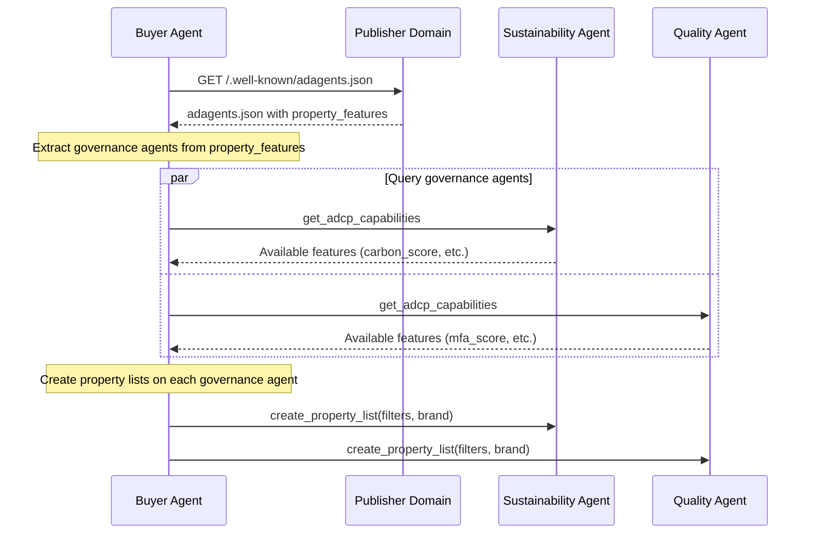

The `adagents.json` file provides a standardized way for publishers to declare their properties and authorize sales agents. This is the foundation of Property Governance - it defines what properties exist and who can sell them.

### Unified declaration model

`adagents.json` serves as the declaration mechanism for both **property authorization** and **signal data provider** registration. A single file at `/.well-known/adagents.json` can declare both `properties` and `signals` top-level fields simultaneously.

```json
{
  "version": "1.0",
  "properties": [
    {
      "domain": "publisher.example.com",
      "agents": [
        { "agent_url": "https://ads.publisher.example.com", "relationship": "direct" }
      ]
    }
  ],
  "signals": [
    {
      "catalog_url": "https://signals.publisher.example.com/catalog.json",
      "relationship": "direct",
      "description": "First-party audience signals from publisher.example.com"
    }
  ]
}
```

This combined model is common for publishers with first-party data — the same domain authorizes sales agents (via `properties`) and declares published signal definitions (via `signals`). The two namespaces are independent: authorization for property sales does not grant signal access, and signal registration does not imply property authorization.

See [Signal data providers](/docs/signals/data-providers) for the signals-side documentation.

For the sell-side decision tree that pairs publisher authorization with operator `brand.json` identity and signing-key discovery, see [seller setup](/docs/brand-protocol/seller-setup).

<Tip>
**[AdAgents.json Builder](https://agenticadvertising.org/adagents/builder)** - Validate existing files or create new ones with guided validation
</Tip>

## Why `adagents.json` instead of `ads.txt`

`ads.txt` answers a narrower question: is this seller present on the publisher's list, and is the relationship labeled `DIRECT` or `RESELLER`?

That is useful, but it is too flat for many modern publisher sales models. It does not tell buyers:

- which property is covered
- which placements are covered
- whether the path is direct, delegated, or network-mediated
- whether the authorization is country-limited or time-bounded
- whether a network-managed slot is the same thing as a publisher-managed premium placement

`adagents.json` is designed to carry that structure. It lets publishers declare property identity, placement identity, delegation type, scoped authorization, and publisher-defined grouping tags in one place.

| Question | `ads.txt` | `adagents.json` |
|---------|-----------|-----------------|
| Is this seller declared at all? | Yes | Yes |
| Which property is covered? | No | Yes |
| Which placement is covered? | No | Yes |
| Can the publisher group inventory into governed buckets? | No | Yes, via `placement_tags` |
| Can authorization vary by country or time window? | No | Yes |
| Can the path be described as direct, delegated, or network-mediated? | Very weakly | Yes, via `delegation_type` |

For the higher-level framing and a side-by-side example, see [Why adagents.json is more expressive than ads.txt](https://agenticadvertising.org/perspectives/adagents-json-vs-ads-txt).

### Where does sellers.json fit?

In programmatic, `sellers.json` is hosted by the seller/exchange and declares which publishers they represent. AdCP handles this through `brand.json` instead of a separate file. An operator declares properties in their [`brand.json`](/docs/brand-protocol/brand-json) using the `relationship` field. For first-party inventory, the operator can use `relationship: "owned"`. For delegated or network sell-side paths, `relationship` uses the same values as `delegation_type`: `direct`, `delegated`, or `ad_network`. This creates the same bilateral verification pattern:

| Programmatic | AdCP equivalent | Purpose |
|---|---|---|
| `ads.txt` (publisher) | `adagents.json` with `delegation_type` (publisher) | "These agents are authorized, here's the relationship" |
| `sellers.json` (seller) | `brand.json` properties with `relationship` (operator) | "I sell for these publishers, here's how" |

For delegated or network paths, both sides must agree — the `delegation_type` and `relationship` values should match. For first-party inventory, `relationship: "owned"` is an inline ownership declaration and has no matching `delegation_type` value. See [ad networks](/docs/sponsored-intelligence/networks) for how this works in practice.

<Note>
The field is called `delegation_type` in adagents.json and `relationship` in brand.json. The names differ because they describe the same commercial arrangement from different perspectives — the publisher delegates authority (`delegation_type`), the operator declares its relationship to the property (`relationship`). Delegated/network values match (`direct`, `delegated`, `ad_network`); `owned` is only a brand.json relationship value.
</Note>

## File Location

Publishers must host the `adagents.json` file at:

```
https://example.com/.well-known/adagents.json
```

Following [RFC 8615](https://datatracker.ietf.org/doc/html/rfc8615) well-known URI conventions, this location ensures consistent discoverability across publishers.

## Basic Structure

The file must be valid JSON with UTF-8 encoding and return HTTP 200 status.

```json
{
  "$schema": "https://adcontextprotocol.org/schemas/v3/adagents.json",
  "contact": {
    "name": "Example Publisher Ad Operations",
    "email": "adops@example.com",
    "domain": "example.com",
    "seller_id": "pub-example-12345",
    "tag_id": "67890"
  },
  "properties": [
    {
      "property_id": "example_site",
      "property_type": "website",
      "name": "Example Site",
      "identifiers": [
        {"type": "domain", "value": "example.com"}
      ]
    }
  ],
  "authorized_agents": [
    {
      "url": "https://agent.example.com",
      "authorized_for": "Official sales agent",
      "authorization_type": "property_ids",
      "property_ids": ["example_site"],
      "delegation_type": "direct",
      "exclusive": true
    }
  ],
  "last_updated": "2025-01-10T12:00:00Z"
}
```

## Schema Fields

**`$schema`** *(optional)*: JSON Schema reference for validation

**`contact`** *(optional)*: Contact info for entity managing this file
  - **`name`** *(required)*: Name of managing entity (may be publisher or third-party)
  - **`email`** *(optional)*: Contact email for questions/issues
  - **`domain`** *(optional)*: Primary domain of managing entity
  - **`seller_id`** *(optional)*: Seller ID from IAB Tech Lab sellers.json
  - **`tag_id`** *(optional)*: TAG Certified Against Fraud ID
  - **`privacy_policy_url`** *(optional)*: URL to entity's privacy policy for consumer consent flows

**`catalog_etag`** *(optional)*: Opaque cache/version token for the public catalog portions of this file
  - Publishers SHOULD change it whenever `properties`, `collections`, `placements`, `formats`, `signals`, or their tag metadata changes
  - Buyer SDKs SHOULD cache resolved references by URL plus `catalog_etag` and re-resolve catalog references when the value changes
  - If absent, buyers fall back to HTTP validators such as `ETag`/`Last-Modified`, then a bounded TTL

**`properties`** *(optional)*: Array of properties covered by this file (canonical property definitions)
  - **`supported_channels`** *(optional)*: Advertising channels this property supports (e.g., `["display", "olv", "social"]`). See [Media Channel Taxonomy](/docs/reference/media-channel-taxonomy).

**`collections`** *(optional)*: Collections produced or distributed by this publisher
  - Products reference these via `collections` selectors with `publisher_domain` and `collection_ids`
  - Useful when authorization needs to be scoped to specific series, podcasts, streams, or recurring content programs

**`placements`** *(optional)*: Canonical placement definitions for the properties in this file
  - Products SHOULD reuse these `placement_id` values when declaring `placements`
  - Reusing a registered `placement_id` means the product is referring to the same semantic placement, not inventing a different one with the same ID
  - Placement definitions can include `tags`, `property_ids` or `property_tags` for property linkage, `channels`, and `format_options` for creative support
  - Placements in `adagents.json` are public by definition. Do not publish seller-private placement IDs, source/origin fields, or delivery-system mappings in this file.
  - Authorization entries can narrow scope to specific `placement_ids`
  - Authorization entries can also use `placement_tags` for governed placement groupings such as `programmatic`, `direct_only`, or `managed_by_riverline`
  - Useful for expressing distinctions like "available via this agent only for homepage native feed" or "only for pre-roll"

**`tags`** *(optional)*: Tag metadata providing human-readable context and enabling efficient grouping

**`placement_tags`** *(optional)*: Metadata for publisher-defined placement tags
  - Provides human-readable definitions for placement tag values used in `placements[*].tags` and `authorized_agents[*].placement_tags`
  - These are publisher-local concepts, not a global taxonomy

### Public placement catalog

The `placements[]` array is the publisher's public placement catalog. It defines stable, semantic placement IDs that products and authorization rules can reference. A buyer should not have to interpret a raw ad-server ad unit path, delivery placement ID, video-ad-server zone, or other seller-internal delivery identifier to understand what a product offers.

Publishers that expose placement, format, collection, or property catalogs, or published `signals[]` definitions, should publish `catalog_etag` and update it whenever those entries change. This lets buyer SDKs cache catalog lookups without silently resolving the same `{publisher_domain, placement_id}` or `{publisher_domain, format_option_id}` to different metadata after a publisher deployment.

At minimum, a public placement should describe:

- stable `placement_id`
- `name` and `description`
- the `property_ids` or `property_tags` where it can run
- supported `format_options`, which can reference publisher-owned formats and canonical formats
- optional `channels`

Placement format support is a new 3.1 catalog feature and uses the 3.1+ canonical format-option model only:

- `format_options[]` may reference declarations in the same file's top-level `formats[]` by `format_option_id`. Those top-level declarations can be publisher-owned custom formats or narrowed canonical formats.
- `format_options[]` may also carry an inline canonical `ProductFormatDeclaration` when the placement-specific narrowing is not worth a reusable top-level format entry.

The canonical anchor is `format_kind`. A placement entry that carries only `{ "format_option_id": "..." }` inherits the canonical format by resolving that ID to the same file's top-level `formats[]` declaration, then reading its `format_kind`. Outside this file, a buyer-facing `FormatOptionRef` for a publisher-declared format option uses `{ "scope": "publisher", "publisher_domain": "...", "format_option_id": "..." }`.

Placement catalog formats describe what the public placement can support. When a product later references that placement, the product-level `format_ids` or `format_options` remain the buyable creative contract; placement `format_options` narrow that set for the specific placement. If the catalog placement and product declarations disagree, buyers use the intersection and should not treat a catalog-only format as accepted by the product.

```json
{
  "catalog_etag": "daily-pulse-2026-05-25",
  "formats": [
    {
      "format_kind": "html5",
      "format_option_id": "publisher_takeover_html5",
      "display_name": "Publisher takeover HTML5",
      "params": {
        "width": 970,
        "height": 250,
        "max_file_size_kb": 200
      }
    }
  ],
  "placements": [
    {
      "placement_id": "homepage_takeover",
      "name": "Homepage takeover",
      "description": "High-impact homepage sponsorship across the main article rail and top video module.",
      "property_ids": ["daily_pulse"],
      "channels": ["display", "olv"],
      "format_options": [
        { "format_option_id": "publisher_takeover_html5" },
        {
          "format_kind": "image",
          "params": {
            "width": 300,
            "height": 250,
            "image_formats": ["jpg", "png"],
            "max_file_size_kb": 150
          }
        }
      ]
    }
  ]
}
```

Because `adagents.json` is public, it is not the place to expose operational inventory internals. Keep source/origin (`synced` vs synthetic), raw ad-server IDs, delivery mappings, and seller-private placement groupings in the seller's internal inventory registry. The public placement catalog should describe only buyer-understandable inventory that the publisher is willing to make discoverable.

### Product targetability

`adagents.json` does not decide whether a placement is targetable in a product. It only publishes stable public placement IDs and their buyer-understandable semantics.

A sales agent decides per product whether a public placement is buyer-selectable or merely part of the product composition. That decision is exposed, when needed, in the sales agent's `get_products` product placement object, not in the publisher's `adagents.json`.

If a product depends on seller-private delivery composition, describe that composition in product prose and keep the underlying placement IDs in the seller system. Do not publish private placement IDs in `adagents.json` or `get_products`.

### Internal mapping

Publishers still need to map public placements to delivery systems, and they may need synthetic internal groupings when the delivery system does not have the right semantic object. That mapping is implementation detail, not public protocol state.

Common internal cases:

- grouping multiple synced placements
- grouping multiple ad units or zones
- exposing an ad unit as a buyer-understandable placement
- mapping ambiguous `1x1`, fluid, native, out-of-page, or video objects to the format they actually render
- preserving strategic opacity while keeping products free of raw delivery IDs

These internal mappings can produce public `placements[]` entries, but the mapping details themselves remain out of `adagents.json`.

**`authorized_agents`** *(required)*: Array of authorized sales agents
  - **`url`** *(required)*: Agent's API endpoint URL
  - **`authorized_for`** *(required)*: Human-readable authorization description
  - **`authorization_type`** *(required)*: Discriminator naming which selector field carries the scope. One of `property_ids`, `property_tags`, `inline_properties`, `publisher_properties` (for properties) or `signal_ids`, `signal_tags` (for signal providers). The corresponding selector field must be present and non-empty — see [Authorization Patterns](#authorization-patterns) below.
  - **`delegation_type`** *(optional)*: Commercial relationship for this path: `direct`, `delegated`, or `ad_network`
  - **`collections`** *(optional)*: Additional collection selectors that narrow authorization to specific content programs
  - **`placement_ids`** *(optional)*: Placement IDs from the top-level `placements` array that narrow authorization to specific placements
  - **`placement_tags`** *(optional)*: Publisher-defined placement tags that narrow authorization to governed placement groups
  - **`countries`** *(optional)*: ISO 3166-1 alpha-2 country codes limiting where the authorization applies
  - **`effective_from` / `effective_until`** *(optional)*: Time window for the authorization
  - **`exclusive`** *(optional)*: Whether this is the publisher's sole authorized path for the scoped inventory slice
  - **`signing_keys`** *(optional)*: Publisher-attested public keys buyers can pin when verifying signed agent responses
  - **`last_updated`** *(optional)*: ISO 8601 timestamp when this `authorized_agents[]` entry last changed. Independent of the file-level `last_updated`. Advisory — enables validators to skip unchanged entries on partial walks. See [managed-networks security](/docs/governance/property/managed-networks#security-considerations) for the conditional-refresh protocol it enables.
  - **Additional fields**: Depends on authorization_type (see patterns below)

**`revoked_publisher_domains`** *(optional, managed-network use)*: Top-level array of publisher domains explicitly removed from a managed network's authoritative file. Each entry has `publisher_domain`, `revoked_at` (ISO 8601), and optional `reason`. Validators MUST treat any listed domain as no-longer-authorized regardless of where else it appears in the file. See [Publisher revocation](/docs/governance/property/managed-networks#publisher-revocation-the-exit-lifecycle) for the operational lifecycle and validator-side durability rule.

**`last_updated`** *(optional)*: ISO 8601 timestamp of last modification

**`property_features`** *(optional)*: Array of governance agents that provide data about properties in this file
  - **`url`** *(required)*: Agent's API endpoint URL (governance agent implementing property governance tasks)
  - **`name`** *(required)*: Human-readable name of the vendor/agent
  - **`features`** *(required)*: Array of feature IDs this agent provides (e.g., `["carbon_score", "mfa_score"]`)
  - **`publisher_id`** *(optional)*: Publisher's identifier at this agent (for lookup)

This field enables **governance agent discovery** - buyers can find which agents have compliance, sustainability, or quality data for properties without querying every possible agent.

## URL Reference Pattern

For publishers with complex infrastructure or CDN distribution, `adagents.json` can reference an authoritative URL instead of containing the full structure inline.

### When to Use URL References

- **CDN Distribution**: Serve authorization data from a global CDN for better performance
- **Centralized Management**: Single source of truth across multiple domains
- **Large Files**: When authorization data is too large for inline embedding
- **Dynamic Updates**: When authorization needs frequent updates without touching domain files

### URL Reference Structure

```json
{
  "$schema": "https://adcontextprotocol.org/schemas/v3/adagents.json",
  "authoritative_location": "https://cdn.example.com/adagents/v2/adagents.json",
  "last_updated": "2025-01-15T10:00:00Z"
}
```

### Requirements

- **HTTPS Required**: The `authoritative_location` must use HTTPS
- **No Nested References**: The authoritative file cannot itself be a URL reference (prevents infinite loops)
- **Same Schema**: The authoritative file must be a valid inline adagents.json structure
- **Single Hop**: Only one level of URL indirection is allowed

For a complete guide to deploying this pattern across hundreds or thousands of domains, see [Managed Network Deployment](/docs/governance/property/managed-networks).

## Discovery fallback: ads.txt `managerdomain`

<Warning>
This is a **legacy compatibility fallback** for existing ads.txt-era publisher-manager setups.
For managed-network deployments in AdCP, the normative delegation pattern remains
[`authoritative_location`](/docs/governance/property/managed-networks) in the publisher's own
`/.well-known/adagents.json` pointer file. New deployments SHOULD use that pattern.
</Warning>

When `https://{publisher}/.well-known/adagents.json` returns `404`, or returns an S3/CloudFront-style `403` `AccessDenied` XML response, validators MAY attempt a compatibility fallback via `https://{publisher}/ads.txt`:

1. Read `ads.txt` and parse `managerdomain` entries.
   - Accepted form: `MANAGERDOMAIN=example.com` (IAB directive form only).
   - Key matching is case-insensitive (`MANAGERDOMAIN`, `managerdomain`, etc.).
2. If one or more eligible managerdomain entries remain, use the **last** eligible entry in file order and attempt `https://{managerdomain}/.well-known/adagents.json`.
3. If that manager file validates **and explicitly scopes authorization to the source publisher domain**, treat it as the discovered authorization source for this lookup.

### Safety rules for this fallback

- **One hop only**: maximum depth is exactly one (`publisher -> managerdomain`). Do not chain managerdomain lookups.
- **Cycle detection required**: if `managerdomain` points to a visited domain, ignore it.
- **`#noagents` opt-out**: if a managerdomain line has a trailing comment containing the token `noagents` (case-insensitive), clients MUST ignore that managerdomain for adagents discovery. Example: `MANAGERDOMAIN=example.com #NOAGENTS`.
- **Trigger statuses are narrow**: validators SHOULD only attempt this fallback when the publisher's direct `adagents.json` fetch returns `404` or an S3/CloudFront-style `403` `AccessDenied` XML response. Other statuses and failures — generic `403` denial, `500`, timeout, malformed JSON, content-type mismatch, or schema validation failure — do not trigger `managerdomain`.
- **Explicit publisher scoping required**: a manager-hosted `adagents.json` MUST positively name the source publisher domain in a `publisher_domain` field that is reachable from at least one `authorized_agents[]` entry. "Reachable" means one of the following paths resolves to the source domain:

  1. **Per-agent paths.** The agent entry directly carries the publisher domain under `publisher_properties[].publisher_domain`, inside `publisher_properties[].publisher_domains[]` (the compact managed-network form), or under `collections[].publisher_domain`.
  2. **Property-level paths.** The agent entry references one or more top-level `properties[]` entries — either directly by ID/tag on the agent entry (`property_ids` / `property_tags` authorization_type), or indirectly via a `publisher_properties` selector whose predicate is satisfied by parent-file `properties[]` carrying matching `publisher_domain` (see [Resolution paths](#resolution-paths) below) — and at least one resolved property carries a `publisher_domain` matching the source. This is the shape used in production by Mediavine and other managed networks where a property declares its `publisher_domain` once and many agents reference it indirectly.

  What does **not** satisfy this rule: an `inline_properties` selector whose inline properties omit `publisher_domain`, or a top-level `property_tags` selector whose resolved top-level properties carry no matching `publisher_domain`. If no reachable `publisher_domain` field matches the source, fallback MUST fail closed.

  The attack this protects against is implicit scoping — authorization that does not name the publisher anywhere the manager has to type the domain. Indirection through `properties[].publisher_domain` is safe because the manager has positively spelled the publisher's domain in the same manifest; the gate filters to properties whose `publisher_domain` matches the source before considering the reference.
- **No success by silence**: if the manager lookup fails, treat the publisher as missing `adagents.json` (same as no fallback).

This fallback is a compatibility affordance for publisher-manager topologies and does not replace the canonical `/.well-known/adagents.json` location.

### Example Use Case: Multi-Domain Publisher

A publisher with multiple domains can maintain one authoritative file:

**On each domain** (`https://domain1.com/.well-known/adagents.json`, `https://domain2.com/.well-known/adagents.json`, etc.):
```json
{
  "$schema": "https://adcontextprotocol.org/schemas/v3/adagents.json",
  "authoritative_location": "https://cdn.publisher.com/adagents/v2/adagents.json",
  "last_updated": "2025-01-15T10:00:00Z"
}
```

**Authoritative file** (`https://cdn.publisher.com/adagents/v2/adagents.json`):
```json
{
  "$schema": "https://adcontextprotocol.org/schemas/v3/adagents.json",
  "contact": {
    "name": "Publisher Ad Operations",
    "email": "adops@publisher.com"
  },
  "properties": [
    {
      "property_id": "domain1_site",
      "property_type": "website",
      "name": "Domain 1",
      "identifiers": [{"type": "domain", "value": "domain1.com"}],
      "publisher_domain": "domain1.com"
    },
    {
      "property_id": "domain2_site",
      "property_type": "website",
      "name": "Domain 2",
      "identifiers": [{"type": "domain", "value": "domain2.com"}],
      "publisher_domain": "domain2.com"
    }
  ],
  "authorized_agents": [
    {
      "url": "https://sales-agent.publisher.com",
      "authorized_for": "All publisher properties",
      "authorization_type": "property_ids",
      "property_ids": ["domain1_site", "domain2_site"]
    }
  ],
  "last_updated": "2025-01-15T09:00:00Z"
}
```

### Validation Behavior

When AdCP validators encounter a URL reference:

1. **Fetch Reference**: Retrieve the file at `/.well-known/adagents.json`
2. **Detect Reference**: Check for `authoritative_location` field
3. **Validate URL**: Ensure `authoritative_location` is HTTPS and valid
4. **Fetch Authoritative**: Retrieve content from `authoritative_location`
5. **Prevent Loops**: Reject if authoritative file is also a reference
6. **Validate Structure**: Validate the authoritative file as normal inline structure

Validators MUST apply the fetch semantics, change-detection, and rollback protection rules in [Managed network security considerations](/docs/governance/property/managed-networks#security-considerations). That section is the canonical source for blast-radius guidance on the authoritative_location pattern.

### Troubleshooting authoritative_location failures

Publishers registering agents through a URL reference commonly encounter these failure modes. Use this checklist before contacting support.

**Origin requires authentication or IP restriction**

Validators fetch `authoritative_location` server-side — CORS response headers are not required for server-to-server requests. However, if your origin requires authentication (e.g., an S3 bucket with a restrictive bucket policy, a CDN with origin protection that blocks unknown IPs) the fetch will be rejected with a `403`. Verify the URL is publicly reachable without authentication.

**Redirect at the authoritative URL**

Validators reject any HTTP redirect on the `authoritative_location` URL. The URL must resolve directly to the JSON file with a `200` response — no `301`, `302`, or other redirect chain. If your CDN or hosting redirects the URL (HTTP→HTTPS canonicalization, `www` redirect, versioned-path redirect), update `authoritative_location` to point to the final destination URL directly.

**Wrong Content-Type**

The response must be served with `Content-Type: application/json`. Servers that return `text/html` or `text/plain` — even when the body contains valid JSON — will fail content-type validation. Check your CDN or origin response headers.

**HTML error page with 200 status**

Some CDNs return an HTML error page with `200 OK` instead of a `4xx` status. Validators check the `Content-Type` header and attempt JSON parsing; an HTML body will fail parsing even when the status is `200`. Look for a parse error alongside a `200` status in validator output.

**Debugging checklist**

Reproduce the validator's fetch from your terminal to diagnose these failures:

```bash
curl -v \
  -H "Accept: application/json" \
  "https://cdn.example.com/adagents.json"
```

Verify in the output:
- Response status is `200` (not `301`, `302`, `403`, or `404`)
- `Content-Type` header is `application/json`
- Response body is valid JSON containing at least one of `properties`, `signals`, or `authorized_agents`
- Body does **not** contain an `authoritative_location` field (nested references are rejected)

If the crawler exposes a diagnostic endpoint, run your URL through it for structured error output.

### Caching Recommendations

- Cache reference files for 24 hours minimum
- Cache authoritative files separately with their own TTL
- Use `last_updated` timestamp to detect when cache should be invalidated
- Implement exponential backoff for failed fetches

Absolute cache caps and refresh floors for authoritative files live in [Managed network security considerations](/docs/governance/property/managed-networks#security-considerations) — the requirements there take precedence over any `Cache-Control` on the origin.

## Authorization Patterns

AdCP supports six `authorization_type` values, each optimized for different use cases. The table below maps each value to the companion field that carries the selector — useful as a quick reference when writing or validating `adagents.json`:

| `authorization_type` | Companion field | Carries | Pattern |
|---|---|---|---|
| `property_ids` | `property_ids[]` | IDs into the top-level `properties[]` of the same file | [Pattern 1](#pattern-1-property-ids-direct-references) |
| `property_tags` | `property_tags[]` | Tags into the top-level `properties[]` of the same file | [Pattern 2](#pattern-2-property-tags-efficient-grouping) |
| `inline_properties` | `properties[]` *(see warning below)* | Property objects defined directly on the agent entry | [Pattern 3](#pattern-3-inline-properties) |
| `publisher_properties` | `publisher_properties[]` | Per-publisher selectors that resolve against each listed publisher's `adagents.json` (or the parent file's inline `properties[]`) | [Pattern 4](#pattern-4-publisher-property-references) |
| `signal_ids` | `signal_ids[]` | IDs into the top-level `signals[]` of the same file | Signal-provider entries (see `signals` schema) |
| `signal_tags` | `signal_tags[]` | Tags into the top-level `signals[]` of the same file | Signal-provider entries (see `signals` schema) |

<Warning>
  **`inline_properties` companion field is `properties`, not `inline_properties`.** It is the only `authorization_type` whose companion field name does not mirror the discriminator value. Validators reject `inline_properties` entries that carry a top-level `inline_properties` array but no `properties`. See [Pattern 3](#pattern-3-inline-properties) for an example.
</Warning>

### Pattern 1: Property IDs (Direct References)

**Best for**: Specific, enumerable property lists. Direct and unambiguous.

**Structure**:
```json
{
  "properties": [
    {
      "property_id": "cnn_ctv_app",
      "property_type": "ctv_app",
      "name": "CNN CTV App",
      "identifiers": [
        {"type": "roku_store_id", "value": "12345"}
      ]
    }
  ],
  "authorized_agents": [
    {
      "url": "https://cnn-ctv-agent.com",
      "authorized_for": "CNN CTV properties",
      "authorization_type": "property_ids",
      "property_ids": ["cnn_ctv_app"]
    }
  ]
}
```

**How it works**: Agent is authorized for specific properties listed in `property_ids` array. The properties must be defined in the top-level `properties` array.

### Pattern 2: Property Tags (Efficient Grouping)

**Best for**: Large networks where one tag can reference hundreds/thousands of properties. Provides grouping efficiency without listing every property ID.

**Key Insight**: Tags are not just "human-readable metadata" - they're a **performance optimization**. A publisher with 500 properties can use one tag to authorize all of them, rather than listing 500 property IDs.

**Structure**:
```json
{
  "properties": [
    {
      "property_id": "instagram",
      "property_type": "mobile_app",
      "name": "Instagram",
      "identifiers": [
        {"type": "ios_bundle", "value": "com.burbn.instagram"}
      ],
      "tags": ["meta_network", "social_media"]
    },
    {
      "property_id": "facebook",
      "property_type": "mobile_app",
      "name": "Facebook",
      "identifiers": [
        {"type": "ios_bundle", "value": "com.facebook.Facebook"}
      ],
      "tags": ["meta_network", "social_media"]
    }
  ],
  "tags": {
    "meta_network": {
      "name": "Meta Network",
      "description": "All Meta-owned properties - enables one tag to authorize entire network"
    }
  },
  "authorized_agents": [
    {
      "url": "https://meta-ads.com",
      "authorized_for": "All Meta properties",
      "authorization_type": "property_tags",
      "property_tags": ["meta_network"]
    }
  ]
}
```

**How it works**: Agent is authorized for all properties that have ANY of the listed tags. Properties are matched against the `tags` array in each property definition.

### Pattern 3: Inline Properties

**Best for**: Small, specific property sets without top-level property declarations.

**Structure**:
```json
{
  "authorized_agents": [
    {
      "url": "https://agent.com",
      "authorized_for": "Specific inventory",
      "authorization_type": "inline_properties",
      "properties": [
        {
          "property_type": "website",
          "name": "Example Site",
          "identifiers": [
            {"type": "domain", "value": "example.com"}
          ]
        }
      ]
    }
  ]
}
```

**How it works**: Properties are defined directly within the agent authorization entry instead of the top-level `properties` array. Useful when each agent has unique property definitions.

### Pattern 4: Publisher Property References

**Best for**: Third-party agents representing multiple publishers. Single source of truth for property definitions.

**Structure**:
```json
{
  "contact": {
    "name": "Third-Party CTV Network"
  },
  "authorized_agents": [
    {
      "url": "https://ctv-network.com/api",
      "authorized_for": "CTV inventory from multiple publishers",
      "authorization_type": "publisher_properties",
      "publisher_properties": [
        {
          "publisher_domain": "cnn.com",
          "selection_type": "by_tag",
          "property_tags": ["ctv"]
        },
        {
          "publisher_domain": "espn.com",
          "selection_type": "by_tag",
          "property_tags": ["ctv"]
        }
      ]
    }
  ]
}
```

**How it works**: Agent references properties from OTHER publishers' adagents.json files. The `publisher_domain` points to the publisher, and `selection_type` determines how to resolve properties (`by_id` or `by_tag`).

**Compact form for managed networks (`publisher_domains`)**: when the same predicate applies to many publishers — the canonical managed-network shape — replace the singular `publisher_domain` with the plural `publisher_domains` array. Each `publisher_properties[]` entry takes exactly one of `publisher_domain` or `publisher_domains`; both are equivalent for resolution and both satisfy the [`managerdomain` fallback safety rule](#safety-rules-for-this-fallback) for every listed domain.

The compact form is available on `selection_type: "all"` and `"by_tag"` only. **It is intentionally NOT available on `selection_type: "by_id"`**: property IDs are publisher-scoped, and fanning the same ID set across N publishers' files would silently authorize whichever inventory happens to share an ID at each publisher. Use one `publisher_properties[]` entry per publisher when each publisher's ID set differs. Validators MUST reject `by_id` selectors that include `publisher_domains[]`.

Validators MUST reject any `publisher_properties[]` entry that includes both `publisher_domain` and `publisher_domains`, and MUST reject any entry that includes neither. Implementations MAY mix the two forms across entries — for example, use the compact form for the bulk of represented publishers and a singular-form entry for an outlier publisher with a different tag predicate.

```json
{
  "contact": { "name": "Example Managed Network" },
  "authorized_agents": [{
    "url": "https://agent.network.example/api",
    "authorized_for": "Managed-network display inventory across represented publishers",
    "authorization_type": "publisher_properties",
    "publisher_properties": [
      {
        "publisher_domains": ["site1.example", "site2.example", "site3.example"],
        "selection_type": "by_tag",
        "property_tags": ["managed_network"]
      }
    ],
    "delegation_type": "ad_network"
  }]
}
```

The above is semantically identical to repeating the singular-form entry once per domain. Use it when every represented publisher tags inventory the same way (typical of WordPress/managed-network deployments); fall back to one entry per publisher only when the selector predicate genuinely differs.

### Resolution paths

A `publisher_properties` selector resolves against properties in one of two ways. Federated is the default and the trust root; parent-file inline is a per-domain optimization a consumer MAY take when the parent file carries enough information to resolve the selector locally.

**1. Federated resolution (default).** For each domain in `publisher_domain` or `publisher_domains[]`, fetch that publisher's `adagents.json` and apply the selector predicate against the publisher's own top-level `properties[]`. Each listed domain is resolved **independently and in parallel**:

- If a listed publisher's `adagents.json` is unreachable (404, 5xx, timeout, fails its own validation), the selector resolves to the empty set **for that publisher only** — the entry remains valid for all other listed publishers. Consumers MUST NOT treat a single unreachable publisher as poisoning the rest of the compact entry.
- If a listed publisher's `adagents.json` carries no properties matching the predicate (no entries with the named tag), the selector resolves to the empty set for that publisher. Same partial-resolution rule applies.
- Resolution caching follows each publisher's own cache policy on their `adagents.json`, independently. A consumer SHOULD NOT extend or shorten one publisher's cache TTL based on observations of another publisher in the same compact entry.

**2. Parent-file inline resolution (managed-network optimization).** A consumer MAY satisfy the selector from the parent file's own top-level `properties[]` when **all** of the following hold:

- The parent file has top-level `properties[]` entries.
- Every matched property carries an explicit `publisher_domain` field whose value equals one of the domains in the selector's `publisher_domain` / `publisher_domains[]` set.
- For `selection_type: by_tag`: the property's `tags[]` contains at least one of the selector's `property_tags[]`.
- For `selection_type: by_id`: the property's `property_id` is in the selector's `property_ids[]` AND the selector uses its singular `publisher_domain` form (the compact `publisher_domains[]` form remains rejected for `by_id` — property IDs are publisher-scoped and fanning a fixed ID set across publishers would silently authorize wrong inventory).
- For `selection_type: all`: every parent-file `properties[]` entry with a matching `publisher_domain` is selected.

Inline resolution is a **per-domain optimization**: a consumer MAY use inline resolution for the listed domains that have matching inline properties in the parent file, AND federated resolution for the remainder. Both paths SHOULD produce the same `(publisher_domain, property_id)` set when both are available.

**Why this is safe.** The trust anchor for property authorization is the publisher whose domain is named on the property. By requiring `publisher_domain` on each inline property and matching against the selector's `publisher_domains[]`, the inline path preserves the invariant that the publisher whose inventory is being authorized is explicitly named — the same invariant the [`managerdomain` fallback safety rule](#safety-rules-for-this-fallback) protects. A manager file cannot use inline resolution to authorize inventory for a publisher it doesn't list.

**Divergence rule.** If a consumer resolves the same `(publisher_domain, property_id)` via both inline and federated paths and the results disagree, the federated result is authoritative. Consumers SHOULD log the divergence as a publisher-side data-integrity warning and MAY surface it to operators. Consumers that prefer strict federation MAY ignore the inline path entirely.

**Revocation under inline resolution.** Inline resolution MUST honor `revoked_publisher_domains[]` on the parent file. A `publisher_domain` listed as revoked at the parent level resolves to the empty set for that domain, regardless of whether matching properties exist in the parent's `properties[]`. Consumers that also resolve federated SHOULD cross-check the child's own `revoked_publisher_domains[]`; first match (parent or child) revokes.

**When to use which.** Inline resolution exists because strict federation at managed-network scale (thousands of represented publishers under one operator) requires N HTTP fetches per authorization check, which no production consumer can sustain. Files that inline `properties[]` with `publisher_domain` anchors are signalling "you can resolve this here." Consumers handling small federated entries (a handful of publishers, each with their own properly-populated `adagents.json`) should prefer the federated path; it carries less consumer-side trust assumption. Consumers indexing managed-network parent files at scale should prefer the inline path; the parent file is structurally the property catalog whether the spec endorses it or not, and inline resolution makes that explicit.

## Authorization Qualifiers

The four property-side `authorization_type` patterns above answer **which inventory** an agent can sell; the two signal-side values (`signal_ids`, `signal_tags`) carry the same shape for `signals[]`. The optional qualifiers below answer **how** that inventory is being made available.

### `delegation_type`

- **`direct`**: The publisher treats this endpoint as a direct way to buy from them, even if a third party operates the software behind the scenes
- **`delegated`**: The agent is authorized to sell on the publisher's behalf
- **`ad_network`**: The inventory is sold through a network/package sales path rather than as the publisher's direct endpoint

### `collections`

Use `collections` when authorization should only apply to inventory associated with specific content programs. This is especially useful for CTV, streaming, podcasting, and creator inventory where the same property can carry many collections with different commercial arrangements.

### `placement_ids`

Use `placement_ids` to narrow authorization to canonical placements published in this same `adagents.json`. This is the field that lets a publisher say "this agent is authorized for MSN homepage native feed, but not for the entire property" or "this network can sell pre-roll but not host-read sponsorships." In product responses and creative assignment, the corresponding placement identity is `{ publisher_domain, placement_id }`.

Canonical placement definitions can also carry:

- `tags` for grouping placements across properties and products
- `property_ids` or `property_tags` to answer "what placements are on property X?" and "what properties is placement Y on?"
- `format_options` to answer "what formats does this placement support?" without relying entirely on product response placement details

### `placement_tags`

Use `placement_tags` when authorization should apply to a governed placement group rather than a hand-maintained list of placement IDs. This is useful for commercial access patterns such as:

- `programmatic`
- `direct_only`
- `publisher_managed`
- `managed_by_taboola`

Unlike freeform labels, these tags should be treated as part of the publisher's placement governance model because authorization decisions depend on them. Define them in top-level `placement_tags` metadata the same way property tags are documented in top-level `tags`.

### `signing_keys`

Use `signing_keys` when the publisher wants to pin the public keys an authorized agent is allowed to sign with. This avoids trusting key discovery from the agent domain alone.

- These are publisher-attested trust anchors, not just convenience metadata
- Buyers should verify signed agent responses against the pinned keys in `adagents.json`
- If an agent domain is compromised, pinned keys prevent the attacker from silently swapping both the endpoint and its advertised keys

Publishers MUST populate `signing_keys` for any authorized agent whose delegated scopes include **mutating operations** — any AdCP task that writes state on behalf of the publisher. In the 3.x catalog this means the media-buy task set (`create_media_buy`, `update_media_buy`, `sync_creatives`, `update_performance_index`) and any future task flagged as mutating in the [media-buy task reference](/docs/media-buy/task-reference/update_media_buy). Read-only discovery tasks (`get_products`, `get_signals`, `list_creative_formats`) are out of scope for this requirement. Leaving `signing_keys` empty for a mutating-scope authorization reduces the trust chain to counterparty-controlled `jwks_uri` discovery and forfeits the publisher's pin as a cross-check.

Verifier requirement: if the publisher's `adagents.json` entry for an agent contains `signing_keys`, the verifier MUST reject any signature whose `keyid` is not in that pinned set, regardless of `jwks_uri` contents. The pin is authoritative; the agent-hosted JWKS is advisory and MUST NOT override it.

**Key rotation and cache semantics.** To keep the pin usable across rotations without opening a DoS-by-rotation window:

- Verifiers SHOULD cache the pinned `signing_keys` for at most the `Cache-Control` `max-age` the publisher serves on `adagents.json`, defaulting to **one hour** when no directive is present. Longer caching risks rejecting a legitimate rotated key.
- On encountering an **unknown `keyid`**, the verifier MUST force-refresh the publisher's `adagents.json` (bypassing cache) before final rejection. This prevents a stale cache from locking out a legitimately rotated key.
- Publishers MAY carry **overlapping keys** in `signing_keys` during a rotation window so verifiers can accept signatures produced under either the old or the new key. The pinned set is unordered: presence in the set is sufficient for acceptance. Operators SHOULD remove the retired key from the pin once they are confident no in-flight traffic is still signing with it (hours, not days).

**Bootstrap scope.** The pin protects against **agent-domain** compromise: if the agent domain is taken over, an attacker cannot silently swap both the endpoint and its advertised keys because the publisher's pin still governs acceptance. It does **not** protect against publisher-domain compromise (an attacker who controls `adagents.json` can rewrite the pin itself). First-ever retrieval of `adagents.json` is TLS-trust-only; the R-1 root-of-trust / key-transparency work (tracked in `specs/registry-change-feed.md` §Feed-event content signing) is the track that will strengthen this boundary.

A follow-up is tracked to promote `signing_keys` from optional to required at the schema level for mutating-scope authorizations; the prose requirement above is the normative floor until that schema change lands.

### `countries`

Use ISO 3166-1 alpha-2 country codes to constrain authorization geographically. This avoids ambiguous regional shorthands such as "LATAM" or "EMEA" and gives buyer agents a precise machine-readable scope.

### `effective_from` / `effective_until`

Use these fields for time-bounded rights such as seasonal exclusives, windowed syndication, or temporary delegated sales agreements.

### `exclusive`

Set `exclusive: true` when this agent is the publisher's sole authorized path for the scoped slice of inventory. Leave it absent or set it to `false` when multiple agents are authorized concurrently.

### Example: Scoped Delegation

```json
{
  "placement_tags": {
    "programmatic": {
      "name": "Programmatic",
      "description": "Placements available through programmatic sales paths"
    },
    "direct_only": {
      "name": "Direct only",
      "description": "Placements reserved for direct publisher sales"
    }
  },
  "collections": [
    {
      "collection_id": "signal_noise",
      "name": "Signal & Noise",
      "kind": "series"
    }
  ],
  "placements": [
    {
      "placement_id": "pre_roll",
      "name": "Pre-roll",
      "tags": ["audio", "pre_roll", "programmatic"],
      "property_ids": ["publisher_podcast"],
      "collection_ids": ["signal_noise"],
      "format_options": [
        {
          "format_kind": "audio_hosted",
          "params": {
            "duration_ms_exact": 15000,
            "audio_codecs": ["mp3"]
          }
        }
      ]
    },
    {
      "placement_id": "host_read",
      "name": "Host-read Mid-roll",
      "tags": ["audio", "host_read", "premium", "direct_only"],
      "property_ids": ["publisher_podcast"],
      "collection_ids": ["signal_noise"],
      "format_options": [
        {
          "format_kind": "audio_hosted",
          "params": {
            "duration_ms_exact": 60000,
            "asset_source": "publisher_host_recorded",
            "buyer_asset_acceptance": "rejected"
          }
        }
      ]
    }
  ],
  "authorized_agents": [
    {
      "url": "https://sales.publisher.example.com",
      "authorized_for": "Direct US and CA sales for Signal & Noise host reads",
      "authorization_type": "property_ids",
      "property_ids": ["publisher_podcast"],
      "collections": [
        {
          "publisher_domain": "publisher.example.com",
          "collection_ids": ["signal_noise"]
        }
      ],
      "placement_tags": ["direct_only"],
      "delegation_type": "direct",
      "countries": ["US", "CA"],
      "exclusive": true
    },
    {
      "url": "https://network.example.com",
      "authorized_for": "Open network distribution outside US and CA for pre-roll",
      "authorization_type": "property_ids",
      "property_ids": ["publisher_podcast"],
      "collections": [
        {
          "publisher_domain": "publisher.example.com",
          "collection_ids": ["signal_noise"]
        }
      ],
      "placement_tags": ["programmatic"],
      "delegation_type": "ad_network",
      "countries": ["GB", "AU", "NZ"]
    }
  ]
}
```

This lets a publisher say "buy host reads directly from us in some markets, but use a network path for pre-roll in others" without implying that every authorized path is equivalent.

`adagents.json` now provides a canonical publisher-level placement registry. Products still return their own `placements`, but placement IDs are publisher-scoped: catalog-backed placements SHOULD reference the publisher registry with `{ publisher_domain, placement_id }`. When a product spans multiple publishers and catalog IDs collide, the `publisher_domain` disambiguates them; creative assignments should use structured `placement_refs` for those cases. Referencing a catalog placement means the product is inheriting that placement's identity; the product can narrow `format_ids`, preserve or narrow placement tags, or add operational detail, but it should not redefine the placement into something incompatible.

## Domain Matching Rules

For website properties with domain identifiers, AdCP follows web conventions:

### Base Domain (`example.com`)

Matches domain plus standard web subdomains:

- ✅ `example.com`
- ✅ `www.example.com` (standard web)
- ✅ `m.example.com` (standard mobile)
- ❌ `subdomain.example.com` (requires explicit authorization)

### Specific Subdomain (`subdomain.example.com`)

Matches only that exact subdomain:

- ✅ `subdomain.example.com`
- ❌ All other domains/subdomains

### Wildcard (`*.example.com`)

Matches ALL subdomains but NOT base:

- ✅ Any subdomain
- ❌ `example.com` (base domain requires separate authorization)

## Real-World Examples

### Example 1: Meta Network (Tag-Based)

Large network using tags for grouping efficiency:

```json
{
  "contact": {
    "name": "Meta Advertising Operations",
    "email": "adops@meta.com",
    "domain": "meta.com",
    "seller_id": "pub-meta-12345",
    "tag_id": "12345",
    "privacy_policy_url": "https://www.meta.com/privacy/policy"
  },
  "properties": [
    {
      "property_type": "mobile_app",
      "name": "Instagram",
      "identifiers": [
        {"type": "ios_bundle", "value": "com.burbn.instagram"},
        {"type": "android_package", "value": "com.instagram.android"}
      ],
      "tags": ["meta_network"],
      "publisher_domain": "instagram.com"
    },
    {
      "property_type": "mobile_app",
      "name": "Facebook",
      "identifiers": [
        {"type": "ios_bundle", "value": "com.facebook.Facebook"},
        {"type": "android_package", "value": "com.facebook.katana"}
      ],
      "tags": ["meta_network"],
      "publisher_domain": "facebook.com"
    },
    {
      "property_type": "mobile_app",
      "name": "WhatsApp",
      "identifiers": [
        {"type": "ios_bundle", "value": "net.whatsapp.WhatsApp"},
        {"type": "android_package", "value": "com.whatsapp"}
      ],
      "tags": ["meta_network"],
      "publisher_domain": "whatsapp.com"
    }
  ],
  "tags": {
    "meta_network": {
      "name": "Meta Network",
      "description": "All Meta-owned properties - one tag authorizes entire network efficiently"
    }
  },
  "authorized_agents": [
    {
      "url": "https://meta-ads.com",
      "authorized_for": "All Meta properties",
      "authorization_type": "property_tags",
      "property_tags": ["meta_network"]
    }
  ]
}
```

**Why this works**: One tag (`meta_network`) authorizes all properties without listing individual property IDs. As Meta adds properties, they just tag them - no need to update agent authorization.

### Example 2: CNN (Channel Segmentation)

Different agents for different channels:

```json
{
  "contact": {
    "name": "CNN Advertising Operations",
    "email": "adops@cnn.com",
    "domain": "cnn.com"
  },
  "properties": [
    {
      "property_id": "cnn_ctv_app",
      "property_type": "ctv_app",
      "name": "CNN CTV App",
      "identifiers": [
        {"type": "roku_store_id", "value": "12345"}
      ],
      "tags": ["ctv"]
    },
    {
      "property_id": "cnn_web_us",
      "property_type": "website",
      "name": "CNN.com US",
      "identifiers": [
        {"type": "domain", "value": "cnn.com"}
      ],
      "tags": ["web"]
    }
  ],
  "authorized_agents": [
    {
      "url": "https://cnn-ctv-agent.com",
      "authorized_for": "CNN CTV properties",
      "authorization_type": "property_ids",
      "property_ids": ["cnn_ctv_app"],
      "delegation_type": "direct",
      "exclusive": true
    },
    {
      "url": "https://cnn-web-agent.com",
      "authorized_for": "CNN web properties",
      "authorization_type": "property_ids",
      "property_ids": ["cnn_web_us"],
      "delegation_type": "delegated",
      "countries": ["US", "CA"]
    }
  ]
}
```

### Example 3: Publisher with Governance Agent References

Publishers can declare which governance agents have data about their properties using `property_features`. This enables buyers to discover where to get sustainability, quality, and suitability data.

```json
{
  "$schema": "https://adcontextprotocol.org/schemas/v3/adagents.json",
  "contact": {
    "name": "Premium News Publisher",
    "email": "adops@news.example.com",
    "domain": "news.example.com"
  },
  "properties": [
    {
      "property_id": "news_main",
      "property_type": "website",
      "name": "News Example",
      "identifiers": [
        {"type": "domain", "value": "news.example.com"}
      ],
      "tags": ["premium", "news"],
      "publisher_domain": "news.example.com"
    }
  ],
  "tags": {
    "premium": {
      "name": "Premium Properties",
      "description": "High-quality, brand-suitable properties"
    },
    "news": {
      "name": "News Properties",
      "description": "News and journalism content"
    }
  },
  "authorized_agents": [
    {
      "url": "https://sales.news.example.com",
      "authorized_for": "All news properties",
      "authorization_type": "property_tags",
      "property_tags": ["news"]
    }
  ],
  "property_features": [
    {
      "url": "https://api.sustainability-vendor.example",
      "name": "Sustainability Vendor",
      "features": ["carbon_score", "green_media_certified"],
      "publisher_id": "pub_news_12345"
    },
    {
      "url": "https://api.quality-vendor.example",
      "name": "Quality Vendor",
      "features": ["mfa_score", "ad_density", "page_speed"]
    },
    {
      "url": "https://api.suitability-vendor.example",
      "name": "Suitability Vendor",
      "features": ["content_category", "brand_risk_score", "sentiment"],
      "publisher_id": "suit_news_67890"
    }
  ],
  "last_updated": "2025-01-10T18:00:00Z"
}
```

**Why this works**:
- Publishers declare relationships with governance agents upfront
- Buyers discover governance agents by reading adagents.json (no need to query every possible agent)
- The `publisher_id` field helps agents look up the publisher's data efficiently
- Feature IDs tell buyers what data types are available without querying

## Governance Agent Discovery

The `property_features` field solves a key discovery problem: how does a buyer know which governance agents have data about a given property?


```mermaid
sequenceDiagram
    participant Buyer as Buyer Agent
    participant PubDomain as Publisher Domain
    participant SustAgent as Sustainability Agent
    participant QualAgent as Quality Agent

    Buyer->>PubDomain: GET /.well-known/adagents.json
    PubDomain-->>Buyer: adagents.json with property_features

    Note over Buyer: Extract governance agents from property_features

    par Query governance agents
        Buyer->>SustAgent: get_adcp_capabilities
        SustAgent-->>Buyer: Available features (carbon_score, etc.)
    and
        Buyer->>QualAgent: get_adcp_capabilities
        QualAgent-->>Buyer: Available features (mfa_score, etc.)
    end

    Note over Buyer: Create property lists on each governance agent

    Buyer->>SustAgent: create_property_list(filters, brand)
    Buyer->>QualAgent: create_property_list(filters, brand)
```

### When to Use property_features

| Scenario | Use property_features? |
|----------|------------------------|
| Publisher has carbon scoring from a sustainability vendor | ✅ Yes |
| Publisher has MFA score measured by a quality vendor | ✅ Yes |
| Publisher has content classification from a suitability vendor | ✅ Yes |
| Publisher self-reports brand suitability | ❌ No - use property tags |
| Sales agent provides quality data | ❌ No - that's agent capability |

### Vendor Extensions

Governance agents can include vendor-specific data in feature definitions via an `ext` block. See [get_adcp_capabilities](/docs/protocol/get_adcp_capabilities) for details.

## Fetching and Validating

### Using the AdAgents.json Builder

The easiest way to validate or create an adagents.json file is using the **[AdAgents.json Builder](https://agenticadvertising.org/adagents/builder)** web tool. It provides:

- Domain validation (fetches and checks `/.well-known/adagents.json`)
- Structure validation against the JSON schema
- Agent card endpoint verification (checks if agent URLs respond correctly)
- Guided file creation with proper formatting

### Programmatic Validation

For programmatic validation, use the validation API:

<CodeGroup>

```javascript JavaScript
// Validate a domain's adagents.json file
const response = await fetch('https://adcontextprotocol.org/api/adagents/validate', {
  method: 'POST',
  headers: { 'Content-Type': 'application/json' },
  body: JSON.stringify({ domain: 'example.com' })
});

const { success, data } = await response.json();

if (success && data.found) {
  console.log(`Valid: ${data.validation.valid}`);
  console.log(`Agents: ${data.validation.raw_data?.authorized_agents?.length || 0}`);

  // Check for any validation errors
  if (data.validation.errors?.length > 0) {
    console.log('Errors:', data.validation.errors.map(e => e.message));
  }
} else {
  console.log('No adagents.json found at this domain');
}
```

```python Python
import httpx

# Validate a domain's adagents.json file
response = httpx.post(
    'https://adcontextprotocol.org/api/adagents/validate',
    json={'domain': 'example.com'}
)

result = response.json()

if result['success'] and result['data']['found']:
    validation = result['data']['validation']
    print(f"Valid: {validation['valid']}")
    print(f"Agents: {len(validation.get('raw_data', {}).get('authorized_agents', []))}")

    # Check for any validation errors
    if validation.get('errors'):
        print('Errors:', [e['message'] for e in validation['errors']])
else:
    print('No adagents.json found at this domain')
```

```bash CLI
# Validate a domain's adagents.json file
curl -X POST https://adcontextprotocol.org/api/adagents/validate \
  -H "Content-Type: application/json" \
  -d '{"domain": "example.com"}' | jq '.data.validation'
```

</CodeGroup>

The validation API fetches `https://{domain}/.well-known/adagents.json`, validates its structure, follows URL references if present, and optionally checks agent card endpoints.

### Using AdCP Client Libraries

The AdCP client libraries provide built-in validation and authorization checking:

<CodeGroup>

```python Python
import asyncio
from adcp import fetch_adagents, verify_agent_authorization

async def validate_authorization():
    # Fetch and validate adagents.json from a publisher domain
    adagents_data = await fetch_adagents('example-publisher.com')

    # Check if a specific agent is authorized
    is_authorized = verify_agent_authorization(
        adagents_data=adagents_data,
        agent_url='https://our-sales-agent.com',
        property_type='website',
        property_identifiers=[{'type': 'domain', 'value': 'example-publisher.com'}]
    )

    print(f"Agent authorized: {is_authorized}")
    print(f"Total agents: {len(adagents_data.get('authorized_agents', []))}")

asyncio.run(validate_authorization())
```

```javascript JavaScript
// Using the @adcp/sdk PropertyCrawler for discovery
import { PropertyCrawler } from '@adcp/sdk';

const crawler = new PropertyCrawler({ logLevel: 'info' });

// Crawl agents to discover their authorized properties
const result = await crawler.crawlAgents([
  { agent_url: 'https://our-sales-agent.com', protocol: 'a2a' }
]);

console.log(`Found ${result.totalProperties} properties across ${result.totalPublisherDomains} domains`);
```

```bash CLI
# Fetch and inspect authorization file
curl https://example-publisher.com/.well-known/adagents.json | jq '.'

# Check specific agent authorization
curl https://example-publisher.com/.well-known/adagents.json | \
  jq '.authorized_agents[] | select(.url == "https://our-sales-agent.com")'
```

</CodeGroup>

The Python library handles validation automatically when fetching - if the adagents.json file is malformed or missing required fields, it raises `AdagentsValidationError`.

## Best Practices

### 1. Use Appropriate Authorization Pattern

- **Property IDs**: Small, enumerable lists (< 20 properties)
- **Property Tags**: Large networks (100+ properties)
- **Inline Properties**: Simple cases without top-level properties
- **Publisher Properties**: Third-party agents representing multiple publishers

### 2. Cache Files Appropriately

- Cache for 24 hours minimum
- Use `last_updated` timestamp to detect staleness
- Handle 404 as "no file" (not an error - proceed without validation)
- Implement retry logic with exponential backoff for network errors

### 3. Validate Structure

- Validate against JSON schema before processing
- Check required fields exist (`authorized_agents` array)
- Verify authorization scope matches product claims
- Cross-reference with seller.json if available

### 4. Handle Missing Files Gracefully

- 404 status = No file present (not an authorization failure)
- Absence of file does not mean agent is unauthorized
- Use adagents.json as verification, not requirement

### 5. Handle Per-Property Validation Failures Gracefully

File-level failures (unparseable JSON, missing required top-level `authorized_agents`) MUST abort processing for that domain — the file is unusable. Per-property validation failures are a separate tier: a single property object in an otherwise-valid file may omit `identifiers` or another required field due to a publisher-side templating error or a partial write.

Per-property validation failures MUST NOT prevent processing of remaining properties in the same file. Treat a non-conforming property as absent from the array — never as a reason to abort the run:

- **Skip** the non-conforming property
- **Log** a warning including the source domain, the property's index in the array, and the reason (e.g., `missing required field: identifiers`)
- **Continue** processing all remaining properties in the file

Aborting the full crawl on a per-property failure is a common implementation error. A single malformed property in a managed-network file that covers hundreds of publisher domains can silently zero out an entire discovery run, making this failure mode disproportionately disruptive relative to the size of the underlying data problem. This follows the same principle as IAB Tech Lab ads.txt 1.1 §3.1, which specifies that a malformed line MUST be ignored and processing of subsequent lines MUST continue.

This applies to all surfaces where property objects appear: the top-level `properties` array, inline properties inside `authorized_agents[*].properties` (the `inline_properties` authorization type), and properties fetched and resolved from remote domains during `publisher_properties` resolution.

## Next Steps

After implementing adagents.json validation:

1. **Integrate with Product Discovery**: Use [`get_products`](/docs/media-buy/task-reference/get_products) to discover inventory
2. **Validate at Purchase**: Check authorization before calling [`create_media_buy`](/docs/media-buy/task-reference/create_media_buy)
3. **Cache Property Mappings**: Store resolved properties for efficient validation
4. **Monitor Authorization**: Track validation success rates and unauthorized attempts

## Learn More

- [AdCP Basics: Authorized Properties](https://bokonads.com/p/adcp-basics-authorized-properties) - Accessible introduction to AdCP authorization
- [get_adcp_capabilities](/docs/protocol/get_adcp_capabilities) - Discover agent capabilities and portfolio
- [Property Schema](https://adcontextprotocol.org/schemas/v3/core/property.json) - Property definition structure
- [AdAgents.json Builder](https://agenticadvertising.org/adagents/builder) - Web-based validator and creator
