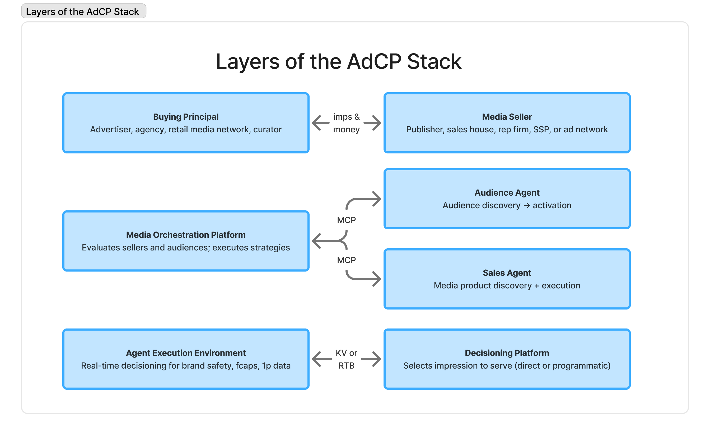
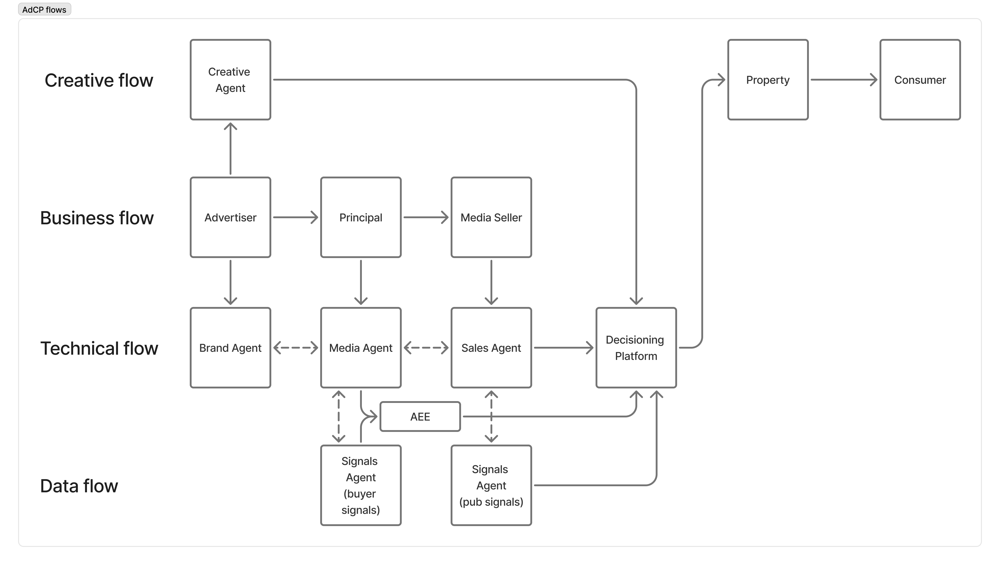

# Getting Started with Ad Context Protocol

Welcome to the Ad Context Protocol (AdCP) documentation. AdCP enables AI assistants to interact with advertising platforms through standardized interfaces.

## What is Ad Context Protocol?

Ad Context Protocol is an open standard that enables AI-powered advertising workflows through:

- **Natural Language Interaction**: Describe what you want in plain English
- **Platform Agnostic**: Works with any compatible advertising platform
- **Multi-Protocol Support**: Access AdCP through MCP, A2A, or future protocols
- **AI-Powered**: Designed for integration with AI assistants and agents

AdCP uses a task-first architecture where core advertising tasks (like creating media buys or discovering signals) can be accessed through multiple protocols:
- **MCP (Model Context Protocol)**: For direct AI assistant integration
- **A2A (Agent2Agent Protocol)**: For complex workflows and agent collaboration
- **REST API**: Coming soon for traditional integrations

## Protocol Architecture

AdCP operates at multiple layers, providing a clean separation between the business roles, orchestration layer, and technical execution:

## The AdCP Ecosystem Layers

### Top Layer: Business Principals

#### Buying Principal (Left)
The demand side of advertising, including:
- **Advertisers**: Brands with products/services to promote
- **Agencies**: Acting on behalf of advertisers
- **Retail Media Networks**: Retailers monetizing their audiences
- **Curators**: Packaging inventory and data for specific use cases

#### Media Seller (Right)
The supply side of advertising, including:
- **Publishers**: Content creators with audience reach
- **Sales Houses**: Representing multiple publishers
- **Rep Firms**: Specialized sales representation
- **SSPs**: Supply-side platforms aggregating inventory
- **Ad Networks**: Aggregating and reselling inventory

These parties exchange impressions and money through the orchestration layer below.

### Middle Layer: Orchestration

#### Media Orchestration Platform (Left)
Platforms that evaluate sellers and audiences, and execute buying strategies:
- **Examples**: Scope3, custom orchestration solutions
- **Function**: Strategy execution, seller evaluation, optimization
- **Integration**: Uses MCP to communicate with both Audience and Sales Agents

#### Signal Agent (Right, Top)
MCP servers that provide:
- **Signal Discovery**: Finding relevant signals (audiences, contextual, geographical, temporal) using natural language
- **Signal Activation**: Pushing signals to decisioning platforms
- **Integration**: Connects signal platforms to orchestration via MCP

#### Sales Agent (Right, Bottom)
MCP servers that provide:
- **Media Product Discovery**: Natural language inventory search
- **Media Execution**: Creating and managing campaigns
- **Integration**: Exposes publisher capabilities via MCP

### Bottom Layer: Technical Execution

#### Agentic eXecution Engine (Left)
Real-time systems for:
- **Brand Safety**: Ensuring appropriate ad placement
- **Frequency Capping**: Managing exposure limits
- **First-Party Data**: Activating advertiser data
- **Integration**: Connects via key-value pairs or RTB protocols

#### Decisioning Platform (Right)
The technical infrastructure that:
- **Selects Impressions**: Decides which ad to serve
- **Delivery Method**: Direct campaigns or programmatic (RTB)
- **Examples**: DSPs, SSPs, Ad Servers, Google Ad Manager, Kevel

## AdCP Information Flows

The AdCP ecosystem coordinates multiple flows of information between participants:

### Key Flows Explained

- **Creative Flow**: Creative agents produce assets that flow through the ecosystem to reach consumers via properties
- **Business Flow**: Advertisers work with principals who engage media sellers in the business layer
- **Technical Flow**: Brand agents, media agents, and sales agents coordinate through the decisioning platform, with bidirectional communication enabling optimization
- **Data Flow**: Signals flow between agents, with buyer signals and publisher signals enriching the decision-making process through the AXE (Agentic eXecution Engine)

These flows illustrate how AdCP enables seamless coordination between business stakeholders, technical systems, and creative processes.

## How AdCP Protocols Work Together

Each AdCP protocol operates within this ecosystem:

### 🎯 Signals Activation Protocol
- **Scope**: Works with **signal platforms** to discover and activate signals directly on **decisioning platforms**
- **Integration**: Direct integration between signal agents and decisioning platforms (DSPs, injective platforms)
- **Workflow**: Find signals → Direct activation on target platform → Ready for campaign use

### 📍 Curation Protocol (Coming Q2 2025)
- **Scope**: Works with **decisioning platforms** and **supply-side platforms**
- **Integration**: Curates inventory that will be targeted with activated signals
- **Workflow**: Define requirements → Find inventory → Package with signals

### 💰 Media Buy Protocol
- **Scope**: Works primarily with **decisioning platforms** (DSPs, injective platforms)
- **Integration**: Executes campaigns using curated inventory and activated signals
- **Workflow**: Set objectives → Execute buys → Optimize performance

## Quick Example

Instead of navigating multiple platforms, you can now say:

> "Find audience signals of premium sports enthusiasts who would be interested in high-end running shoes, and activate them on Scope3."

The AI assistant will:
1. Search for relevant signals across connected platforms
2. Show you options with transparent pricing
3. Activate your chosen signals for use on decisioning platforms

## Available Protocols

### 🔍 [Discovery Protocol](./discovery/protocol)
**Status**: RFC/v1.0

Automatically discover AdCP agents using `.well-known/adcp.json` endpoints.

### 🎯 [Signals Activation Protocol](./signals/overview)
**Status**: RFC/v0.1

Discover and activate data signals (audiences, contextual, geographical, temporal) using natural language.

### 📍 Curation Protocol
**Status**: Coming Q2 2025

Curate media inventory based on context and brand safety.

### 💰 [Media Buy Protocol](./media-buy)
**Status**: RFC/v0.1

Execute and optimize media buys programmatically.

## Reference Implementations

- [Signals Agent](https://github.com/adcontextprotocol/signals-agent)
- [Sales Agent](https://github.com/adcontextprotocol/salesagent)

## For Platform Providers

If you operate a signal platform, DSP, or ad tech solution:

1. [Review the Protocol Specifications](./signals/specification)

## For Advertisers & Agencies

If you want to use AdCP with your AI assistant:

1. Check if your platforms support AdCP
2. Configure your AI assistant with AdCP-enabled platforms
3. Start using natural language for your campaigns

## Protocol Flexibility

AdCP's task-first architecture means you can access the same functionality through different protocols:

- **Using MCP**: Ideal for Claude and other AI assistants with direct tool integration
- **Using A2A**: Perfect for complex workflows with approvals and multi-agent collaboration
- **Protocol Agnostic**: Implementers write tasks once, support all protocols automatically

Learn more in the [Protocols section](./protocols/getting-started).

## Next Steps

- **Platform Providers**: Start with the [Signals Protocol Specification](./signals/specification)
- **Developers**: Review the [Protocol Support](./protocols/getting-started) options
- **Everyone**: Join the [community discussion](https://github.com/adcontextprotocol/adcp/discussions)

## Need Help?

- 📖 Browse the documentation
- 💬 Ask in [GitHub Discussions](https://github.com/adcontextprotocol/adcp/discussions)
- 📧 Email: support@adcontextprotocol.org
