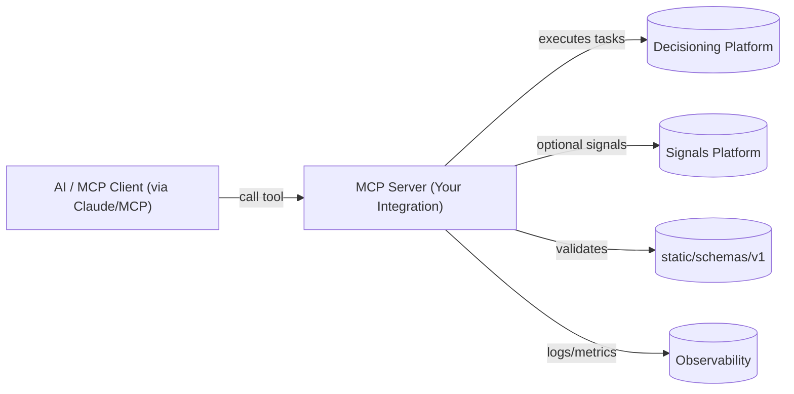
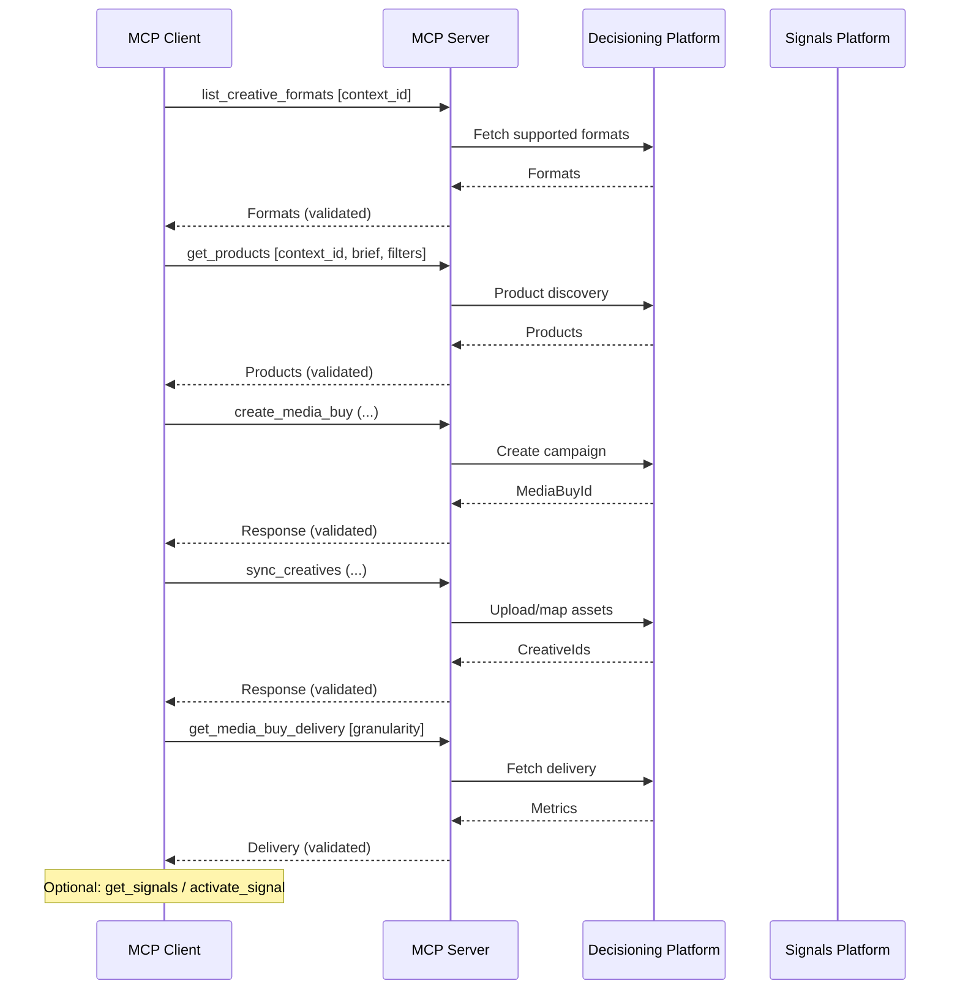
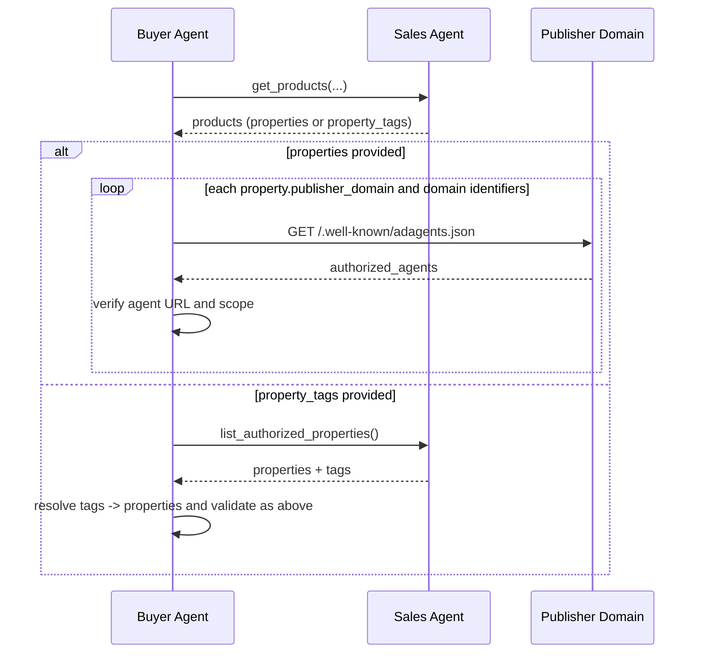
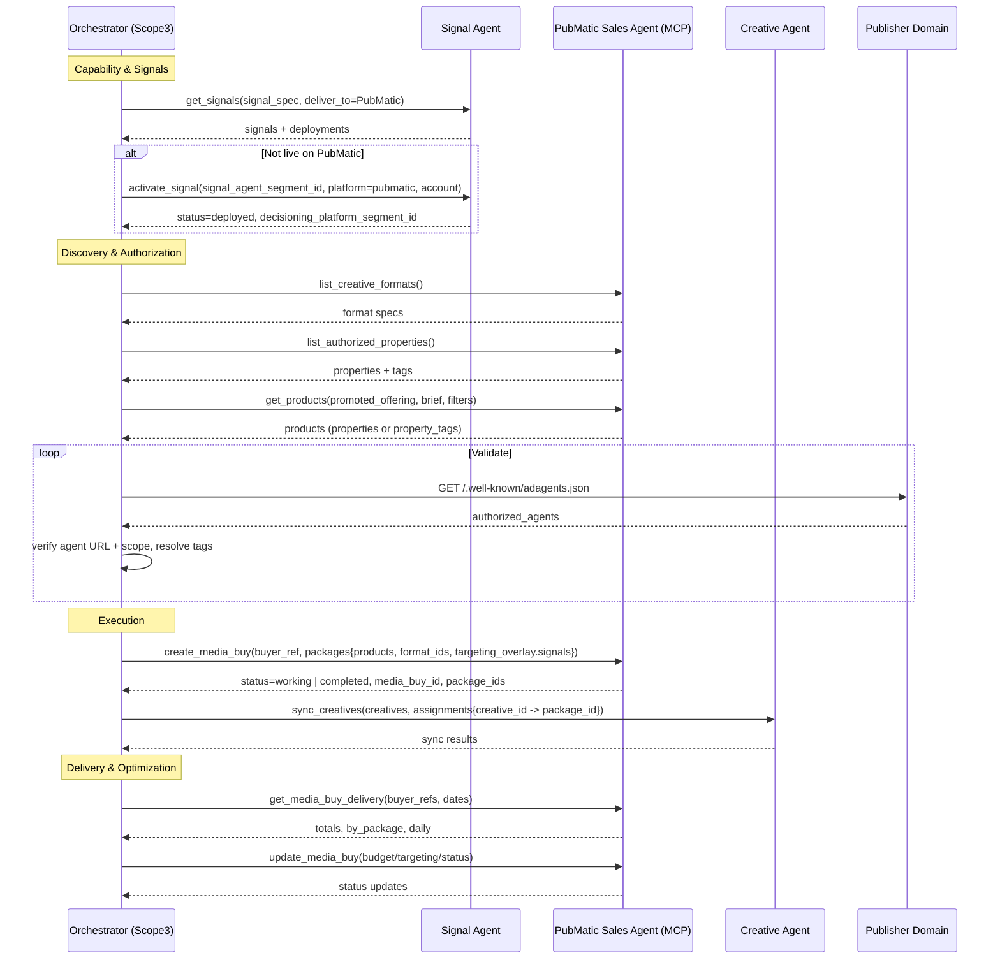

# MCP Buy-Side Integration Guide

This guide explains how to integrate AdCP for all buy-side operations using the Model Context Protocol (MCP). It covers prerequisites, context management, tool catalog, end-to-end workflows, validation, and deployment notes.

- See `docs/protocols/mcp-guide.md` for MCP concepts and status handling.
- See `static/schemas/v1/` for JSON Schemas of requests/responses and core models.

## Prerequisites

- MCP client and server foundations; Node 18+ recommended.
- Access and credentials for your decisioning platform(s) (DSP, ad server).
- Familiarity with the Media Buy docs at `docs/media-buy/` and Signals at `docs/signals/`.

## Architecture Overview



- The MCP client invokes tools exposed by your MCP server.
- Your server integrates with platforms and validates payloads against canonical schemas.

## Context Management (MCP)

MCP requires manual context persistence. Always pass a `context_id` to maintain session state.

```ts
// Example: generate and reuse a context ID for the session
const context_id = crypto.randomUUID();
await mcp.call('get_products', { context_id, brief: 'CTV sports in US' });
// ... reuse context_id in all subsequent calls
```

Store session-scoped data (advertiser, markets, objectives) keyed by `context_id`.

## Tool Catalog (Buy-Side)

All tasks are available as MCP tools.

- Media Buy
  - `get_products`
  - `list_creative_formats`
  - `list_authorized_properties`
  - `create_media_buy`
  - `sync_creatives`
  - `update_media_buy`
  - `get_media_buy_delivery`
  - `provide_performance_feedback`
- Signals (optional)
  - `get_signals`
  - `activate_signal`

Schemas live under `static/schemas/v1/` (see Schema Registry in `static/schemas/README.md`).

## End-to-End Workflow



## Critical Requirements & Patterns

### Authorization Validation (adagents.json)

Buyers MUST validate seller authorization before purchasing inventory. See `docs/media-buy/capability-discovery/adagents.md`.



Key rules:
- **Resolve tags** via `list_authorized_properties` when products return `property_tags`.
- **Domain matching** must follow base/subdomain/wildcard rules defined in `adagents.md`.
- **Reject unauthorized** or scope-mismatched products.

### Format Workflow

AdCP uses a two-step format flow:
- `get_products` returns only `format_ids`.
- Use `list_creative_formats` to retrieve full specifications.
- `create_media_buy` MUST include `format_ids` per package to enable placeholder creation and validation.

### Async & HITL Status

All tasks return a unified `status` (`working`, `input-required`, `completed`, `failed`). Long-running tasks may require human approval (HITL). Handle with polling, webhooks, or streaming as per `docs/protocols/mcp-guide.md` and `docs/media-buy/media-buys/index.md`.

```ts
// Polling pattern with context_id
let resp = await session.call('create_media_buy', args);
while (resp.status === 'working') {
  await delay(2000);
  resp = await session.call('create_media_buy', { context_id: resp.context_id });
}
if (resp.status !== 'completed') throw new Error(resp.message);
```

### Brief Requirements

`promoted_offering` is required for `get_products` and `create_media_buy`. See `docs/media-buy/product-discovery/brief-expectations.md`.

---

### Capability Discovery

```js
const formats = await mcp.call('list_creative_formats', {
  context_id: "ctx-123",
  media_types: ["video", "display"]
});

const properties = await mcp.call('list_authorized_properties', {
  context_id: "ctx-123",
  tags: ["premium", "sports_network"]
});
```

- Schemas: `media-buy/list-creative-formats-*.json`.
- Specs: `static/schemas/creative-formats-v1.json`, `static/schemas/asset-types-v1.json`.

### Product Discovery (Schema-Aligned)

```js
const products = await mcp.call('get_products', {
  context_id: "ctx-123",
  promoted_offering: "Running Shoes Spring 2026",
  brief: "Premium CTV/video against sports audiences in US/CA",
  filters: {
    delivery_type: "guaranteed",
    format_types: ["video"]
  }
});
```

### Create Media Buy (Schema-Aligned)

```js
const createResp = await mcp.call('create_media_buy', {
  context_id: "ctx-123",
  buyer_ref: "spring_ctv_2026",
  promoted_offering: "Running Shoes Spring 2026",
  start_time: "2026-03-01T00:00:00Z",
  end_time: "2026-04-30T23:59:59Z",
  budget: { total: 250000, currency: "USD", pacing: "even" },
  packages: [
    {
      buyer_ref: "pkg_ctv_sports",
      products: ["video_ctv_30s_hosted"],
      format_ids: ["video_16x9_30s"],
      budget: { total: 250000, currency: "USD" },
      targeting_overlay: {
        geo_country_any_of: ["US"],
        device_type_any_of: ["connected_tv"],
        signals: ["peer39_luxury_auto"],
        frequency_cap: { suppress_minutes: 30 }
      }
    }
  ]
});
```

### Sync Creatives (Schema-Aligned)

```js
const sync = await mcp.call('sync_creatives', {
  context_id: "ctx-123",
  creatives: [
    {
      creative_id: "hero_video_30s",
      name: "Brand Hero Video 30s",
      format: "video_16x9_30s",
      snippet: "https://vast.example.com/video/123",
      snippet_type: "vast_url",
      click_url: "https://example.com/products",
      duration: 30000,
      tags: ["spring_2026", "video"]
    }
  ],
  assignments: {
    hero_video_30s: [createResp.packages[0].package_id]
  }
});
```

### Update Media Buy (Schema-Aligned)

```js
const update = await mcp.call('update_media_buy', {
  context_id: "ctx-123",
  media_buy_id: createResp.media_buy_id,
  budget: { total: 300000, currency: "USD", pacing: "front_loaded" },
  packages: [
    {
      package_id: createResp.packages[0].package_id,
      budget: { total: 300000, currency: "USD" },
      targeting_overlay: { device_type_any_of: ["connected_tv", "desktop"] }
    }
  ]
});
```

### Delivery Reporting (Schema-Aligned)

```js
const delivery = await mcp.call('get_media_buy_delivery', {
  context_id: "ctx-123",
  buyer_refs: ["spring_ctv_2026"],
  start_date: "2026-03-01",
  end_date: "2026-03-31"
});
```

### Optional Signals (Schema-Aligned)

```js
const signals = await mcp.call('get_signals', {
  context_id: "ctx-123",
  signal_spec: "High-income households interested in sustainable fashion",
  deliver_to: { platforms: ["the-trade-desk"], countries: ["US"] }
});

await mcp.call('activate_signal', {
  context_id: "ctx-123",
  signal_agent_segment_id: signals.signals[0].signal_agent_segment_id,
  platform: "the-trade-desk",
  account: "acct_xyz"
});
```

## Validation & Errors

- Validate all requests/responses with AJV (`ajv`, `ajv-formats`), mirroring `tests/schema-validation.test.js`.
- Standard errors: `static/schemas/v1/core/error.json`.
- Idempotency keys for mutating calls to avoid duplicates on retries.
- Retry only transient failures; do not retry validation/auth failures.

## PubMatic × Scope3 Integration via AdCP

This section summarizes how PubMatic integrates with Scope3 using AdCP tasks exposed over MCP. For a deeper, PubMatic-specific mapping, see `docs/media-buy/advanced-topics/pubmatic-activate-adcp-integration.md`.

### Roles and Agents

- **Orchestrator (Scope3)**: Coordinates discovery, creation, creative ops, and optimization.
- **Sales Agent (PubMatic MCP Server)**: Exposes `get_products`, `list_authorized_properties`, `create_media_buy`, `update_media_buy`, `sync_creatives`, `get_media_buy_delivery`.
- **Signal Agent**: Exposes `get_signals`, `activate_signal` to deliver `decisioning_platform_segment_id` into targeting overlays.
- **Creative Management Agent**: Exposes `list_creatives`, `sync_creatives`, and manages assignments to packages.

### End-to-End Steps

1. **Signal discovery and activation**: `get_signals` → `activate_signal` for PubMatic platform/account.
2. **Capability discovery**: `list_creative_formats` and `list_authorized_properties` (cache for tag resolution).
3. **Product discovery**: `get_products` with `promoted_offering` and optional `brief`/`filters`.
4. **Authorization validation**: Validate products via publisher `/.well-known/adagents.json` and domain rules.
5. **Create media buy**: `create_media_buy` with packages, `format_ids`, targeting overlay including activated `signals`.
6. **Creative sync and assignment**: `sync_creatives` via Creative Agent; assign creative IDs to package IDs returned from creation.
7. **Activation and delivery**: Track async status/HITL to `active`.
8. **Reporting and optimization**: `get_media_buy_delivery` then `update_media_buy` (budgets/targeting/pauses).

### Sequence Diagram (Scope3 ↔ PubMatic over MCP)



### Data Mapping Notes

- Signals activated on PubMatic yield a `decisioning_platform_segment_id` that should be supplied in `targeting_overlay.signals` for `create_media_buy`.
- Products from PubMatic map to AdCP `Product` models; if `property_tags` are used, resolve via `list_authorized_properties`.
- Creative assignments should map buyer creative IDs to AdCP package IDs returned by the PubMatic Sales Agent.

## Observability

- Log per-tool invocations with `context_id`, status, and latency.
- Metrics: success/failure rates, p95 latency, retries, platform response IDs.

## Deployment Notes

- Your MCP server deploys independently.
- This repo’s `Dockerfile`/`nginx.conf`/`fly.toml` cover docs site deployment; reuse patterns as needed.

## References

- `docs/protocols/mcp-guide.md`
- `docs/media-buy/index.md` and `docs/media-buy/task-reference/`
- `docs/signals/overview.md`
- `static/schemas/README.md`
- `static/schemas/creative-formats-v1.json`
- `static/schemas/asset-types-v1.json`
