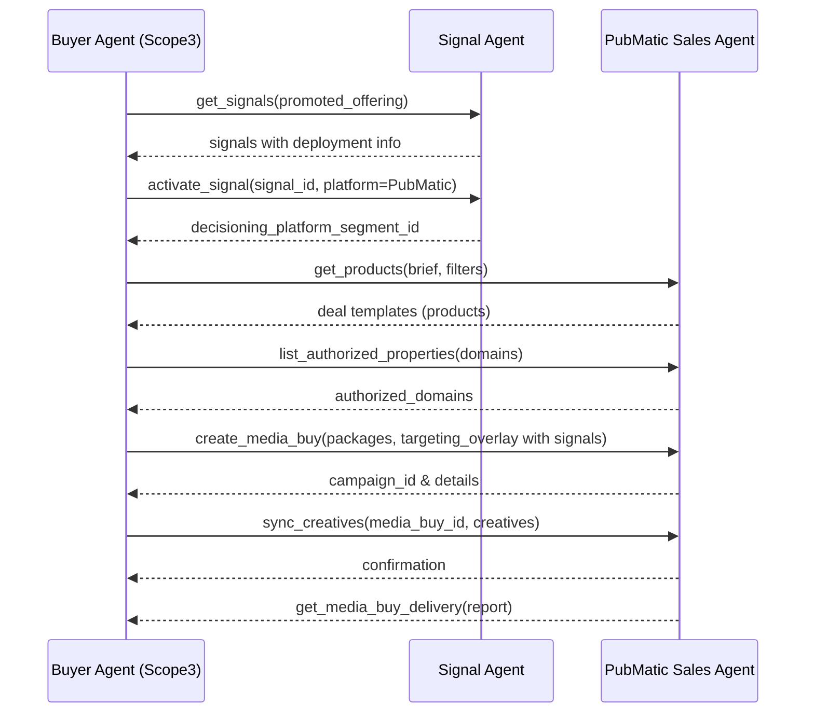

# PubMatic Buy-Side Integration using Ad Context Protocol (AdCP)

## Overview
This document describes how PubMatic can integrate its **buy-side workflows** using the **Ad Context Protocol (AdCP)** framework. It maps AdCP constructs like **Products**, **Signals**, and **Media Buys** to PubMatic’s domain (where *Products* = *Deal Templates*).

The integration focuses on how PubMatic’s MCP (Media Context Protocol) server can expose standardized APIs (as a **Sales Agent**) and interoperate with orchestrators like **Scope3** or any DSP through AdCP’s task model.

---

## Objectives
- Standardize buy-side communication using AdCP.
- Map PubMatic deal templates to AdCP Products.
- Support audience activation via AdCP Signals.
- Enable transparent and interoperable Media Buy creation and reporting.

---

## Agents and Responsibilities

| Agent | Role | Key AdCP Tasks | Description |
|-------|------|----------------|--------------|
| **Sales Agent (PubMatic MCP)** | Exposes PubMatic deal templates and handles buy execution | `get_products`, `create_media_buy`, `update_media_buy`, `sync_creatives`, `get_media_buy_delivery` | Central agent handling all buy-side workflows |
| **Signal Agent (3rd-party or internal)** | Provides audience and contextual signals | `get_signals`, `activate_signal` | Optional: PubMatic can expose its own contextual or audience signals |
| **Authorization Agent** | Verifies publisher domain authorization | `list_authorized_properties` | Prevents unauthorized resale of inventory |
| **Reporting Agent** | Exposes delivery metrics | `get_media_buy_delivery` | Maps internal PubMatic metrics to AdCP schema |

---

## AdCP to PubMatic Mapping

| AdCP Concept | PubMatic Equivalent |
|---------------|---------------------|
| **Product** | Deal Template |
| **Signal** | Audience / Contextual Segment (peer39, Scope3, etc.) |
| **Media Buy** | Campaign / Deal Execution |
| **Principal** | Buyer / Advertiser |
| **Orchestrator** | Scope3, DSP, or Agency Platform |

---

## Core API Implementations

### 1. `get_products` → Fetch Deal Templates

**Request:**
```json
{
  "tool": "get_products",
  "arguments": {
    "promoted_offering": "Nike Shoes Q4 2026",
    "brief": "Premium video deals across Yahoo properties in US",
    "filters": {
      "format_types": ["video"],
      "geo": {"country_in": ["US"]},
      "min_budget": 1000
    }
  }
}
```

**Response:**
```json
{
  "products": [
    {
      "product_id": "pm_dealtemplate_yt_vid_us_100k",
      "title": "Yahoo Video Deal – US – 100k min spend",
      "format_ids": ["video_15s", "video_30s"],
      "properties": ["yahoo.com", "finance.yahoo.com"],
      "geo": {"country_in": ["US"]},
      "device_types": ["CTV", "mobile", "desktop"],
      "min_budget": 100000,
      "reporting_currency": "USD",
      "reporting_capabilities": {
        "can_webhook": true,
        "webhook_granularity": ["hourly", "daily"]
      }
    }
  ]
}
```

---

### 2. `list_authorized_properties`

**Request:**
```json
{
  "tool": "list_authorized_properties",
  "arguments": {
    "property_tags": ["finance", "news"],
    "domains": ["finance.yahoo.com", "yahoo.com"]
  }
}
```

**Response:**
```json
{
  "authorized_properties": ["finance.yahoo.com", "yahoo.com"]
}
```

---

### 3. `create_media_buy`

**Request:**
```json
{
  "tool": "create_media_buy",
  "arguments": {
    "buyer_ref": "nike_q4_promo",
    "promoted_offering": "Nike Shoes Q4 2026",
    "start_time": "2026-10-01T00:00:00Z",
    "end_time": "2026-12-31T23:59:59Z",
    "budget": {
      "total": 200000,
      "currency": "USD",
      "pacing": "even"
    },
    "packages": [
      {
        "buyer_ref": "pkg_yahoo_video",
        "product_id": "pm_dealtemplate_yt_vid_us_100k",
        "format_ids": ["video_15s", "video_30s"],
        "budget": {"total": 200000, "currency": "USD"},
        "targeting_overlay": {
          "geo": {"country_in": ["US"]},
          "devices": ["CTV", "desktop"],
          "ad_size": ["1920x1080", "1280x720"],
          "signals": ["pm_peer39_luxury_auto"],
          "freq_cap": {"impressions": 3, "per": "day"}
        }
      }
    ],
    "reporting_webhook": {
      "url": "https://scope3.example.com/pubmatic/report",
      "auth_type": "bearer",
      "auth_token": "xyz",
      "reporting_frequency": "hourly",
      "requested_metrics": ["impressions", "spend", "video_completions"]
    }
  }
}
```

**Response:**
```json
{
  "media_buy_id": "mb_nike_q4_001",
  "package_ids": ["pkg_yahoo_video"],
  "creative_deadline": "2026-09-25T00:00:00Z"
}
```

---

### 4. `sync_creatives`

**Request:**
```json
{
  "tool": "sync_creatives",
  "arguments": {
    "media_buy_id": "mb_nike_q4_001",
    "creatives": [
      {
        "creative_id": "nike_vid30_001",
        "format_id": "video_30s",
        "url": "https://ads.nike.com/vid30_001.mp4",
        "tracking_macros": {
           "impression": "{IMP_URL}",
           "video_complete": "{COMP_URL}"
        }
      }
    ]
  }
}
```

**Response:**
```json
{
  "synced_creatives": [
    {"creative_id": "nike_vid30_001", "status": "OK"}
  ]
}
```

---

### 5. `get_media_buy_delivery`

**Request:**
```json
{
  "tool": "get_media_buy_delivery",
  "arguments": {
    "media_buy_id": "mb_nike_q4_001",
    "start_time": "2026-10-01T00:00:00Z",
    "end_time": "2026-10-31T23:59:59Z",
    "granularity": "hourly"
  }
}
```

**Response:**
```json
{
  "delivery": [
    {"timestamp": "2026-10-01T00:00:00Z", "impressions": 1200, "spend": 180.5, "video_completions": 800},
    {"timestamp": "2026-10-01T01:00:00Z", "impressions": 1300, "spend": 195.7, "video_completions": 850}
  ]
}
```

---

## Integration Flow

### Step-by-Step Sequence
1. **Buyer Agent (Scope3)** → `get_signals()` → Fetch audience/context signals.
2. **Signal Agent** → Returns signal list + deployment info.
3. **Buyer Agent** → `activate_signal()` → Deploys signals to PubMatic.
4. **Sales Agent (PubMatic)** → `get_products()` → Returns available deal templates.
5. **Buyer Agent** → `list_authorized_properties()` → Confirms domain authorization.
6. **Buyer Agent** → `create_media_buy()` → Creates campaign with target overlays.
7. **Sales Agent** → `sync_creatives()` → Uploads creatives.
8. **Ad Delivery** → PubMatic enforces deal + overlay targeting.
9. **Reporting** → `get_media_buy_delivery()` → Fetch performance.
10. **Optimization** → `update_media_buy()` → Adjust targeting/budget.

---

## Mermaid Sequence Diagram



---

## Implementation Notes
- **Signal Integration:** Signals activated via AdCP become `decisioning_platform_segment_id` in PubMatic.
- **Authorization:** Must check publisher’s `.well-known/adagents.json` for compliance.
- **Async Tasks:** Each AdCP task should return a `task_id` for polling.
- **Partial Success Handling:** Multi-package buys may succeed partially.
- **Reporting:** Map internal PubMatic metrics (impressions, spend, CTR) to AdCP schema.

---

## Next Steps
1. Implement MCP Sales Agent endpoints as per AdCP’s Media Buy spec.
2. Integrate with PubMatic’s deal template system.
3. Map existing API parameters (ad_size, geo, targeting) to AdCP targeting overlay.
4. Add async task management for long-running operations.
5. Validate through Scope3 orchestrator sandbox.

---

**Author:** PubMatic Engineering / AdCP Integration Team  
**Version:** 1.0.0  
**Date:** October 2025