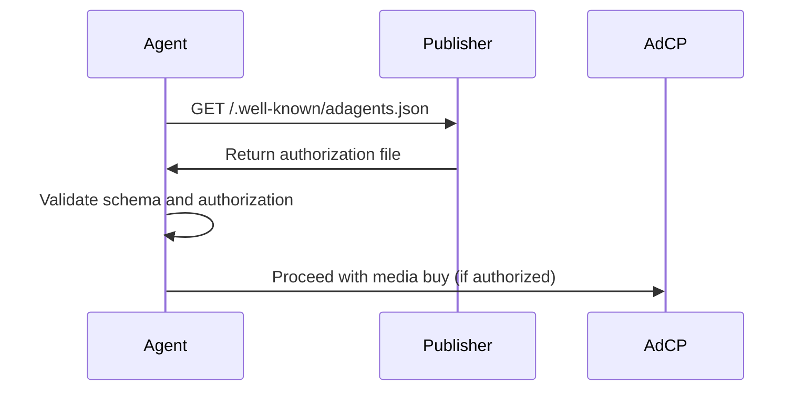

# adagents.json Tech Spec

The `adagents.json` file provides a standardized way for publishers to declare which sales agents are authorized to sell their advertising inventory. This specification addresses authorization transparency and helps prevent unauthorized reselling of publisher inventory.

<Tip>
**🔧 Management Tools Available**
- **[AdAgents.json Manager](https://adcontextprotocol.org/adagents)** - Validate existing files or create new ones with guided validation
- **[Agent Registry](https://adcontextprotocol.org/registry)** - Browse all available AdCP agents
</Tip>


## File Location

Publishers must host the `adagents.json` file at:

```
https://example.com/.well-known/adagents.json
```

Following [RFC 8615](https://datatracker.ietf.org/doc/html/rfc8615) well-known URI conventions, this location ensures consistent discoverability across publishers.

## File Format

The file must be valid JSON with UTF-8 encoding and return HTTP 200 status.

### Basic Structure

```json
{
  "$schema": "https://adcontextprotocol.org/schemas/v1/adagents.json",
  "contact": {
    "name": "Example Publisher Ad Operations",
    "email": "adops@example.com",
    "domain": "example.com",
    "seller_id": "pub-example-12345",
    "tag_id": "67890"
  },
  "properties": [
    {
      "property_id": "example_site",
      "property_type": "website",
      "name": "Example Site",
      "identifiers": [
        {"type": "domain", "value": "example.com"}
      ]
    }
  ],
  "authorized_agents": [
    {
      "url": "https://agent.example.com",
      "authorized_for": "Official sales agent",
      "authorization_type": "property_ids",
      "property_ids": ["example_site"]
    }
  ],
  "last_updated": "2025-01-10T12:00:00Z"
}
```

### Schema Definition

- **`$schema`** *(optional)*: JSON Schema reference for validation
- **`contact`** *(optional)*: Contact info for entity managing this file
  - **`name`** *(required)*: Name of managing entity (may be publisher or third-party)
  - **`email`** *(optional)*: Contact email for questions/issues
  - **`domain`** *(optional)*: Primary domain of managing entity
  - **`seller_id`** *(optional)*: Seller ID from IAB Tech Lab sellers.json
  - **`tag_id`** *(optional)*: TAG Certified Against Fraud ID
- **`properties`** *(optional)*: Array of properties covered by this file (same structure as `list_authorized_properties`)
- **`tags`** *(optional)*: Metadata for property tags (same structure as `list_authorized_properties`)
- **`authorized_agents`** *(required unless `managed_by` is present)*: Array of authorized sales agents
  - **`url`** *(required)*: Agent's API endpoint URL
  - **`authorized_for`** *(required)*: Human-readable authorization description
  - **`property_tags`** *(optional)*: Tags identifying which properties this agent represents (resolved against top-level `properties`)
  - **`properties`** *(optional)*: Explicit property list (alternative to `property_tags`)
- **`managed_by`** *(optional, alternative to `authorized_agents`)*: Domain of entity managing this publisher's ad operations. When present, buyer agents should fetch and use the adagents.json from this domain instead
- **`last_updated`** *(optional)*: ISO 8601 timestamp of last modification

## Contact Information

The optional `contact` object identifies who manages this `adagents.json` file - which may be the publisher themselves or a third-party operator.

**Why this matters**: If there are questions or issues with authorization, buyers know who to contact. This also enables cross-validation with sellers.json and TAG certification.

```json
{
  "contact": {
    "name": "CNN Advertising Operations",
    "email": "adops@cnn.com",
    "domain": "cnn.com",
    "seller_id": "pub-cnn-12345",  // From sellers.json
    "tag_id": "67890"               // TAG Certified Against Fraud ID
  }
}
```

**Recommended fields**: Include `email`, `domain`, and `seller_id` when available to facilitate verification and communication.

## Managed By Redirects

The optional `managed_by` field enables publishers to delegate their advertising operations to a third-party manager. When present, buyer agents should fetch the authoritative `adagents.json` from the managing domain instead.

**Common use cases:**
- **Multi-brand networks**: Instagram, Facebook, and WhatsApp redirect to `meta.com`
- **DOOH networks**: Individual venue domains redirect to network operator (e.g., `clearchannel.com`)
- **Publisher consortiums**: Member publishers redirect to consortium's centralized ad operations
- **White-label platforms**: Publishers redirect to their platform provider's authorization

### Simple Redirect

Minimal redirect with just the managing domain:

```json
{
  "$schema": "https://adcontextprotocol.org/schemas/v1/adagents.json",
  "managed_by": "meta.com"
}
```

**What happens**: When buyer agents fetch `instagram.com/.well-known/adagents.json`, they find `managed_by: "meta.com"` and immediately fetch `meta.com/.well-known/adagents.json` for the actual authorization data.

### Redirect with Contact Info

Include contact information for the local property even when redirecting:

```json
{
  "$schema": "https://adcontextprotocol.org/schemas/v1/adagents.json",
  "contact": {
    "name": "Instagram Advertising",
    "email": "adops@instagram.com",
    "domain": "instagram.com"
  },
  "managed_by": "meta.com",
  "last_updated": "2025-01-10T18:00:00Z"
}
```

**Why include contact**: Even though authorization comes from `meta.com`, property-specific questions may go to the Instagram team.

### Validation Flow with managed_by

When buyer agents encounter a `managed_by` field:

1. **Detect redirect**: Parse the publisher's adagents.json and find `managed_by` field
2. **Follow redirect**: Fetch `/.well-known/adagents.json` from the managing domain
3. **Validate authorization**: Check if the sales agent is authorized in the manager's file
4. **Prevent loops**: Track redirect chain and reject if loop detected or depth > 3
5. **Cache both**: Cache both the redirect and the manager's authorization data

**Security considerations:**
- Redirects MUST use HTTPS
- Buyer agents MUST detect and reject redirect loops
- Maximum redirect depth should be limited (recommended: 3)
- Original domain's contact info should be preserved for property-specific questions

## Property Declaration

The optional `properties` array lists all properties covered by this file, using the **same structure as `list_authorized_properties`**.

**Key insight**: `adagents.json` and `list_authorized_properties` should be consistent - they describe the same properties with the same tags.

```json
{
  "properties": [
    {
      "property_type": "mobile_app",
      "name": "Instagram",
      "identifiers": [
        {"type": "ios_bundle", "value": "com.burbn.instagram"},
        {"type": "android_package", "value": "com.instagram.android"}
      ],
      "tags": ["meta_network", "social_media"],
      "publisher_domain": "instagram.com"
    },
    {
      "property_type": "mobile_app",
      "name": "Facebook",
      "identifiers": [...],
      "tags": ["meta_network", "social_media"],
      "publisher_domain": "facebook.com"
    }
  ],
  "tags": {
    "meta_network": {
      "name": "Meta Network",
      "description": "All Meta-owned properties"
    },
    "social_media": {
      "name": "Social Media Apps",
      "description": "Social networking applications"
    }
  }
}
```

## Agent Authorization Patterns

Agents can be authorized using **property IDs** (recommended), **tags** (for flexible grouping), or **explicit property lists**.

### Pattern 1: Property IDs (Recommended)

Use `property_ids` to reference specific properties by ID - direct and unambiguous.

```json
{
  "properties": [
    {
      "property_id": "cnn_ctv_app",
      "property_type": "ctv_app",
      "name": "CNN CTV App",
      "identifiers": [...]
    },
    {
      "property_id": "cnn_web_us",
      "property_type": "website",
      "name": "CNN.com US",
      "identifiers": [...]
    }
  ],
  "authorized_agents": [
    {
      "url": "https://cnn-ctv-agent.com",
      "authorized_for": "CNN CTV properties",
      "authorization_type": "property_ids",
      "property_ids": ["cnn_ctv_app"]
    }
  ]
}
```

**Resolution**: Agent is authorized for exactly the properties with matching `property_id` values.

### Pattern 2: Tag-Based Authorization

Use `property_tags` to reference properties by tag - good for flexible grouping.

```json
{
  "properties": [
    {
      "property_id": "instagram",
      "property_type": "mobile_app",
      "name": "Instagram",
      "identifiers": [...],
      "tags": ["meta_network", "social_media"]
    },
    {
      "property_id": "facebook",
      "property_type": "mobile_app",
      "name": "Facebook",
      "identifiers": [...],
      "tags": ["meta_network", "social_media"]
    }
  ],
  "tags": {
    "meta_network": {
      "name": "Meta Network",
      "description": "All Meta-owned properties"
    }
  },
  "authorized_agents": [
    {
      "url": "https://meta-ads.com",
      "authorized_for": "All Meta properties",
      "authorization_type": "property_tags",
      "property_tags": ["meta_network"]
    }
  ]
}
```

**Resolution**: Agent is authorized for all properties where `tags` includes `"meta_network"`.

### Pattern 3: Explicit Property Objects

Use `properties` array for inline property definitions (rare - usually properties are defined at top level).

```json
{
  "authorized_agents": [
    {
      "url": "https://agent.com",
      "authorized_for": "Specific inventory",
      "authorization_type": "inline_properties",
      "properties": [
        {
          "property_type": "website",
          "name": "Example Site",
          "identifiers": [
            {"type": "domain", "value": "example.com"}
          ]
        }
      ]
    }
  ]
}
```

### Pattern 4: Publisher Property References

Use `publisher_properties` to authorize an agent for properties defined in another publisher's `adagents.json` file. This is the **recommended pattern** when publishers authorize third-party sales agents, as it ensures a single source of truth for property definitions.

**By Property ID**:
```json
{
  "authorized_agents": [
    {
      "url": "https://third-party-sales.com",
      "authorized_for": "CNN CTV App only",
      "authorization_type": "publisher_properties",
      "publisher_properties": [
        {
          "publisher_domain": "cnn.com",
          "selection_type": "by_id",
          "property_ids": ["cnn_ctv_app"]
        }
      ]
    }
  ]
}
```

**By Publisher Tags**:
```json
{
  "authorized_agents": [
    {
      "url": "https://ctv-specialist.com",
      "authorized_for": "CTV inventory from multiple publishers",
      "authorization_type": "publisher_properties",
      "publisher_properties": [
        {
          "publisher_domain": "cnn.com",
          "selection_type": "by_tag",
          "property_tags": ["ctv"]
        },
        {
          "publisher_domain": "espn.com",
          "selection_type": "by_tag",
          "property_tags": ["ctv"]
        }
      ]
    }
  ]
}
```

**Key Points**:
- Agent references properties from the publisher's canonical `adagents.json` file
- Property IDs and tags are resolved against the **publisher's** properties/tags definitions
- Ensures consistency - if publisher updates properties, agent authorization automatically reflects changes
- When buyer agents call `list_authorized_properties`, they should fetch each referenced publisher's `adagents.json` to resolve property definitions

### Pattern 5: No Scoping (Simple Case)

If `property_ids`, `property_tags`, `properties`, and `publisher_properties` are all omitted, agent is authorized for ALL properties in this file.

```json
{
  "authorized_agents": [
    {
      "url": "https://agent.com",
      "authorized_for": "All inventory"
      // No scoping = authorized for everything in this file
    }
  ]
}
```

## Real-World Examples

### Example 1: Meta Network with Managed By Redirects

Meta manages Instagram, Facebook, and WhatsApp with a single sales agent. Each property redirects to the central Meta authorization:

**instagram.com/.well-known/adagents.json:**
```json
{
  "$schema": "https://adcontextprotocol.org/schemas/v1/adagents.json",
  "contact": {
    "name": "Instagram Advertising",
    "email": "adops@instagram.com",
    "domain": "instagram.com"
  },
  "managed_by": "meta.com",
  "last_updated": "2025-01-10T18:00:00Z"
}
```

**facebook.com/.well-known/adagents.json:**
```json
{
  "$schema": "https://adcontextprotocol.org/schemas/v1/adagents.json",
  "contact": {
    "name": "Facebook Advertising",
    "email": "adops@facebook.com",
    "domain": "facebook.com"
  },
  "managed_by": "meta.com",
  "last_updated": "2025-01-10T18:00:00Z"
}
```

**meta.com/.well-known/adagents.json** (authoritative file):

**Note**: `publisher_domain` is optional in adagents.json when properties are for the same domain where the file is hosted. It's included here because these are cross-domain properties (Instagram, Facebook, WhatsApp) all managed by Meta.

```json
{
  "contact": {
    "name": "Meta Advertising Operations",
    "email": "adops@meta.com",
    "domain": "meta.com",
    "seller_id": "pub-meta-12345",
    "tag_id": "12345"
  },
  "properties": [
    {
      "property_type": "mobile_app",
      "name": "Instagram",
      "identifiers": [
        {"type": "ios_bundle", "value": "com.burbn.instagram"},
        {"type": "android_package", "value": "com.instagram.android"}
      ],
      "tags": ["meta_network"],
      "publisher_domain": "instagram.com"
    },
    {
      "property_type": "mobile_app",
      "name": "Facebook",
      "identifiers": [
        {"type": "ios_bundle", "value": "com.facebook.Facebook"},
        {"type": "android_package", "value": "com.facebook.katana"}
      ],
      "tags": ["meta_network"],
      "publisher_domain": "facebook.com"
    },
    {
      "property_type": "mobile_app",
      "name": "WhatsApp",
      "identifiers": [
        {"type": "ios_bundle", "value": "net.whatsapp.WhatsApp"},
        {"type": "android_package", "value": "com.whatsapp"}
      ],
      "tags": ["meta_network"],
      "publisher_domain": "whatsapp.com"
    }
  ],
  "tags": {
    "meta_network": {
      "name": "Meta Network",
      "description": "All Meta-owned properties"
    }
  },
  "authorized_agents": [
    {
      "url": "https://meta-ads.com",
      "authorized_for": "All Meta properties",
      "authorization_type": "property_tags",
      "property_tags": ["meta_network"]
    }
  ]
}
```

### Example 2: Tumblr (Subdomain Exclusion)

Tumblr authorizes sales only for corporate properties, NOT user blogs. This file would be hosted at **tumblr.com/.well-known/adagents.json**.

**Note**: `publisher_domain` is omitted since the property is for the same domain where the file is hosted (tumblr.com).

```json
{
  "contact": {
    "name": "Tumblr Advertising"
  },
  "properties": [
    {
      "property_type": "website",
      "name": "Tumblr Corporate",
      "identifiers": [
        {"type": "domain", "value": "tumblr.com"}
      ],
      "tags": ["corporate"]
    }
  ],
  "tags": {
    "corporate": {
      "name": "Corporate Properties",
      "description": "Tumblr corporate properties only"
    }
  },
  "authorized_agents": [
    {
      "url": "https://tumblr-sales.com",
      "authorized_for": "Tumblr corporate properties only",
      "authorization_type": "property_tags",
      "property_tags": ["corporate"]
    }
  ]
}
```

**Why this works**: The property only lists `"value": "tumblr.com"` (not `"*.tumblr.com"`), so the agent is authorized ONLY for the root domain. User blogs on subdomains like `userblog.tumblr.com` are not authorized.

### Example 3: CNN (Channel and Geographic Segmentation)

CNN has CTV properties managed by one agent, and US/international websites by another:

```json
{
  "contact": {
    "name": "CNN Advertising Operations",
    "email": "adops@cnn.com",
    "domain": "cnn.com",
    "seller_id": "pub-cnn-12345",
    "tag_id": "67890"
  },
  "properties": [
    {
      "property_id": "cnn_ctv_app",
      "property_type": "ctv_app",
      "name": "CNN CTV App",
      "identifiers": [
        {"type": "roku_store_id", "value": "12345"},
        {"type": "fire_tv_asin", "value": "B00ABC123"},
        {"type": "apple_tv_bundle", "value": "com.cnn.tv"}
      ],
      "tags": ["ctv"]
    },
    {
      "property_id": "cnn_web_us",
      "property_type": "website",
      "name": "CNN.com US",
      "identifiers": [
        {"type": "domain", "value": "cnn.com"}
      ],
      "tags": ["web"]
    },
    {
      "property_id": "cnn_web_intl",
      "property_type": "website",
      "name": "CNN International",
      "identifiers": [
        {"type": "domain", "value": "edition.cnn.com"}
      ],
      "tags": ["web"]
    }
  ],
  "tags": {
    "ctv": {
      "name": "Connected TV",
      "description": "CTV app inventory"
    },
    "web": {
      "name": "Web Properties",
      "description": "Website inventory"
    }
  },
  "authorized_agents": [
    {
      "url": "https://cnn-ctv-agent.com",
      "authorized_for": "CNN CTV properties",
      "authorization_type": "property_ids",
      "property_ids": ["cnn_ctv_app"]
    },
    {
      "url": "https://cnn-web-agent.com",
      "authorized_for": "CNN US and international websites",
      "authorization_type": "property_ids",
      "property_ids": ["cnn_web_us", "cnn_web_intl"]
    }
  ]
}
```

**Why this works**: One agent handles all CTV regardless of platform (Roku, Fire TV, etc.), while another handles all web properties regardless of geography. Tags enable flexible grouping without duplicating property lists.

## Mobile Applications

Mobile applications follow the same pattern as [app-ads.txt](https://iabtechlab.com/wp-content/uploads/2019/03/app-ads.txt-v1.0-final-.pdf):

1. **Developer Website**: Apps reference their developer's website through app store listings
2. **Single File**: Publisher hosts one `adagents.json` for all properties (websites, apps, etc.)
3. **Trust Chain**: App store enforces developer website link, creating trusted authorization path
4. **Property Scoping**: Use the `properties` array to specify which apps/platforms each agent represents

### Implementation for Apps

Publishers with mobile apps can use property scoping to specify which platforms each agent represents:

```json
{
  "$schema": "https://adcontextprotocol.org/schemas/v1/adagents.json",
  "publisher": {
    "name": "Publisher Inc.",
    "domain": "publisher.com"
  },
  "authorized_agents": [
    {
      "url": "https://mobile-agent.com",
      "authorized_for": "Mobile app inventory only",
      "authorization_type": "inline_properties",
      "properties": [
        {
          "property_type": "mobile_app",
          "name": "Publisher Mobile App",
          "identifiers": [
            {"type": "ios_bundle", "value": "com.publisher.app"},
            {"type": "android_package", "value": "com.publisher.app"}
          ],
          "publisher_domain": "publisher.com"
        }
      ]
    },
    {
      "url": "https://web-agent.com",
      "authorized_for": "Web properties only",
      "authorization_type": "inline_properties",
      "properties": [
        {
          "property_type": "website",
          "name": "Publisher Website",
          "identifiers": [
            {"type": "domain", "value": "publisher.com"}
          ],
          "publisher_domain": "publisher.com"
        }
      ]
    }
  ],
  "last_updated": "2025-01-10T15:30:00Z"
}
```

## Examples

### Minimal Configuration

```json
{
  "authorized_agents": [
    {
      "url": "https://agent.example.com",
      "authorized_for": "Official sales agent for our US and CA display inventory"
    }
  ]
}
```

### Publisher with Full Metadata

```json
{
  "$schema": "https://adcontextprotocol.org/schemas/v1/adagents.json",
  "publisher": {
    "name": "Premium Video Network Inc.",
    "domain": "premiumvideo.com",
    "seller_id": "pub-67890",
    "identifiers": [
      {"type": "tag_id", "value": "67890"}
    ]
  },
  "portfolio": {
    "primary_channels": ["video", "ctv"],
    "primary_countries": ["US", "CA", "GB"],
    "portfolio_description": "Premium video inventory across streaming platforms and CTV apps. Brand-safe, viewability-guaranteed inventory with professional content."
  },
  "authorized_agents": [
    {
      "url": "https://premium-ads.com",
      "authorized_for": "Primary sales agent for all premium video inventory worldwide"
    }
  ],
  "last_updated": "2025-01-10T12:00:00Z"
}
```

### Multiple Agents with Different Specializations

```json
{
  "$schema": "https://adcontextprotocol.org/schemas/v1/adagents.json",
  "publisher": {
    "name": "Multi-Platform Media Co.",
    "domain": "mediaco.com"
  },
  "portfolio": {
    "primary_channels": ["display", "video", "mobile"],
    "primary_countries": ["US", "CA", "GB", "AU"]
  },
  "authorized_agents": [
    {
      "url": "https://direct-sales.mediaco.com",
      "authorized_for": "Direct sales for premium placements and custom packages"
    },
    {
      "url": "https://programmatic-partner.com",
      "authorized_for": "Authorized reseller for display inventory in EMEA region",
      "authorization_type": "inline_properties",
      "properties": [
        {
          "property_type": "website",
          "name": "MediaCo Properties",
          "identifiers": [
            {"type": "domain", "value": "mediaco.com"},
            {"type": "domain", "value": "*.mediaco.com"}
          ],
          "publisher_domain": "mediaco.com",
          "tags": ["display_inventory", "emea"]
        }
      ]
    },
    {
      "url": "https://video-specialist.com",
      "authorized_for": "Specialized video advertising for CTV and mobile video",
      "authorization_type": "inline_properties",
      "properties": [
        {
          "property_type": "ctv_app",
          "name": "MediaCo Streaming",
          "identifiers": [
            {"type": "roku_store_id", "value": "12345"},
            {"type": "fire_tv_asin", "value": "B00ABC123"}
          ],
          "publisher_domain": "mediaco.com"
        }
      ]
    },
    {
      "url": "https://mobile-network.com",
      "authorized_for": "Mobile app advertising for iOS and Android",
      "authorization_type": "inline_properties",
      "properties": [
        {
          "property_type": "mobile_app",
          "name": "MediaCo Mobile App",
          "identifiers": [
            {"type": "ios_bundle", "value": "com.mediaco.app"},
            {"type": "android_package", "value": "com.mediaco.app"}
          ],
          "publisher_domain": "mediaco.com"
        }
      ]
    }
  ],
  "last_updated": "2025-01-10T15:30:00Z"
}
```

### DOOH Network with Managed By

Individual venue domains redirect to the network operator:

**timessquare-venue.com/.well-known/adagents.json:**
```json
{
  "$schema": "https://adcontextprotocol.org/schemas/v1/adagents.json",
  "contact": {
    "name": "Times Square Venue Operations",
    "email": "venue@timessquare-venue.com"
  },
  "managed_by": "clearchannel.com",
  "last_updated": "2025-01-10T14:00:00Z"
}
```

**clearchannel.com/.well-known/adagents.json** (network-level authorization):
```json
{
  "$schema": "https://adcontextprotocol.org/schemas/v1/adagents.json",
  "contact": {
    "name": "Clear Channel Outdoor",
    "domain": "clearchannel.com"
  },
  "properties": [
    {
      "property_type": "dooh",
      "name": "Times Square Digital Network",
      "identifiers": [
        {"type": "venue_id", "value": "TSQ_001"},
        {"type": "network_id", "value": "clear_channel_tsq"}
      ],
      "publisher_domain": "timessquare-venue.com",
      "tags": ["clear_channel_network", "nyc_metro"]
    }
  ],
  "tags": {
    "clear_channel_network": {
      "name": "Clear Channel Network",
      "description": "All Clear Channel DOOH properties"
    }
  },
  "authorized_agents": [
    {
      "url": "https://dooh-direct.clearchannel.com",
      "authorized_for": "Direct sales for all DOOH inventory",
      "authorization_type": "property_tags",
      "property_tags": ["clear_channel_network"]
    },
    {
      "url": "https://programmatic-dooh.com",
      "authorized_for": "Programmatic DOOH sales",
      "authorization_type": "property_tags",
      "property_tags": ["clear_channel_network"]
    }
  ],
  "last_updated": "2025-01-10T14:15:00Z"
}
```

**Why this pattern**: Individual venues don't need to maintain separate adagents.json files. The network operator manages all authorization centrally.

## Crawling and Discovery

### Crawler Requirements

- **Frequency**: Crawlers should fetch `adagents.json` every 24 hours
- **User Agents**: Follow standard web crawler practices and respect robots.txt
- **Caching**: Cache responses for up to 24 hours unless `last_updated` indicates changes
- **Validation**: Validate against JSON schema before processing

### Robots.txt Compatibility

Ensure `adagents.json` is not blocked in robots.txt:

```
User-agent: *
Allow: /.well-known/adagents.json
```

## Integration with AdCP

### Agent Discovery Process

1. **Publisher Discovery**: Agent discovers publisher domain from media buy request
2. **Fetch Authorization**: Request `/.well-known/adagents.json` from publisher domain
3. **Validate Authorization**: Confirm agent URL appears in `authorized_agents` array
4. **Cache Results**: Cache authorization for 24 hours with periodic refresh

### Validation Flow



### Error Handling

- **File Not Found (404)**: Agent proceeds without authorization validation
- **Invalid JSON**: Agent rejects request as unauthorized
- **Schema Validation Failure**: Agent rejects request as unauthorized
- **Agent Not Listed**: Agent rejects request as unauthorized

## Buyer Agent Validation

Buyer agents MUST validate sales agent authorization before purchasing inventory to prevent unauthorized reselling.

### Validation Process

When receiving a `get_products` response, buyer agents should:

1. **Extract Properties**: Get the `properties` array from each product
2. **Check Each Domain**: For each property, fetch `/.well-known/adagents.json` from the domain
3. **Validate Agent Authorization**: Confirm the sales agent URL appears in `authorized_agents`
4. **Match Authorization Scope**: Compare `authorized_for` description with product details
5. **Reject Unauthorized**: Decline products from unauthorized agents

### Required Product Schema

Products MUST include a `properties` array with comprehensive property identification:

```json
{
  "product_id": "premium-video-2024",
  "name": "Premium Video Inventory",
  "description": "High-quality video placements across Yahoo properties",
  "properties": [
    {
      "property_type": "website",
      "name": "Yahoo Network",
      "identifiers": [
        {"type": "domain", "value": "yahoo.com"},
        {"type": "domain", "value": "finance.yahoo.com"},
        {"type": "domain", "value": "mail.yahoo.com"},
        {"type": "domain", "value": "sports.yahoo.com"},
        {"type": "network_id", "value": "yahoo_network"}
      ],
      "tags": [
        "yahoo_network",
        "news_media",
        "premium_content",
        "brand_safe"
      ],
      "publisher_domain": "yahoo.com"
    },
    {
      "property_type": "mobile_app",
      "name": "Yahoo News App",
      "identifiers": [
        {"type": "ios_bundle", "value": "com.yahoo.mobile.client.iphone.yahoo"},
        {"type": "android_package", "value": "com.yahoo.mobile.client.android.yahoo"},
        {"type": "apple_app_store_id", "value": "328412701"},
        {"type": "google_play_id", "value": "com.yahoo.mobile.client.android.yahoo"}
      ],
      "tags": [
        "yahoo_network",
        "news_app",
        "mobile_only"
      ],
      "publisher_domain": "yahoo.com"
    }
  ]
}
```

### Property Types and Identifiers

#### **Website Properties**
```json
{
  "property_type": "website",
  "identifiers": [
    {"type": "domain", "value": "example.com"},
    {"type": "subdomain", "value": "news.example.com"}
  ]
}
```

#### **Mobile App Properties**
```json
{
  "property_type": "mobile_app",
  "identifiers": [
    {"type": "ios_bundle", "value": "com.company.app"},
    {"type": "android_package", "value": "com.company.app"},
    {"type": "apple_app_store_id", "value": "123456789"},
    {"type": "google_play_id", "value": "com.company.app"}
  ]
}
```

#### **CTV/OTT App Properties**
```json
{
  "property_type": "ctv_app",
  "identifiers": [
    {"type": "roku_store_id", "value": "12345"},
    {"type": "fire_tv_asin", "value": "B00ABC123"},
    {"type": "samsung_app_id", "value": "3201234567890"},
    {"type": "apple_tv_bundle", "value": "com.company.tv"},
    {"type": "bundle_id", "value": "com.company.tv"},
    {"type": "bundle_id", "value": "com.company.tv.roku"}
  ]
}
```

#### **DOOH Properties**
```json
{
  "property_type": "dooh",
  "identifiers": [
    {"type": "venue_id", "value": "NYC_TSQ_001"},
    {"type": "screen_id", "value": "SCR_001"},
    {"type": "screen_id", "value": "SCR_002"},
    {"type": "network_id", "value": "clear_channel_nyc"},
    {"type": "openooh_venue_type", "value": "transit_airport"}
  ]
}
```

#### **Podcast Properties**
```json
{
  "property_type": "podcast",
  "identifiers": [
    {"type": "rss_url", "value": "https://feeds.example.com/podcast.rss"},
    {"type": "apple_podcast_id", "value": "id1234567890"},
    {"type": "spotify_show_id", "value": "3IM0lmZxpFGH5B3yNrfBkF"},
    {"type": "podcast_guid", "value": "7f4d3c2b-9e8a-5d6c-b4a3-2e1f0d9c8b7a"}
  ]
}
```

### Tags for Scale

Tags enable efficient management of large property portfolios:

```json
{
  "property_type": "website",
  "name": "Condé Nast Lifestyle Network",
  "identifiers": [
    {"type": "network_id", "value": "conde_nast"},
    {"type": "domain", "value": "vogue.com"},
    {"type": "domain", "value": "gq.com"},
    {"type": "domain", "value": "wired.com"}
  ],
  "tags": [
    "conde_nast_network",
    "lifestyle",
    "fashion",
    "premium_content",
    "brand_safe",
    "comscore_top_100"
  ],
  "publisher_domain": "condenast.com"
}
```

**Common Tag Categories**:
- **Network Membership**: `yahoo_network`, `disney_network`, `conde_nast_network`
- **Content Categories**: `news`, `sports`, `entertainment`, `gaming`, `lifestyle`
- **Quality Indicators**: `premium_content`, `brand_safe`, `viewability_certified`
- **Geographic**: `us_national`, `nyc_dma`, `tier_1_markets`
- **Technical**: `gdpr_compliant`, `coppa_compliant`, `header_bidding_enabled`

### Validation Examples

#### ✅ Authorized Sale

**Product from agent@salescompany.com**:
```json
{
  "name": "Yahoo Display Package",
  "description": "Display ads across Yahoo web properties",
  "properties": [
    {
      "property_type": "website",
      "name": "Yahoo Finance Network",
      "identifiers": [
        {"type": "domain", "value": "yahoo.com"},
        {"type": "domain", "value": "finance.yahoo.com"}
      ],
      "tags": ["yahoo_network", "finance", "premium_content"],
      "publisher_domain": "yahoo.com"
    }
  ]
}
```

**yahoo.com/.well-known/adagents.json**:
```json
{
  "authorized_agents": [
    {
      "url": "https://agent@salescompany.com",
      "authorized_for": "Display and video inventory across all Yahoo web properties"
    }
  ]
}
```

**Result**: ✅ **AUTHORIZED** - Agent is listed and scope matches product description

#### ❌ Unauthorized Resale

**Product from agent@unauthorizedreseller.com**:
```json
{
  "name": "Yahoo Premium Video",
  "description": "Premium video inventory on Yahoo properties",
  "properties": [
    {
      "property_type": "website",
      "name": "Yahoo Homepage",
      "identifiers": [
        {"type": "domain", "value": "yahoo.com"}
      ],
      "tags": ["yahoo_network"],
      "publisher_domain": "yahoo.com"
    }
  ]
}
```

**yahoo.com/.well-known/adagents.json**:
```json
{
  "authorized_agents": [
    {
      "url": "https://official-partner.com",
      "authorized_for": "Official sales for Yahoo inventory"
    }
  ]
}
```

**Result**: ❌ **UNAUTHORIZED** - Agent not listed in adagents.json

#### ⚠️ Scope Mismatch

**Product from agent@videospecialist.com**:
```json
{
  "name": "Multi-Format Campaign",
  "description": "Display, video, and native ads across news sites",
  "properties": [
    {
      "property_type": "website",
      "name": "News Network Sites",
      "identifiers": [
        {"type": "domain", "value": "newssite.com"}
      ],
      "tags": ["news_network", "breaking_news"],
      "publisher_domain": "newssite.com"
    }
  ]
}
```

**newssite.com/.well-known/adagents.json**:
```json
{
  "authorized_agents": [
    {
      "url": "https://agent@videospecialist.com",
      "authorized_for": "Video inventory only - no display or native formats"
      // No authorization_type field = authorized for everything
    }
  ]
}
```

**Result**: ⚠️ **SCOPE MISMATCH** - Agent authorized but scope doesn't match product offering

### Enhanced Validation Examples

#### CTV App Validation

**Product with Multiple CTV Platform IDs**:
```json
{
  "properties": [
    {
      "property_type": "ctv_app",
      "name": "Streaming News App",
      "identifiers": [
        {"type": "roku_store_id", "value": "12345"},
        {"type": "fire_tv_asin", "value": "B00ABC123"},
        {"type": "samsung_app_id", "value": "3201234567890"},
        {"type": "bundle_id", "value": "com.news.ctv"},
        {"type": "bundle_id", "value": "com.news.ctv.roku"}
      ],
      "tags": ["news_network", "ctv_app", "live_streaming"],
      "publisher_domain": "newsnetwork.com"
    }
  ]
}
```

**Check**: `newsnetwork.com/.well-known/adagents.json`

#### Mobile App Validation

**Product with Multiple Platform Identifiers**:
```json
{
  "properties": [
    {
      "property_type": "mobile_app",
      "name": "Gaming Apps Portfolio",
      "identifiers": [
        {"type": "ios_bundle", "value": "com.gamecompany.puzzle"},
        {"type": "android_package", "value": "com.gamecompany.puzzle"},
        {"type": "apple_app_store_id", "value": "123456789"},
        {"type": "google_play_id", "value": "com.gamecompany.puzzle"}
      ],
      "tags": ["mobile_gaming", "puzzle_games", "family_friendly"],
      "publisher_domain": "gamecompany.com"
    }
  ]
}
```

**Check**: `gamecompany.com/.well-known/adagents.json`

#### DOOH Network Validation

**Product with Venue and Screen IDs**:
```json
{
  "properties": [
    {
      "property_type": "dooh",
      "name": "Times Square Digital Network",
      "identifiers": [
        {"type": "venue_id", "value": "TSQ_001"},
        {"type": "venue_id", "value": "TSQ_002"},
        {"type": "screen_id", "value": "SCR_001"},
        {"type": "screen_id", "value": "SCR_002"},
        {"type": "network_id", "value": "clear_channel_tsq"},
        {"type": "openooh_venue_type", "value": "outdoor_billboard"}
      ],
      "tags": ["clear_channel_network", "nyc_metro", "high_traffic", "tourist_zone"],
      "publisher_domain": "clearchannel.com"
    }
  ]
}
```

**Check**: `clearchannel.com/.well-known/adagents.json`

#### Podcast Validation

**Product with Multiple Podcast Platform IDs**:
```json
{
  "properties": [
    {
      "property_type": "podcast",
      "name": "Daily News Podcast",
      "identifiers": [
        {"type": "rss_url", "value": "https://feeds.newsnetwork.com/daily.rss"},
        {"type": "apple_podcast_id", "value": "id1234567890"},
        {"type": "spotify_show_id", "value": "3IM0lmZxpFGH5B3yNrfBkF"},
        {"type": "podcast_guid", "value": "7f4d3c2b-9e8a-5d6c-b4a3-2e1f0d9c8b7a"}
      ],
      "tags": ["news_podcast", "daily_show", "professional_news"],
      "publisher_domain": "newsnetwork.com"
    }
  ]
}
```

**Check**: `newsnetwork.com/.well-known/adagents.json`

### Implementation Requirements

Buyer agents MUST implement the following validation logic:

#### 1. **Property-Level Validation**
For each property in the `properties` array:
- Extract the `publisher_domain` field
- Fetch `/.well-known/adagents.json` from that domain
- Validate sales agent authorization

#### 2. **Identifier-Based Validation**
For websites, also validate domain identifiers:
```javascript
// Pseudocode for domain validation
function validateWebsiteProperty(property, sellingAgent) {
  // Check main publisher domain
  const mainAuth = checkAdagents(property.publisher_domain, sellingAgent);
  
  // For website properties, also check each domain identifier
  const domainIds = property.identifiers.filter(id => id.type === 'domain');
  for (const domainId of domainIds) {
    if (!checkAdagents(domainId.value, sellingAgent)) {
      return false; // Unauthorized on at least one domain
    }
  }
  
  return mainAuth;
}
```

#### 3. **Tag-Based Efficiency (Optional Future Enhancement)**
Publishers may eventually support tag-based authorization:
```json
{
  "authorized_agents": [
    {
      "url": "https://network-agent.com",
      "authorized_for": "All Condé Nast Network properties",
      "tags": ["conde_nast_network"]
    }
  ]
}
```

#### 4. **Multi-Property Validation**
- Validate **all** properties in the array
- Reject if **any** property fails authorization
- Cache results per publisher domain to avoid repeated requests

#### 5. **Required Validation Steps**
1. **Extract Properties**: Parse the enhanced `properties` array structure
2. **Check Publisher Domains**: Fetch adagents.json from each `publisher_domain`
3. **Validate Domain Identifiers**: For website properties, check each domain identifier
4. **Match Authorization Scope**: Compare `authorized_for` with product details
5. **Handle Property Types**: Different validation logic per `property_type`
6. **Cache Efficiently**: Cache by publisher domain, not individual properties
7. **Log Results**: Track authorization status for debugging and reporting

### Error Handling

- **Missing adagents.json**: Continue with warning (file may not exist yet)
- **Invalid JSON**: Treat as authorization failure
- **Agent Not Listed**: Reject as unauthorized resale
- **Scope Mismatch**: Flag for manual review or reject based on policy
- **Network Errors**: Retry with exponential backoff, treat repeated failures as warnings


## Domain Matching Rules

For website properties with domain identifiers, AdCP follows web conventions for common subdomains while requiring explicit authorization for others.

### Base Domain Matching (`example.com`)

Base domain format matches the domain plus standard web subdomains:

**Example**: `"value": "cnn.com"` authorizes:
- ✅ `cnn.com`
- ✅ `www.cnn.com` (standard web subdomain)
- ✅ `m.cnn.com` (standard mobile subdomain)
- ❌ `edition.cnn.com` (requires explicit authorization)
- ❌ `money.cnn.com` (requires explicit authorization)

**Rationale**: Matches how websites actually work - www and m are conventionally the same site.

### Specific Subdomain Matching (`subdomain.example.com`)

Specific subdomain matches only that exact subdomain:

**Example**: `"value": "edition.cnn.com"` authorizes:
- ✅ `edition.cnn.com`
- ❌ `cnn.com`
- ❌ `www.cnn.com`
- ❌ Any other subdomain

### Wildcard Subdomain Matching (`*.example.com`)

Wildcard format matches ALL subdomains but NOT the base domain:

**Example**: `"value": "*.cnn.com"` authorizes:
- ✅ `www.cnn.com`
- ✅ `m.cnn.com`
- ✅ `edition.cnn.com`
- ✅ `money.cnn.com`
- ✅ Any subdomain
- ❌ `cnn.com` (base domain requires separate authorization)

### Common Patterns

#### Pattern 1: Base Domain (Most Common)
```json
{
  "property_type": "website",
  "name": "CNN Website",
  "identifiers": [
    {"type": "domain", "value": "cnn.com"}
  ],
  "publisher_domain": "cnn.com"
}
```

**Authorizes**: `cnn.com`, `www.cnn.com`, and `m.cnn.com`

#### Pattern 2: Base + Specific Subdomains
```json
{
  "property_type": "website",
  "name": "CNN Properties",
  "identifiers": [
    {"type": "domain", "value": "cnn.com"},
    {"type": "domain", "value": "edition.cnn.com"},
    {"type": "domain", "value": "money.cnn.com"}
  ],
  "publisher_domain": "cnn.com"
}
```

**Authorizes**: Base domain (cnn.com, www.cnn.com, m.cnn.com) + edition.cnn.com + money.cnn.com

#### Pattern 3: All Subdomains (Use with Caution)
```json
{
  "property_type": "website",
  "name": "All CNN Network Sites",
  "identifiers": [
    {"type": "domain", "value": "cnn.com"},
    {"type": "domain", "value": "*.cnn.com"}
  ],
  "publisher_domain": "cnn.com"
}
```

**Authorizes**: Base domain + ALL subdomains (www, edition, money, etc.)

**Warning**: Only use wildcards when you genuinely control ALL subdomains.

### Validation Process

When validating domain authorization:

1. **Extract Domain Identifiers**: Get all `domain` type identifiers from the property
2. **Apply Matching Rules**: For each domain identifier, determine which domains it matches
3. **Check Authorization**: Fetch `/.well-known/adagents.json` from each matched domain
4. **Verify Agent**: Confirm the selling agent appears in each domain's authorized agents list

## Security Considerations

### File Integrity

- **HTTPS Required**: Always serve over HTTPS to prevent tampering
- **Regular Updates**: Update `last_updated` timestamp when making changes
- **Backup Copies**: Maintain backup of authorization file

### Authorization Granularity

The `authorized_for` field allows publishers to specify:
- **Geographic restrictions**: "US and CA only", "EMEA region"
- **Inventory types**: "display inventory", "video placements", "native ads"
- **Relationship types**: "direct sales", "authorized reseller"
- **Platform specifications**: "mobile apps", "desktop web", "CTV"
- **Format specializations**: "premium video", "rewarded ads", "interstitials"

## Comparison to ads.txt

| Feature | ads.txt | app-ads.txt | adagents.json |
|---------|---------|-------------|---------------|
| **Format** | CSV-like text | CSV-like text | JSON |
| **Location** | `/ads.txt` | `/app-ads.txt` | `/.well-known/adagents.json` |
| **Structure** | Fixed 4-field format | Fixed 4-field format | Extensible JSON schema |
| **Validation** | Manual parsing | Manual parsing | JSON Schema validation |
| **Mobile Apps** | Not supported | Supported | Supported |
| **Scope** | Publisher-level | Publisher-level | Publisher-level |
| **Metadata** | Limited | Limited | Rich descriptions |
| **Extensibility** | None | None | Schema versioning |

## Best Practices

1. **Keep Updated**: Regularly review and update authorized agents
2. **Be Specific**: Use detailed `authorized_for` descriptions that clearly define scope
3. **Monitor Access**: Track who accesses the file via web logs
4. **Schema Validation**: Validate file against JSON schema before publishing
5. **Backup Strategy**: Maintain backups of authorization configuration
6. **Clear Authorization**: Ensure `authorized_for` descriptions are actionable and specific

## Schema Validation

### Option 1: Web-Based Manager (Recommended)

Use the **[AdAgents.json Manager](https://adcontextprotocol.org/adagents)** for the easiest validation experience:

- ✅ Validates your live domain's adagents.json file
- ✅ Checks agent card endpoints automatically
- ✅ Provides detailed error messages and warnings
- ✅ Creates properly formatted files with guided input
- ✅ No installation required

**To validate:**
1. Visit [adcontextprotocol.org/adagents](https://adcontextprotocol.org/adagents)
2. Enter your domain name
3. Get instant validation results with actionable feedback

### Option 2: Command Line

Validate your `adagents.json` file using the JSON schema:

```bash
# Using ajv-cli
ajv validate -s https://adcontextprotocol.org/schemas/v1/adagents.json -d your-adagents.json

# Using online validators
# Copy schema URL: https://adcontextprotocol.org/schemas/v1/adagents.json
```

## Implementation Checklist

- [ ] Create `adagents.json` with required fields (use the [AdAgents Manager](https://adcontextprotocol.org/adagents) for guided creation)
- [ ] Use clear, specific `authorized_for` descriptions
- [ ] Host at `/.well-known/adagents.json` on your domain
- [ ] Validate against JSON schema (use [AdAgents Manager](https://adcontextprotocol.org/adagents) or ajv-cli)
- [ ] Ensure HTTPS serving with HTTP 200 response
- [ ] Configure robots.txt to allow crawling
- [ ] Test agent discovery process
- [ ] Verify agent cards are accessible (automatic in [AdAgents Manager](https://adcontextprotocol.org/adagents))
- [ ] Set up monitoring for file accessibility
- [ ] Document authorization policies for your team
- [ ] Plan regular review schedule for authorized agents

## Future Considerations

This v1 specification focuses on publisher-level authorization for simplicity and broad adoption. Future versions may add:
- Fine-grained app or property-specific authorization
- Integration with emerging app identification standards
- Enhanced metadata for programmatic buying
