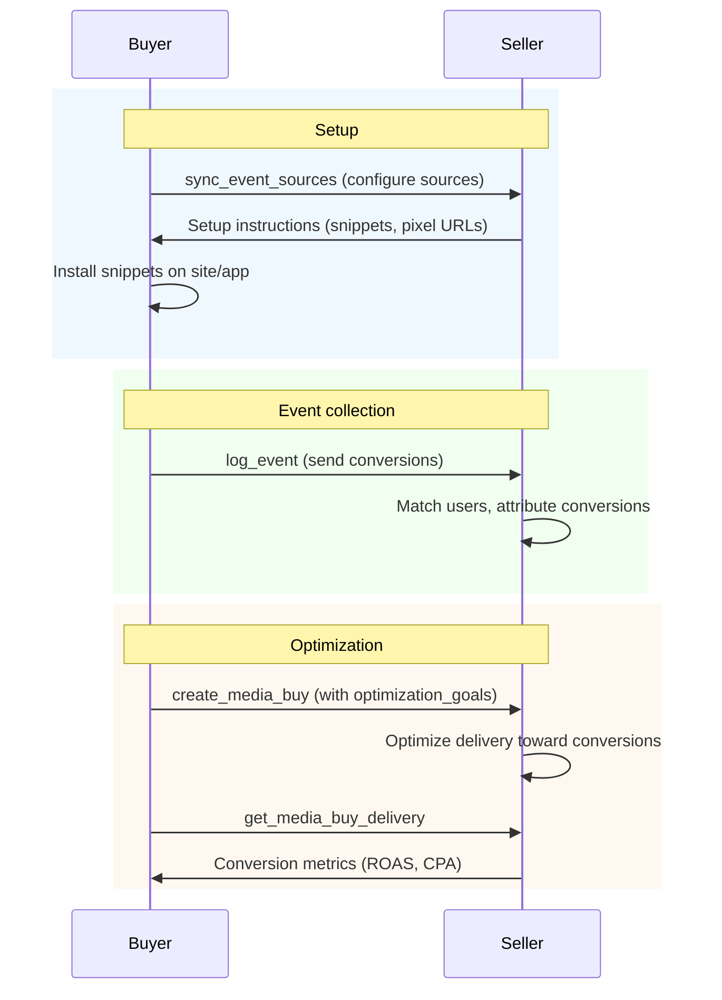

Conversion tracking in AdCP connects advertising spend to business outcomes. Two tasks handle the lifecycle: [`sync_event_sources`](/docs/media-buy/task-reference/sync_event_sources) configures where events come from, and [`log_event`](/docs/media-buy/task-reference/log_event) sends the events themselves.

Event data feeds into delivery reporting (conversions, ROAS, cost per acquisition) and enables optimization goals on media buy packages.

## The flow



This shows the recommended order. In practice, media buys can be created before events are flowing — the seller begins optimizing once sufficient event history accumulates.

## Event source

An event source represents a channel through which conversion events are collected — a website pixel, mobile SDK, server-to-server integration, or CRM import.

Configure event sources with [`sync_event_sources`](/docs/media-buy/task-reference/sync_event_sources). You provide an `event_source_id`, optional `name`, `event_types`, and `allowed_domains`. The response includes additional fields for each source:

| Field | Type | Description |
|-------|------|-------------|
| `seller_id` | string | Seller-assigned identifier in their ad platform |
| `action` | string | What happened: `created`, `updated`, `unchanged`, `deleted`, `failed` |
| `managed_by` | string | `buyer` (you configured it) or `seller` (always-on, seller-managed) |
| `action_source` | [ActionSource](#action-sources) | Type of event source (website pixel, app SDK, etc.) |
| `setup` | object | Implementation details — snippet code, snippet type, instructions |

### Buyer-managed vs seller-managed

**Buyer-managed** sources are ones you configure via `sync_event_sources`. You control the event types, domains, and lifecycle.

**Seller-managed** sources are always-on and appear in the response with `managed_by: "seller"`. These are common in commerce media where the retailer provides built-in attribution (e.g., purchase tracking on their own platform). Products with `conversion_tracking.platform_managed: true` indicate the seller provides these sources.

To discover all sources on an account (including seller-managed), call `sync_event_sources` without an `event_sources` array:

```json
{
  "$schema": "https://adcontextprotocol.org/schemas/v2/media-buy/sync-event-sources-request.json",
  "account": { "account_id": "acct_12345" }
}
```

## Event

An event represents a user action — a purchase, lead submission, page view, app install, or any of the [standard event types](#event-types).

Send events with [`log_event`](/docs/media-buy/task-reference/log_event):

```json
{
  "$schema": "https://adcontextprotocol.org/schemas/v3/core/event.json",
  "event_id": "evt_purchase_12345",
  "event_type": "purchase",
  "event_time": "2026-01-15T14:30:00Z",
  "action_source": "website",
  "event_source_url": "https://www.example.com/checkout/confirm",
  "user_match": {
    "hashed_email": "a1b2c3d4e5f6a1b2c3d4e5f6a1b2c3d4e5f6a1b2c3d4e5f6a1b2c3d4e5f6a1b2",
    "click_id": "abc123def456",
    "click_id_type": "gclid"
  },
  "custom_data": {
    "value": 149.99,
    "currency": "USD",
    "order_id": "order_98765",
    "num_items": 3
  }
}
```

| Field | Type | Required | Description |
|-------|------|----------|-------------|
| `event_id` | string | Yes | Unique identifier for deduplication (scoped to event_type + event_source_id). Max 256 chars. |
| `event_type` | [EventType](#event-types) | Yes | Standard event type |
| `event_time` | date-time | Yes | ISO 8601 timestamp when the event occurred |
| `user_match` | [UserMatch](#user-match) | No | User identifiers for attribution matching |
| `custom_data` | [CustomData](#custom-data) | No | Event-specific data (value, currency, items) |
| `action_source` | [ActionSource](#action-sources) | No | Where the event occurred |
| `event_source_url` | uri | No | URL where the event occurred (required when action_source is `website`) |
| `custom_event_name` | string | No | Name for custom events (when event_type is `custom`) |

Events are deduplicated by `event_id` + `event_type` + `event_source_id`. Sending the same event multiple times is safe.

## User match

User identifiers enable the seller to attribute conversions to ad impressions. Provide the strongest identifiers available — more identifiers means higher match rates.

```json
{
  "$schema": "https://adcontextprotocol.org/schemas/v2/core/user-match.json",
  "hashed_email": "a1b2c3d4e5f6a1b2c3d4e5f6a1b2c3d4e5f6a1b2c3d4e5f6a1b2c3d4e5f6a1b2",
  "uids": [
    { "type": "uid2", "value": "AbC123XyZ..." }
  ],
  "click_id": "abc123def456",
  "click_id_type": "gclid"
}
```

At least one identifier is required. The hierarchy from strongest to weakest:

| Field | Type | Match quality | Description |
|-------|------|---------------|-------------|
| `uids` | UID[] | Deterministic | Universal ID values (`rampid`, `id5`, `uid2`, `euid`, `pairid`, `maid`) |
| `hashed_email` | string | Deterministic | SHA-256 hash of lowercase, trimmed email (64-char hex) |
| `hashed_phone` | string | Deterministic | SHA-256 hash of E.164 phone number (64-char hex) |
| `click_id` | string | Deterministic | Platform click identifier (fbclid, gclid, ttclid, etc.) |
| `click_id_type` | string | — | Type of click identifier |
| `client_ip` | string | Probabilistic | Client IP address (requires `client_user_agent`) |
| `client_user_agent` | string | Probabilistic | Client user agent (requires `client_ip`) |

**Hashing**: Normalize before hashing — emails to lowercase with whitespace trimmed, phone numbers to E.164 format (e.g., `+12065551234`). Hash with SHA-256, output as 64-character lowercase hex.

Send multiple identifier types when available. The seller uses the best available match.

## Custom data

Event-specific data for attribution and reporting. For purchase events, always include `value` and `currency` to enable ROAS reporting.

```json
{
  "$schema": "https://adcontextprotocol.org/schemas/v2/core/event-custom-data.json",
  "value": 149.99,
  "currency": "USD",
  "order_id": "order_98765",
  "content_ids": ["SKU-1234", "SKU-5678"],
  "num_items": 3,
  "contents": [
    { "id": "SKU-1234", "quantity": 2, "price": 49.99, "brand": "Acme" },
    { "id": "SKU-5678", "quantity": 1, "price": 50.01, "brand": "Nova" }
  ]
}
```

| Field | Type | Description |
|-------|------|-------------|
| `value` | number | Monetary value of the event |
| `currency` | string | ISO 4217 currency code (e.g., `USD`, `EUR`, `GBP`) |
| `order_id` | string | Unique order or transaction identifier |
| `content_ids` | string[] | Product or content identifiers |
| `content_type` | string | Category of content (product, service, etc.) |
| `content_name` | string | Name of the product or content |
| `content_category` | string | Category of the product or content |
| `num_items` | integer | Number of items in the event |
| `search_string` | string | Search query (for search events) |
| `contents` | Content[] | Per-item details: `id` (required), `quantity`, `price`, `brand` |

## Event types

Standard marketing event types, aligned with IAB ECAPI:

| Event type | Description |
|------------|-------------|
| `page_view` | User viewed a page |
| `view_content` | User viewed specific content (product, article, etc.) |
| `select_content` | User selected or clicked on content |
| `select_item` | User selected a specific product or item from a list |
| `search` | User performed a search |
| `share` | User shared content via social or messaging |
| `add_to_cart` | User added an item to cart |
| `remove_from_cart` | User removed an item from cart |
| `viewed_cart` | User viewed their shopping cart |
| `add_to_wishlist` | User added an item to a wishlist |
| `initiate_checkout` | User started checkout process |
| `add_payment_info` | User added payment information |
| `purchase` | User completed a purchase |
| `refund` | A purchase was fully or partially refunded (adjusts ROAS) |
| `lead` | User expressed interest (form submission, signup, etc.) |
| `qualify_lead` | Lead qualified by sales or scoring criteria |
| `close_convert_lead` | Lead converted to a customer or closed deal |
| `disqualify_lead` | Lead disqualified or marked as not viable |
| `complete_registration` | User completed account registration |
| `subscribe` | User subscribed to a service or newsletter |
| `start_trial` | User started a free trial |
| `app_install` | User installed an application |
| `app_launch` | User launched an application |
| `contact` | User initiated contact (call, message, etc.) |
| `schedule` | User scheduled an appointment or event |
| `donate` | User made a donation |
| `submit_application` | User submitted an application (loan, job, etc.) |
| `custom` | Custom event type (specify in `custom_event_name`) |

## Action sources

Where the conversion event originated:

| Action source | Description |
|---------------|-------------|
| `website` | Event occurred on a website |
| `app` | Event occurred in a mobile or desktop app |
| `offline` | Event occurred offline (imported data) |
| `phone_call` | Event originated from a phone call |
| `chat` | Event originated from a chat conversation |
| `email` | Event originated from an email interaction |
| `in_store` | Event occurred at a physical retail location |
| `system_generated` | Event generated by an automated system |
| `other` | Other source (specify in `ext`) |

## Optimization goals

Optimization goals tell the seller what to optimize delivery toward. Set them on a package in [`create_media_buy`](/docs/media-buy/task-reference/create_media_buy#campaign-with-conversion-optimization). A package accepts an array of goals — each with an optional `priority` (1 = highest). Products declare `max_optimization_goals` when they limit how many goals a package can carry (most social platforms accept only 1).

**Schema**: [`/schemas/v2/core/optimization-goal.json`](https://adcontextprotocol.org/schemas/v3/core/optimization-goal.json)

There are two kinds of goals, discriminated by `kind`:

- **`kind: "metric"`** — Optimize for a seller-tracked delivery metric (clicks, views, engagements, etc.). No event source or conversion tracking setup required. The product declares which metrics it supports in `metric_optimization`.
- **`kind: "event"`** — Optimize for advertiser-tracked conversion events. Requires event sources registered via `sync_event_sources`. The product declares support in `conversion_tracking`.

### kind: event

Optimize for advertiser-tracked conversion events. The `event_sources` array defines which source-type pairs feed this goal. When the seller supports `multi_source_event_dedup` (declared in [`get_adcp_capabilities`](/docs/protocol/get_adcp_capabilities)), they deduplicate by `event_id` across all entries — the same business event reported by multiple sources counts once, using `value_field` and `value_factor` from the first matching entry. When `multi_source_event_dedup` is absent or false, buyers should use a single event source per goal.

**Cost per conversion** (single source):

```json
{
  "kind": "event",
  "event_sources": [
    { "event_source_id": "website_pixel", "event_type": "lead" }
  ],
  "target": { "kind": "cost_per", "value": 25.00 },
  "priority": 1
}
```

**Return on ad spend** (multiple sources with refunds):

```json
{
  "kind": "event",
  "event_sources": [
    { "event_source_id": "web_pixel", "event_type": "purchase", "value_field": "order_total" },
    { "event_source_id": "app_sdk", "event_type": "purchase", "value_field": "order_total" },
    { "event_source_id": "web_pixel", "event_type": "refund", "value_field": "refund_amount", "value_factor": -1 }
  ],
  "target": { "kind": "per_ad_spend", "value": 4.0 },
  "attribution_window": { "click_through": "28d", "view_through": "1d" },
  "priority": 1
}
```

For `per_ad_spend` targets, each event source entry specifies a `value_field` (which field on `custom_data` carries the monetary value) and an optional `value_factor` (multiplier, defaults to 1). The seller computes `sum(value_field * value_factor) / spend` across all deduplicated events.

**Maximize conversion value** (no specific ROAS target):

```json
{
  "kind": "event",
  "event_sources": [
    { "event_source_id": "web_pixel", "event_type": "purchase", "value_field": "value" }
  ],
  "target": { "kind": "maximize_value" },
  "priority": 1
}
```

A `maximize_value` target steers spend toward higher-value conversions without committing to a specific return ratio. Requires `value_field` on at least one event source entry.

| Field | Type | Required | Description |
|-------|------|----------|-------------|
| `kind` | `"event"` | Yes | Discriminator |
| `event_sources` | array | Yes | Source-type pairs feeding this goal. Seller deduplicates by `event_id` across entries — when the same `event_id` arrives from multiple sources with different `value_field`s, the seller uses the `value_field` and `value_factor` from the first matching entry in this array. |
| `event_sources[].event_source_id` | string | Yes | Event source (must be configured via `sync_event_sources`) |
| `event_sources[].event_type` | [EventType](#event-types) | Yes | Event type to include (e.g., `purchase`, `lead`, `refund`) |
| `event_sources[].custom_event_name` | string | When event_type is `custom` | Platform-specific custom event name |
| `event_sources[].value_field` | string | When target is `per_ad_spend` or `maximize_value` | Which field on `custom_data` carries the monetary value. The seller must use this for value extraction and aggregation — it is not passed directly to underlying platform APIs. |
| `event_sources[].value_factor` | number | No | Multiplier the seller must apply to `value_field` before aggregation (default 1). Use -1 for refunds, 0.01 for cents, 0 to zero out a source's value contribution while still counting it for dedup. |
| `target.kind` | `"cost_per"` \| `"per_ad_spend"` \| `"maximize_value"` | No | Target type. When omitted, the seller maximizes conversions within budget. |
| `target.value` | number | Yes (if target set) | Cost per event in buy currency, or return ratio (e.g., 4.0 = $4 per $1 spent) |
| `attribution_window` | object | No | Click-through and view-through windows. When omitted, the seller uses their default. |
| `priority` | integer | No | 1 = highest priority. When omitted, sellers use array position. |

### kind: metric

Optimize for a seller-tracked delivery metric. No event source needed — the seller tracks these natively. Products declare which metrics they support in `metric_optimization.supported_metrics`.

**Maximize clicks** (no target — seller optimizes for volume within budget):

```json
{
  "kind": "metric",
  "metric": "clicks"
}
```

**Cost per click**:

```json
{
  "kind": "metric",
  "metric": "clicks",
  "target": { "kind": "cost_per", "value": 2.00 },
  "priority": 2
}
```

**Minimum click-through rate**:

```json
{
  "kind": "metric",
  "metric": "clicks",
  "target": { "kind": "threshold_rate", "value": 0.001 },
  "priority": 2
}
```

**Minimum attention time**:

```json
{
  "kind": "metric",
  "metric": "attention_seconds",
  "target": { "kind": "threshold_rate", "value": 5.0 },
  "priority": 3
}
```

**Maximize engagements** (social reactions, comments, shares, story opens, overlay taps):

```json
{
  "kind": "metric",
  "metric": "engagements"
}
```

**Completed views with duration threshold** (6-second views on TikTok):

```json
{
  "kind": "metric",
  "metric": "completed_views",
  "view_duration_seconds": 6,
  "target": { "kind": "cost_per", "value": 0.02 },
  "priority": 1
}
```

| Field | Type | Required | Description |
|-------|------|----------|-------------|
| `kind` | `"metric"` | Yes | Discriminator |
| `metric` | string | Yes | Seller-native metric (see metrics table below) |
| `view_duration_seconds` | number | No | Minimum video view duration (in seconds) that qualifies as a `completed_views` event. Only applicable when metric is `completed_views`. When omitted, the seller uses their platform default. Must be a value listed in the product's `metric_optimization.supported_view_durations` — sellers reject unsupported values. |
| `target.kind` | `"cost_per"` \| `"threshold_rate"` | No | Target type. When omitted, the seller maximizes metric volume within budget. |
| `target.value` | number | Yes (if target set) | Cost per metric unit in buy currency, or minimum per-impression value |
| `priority` | integer | No | 1 = highest priority. When omitted, sellers use array position. |

**Metrics**:

| Metric | Unit | `threshold_rate` example | Description |
|---|---|---|---|
| `clicks` | count/impression | 0.001 (0.1% CTR) | Link clicks, swipe-throughs, CTA taps that navigate away |
| `views` | count/impression | 0.70 (70% viewability) | Viewable impressions |
| `completed_views` | count/impression | 0.85 (85% VCR) | Video or audio completions. Use `view_duration_seconds` to control the qualifying threshold (e.g., 2s, 6s, 15s). |
| `viewed_seconds` | seconds/impression | 3.0 (3s in view) | Time in view per impression |
| `attention_seconds` | seconds/impression | 5.0 (5s attention) | Attention time per impression |
| `attention_score` | score/impression | 40.0 (vendor-specific) | Attention score per impression |
| `engagements` | count/impression | — | Direct interaction beyond viewing — social reactions/comments/shares, story/unit opens, interactive overlay taps on CTV, companion banner interactions on audio |
| `follows` | count/impression | — | New followers, page likes, artist/podcast/channel subscribes |
| `saves` | count/impression | — | Saves, bookmarks, playlist adds, pins — signals of intent to return |
| `profile_visits` | count/impression | — | Visits to the brand's in-platform page — profile, artist page, channel, or storefront. Does not include external website clicks (use `clicks` for that). |

### Target kinds

All target kinds across both goal types:

| `target.kind` | Metric goals | Event goals | Description |
|---|---|---|---|
| `cost_per` | Cost per click/view/etc. | Cost per conversion event | `spend / count` |
| `threshold_rate` | Minimum per-impression value | — | `at least X per impression` |
| `per_ad_spend` | — | Target return on ad spend | `sum(value_field * value_factor) / spend` |
| `maximize_value` | — | Maximize total conversion value | Steers spend toward higher-value conversions. Requires `value_field`. |

### Choosing a strategy

| Goal | When to use | What you set |
|---|---|---|
| Max conversions | As many conversions as possible within budget | `kind: "event"` + event sources, no target |
| Target cost per conversion | Specific cost per event | `kind: "event"` + `target: { kind: "cost_per", value: 25.0 }` |
| Target return on ad spend | Specific return ratio on event values | `kind: "event"` + `value_field` on sources + `target: { kind: "per_ad_spend", value: 4.0 }` |
| Maximize conversion value | Steer toward higher-value conversions without a ROAS target | `kind: "event"` + `value_field` on sources + `target: { kind: "maximize_value" }` |
| Max clicks | Maximize clicks within budget | `kind: "metric"`, `metric: "clicks"`, no target |
| Target cost per click | Specific cost per click | `kind: "metric"`, `metric: "clicks"` + `target: { kind: "cost_per", value: 2.0 }` |
| Target CTR | Minimum click-through rate | `kind: "metric"`, `metric: "clicks"` + `target: { kind: "threshold_rate", value: 0.001 }` |
| Target viewability | Minimum viewability rate | `kind: "metric"`, `metric: "views"` + `target: { kind: "threshold_rate", value: 0.70 }` |
| Target attention | Minimum attention time | `kind: "metric"`, `metric: "attention_seconds"` + `target: { kind: "threshold_rate", value: 5.0 }` |
| Target VCR | Minimum video completion rate | `kind: "metric"`, `metric: "completed_views"` + `target: { kind: "threshold_rate", value: 0.85 }` |
| Completed views with duration | Video views with specific duration threshold | `kind: "metric"`, `metric: "completed_views"` + `view_duration_seconds: 6` |
| Max engagements | Maximize social interactions within budget | `kind: "metric"`, `metric: "engagements"`, no target |
| Max follows | Maximize new followers/subscribers | `kind: "metric"`, `metric: "follows"`, no target |
| Max saves | Maximize saves/bookmarks/playlist adds | `kind: "metric"`, `metric: "saves"`, no target |
| Max profile visits | Drive traffic to brand page/profile | `kind: "metric"`, `metric: "profile_visits"`, no target |

### Multiple goals and priority

A package can have multiple goals. Priority controls which the seller treats as primary. A common pattern is to use metric goals as proxy signals when event data is sparse:

```json
"optimization_goals": [
  {
    "kind": "metric",
    "metric": "clicks",
    "target": { "kind": "cost_per", "value": 2.00 },
    "priority": 2
  },
  {
    "kind": "event",
    "event_sources": [
      { "event_source_id": "mobile_sdk", "event_type": "app_install" },
      { "event_source_id": "mmp_adjust", "event_type": "app_install" }
    ],
    "target": { "kind": "cost_per", "value": 10.00 },
    "priority": 1
  }
]
```

The seller focuses on the `priority: 1` goal (installs at $10 cost per, deduplicated across SDK and MMP) and uses clicks as a proxy signal until install data accumulates.

### Pricing model vs. optimization goal

The pricing model (CPC, CPM, CPA, etc.) determines what the buyer pays. The optimization goal determines how the seller allocates impressions. These are independent — a package can use CPM pricing while optimizing toward a CPA target, or use CPA pricing while optimizing for ROAS. See [Pricing Models](/docs/media-buy/advanced-topics/pricing-models) for details on billing.

### Reach and frequency

Reach-based optimization (e.g., "maximize unique reach" or "target 70% reach of P18-49") is not expressed through `optimization_goals`. Instead, use [CPP pricing](/docs/media-buy/advanced-topics/pricing-models#cpp-cost-per-point) for GRP-based buys, `frequency_cap` on the package for frequency constraints, and delivery forecasts to plan reach before buying. Reach and frequency metrics are available in delivery reporting via [`get_media_buy_delivery`](/docs/media-buy/task-reference/get_media_buy_delivery).

### Prerequisites

**For metric goals** (`kind: "metric"`):

1. **Check product support** — The product must declare `metric_optimization` with the desired metric in `supported_metrics`. No event source or conversion tracking setup is required.
2. **Check target support** — If setting a target, verify the target kind is listed in `metric_optimization.supported_targets`.
3. **Check view durations** — If using `completed_views` with `view_duration_seconds`, verify the value is listed in `metric_optimization.supported_view_durations`.

**For event goals** (`kind: "event"`):

1. **Configure event sources** — Call [`sync_event_sources`](/docs/media-buy/task-reference/sync_event_sources) to set up the event sources referenced in `event_sources`.
2. **Check product support** — The product must declare `conversion_tracking` with the desired target kind in `supported_targets`.
3. **Check dedup support** — If using multiple event sources per goal, verify the seller supports `multi_source_event_dedup` in [`get_adcp_capabilities`](/docs/protocol/get_adcp_capabilities). When unsupported, use a single event source per goal.
4. **Send events** — Use [`log_event`](/docs/media-buy/task-reference/log_event) to send conversion data. The seller needs event history to optimize effectively.

### Attribution windows

Attribution windows control how far back the seller looks to credit an ad impression for a conversion. Common options:

| Window | Meaning |
|--------|---------|
| `click_through: "7d"` | Conversions within 7 days of a click |
| `click_through: "28d"` | Conversions within 28 days of a click |
| `view_through: "1d"` | Conversions within 1 day of viewing an ad |
| `view_through: "7d"` | Conversions within 7 days of viewing an ad |

Values must match an option in the seller's `conversion_tracking.attribution_windows` capability. When omitted, the seller applies their default window.

## Connection to delivery reporting

Once event sources are configured and events are flowing, conversion metrics appear in [`get_media_buy_delivery`](/docs/media-buy/task-reference/get_media_buy_delivery) responses:

- **`conversions`** — Post-click or post-view conversions attributed to the campaign
- **`conversion_value`** — Monetary value of attributed conversions
- **`roas`** — Return on ad spend (conversion_value / spend)
- **`cost_per_acquisition`** — Cost per conversion (spend / conversions)

These metrics are reported per-package when the package has `optimization_goals` set. Sellers that support `by_action_source` breakdowns can show conversions split by source (website, app, in_store, etc.).

## Catalog-item attribution

For catalog-driven packages, conversion events carry `content_ids` that identify which catalog items were involved. The catalog's `content_id_type` declares what identifier type to expect (`sku`, `gtin`, `job_id`, etc.).

Attribution is broad by design: a user might click on one item (job A) but convert on another (apply to job B). The event fires with the actual `content_id` of the conversion, not the clicked item. Per-item click-to-conversion path analysis is a platform optimization concern, not a protocol concern.

The `by_catalog_item` breakdown in [`get_media_buy_delivery`](/docs/media-buy/task-reference/get_media_buy_delivery) shows per-item metrics (impressions, spend, clicks, conversions).

## Related documentation

- [`sync_event_sources`](/docs/media-buy/task-reference/sync_event_sources) — Configure event sources
- [`log_event`](/docs/media-buy/task-reference/log_event) — Send conversion events
- [`create_media_buy`](/docs/media-buy/task-reference/create_media_buy#campaign-with-conversion-optimization) — Set optimization goals on packages
- [`get_media_buy_delivery`](/docs/media-buy/task-reference/get_media_buy_delivery) — Monitor conversion metrics
- [Pricing Models](/docs/media-buy/advanced-topics/pricing-models#cpa-cost-per-acquisition) — CPA billing (pay per conversion)
