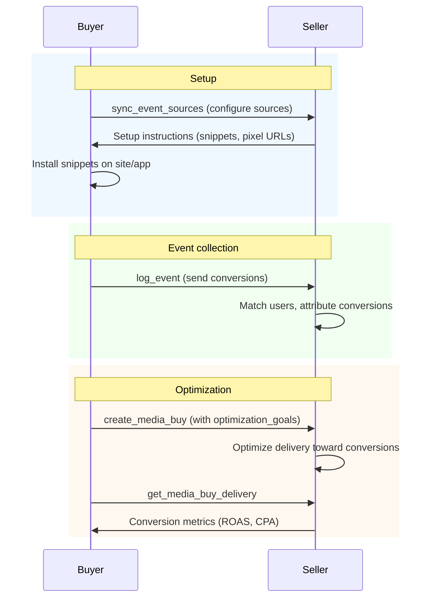

Conversion tracking in AdCP connects advertising spend to business outcomes. Two tasks handle the lifecycle: [`sync_event_sources`](/docs/media-buy/task-reference/sync_event_sources) configures where events come from, and [`log_event`](/docs/media-buy/task-reference/log_event) sends the events themselves.

Event data feeds into delivery reporting (conversions, ROAS, cost per acquisition) and enables optimization goals on media buy packages.

## The flow


```mermaid
sequenceDiagram
    participant B as Buyer
    participant S as Seller

    rect rgb(240, 248, 255)
        Note over B,S: Setup
        B->>S: sync_event_sources (configure sources)
        S->>B: Setup instructions (snippets, pixel URLs)
        B->>B: Install snippets on site/app
    end

    rect rgb(240, 255, 240)
        Note over B,S: Event collection
        B->>S: log_event (send conversions)
        S->>S: Match users, attribute conversions
    end

    rect rgb(255, 248, 240)
        Note over B,S: Optimization
        B->>S: create_media_buy (with optimization_goals)
        S->>S: Optimize delivery toward conversions
        B->>S: get_media_buy_delivery
        S->>B: Conversion metrics (ROAS, CPA)
    end
```

This shows the recommended order. In practice, media buys can be created before events are flowing — the seller buffers the optimization signal and applies it once events start arriving.

## Glossary

| Term | Meaning |
|---|---|
| **Event source** | A configured origin for conversion data — a first-party pixel, a server-to-server endpoint, a platform native connector |
| **Conversion event** | A specific action (purchase, lead, app install) that the buyer wants the seller to attribute and report |
| **Attribution window** | The lookback period after an ad impression or click in which a conversion is counted |
| **Optimization goal** | A delivery instruction telling the seller what metric, event, or outcome to use as the optimization signal |

---

## Event sources — `sync_event_sources`

Before the seller can optimize delivery, it needs to receive and attribute conversion events. `sync_event_sources` configures where that data comes from.

### Request fields

| Field | Type | Required | Description |
|---|---|---|---|
| `event_sources` | array | Yes | List of source configurations. One request can configure multiple sources. |
| `event_sources[].kind` | enum | Yes | Source type: `"pixel"`, `"s2s"`, `"platform_native"` |
| `event_sources[].events` | array | Yes | Events to capture from this source |
| `event_sources[].events[].name` | string | Yes | Buyer-defined event name; used in `log_event` |
| `event_sources[].events[].standard_event` | string | No | Maps to a seller-recognized standard event (e.g., `"purchase"`, `"lead"`) |

### Response fields

| Field | Type | Description |
|---|---|---|
| `sources` | array | One entry per configured source, in the same order as the request |
| `sources[].status` | enum | `"active"`, `"pending"`, `"error"` |
| `sources[].setup_instructions` | object | Implementation details: pixel URLs, tag snippets, server endpoint, etc. |

### Source kinds

#### `pixel`

A JavaScript tag installed on the buyer's site. The seller returns a pixel URL and optional tag snippet.

```json
{
  "event_sources": [
    {
      "kind": "pixel",
      "events": [
        { "name": "purchase", "standard_event": "purchase" },
        { "name": "add_to_cart" }
      ]
    }
  ]
}
```

Response:

```json
{
  "sources": [
    {
      "status": "active",
      "setup_instructions": {
        "pixel_url": "https://px.example.com/track",
        "tag_snippet": "<script src=\"https://px.example.com/pixel.js\"></script>"
      }
    }
  ]
}
```

#### `s2s`

Server-to-server event delivery. The seller returns an endpoint and authentication details.

```json
{
  "event_sources": [
    {
      "kind": "s2s",
      "events": [
        { "name": "purchase", "standard_event": "purchase" }
      ]
    }
  ]
}
```

Response:

```json
{
  "sources": [
    {
      "status": "active",
      "setup_instructions": {
        "endpoint": "https://events.example.com/v1/track",
        "auth_header": "X-Pixel-Token",
        "auth_token": "tok_abc123"
      }
    }
  ]
}
```

#### `platform_native`

Uses the seller's existing first-party data (from their ad serving stack). No additional setup required.

```json
{
  "event_sources": [
    {
      "kind": "platform_native",
      "events": [
        { "name": "purchase" }
      ]
    }
  ]
}
```

---

## Sending events — `log_event`

Once sources are configured, `log_event` sends individual conversion events.

### Request fields

| Field | Type | Required | Description |
|---|---|---|---|
| `event_name` | string | Yes | Must match a name from `sync_event_sources` |
| `event_time` | ISO 8601 | Yes | When the event occurred |
| `event_id` | string | No | Deduplication key; the seller ignores duplicate `event_id`s within the dedup window |
| `user_data` | object | No | Hashed signals for attribution (email, phone, cookie). Sent as hashed values; see [user data hashing](#user-data-hashing) |
| `custom_data` | object | No | Event-specific metadata (purchase value, product IDs, etc.) |
| `action_source` | string | No | Where the event occurred: `"website"`, `"app"`, `"offline"`, `"email"` |

### Response fields

| Field | Type | Description |
|---|---|---|
| `events_received` | integer | Events accepted in this request |
| `messages` | array | Per-event messages (warnings, dedup notices) |

### Purchase example

```json
{
  "event_name": "purchase",
  "event_time": "2024-03-15T14:23:00Z",
  "event_id": "order_abc123",
  "user_data": {
    "email_hash": "a665a45920422f9d417e4867efdc4fb8a04a1f3fff1fa07e998e86f7f7a27ae3",
    "phone_hash": "b3a8e0e1f9ab1bfe3a36f231f676f78bb28a2d0ada1dba2a01c5c1dd35438ba6"
  },
  "custom_data": {
    "value": 89.99,
    "currency": "USD",
    "order_id": "order_abc123"
  },
  "action_source": "website"
}
```

### User data hashing

User data fields in `log_event` are sent pre-hashed by the buyer. The seller uses these hashes to match events to ad impressions in their identity graph.

Hashing requirements:

- **Email**: lowercase, trim whitespace, then SHA-256
- **Phone**: E.164 format (e.g., `+12125551234`), then SHA-256
- **Other identifiers**: follow the seller's documented normalization

Some sellers support probabilistic matching via device IDs, IP addresses, or cookie values — check the seller's `sync_event_sources` response for accepted fields.

---

## Optimization goals

Optimization goals tell the seller what to optimize for. They're set on media buy packages via `create_media_buy` or `update_media_buy`.

### Goal kinds

#### `metric`

**Optimize for a seller-tracked delivery metric** (clicks, views, engagements, etc.). No event source or conversion tracking setup required. The product declares which metrics it supports in `metric_optimization.supported_metrics`.

```json
{
  "optimization_goals": [
    {
      "kind": "metric",
      "metric": "clicks",
      "target": {
        "kind": "threshold_rate",
        "value": 0.01
      }
    }
  ]
}
```

#### `event`

**Optimize for a buyer-defined conversion event** (purchase, lead, app install). Requires a configured event source.

```json
{
  "optimization_goals": [
    {
      "kind": "event",
      "event_name": "purchase",
      "target": {
        "kind": "cost_per_event",
        "value": 25.00,
        "currency": "USD"
      }
    }
  ]
}
```

#### `value`

**Optimize for conversion value** (revenue, LTV). Like `event`, but weighted by the value field in `log_event`.

```json
{
  "optimization_goals": [
    {
      "kind": "value",
      "event_name": "purchase",
      "target": {
        "kind": "roas",
        "value": 3.0
      }
    }
  ]
}
```

### Metric optimization (`kind: "metric"`)

The `metric` field specifies which delivery metric the seller should optimize for.

#### Supported metrics

| Metric | Unit | Default target | Description |
|---|---|---|---|
| `clicks` | count/impression | 0.001 (0.1% CTR) | Link clicks, swipe-throughs, CTA taps that navigate away |
| `views` | count/impression | — | Content views counted at the billable view threshold, as defined by delivery-metrics `views` (the quantity CPV bills on). For a viewability rate target, use `viewable_rate`, which names the standard and vendor. |
| `completed_views` | count/impression | 0.85 (85% VCR) | Video or audio completions. Use `view_duration_seconds` to control the qualifying threshold (e.g., 2s, 6s, 15s). |
| `viewed_seconds` | seconds/impression | 3.0 (3s in view) | Time in view per impression. Reported via `viewability.viewed_seconds`; governed by the viewability `standard`. Optionally set `standard` and `vendor` on the goal; otherwise the seller's default viewability measurement applies. |
| `engagements` | count/impression | — | Interactions short of a click (hover, expand, replay, poll tap). Seller-defined. |
| `reach` | unique users/budget | — | Unique user coverage. No numeric default; typically expressed as a percentage of a target audience. |
| `viewable_rate` | proportion (0–1) | 0.70 (70% MRC viewable) | Viewable impressions / measurable impressions under the goal's `standard`, optionally judged by the goal's `vendor`. Requires `standard`; accepts only `threshold_rate` targets, and `threshold_rate.value` MUST NOT exceed 1. Same leaf identity reported as `viewability.viewable_rate`. See [viewability goals and performance standards](#viewability-goals-and-performance-standards). |

#### Optional fields for `kind: "metric"`

| Field | Type | Required | Description |
|---|---|---|---|
| `view_duration_seconds` | number | No | Minimum video view duration (in seconds) that qualifies as a `completed_views` event. Only applicable when metric is `completed_views`. When omitted, the seller applies its platform default. |
| `standard` | string | Required when `metric` is `viewable_rate` | Viewability standard name: `"mrc"`, `"groupm"`, or a seller-defined identifier. Exposed in the product's `metric_optimization.supported_standards`. |
| `vendor` | string | No | Measurement vendor name (e.g., `"moat"`, `"ias"`). Omit to use the seller's default viewability measurement. |

#### Target kinds for metric goals

| Target kind | Applies to | Description |
|---|---|---|
| `threshold_rate` | `clicks`, `views`, `completed_views`, `viewable_rate` | Minimum rate: `value` is a ratio (0–1 for rates; >1 for viewed_seconds). For `viewable_rate`, `value` MUST NOT exceed 1. |
| `max_cost_per_event` | `clicks`, `views`, `completed_views`, `engagements` | Maximum cost per event. `value` is in the currency of the media buy. |
| `maximize` | any | Maximize the metric within the budget, no numeric floor. |

#### Examples

**Maximum CPC** (pay at most $0.50 per click):

```json
{
  "kind": "metric",
  "metric": "clicks",
  "target": {
    "kind": "max_cost_per_event",
    "value": 0.50,
    "currency": "USD"
  }
}
```

**Completed views with duration threshold** (6-second views on TikTok):

```json
{
  "kind": "metric",
  "metric": "completed_views",
  "view_duration_seconds": 6,
  "target": {
    "kind": "threshold_rate",
    "value": 0.85
  }
}
```

### Viewability goals and performance standards

Viewability goals sit on the `viewable_rate` metric. They require naming the measurement standard.

#### Optional fields for `viewable_rate` goals

| Field | Type | Required | Description |
|---|---|---|---|
| `view_duration_seconds` | number | No | Minimum video view duration (in seconds) that qualifies as a `completed_views` event. Only applicable when metric is `completed_views`. When omitted, the seller applies its platform default. |
| `standard` | string | Required when `metric` is `viewable_rate` | Viewability standard name: `"mrc"`, `"groupm"`, or a seller-defined identifier. Exposed in the product's `metric_optimization.supported_standards`. |
| `vendor` | string | No | Measurement vendor name (e.g., `"moat"`, `"ias"`). Omit to use the seller's default viewability measurement. |

**Distinct from `metric` kind.** The `metric` kind is for seller-native measurement (clicks, views, completed_views, reach, engagements, etc.) where no vendor binding is needed — the seller measures the delivery signal directly. Viewability goals on `viewable_rate` are also a `metric` kind, but they bind to an external standard and optionally a named vendor.

#### Viewability standard: MRC (Media Rating Council)

The MRC standard counts an impression as viewable if ≥50% of pixels are in the viewport for ≥1 continuous second (display) or ≥2 continuous seconds (video).

```json
{
  "kind": "metric",
  "metric": "viewable_rate",
  "standard": "mrc",
  "target": {
    "kind": "threshold_rate",
    "value": 0.70
  }
}
```

#### Viewability standard: GroupM

GroupM requires 100% of pixels in-viewport for ≥1 second (display) or ≥50% pixels for ≥2 seconds (video).

```json
{
  "kind": "metric",
  "metric": "viewable_rate",
  "standard": "groupm",
  "target": {
    "kind": "threshold_rate",
    "value": 0.80
  }
}
```

#### Third-party verification

Specify a vendor to use their measurement pipeline instead of the seller's default:

```json
{
  "kind": "metric",
  "metric": "viewable_rate",
  "standard": "mrc",
  "vendor": "ias",
  "target": {
    "kind": "threshold_rate",
    "value": 0.70
  }
}
```

The seller passes impression-level signals to the vendor and uses the vendor's viewability determination for optimization.

### Conversion optimization (`kind: "event"` and `kind: "value"`)

#### Target kinds for event and value goals

| Target kind | Applies to | Description |
|---|---|---|
| `cost_per_event` | `event` | Target cost per conversion. `value` is in the media buy's currency. |
| `roas` | `value` | Target return on ad spend. `value` is a multiplier (e.g., `3.0` = 3× ROAS). |
| `maximize` | `event`, `value` | Maximize events or value within budget, no numeric floor. |

#### Example: minimize CPA

```json
{
  "kind": "event",
  "event_name": "purchase",
  "target": {
    "kind": "cost_per_event",
    "value": 25.00,
    "currency": "USD"
  }
}
```

#### Example: maximize ROAS

```json
{
  "kind": "value",
  "event_name": "purchase",
  "target": {
    "kind": "roas",
    "value": 4.0
  }
}
```

---

## Attaching optimization goals to a media buy

Goals are set directly on packages in `create_media_buy` or `update_media_buy`:

```json
{
  "packages": [
    {
      "name": "video_awareness",
      "optimization_goals": [
        {
          "kind": "metric",
          "metric": "completed_views",
          "target": {
            "kind": "threshold_rate",
            "value": 0.85
          }
        }
      ]
    }
  ]
}
```

Multiple goals can be set per package. The seller optimizes for all of them; how multiple goals are weighted is seller-implementation territory.

---

## Checking seller capabilities

Before sending goals, verify what the seller supports:

```json
// From get_product (metric_optimization section)
{
  "metric_optimization": {
    "supported_metrics": ["clicks", "views", "completed_views", "viewable_rate"],
    "supported_targets": ["threshold_rate", "max_cost_per_event", "maximize"],
    "supported_standards": ["mrc", "groupm"],
    "supported_view_durations": [2, 6, 15],
    "supported_vendors": ["moat", "ias"]
  },
  "conversion_optimization": {
    "supported": true,
    "supported_targets": ["cost_per_event", "roas", "maximize"]
  }
}
```

Key checks:

1. **Check `supported_metrics`** — Is your target metric listed?
2. **Check `supported_targets`** — Does the seller accept your target kind?
3. **Check `supported_standards`** — Required for `viewable_rate` goals.
4. **Check view durations** — If using `completed_views` with `view_duration_seconds`, verify the value is listed in `metric_optimization.supported_view_durations`.

---

## Reporting on optimization goals

Optimization performance appears in `get_media_buy_delivery` under the `optimization` key:

```json
{
  "packages": [
    {
      "name": "video_awareness",
      "optimization": {
        "goals": [
          {
            "kind": "metric",
            "metric": "completed_views",
            "target": { "kind": "threshold_rate", "value": 0.85 },
            "actual": 0.82,
            "status": "approaching"
          }
        ]
      }
    }
  ]
}
```

`status` values:

| Status | Meaning |
|---|---|
| `on_track` | Current performance meets or exceeds the target |
| `approaching` | Performance is within 10% of the target |
| `below_target` | Performance is more than 10% below the target |

---

## Patterns and anti-patterns

### Pattern: progressive optimization

Start with a `maximize` goal while learning, then narrow to a CPA target once you have signal:

```json
// Week 1 — learn
{
  "kind": "event",
  "event_name": "purchase",
  "target": { "kind": "maximize" }
}

// Week 2+ — optimize
{
  "kind": "event",
  "event_name": "purchase",
  "target": {
    "kind": "cost_per_event",
    "value": 30.00,
    "currency": "USD"
  }
}
```

### Pattern: layered goals

Combine a reach floor with a CPA ceiling:

```json
"optimization_goals": [
  {
    "kind": "metric",
    "metric": "reach",
    "target": { "kind": "maximize" }
  },
  {
    "kind": "event",
    "event_name": "purchase",
    "target": {
      "kind": "cost_per_event",
      "value": 40.00,
      "currency": "USD"
    }
  }
]
```

### Anti-pattern: mismatched event name

If `event_name` in the goal doesn't match a name from `sync_event_sources`, the seller returns a `4xx` error or silently ignores the goal depending on implementation. Always use a name from the sync response.

### Anti-pattern: target without event source

Event and value goals require a configured event source. Setting a CPA target before syncing sources will either fail validation or fall back to impression-based delivery — check `conversion_optimization.supported` first.

---

## See also

- [Task reference: `sync_event_sources`](/docs/media-buy/task-reference/sync_event_sources)
- [Task reference: `log_event`](/docs/media-buy/task-reference/log_event)
- [Delivery reporting](/docs/media-buy/delivery)
- [Pricing models](/docs/media-buy/advanced-topics/pricing-models) — how `metric: "views"` maps to [CPV pricing](/docs/media-buy/advanced-topics/pricing-models#cpv-cost-per-view) and `metric: "completed_views"` to [CPCV](/docs/media-buy/advanced-topics/pricing-models#cpcv-cost-per-completed-view)
- [Pricing models: CPA](/docs/media-buy/advanced-topics/pricing-models#cpa-cost-per-acquisition) — CPA billing (pay per conversion)
