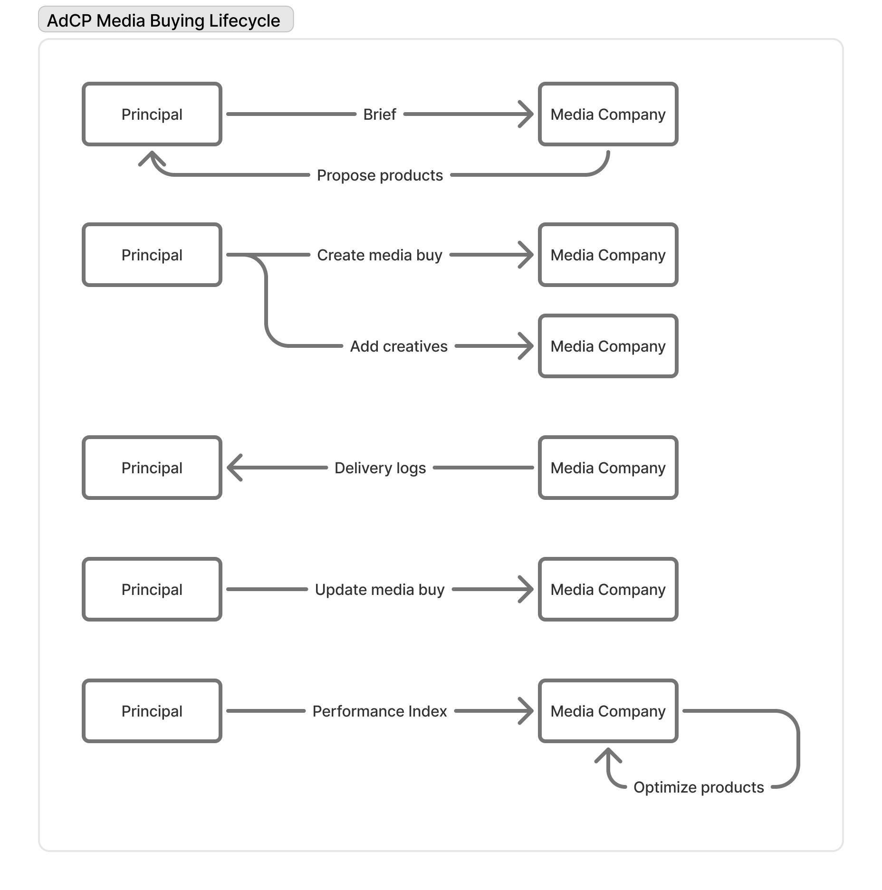

# Advertising Context Protocol (AdCP) Overview

The Advertising Context Protocol (AdCP) provides a simple, expressive, and AI-first standard for the entire media buying lifecycle. It is designed to be language-agnostic and flexible, guiding any implementation of a sales agent server that exposes publisher inventory to AI-driven buyers.

## Key Design Principles

1. **MCP-Based Interface**: Built on Model Context Protocol (MCP) for standardized AI agent interaction, not REST APIs.

2. **Asynchronous by Design**: Operations may take seconds to days to complete. The protocol embraces pending states as normal workflow elements.

3. **Human-in-the-Loop**: Publishers can require manual approval for any operation. The protocol includes comprehensive task management for human intervention.

4. **Multi-Platform Abstraction**: A unified interface that works across Google Ad Manager, Kevel, Triton Digital, and more.

5. **AI-Optimized**: Designed for AI agents to discover, negotiate, and optimize media buys programmatically.

## Key Features

- **Natural Language Discovery**: Find advertising inventory using plain English briefs
- **Unified Targeting**: Consistent targeting dimensions across all platforms
- **Creative Flexibility**: Support for standard IAB and custom publisher formats
- **Real-time Optimization**: Continuous performance monitoring and adjustment
- **Human-in-the-Loop**: Optional manual approval workflows where needed

## Separation of Concerns: A Collaborative Model

AdCP is built on the principle that optimizing media campaigns is a collaborative process where each party focuses on what they do best. This separation of concerns creates efficiency and better outcomes for all participants.

### The Three Roles

#### 1. Publisher Role
Publishers bring expertise and data to optimize campaign delivery. Their needs are simple:
- **Money**: Budget to work with
- **Brief**: Clear understanding of campaign goals
- **Feedback**: Performance signals to know if it's working

Publishers say: *"Give me money, tell me what you're trying to do, and tell me if it's working."*

#### 2. Principal (Buyer) Role
Principals maintain control over their brand and campaign strategy:

**Upfront Controls:**
- Campaign brief and objectives
- Budget allocation
- Targeting overlay (e.g., "must run in California", "near our stores")
- Creative approval

**Real-time Signals:**
- Audience data
- Brand safety requirements
- Frequency capping rules
- Performance feedback

The principal focuses on high-level campaign goals while giving publishers flexibility to optimize delivery.

#### 3. Orchestrator Role
The orchestrator handles the technical mechanics, similar to a DSP in programmatic:
- Information synchronization between parties
- Creative asset management
- Frequency capping enforcement
- Real-time signal processing (AEE)
- Campaign state management

The orchestrator enables principals to stay focused on strategy rather than implementation details.

### Why This Model Works

1. **Expertise Alignment**: Each party focuses on their strengths
2. **Clear Boundaries**: Well-defined responsibilities prevent conflicts
3. **Flexibility**: Publishers can optimize within principal constraints
4. **Scalability**: Orchestrators handle complexity behind the scenes
5. **Transparency**: Clear signals and feedback loops

This collaborative approach optimizes outcomes by letting each participant do what they do best, creating a more efficient and effective advertising ecosystem.

## Media Buying Lifecycle

The following diagram illustrates the complete lifecycle of a media buy in AdCP:

## Documentation Structure

### Core Concepts
Foundational elements of the Advertising Context Protocol:

- **[Product Discovery](product-discovery.md)** - Learn how to discover advertising inventory using natural language
- **[Media Products](media-products.md)** - Understand the product model and structure
- **[Media Buys](media-buys.md)** - Understand how campaigns are created and managed across platforms
- **[Dimensions](dimensions.md)** - Explore the unified system for categorizing products, targeting, and reporting
- **[Targeting](targeting.md)** - Master the layered targeting approach using dimensional attributes

### Creatives
Managing creative assets throughout their lifecycle:

- **[Creative Lifecycle](creative-lifecycle.md)** - Submit, track, and adapt creative assets
- **[Creative Formats](creative-formats.md)** - Detailed specifications for supported creative types

### Operations
Running successful campaigns:

- **[Media Buy Lifecycle](media-buy-lifecycle.md)** - End-to-end campaign workflow and state management
- **[Reporting & Optimization](reporting-and-optimization.md)** - Monitor delivery and optimize performance
- **[Principals & Security](principals-and-security.md)** - Multi-tenant security model and access control

### Technical Reference
Detailed implementation guidance:

- **[API Reference](api-reference.md)** - Complete tool documentation with examples
- **[Design Decisions](design-decisions.md)** - Architectural choices and rationale

## Getting Started

1. **Understand Discovery**: Start with [Product Discovery](product-discovery.md) to learn how to find inventory using natural language
2. **Learn the Products**: Review [Media Products](media-products.md) to understand the product model
3. **Follow the Workflow**: Study the [Media Buy Lifecycle](media-buy-lifecycle.md) for the complete process
4. **Implement**: Use the [API Reference](api-reference.md) for technical details
5. **Optimize**: Apply [Reporting & Optimization](reporting-and-optimization.md) techniques
